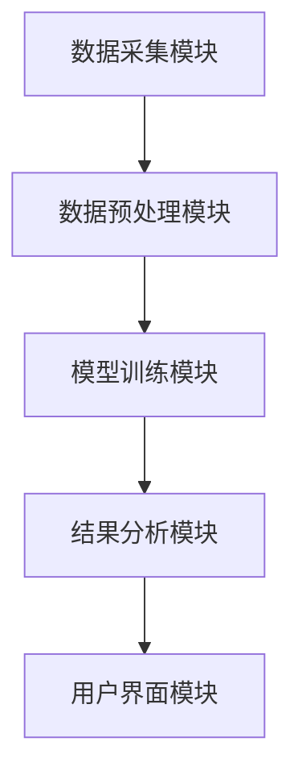

                 

---

# 智能化企业资本结构优化模型设计

## 关键词：企业资本结构、智能化优化、机器学习、数据挖掘、系统架构

## 摘要：本文系统地探讨了智能化企业资本结构优化模型的设计与实现。通过分析传统资本结构优化方法的局限性，提出基于数据挖掘和机器学习的智能化优化策略。文章详细介绍了模型的设计框架、算法实现、系统架构，并通过具体案例展示了模型的实际应用效果，最后提出了未来的发展方向。

---

# 第一部分：智能化企业资本结构优化模型的背景与基础

## 第1章：智能化企业概述

### 1.1 企业资本结构的基本概念

#### 1.1.1 企业资本结构的定义

资本结构是指企业各种长期资本的构成及其比例，包括长期负债和所有者权益。合理的资本结构能够降低资本成本，提高企业价值。

#### 1.1.2 资本结构对企业价值的影响

资本结构直接影响企业的资本成本和风险。适度的负债可以利用财务杠杆效应，提高企业收益，但过高的负债会增加财务风险。

#### 1.1.3 资本结构优化的目标与意义

目标是找到最优资本结构，使企业价值最大化或资本成本最小化。意义在于提升企业财务健康度，增强抗风险能力。

### 1.2 传统资本结构优化方法的局限性

传统方法包括凭经验调整法、公式计算法和综合分析法。这些方法在实际应用中存在数据依赖性强、难以适应市场变化等问题。

### 1.3 智能化技术在资本结构优化中的应用

数据挖掘和机器学习技术的应用，使得资本结构优化更加精准和动态。通过分析大量数据，模型能够发现复杂关系，提供优化建议。

## 第2章：资本结构优化的必要性

### 2.1 传统资本结构优化方法的局限性

传统方法依赖经验，缺乏动态调整能力，难以应对复杂多变的市场环境。

### 2.2 智能化技术的优势

智能化技术能够处理海量数据，发现隐藏规律，提供实时优化建议，显著提升优化效果。

### 2.3 智能化技术的应用场景

包括数据收集、模型训练、结果分析等，覆盖企业资本结构优化的全过程。

## 第3章：智能化技术在资本结构优化中的应用

### 3.1 数据挖掘与机器学习的应用

数据挖掘帮助发现数据中的模式，机器学习用于预测和优化。两者结合，提升资本结构优化的准确性和效率。

### 3.2 技术整合与协同

通过数据预处理、特征选择、模型训练等步骤，实现技术的协同工作，提高模型的性能和实用性。

---

# 第二部分：智能化企业资本结构优化模型的设计与实现

## 第4章：资本结构优化模型的基本框架

### 4.1 模型设计的核心要素

#### 4.1.1 数据来源与处理

包括企业财务数据、市场数据和行业数据的收集与预处理。

#### 4.1.2 模型输入与输出

输入企业数据，输出优化后的资本结构建议。

#### 4.1.3 模型的评价指标

包括资本成本、企业价值等关键指标的评估。

## 第5章：数据预处理与特征选择

### 5.1 数据清洗与标准化

处理缺失值、异常值，标准化数据以适应模型输入要求。

### 5.2 数据特征的提取与选择

使用统计方法或特征重要性分析，选择关键特征，提高模型效率。

## 第6章：基于机器学习的资本结构优化算法实现

### 6.1 算法原理

#### 6.1.1 线性回归模型

用于预测资本结构，假设自变量与因变量之间存在线性关系。

#### 6.1.2 支持向量机模型

通过最大化分类间隔，实现数据分类和预测。

#### 6.1.3 神经网络模型

通过多层神经网络，学习复杂的数据模式，进行非线性预测。

### 6.2 算法实现流程

#### 6.2.1 数据集的划分

将数据分为训练集、验证集和测试集。

#### 6.2.2 模型训练与验证

使用训练集训练模型，验证集调整参数，测试集评估性能。

#### 6.2.3 模型的评估与优化

通过准确率、召回率等指标评估模型，优化参数以提高性能。

---

# 第三部分：智能化资本结构优化模型的系统架构与实现

## 第7章：系统架构设计

### 7.1 系统模块划分

#### 7.1.1 数据采集模块

收集企业财务数据、市场数据等。

#### 7.1.2 数据预处理模块

清洗和标准化数据，提取特征。

#### 7.1.3 模型训练模块

训练机器学习模型，优化参数。

#### 7.1.4 结果分析模块

展示优化结果，生成报告。

### 7.2 系统架构图

## 第8章：系统接口设计与交互流程

### 8.1 系统接口设计

定义模块之间的接口，确保数据流畅传输。

### 8.2 系统交互流程

用户输入数据，系统处理并输出结果。

---

# 第四部分：项目实战

## 第9章：项目实战与案例分析

### 9.1 项目背景

选择中型制造企业作为案例，分析其资本结构优化需求。

### 9.2 实战环境配置

安装Python、scikit-learn等工具，配置开发环境。

### 9.3 核心代码实现

展示数据预处理、模型训练和结果分析的代码，解释每一步操作。

### 9.4 结果分析与解读

分析模型输出的优化建议，评估优化效果。

---

# 第五部分：优化策略与未来展望

## 第10章：优化策略与未来展望

### 10.1 优化策略

提升模型泛化能力，优化计算效率，引入新技术如区块链、边缘计算。

### 10.2 未来展望

智能化优化模型将继续发展，结合更多先进技术，提供更智能的解决方案。

---

# 作者信息

作者：AI天才研究院/AI Genius Institute & 禅与计算机程序设计艺术 /Zen And The Art of Computer Programming

---

这篇文章系统地介绍了智能化企业资本结构优化模型的设计与实现，从理论到实践，详细探讨了各个关键环节，为读者提供了全面的指导和深入的见解。

