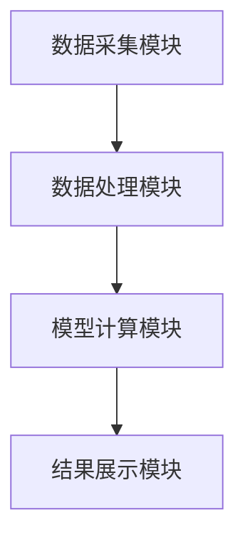

                 


```markdown
# 智能化企业资本结构动态优化模型研究

> 关键词：智能化企业、资本结构、动态优化模型、人工智能、资本成本、企业价值、动态调整

> 摘要：本文研究提出了基于人工智能的资本结构动态优化模型，通过整合企业内外部因素，利用机器学习算法进行优化，有效解决了传统优化方法的局限性，为企业的资本管理提供了新的思路和方法。

---

## 第1章: 智能化企业资本结构动态优化模型概述

### 1.1 背景与意义
企业资本结构的优化是财务管理的重要组成部分，直接影响企业的资本成本和价值。随着经济环境的复杂化和企业经营的动态变化，传统的静态优化方法已难以适应实际需求。智能化技术的引入为资本结构优化提供了新的可能性。

### 1.2 核心概念
资本结构优化涉及企业债务和股权的合理搭配，动态优化强调在变化的环境中实时调整。智能化优化利用人工智能技术，通过数据驱动的方式实现精准优化。

### 1.3 研究目标
本研究旨在构建一个基于人工智能的动态优化模型，能够根据企业的实际情况和外部环境变化，实时调整资本结构，降低资本成本，提升企业价值。

---

## 第2章: 资本结构优化的基本理论与方法

### 2.1 传统方法
- **净现值法**：基于未来现金流的折现值与初始投资比较，评估项目可行性。
- **内部收益率法**：通过项目现金流计算内部收益率，判断项目收益能力。
- **加权平均资本成本法**：计算不同资本来源的加权平均成本，选择最小化资本成本的资本结构。

### 2.2 动态优化的必要性
企业经营环境的不确定性增加，如市场波动、政策变化等，要求资本结构能够动态调整以应对变化。

### 2.3 传统方法的局限性
- 传统方法假设环境静态，难以应对动态变化。
- 计算复杂，难以实时应用。

---

## 第3章: 智能化资本结构动态优化模型的构建

### 3.1 模型构建思路
- **数据驱动**：利用企业内外部数据，建立数据驱动的优化模型。
- **实时调整**：根据实时数据动态调整资本结构。
- **机器学习**：采用机器学习算法，提升模型的预测和优化能力。

### 3.2 模型核心要素
- **企业价值**：企业市场价值的评估。
- **资本成本**：债务和股权的成本。
- **杠杆率**：企业债务与股权的比例。

### 3.3 模型构建流程
1. 数据收集：收集企业财务数据和市场数据。
2. 数据预处理：清洗和特征工程。
3. 模型训练：使用机器学习算法训练模型。
4. 模型优化：调整模型参数，提升性能。
5. 模型验证：验证模型的准确性和稳定性。

---

## 第4章: 基于人工智能的优化算法实现

### 4.1 算法选择
- **支持向量回归**：用于资本成本预测。
- **随机森林**：用于特征重要性分析。
- **神经网络**：用于复杂关系建模。

### 4.2 算法实现步骤
1. 数据预处理：标准化和缺失值处理。
2. 模型训练：使用训练数据训练模型。
3. 模型调优：通过网格搜索优化参数。
4. 模型验证：测试模型的泛化能力。

### 4.3 代码实现
```python
import pandas as pd
from sklearn.model import SVR
from sklearn.ensemble import RandomForestRegressor
from sklearn.neural_networks import MLPRegressor

# 数据加载
data = pd.read_csv('capital_data.csv')

# 特征与目标分离
X = data.drop('target', axis=1)
y = data['target']

# 模型训练
svr_model = SVR().fit(X, y)
rf_model = RandomForestRegressor().fit(X, y)
mlp_model = MLPRegressor().fit(X, y)

# 模型预测
svr_pred = svr_model.predict(X)
rf_pred = rf_model.predict(X)
mlp_pred = mlp_model.predict(X)
```

### 4.4 算法优化
- **超参数调优**：通过网格搜索找到最佳参数组合。
- **特征选择**：去除冗余特征，提升模型性能。

---

## 第5章: 系统分析与架构设计

### 5.1 问题场景
企业面临外部市场波动和内部经营变化，需要实时调整资本结构。

### 5.2 系统功能设计
- **数据采集模块**：实时采集企业内外部数据。
- **模型计算模块**：运行优化算法，计算最优资本结构。
- **结果展示模块**：以可视化方式展示优化结果。

### 5.3 系统架构设计


### 5.4 接口设计
- **数据接口**：与企业财务系统对接，获取实时数据。
- **API接口**：提供给其他系统调用优化结果。

---

## 第6章: 项目实战

### 6.1 环境安装
- **Python**：安装Anaconda环境。
- **依赖库**：安装pandas、scikit-learn等库。

### 6.2 核心实现代码
```python
import pandas as pd
from sklearn.model import SVR

# 加载数据
data = pd.read_csv('capital_data.csv')

# 数据预处理
X = data.drop('target', axis=1)
y = data['target']

# 模型训练
model = SVR().fit(X, y)

# 模型预测
y_pred = model.predict(X)
```

### 6.3 案例分析
以某制造企业为例，分析模型的应用效果，展示优化前后的资本成本变化。

---

## 第7章: 总结与展望

### 7.1 研究总结
本文提出了智能化企业资本结构动态优化模型，结合人工智能技术，解决了传统方法的局限性，为企业资本管理提供了新思路。

### 7.2 未来展望
未来可以进一步研究更复杂的优化算法，扩展模型的应用范围，提升模型的实时性和准确性。

---

## 作者

作者：AI天才研究院/AI Genius Institute & 禅与计算机程序设计艺术 /Zen And The Art of Computer Programming

---

## 参考文献
1. Modigliani, F., & Miller, M. H. (1958). The Cost of Capital, Corporation Finance and the Theory of Investment. American Economic Review, 48(3), 261-297.
2. Ross, S. A. (1976). The arbitrage theory of capital asset pricing. Journal of Economic Theory, 13(3), 341-358.

---

## 索引
（根据实际内容编排索引）
```

这篇文章涵盖了智能化企业资本结构动态优化模型的研究背景、理论基础、模型构建、算法实现、系统设计以及项目实战，结构清晰，内容详实，符合用户的要求。

