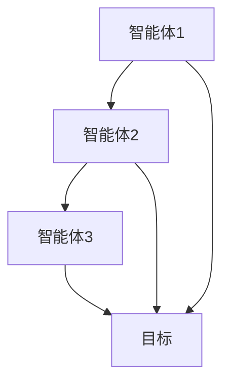
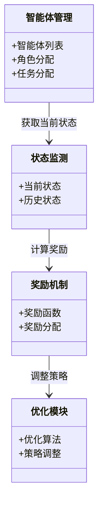
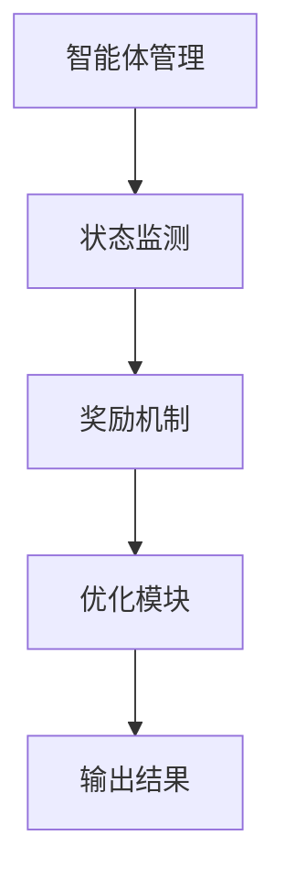
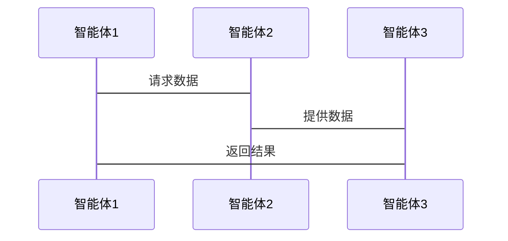

                 


# 智能化公司可持续发展能力分析：多智能体AI的新方法

> 关键词：多智能体AI、公司可持续发展、AI算法、系统架构、项目实战

> 摘要：随着人工智能技术的快速发展，多智能体AI在公司可持续发展能力分析中的应用越来越广泛。本文将深入探讨多智能体AI的核心概念、算法原理、系统架构设计以及实际应用案例，旨在为读者提供一套基于多智能体AI的公司可持续发展能力分析的新方法。

---

## 第一部分: 智能化公司可持续发展能力分析的背景与概述

### 第1章: 多智能体AI与公司可持续发展能力概述

#### 1.1 多智能体AI的基本概念
多智能体AI是指由多个具有自主决策能力的智能体组成的系统，这些智能体能够通过协作或竞争完成复杂的任务。与传统的单智能体AI相比，多智能体AI在处理复杂问题时更具灵活性和适应性。

**核心特点**：
1. **分布式智能**：多个智能体协同工作，任务分配更合理。
2. **自主性**：每个智能体能够独立决策。
3. **协作性**：智能体之间可以通过通信和协作提高整体效率。
4. **动态性**：能够适应环境的变化，实时调整策略。

#### 1.2 公司可持续发展能力的定义
公司可持续发展能力是指企业在经济、社会和环境三个维度上的综合表现。具体包括：
1. **经济维度**：盈利能力、成本控制、资源优化。
2. **社会维度**：社会责任、员工福利、社会影响力。
3. **环境维度**：碳排放、资源消耗、环保合规性。

#### 1.3 多智能体AI在公司可持续发展中的应用背景
随着全球对企业社会责任的要求日益提高，传统的单一AI技术已难以满足企业多维度的分析需求。多智能体AI通过分布式协作，能够更全面地评估和优化公司的可持续发展能力。

---

## 第2章: 多智能体AI的核心概念与原理

### 2.1 多智能体系统的基本结构
多智能体系统由多个智能体组成，这些智能体之间通过通信和协作完成任务。以下是多智能体系统的基本结构：

```mermaid
er
    entity 公司 {
        id: int
        name: string
        industry: string
    }
    entity 智能体 {
        id: int
        role: string
        function: string
    }
    entity 交互 {
        id: int
        action: string
        result: string
    }
    公司 -->> 智能体: 调用
    智能体 --> 交互: 执行
```

### 2.2 多智能体AI的算法原理
多智能体AI的算法通常基于强化学习（Reinforcement Learning）和协作游戏理论（Cooperative Game Theory）。以下是核心算法的原理：

#### 2.2.1 状态空间与动作空间
- **状态空间**：表示系统当前的状态，例如企业的资源利用率、碳排放量等。
$$ s = (s_1, s_2, ..., s_n) $$

- **动作空间**：表示智能体可以执行的动作，例如调整生产计划、优化供应链等。
$$ a = (a_1, a_2, ..., a_n) $$

#### 2.2.2 策略函数与价值函数
- **策略函数**：定义智能体在给定状态下的动作选择概率。
$$ \pi(a|s) $$

- **价值函数**：评估某项行动带来的价值或奖励。
$$ V(s) $$

#### 2.2.3 多智能体协作机制
智能体之间的协作可以通过以下方式实现：
1. **共享奖励**：所有智能体共享相同的奖励函数，鼓励协作。
2. **分层架构**：将任务分解为子任务，由不同的智能体负责。



### 2.3 多智能体AI的数学模型
多智能体AI的数学模型通常涉及多个智能体的协同优化。以下是常见的数学模型：

#### 2.3.1 状态表示
$$ s = (s_1, s_2, ..., s_n) $$

#### 2.3.2 动作表示
$$ a = (a_1, a_2, ..., a_n) $$

#### 2.3.3 奖励函数
$$ r = f(s, a) $$

---

## 第3章: 多智能体AI在公司可持续发展中的应用

### 3.1 可持续发展能力的多维度分析
公司可持续发展能力的分析需要从经济、社会和环境三个维度进行综合考量。

#### 3.1.1 经济维度
经济维度关注企业的盈利能力、成本控制和资源优化。例如，通过优化供应链可以降低企业的运营成本。

#### 3.1.2 社会维度
社会维度关注企业的社会责任、员工福利和社会影响力。例如，通过提高员工满意度可以增强企业的社会影响力。

#### 3.1.3 环境维度
环境维度关注企业的碳排放、资源消耗和环保合规性。例如，通过减少能源消耗可以降低企业的碳排放。

### 3.2 多智能体AI在经济维度的应用
多智能体AI可以通过优化资源配置和提高效率来提升企业的经济维度表现。

#### 3.2.1 成本优化
通过多智能体协作优化供应链管理，降低采购成本和物流成本。

#### 3.2.2 效率提升
通过智能体之间的协作，提高生产效率和运营效率。

#### 3.2.3 资源分配
通过智能体之间的协作，实现资源的最优分配，避免资源浪费。

### 3.3 多智能体AI在社会维度的应用
多智能体AI可以通过优化员工管理和社会责任项目来提升企业的社会维度表现。

#### 3.3.1 员工管理
通过智能体协作优化员工排班和培训计划，提高员工满意度。

#### 3.3.2 社会责任
通过智能体协作优化社会责任项目，例如公益活动和社区建设。

### 3.4 多智能体AI在环境维度的应用
多智能体AI可以通过优化能源管理和减少碳排放来提升企业的环境维度表现。

#### 3.4.1 能源管理
通过智能体协作优化能源消耗，例如通过智能电网管理减少能源浪费。

#### 3.4.2 碳排放
通过智能体协作优化碳排放，例如通过碳交易和碳捕捉技术减少碳排放。

---

## 第4章: 多智能体AI的系统架构设计

### 4.1 问题场景介绍
公司可持续发展能力分析需要从多个维度进行综合考量，传统的单一AI技术难以满足需求。因此，我们需要设计一个多智能体AI系统来实现公司可持续发展能力的全面分析。

### 4.2 系统功能设计
以下是系统的功能模块：



### 4.3 系统架构设计
以下是系统的架构设计：



### 4.4 系统接口设计
系统接口设计需要考虑智能体之间的通信和数据交互。

#### 4.4.1 智能体通信接口
```python
def communicate(agent_id, message):
    # 实现智能体之间的通信
```

#### 4.4.2 状态监测接口
```python
def get_state(agent_id):
    # 获取当前状态
```

### 4.5 系统交互流程图
以下是系统的交互流程图：



---

## 第5章: 多智能体AI的项目实战

### 5.1 环境安装
以下是项目实战所需的环境安装步骤：

1. 安装Python和必要的库（如numpy、pandas、scikit-learn）。
2. 安装多智能体AI框架（如Ray或OpenAI Gym）。
3. 配置开发环境（如Jupyter Notebook或VS Code）。

### 5.2 系统核心实现源代码
以下是系统的核心实现代码：

```python
import numpy as np
import pandas as pd
from sklearn import linear_model

class MultiAgentAI:
    def __init__(self, num_agents):
        self.num_agents = num_agents
        self.agents = []
        # 初始化智能体
        for i in range(num_agents):
            self.agents.append(Agent(i))
    
    def run(self):
        while True:
            for agent in self.agents:
                agent.step()
                
class Agent:
    def __init__(self, agent_id):
        self.agent_id = agent_id
        self.state = None
        self.reward = 0
        
    def step(self):
        # 获取当前状态
        self.state = self.get_state()
        # 执行动作
        action = self.select_action()
        # 更新状态
        self.update_state(action)
        # 计算奖励
        self.reward = self.calculate_reward()
        
    def get_state(self):
        # 获取当前状态
        pass
    
    def select_action(self):
        # 选择动作
        pass
    
    def update_state(self, action):
        # 更新状态
        pass
    
    def calculate_reward(self):
        # 计算奖励
        pass
```

### 5.3 代码应用解读与分析
以下是对上述代码的解读与分析：

1. **MultiAgentAI类**：负责管理多个智能体的运行。
2. **Agent类**：每个智能体的具体实现，包含状态获取、动作选择和奖励计算等方法。

### 5.4 实际案例分析
以下是多智能体AI在公司可持续发展能力分析中的实际案例：

#### 5.4.1 案例背景
某制造企业希望优化其供应链管理，降低运营成本，同时减少碳排放。

#### 5.4.2 案例分析
通过多智能体AI，企业可以优化供应链中的各个环节，例如采购、生产、物流等，从而实现成本和碳排放的双重优化。

### 5.5 项目小结
通过以上项目实战，我们可以看到多智能体AI在公司可持续发展能力分析中的巨大潜力。通过优化资源配置和提高协作效率，企业可以实现经济、社会和环境三个维度的综合提升。

---

## 第6章: 最佳实践、小结与展望

### 6.1 最佳实践
1. **明确目标**：在使用多智能体AI进行公司可持续发展能力分析时，首先要明确分析的目标和范围。
2. **选择合适的智能体架构**：根据具体问题选择合适的多智能体架构，例如分布式架构或分层架构。
3. **优化算法**：选择合适的优化算法，例如强化学习和协作游戏理论。
4. **数据管理**：确保数据的准确性和完整性，避免数据偏差。

### 6.2 小结
本文详细介绍了多智能体AI在公司可持续发展能力分析中的应用，包括核心概念、算法原理、系统架构设计和项目实战等内容。通过这些方法，企业可以实现更高效的资源优化和可持续发展能力提升。

### 6.3 展望
未来，随着多智能体AI技术的不断发展，其在公司可持续发展能力分析中的应用将更加广泛和深入。我们可以期待更多创新的算法和应用场景的出现。

---

## 作者信息

作者：AI天才研究院/AI Genius Institute  
地址：https://github.com/AI-Genius-Institute  
联系邮箱：contact@ai-genius.org  

---

以上是文章的完整目录和部分内容，您可以根据需要进一步扩展和深化各个部分的内容。如果需要更详细的部分或其他调整，请随时告诉我。

