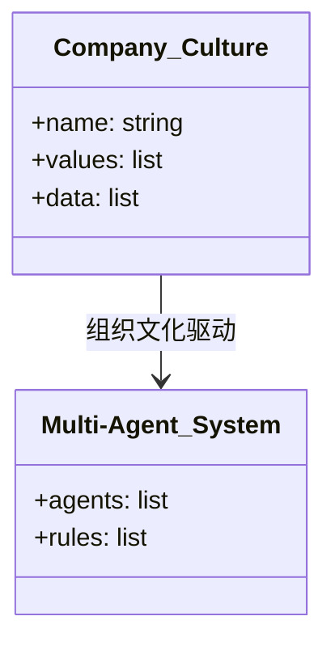
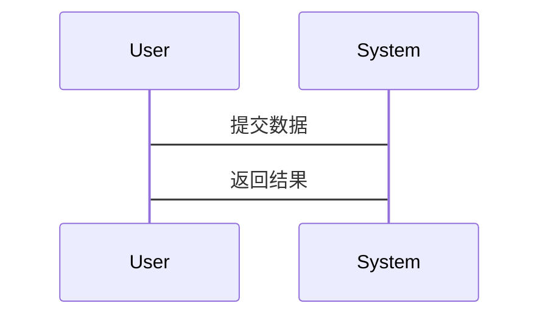

                 


# 智能化公司文化与财务表现关联分析：多智能体AI应用

> 关键词：智能化公司文化，财务表现，多智能体AI，企业决策，AI技术应用

> 摘要：本文探讨了智能化公司文化与财务表现之间的关联性，结合多智能体AI的应用，分析了公司文化智能化对财务表现的影响。通过详细的技术分析和案例研究，本文揭示了多智能体AI在公司文化中的核心作用，并展示了如何利用多智能体AI技术优化公司文化，进而提升财务表现。

---

## 第1章: 智能化公司文化与财务表现关联概述

### 1.1 问题背景

#### 1.1.1 公司文化智能化的定义与特征
公司文化智能化是指通过引入人工智能技术，使公司文化更加数据化、自动化和智能化。其主要特征包括：
- 数据驱动：利用数据进行决策。
- AI辅助：通过AI技术优化公司文化。
- 协作性：多智能体协作提升组织效率。

#### 1.1.2 财务表现的核心要素与衡量标准
财务表现的核心要素包括：
- 盈利能力：净利润率、ROE。
- 成长能力：收入增长率、资产增长率。
- 财务风险：负债率、流动比率。

#### 1.1.3 智能化公司文化与财务表现的关联性
智能化公司文化通过优化组织行为和决策，直接影响财务表现。例如，智能化文化可以提高效率、降低风险，从而提升盈利能力。

### 1.2 智能化公司文化的特点

#### 1.2.1 数据驱动的决策模式
公司文化智能化的核心是数据驱动的决策。通过数据分析，公司可以更准确地制定战略。

#### 1.2.2 AI技术在公司文化中的应用
AI技术在公司文化中的应用包括：
- 智能招聘：利用AI筛选简历。
- 智能培训：通过AI制定培训计划。
- 智能反馈：实时收集员工反馈。

#### 1.2.3 多智能体协作机制
多智能体协作机制通过多个AI实体协同工作，提升组织效率。例如，销售、市场和财务部门可以通过多智能体协作实现高效沟通。

### 1.3 财务表现的驱动因素

#### 1.3.1 盈利能力分析
盈利能力是财务表现的核心指标。通过智能化公司文化，可以优化成本控制和收入增长。

#### 1.3.2 成长能力分析
成长能力分析关注公司未来的增长潜力。智能化公司文化可以通过数据驱动的决策，帮助公司制定更具前瞻性的战略。

#### 1.3.3 财务风险与稳定性
财务风险是影响财务表现的重要因素。智能化公司文化可以通过实时监控和预警系统，降低财务风险。

---

## 第2章: 多智能体AI的基本概念与原理

### 2.1 多智能体系统的核心概念

#### 2.1.1 多智能体系统的定义
多智能体系统是由多个智能体组成的分布式系统，每个智能体都能独立决策并协同工作。

#### 2.1.2 多智能体系统的特征
- 分布式：智能体独立运行。
- 协作性：智能体之间协同完成任务。
- 动态性：系统环境动态变化。

#### 2.1.3 多智能体系统与单智能体AI的区别
多智能体系统强调协作和分布式决策，而单智能体AI强调单个智能体的独立决策。

### 2.2 多智能体AI的工作原理

#### 2.2.1 多智能体协作机制
协作机制包括：
- 信息共享：智能体之间共享数据。
- 协调决策：通过协商达成一致决策。
- 分工合作：智能体根据任务分工协作。

#### 2.2.2 信息共享与决策优化
信息共享是多智能体协作的基础。通过共享信息，智能体可以优化决策。

#### 2.2.3 多智能体系统的通信协议
通信协议定义了智能体之间的交互方式，包括消息传递、协议制定等。

### 2.3 多智能体AI在公司文化中的应用

#### 2.3.1 多智能体AI在团队协作中的应用
- 团队协作优化：通过多智能体AI，团队可以更高效地协作完成任务。
- 协议制定：智能体之间通过协议实现协作。

#### 2.3.2 多智能体AI在组织决策中的作用
- 组织决策优化：多智能体AI可以帮助组织制定更科学的决策。
- 风险控制：通过协作，可以降低决策风险。

#### 2.3.3 多智能体AI与公司文化智能化的结合
- 公司文化智能化：通过多智能体AI，公司文化可以更加智能化和数据化。
- 应用场景：招聘、培训、反馈等。

---

## 第3章: 多智能体AI与公司文化智能化的关系

### 3.1 多智能体AI在公司文化中的核心作用

#### 3.1.1 多智能体AI如何提升公司文化智能化
- 数据驱动决策：多智能体AI通过数据分析优化公司文化。
- 协作机制：通过协作机制，提升组织效率。

#### 3.1.2 多智能体AI在公司文化中的具体应用场景
- 智能招聘：利用多智能体AI筛选简历。
- 智能培训：通过多智能体AI制定培训计划。
- 智能反馈：实时收集员工反馈。

#### 3.1.3 多智能体AI对组织行为的影响
- 提高效率：通过协作，组织行为更加高效。
- 降低风险：通过实时监控，降低风险。

### 3.2 多智能体AI与财务表现的关联性

#### 3.2.1 多智能体AI如何影响财务表现
- 提高效率：通过协作，优化资源配置，提升效率。
- 降低成本：通过数据分析，降低运营成本。
- 增强决策能力：通过协作，提升决策的准确性。

#### 3.2.2 多智能体AI在财务决策中的应用
- 财务预测：通过多智能体AI预测财务趋势。
- 财务分析：通过多智能体AI分析财务数据。
- 财务优化：通过协作，优化财务结构。

#### 3.2.3 多智能体AI对财务风险的控制作用
- 风险预警：通过实时监控，预警财务风险。
- 风险评估：通过协作，评估财务风险。
- 风险控制：通过优化决策，降低风险。

### 3.3 多智能体AI与公司文化智能化的协同效应

#### 3.3.1 多智能体AI如何促进公司文化智能化
- 数据驱动决策：通过多智能体AI，公司文化更加数据化。
- 协作机制：通过协作，提升组织效率。

#### 3.3.2 公司文化智能化对多智能体AI的反哺作用
- 提供数据支持：公司文化智能化为多智能体AI提供数据支持。
- 提供协作环境：公司文化智能化为多智能体AI提供协作环境。

#### 3.3.3 多智能体AI与公司文化智能化的协同优化
- 协同优化：通过协同，优化公司文化和多智能体AI的应用。
- 共同进步：公司文化智能化与多智能体AI相互促进，共同进步。

---

## 第4章: 多智能体AI的算法原理

### 4.1 多智能体AI的算法原理

#### 4.1.1 多智能体AI的核心算法
- 强化学习：通过强化学习优化决策。
- 协作机制：通过协作机制实现任务分配。

#### 4.1.2 多智能体AI的协作算法
- 分工合作：通过分工合作实现任务分配。
- 协调决策：通过协商达成一致决策。

#### 4.1.3 多智能体AI的通信协议
- 消息传递：通过消息传递实现智能体之间的通信。
- 协议制定：通过协议制定规范智能体之间的交互。

#### 4.1.4 多智能体AI的数学模型
- 收益函数：$R(a) = \sum_{i=1}^{n} r_i a_i$
- 优化目标：$\text{maximize } R(a)$

### 4.2 多智能体AI的实现

#### 4.2.1 环境安装
- Python环境：安装Python 3.8及以上版本。
- 第三方库：安装numpy、pandas、scikit-learn。

#### 4.2.2 核心代码实现

```python
import numpy as np
import pandas as pd
from sklearn.metrics import accuracy_score

# 定义多智能体协作函数
def multi_agent_collaboration(data):
    # 数据预处理
    data_processed = data.dropna()
    # 分割特征与目标
    X = data_processed.iloc[:, :-1]
    y = data_processed.iloc[:, -1]
    # 模型训练
    model = ...  # 根据具体任务选择模型
    model.fit(X, y)
    # 模型预测
    y_pred = model.predict(X)
    # 计算准确率
    accuracy = accuracy_score(y, y_pred)
    return accuracy

# 调用函数
data = pd.read_csv('data.csv')
result = multi_agent_collaboration(data)
print('Accuracy:', result)
```

#### 4.2.3 代码解读与分析
- 数据预处理：删除缺失值。
- 模型训练：根据具体任务选择模型。
- 模型预测：预测结果并计算准确率。

### 4.3 多智能体AI的应用案例

#### 4.3.1 案例背景
假设某公司希望优化招聘流程，通过多智能体AI实现智能招聘。

#### 4.3.2 数据分析
- 数据来源：招聘数据。
- 数据处理：清洗数据，提取特征。

#### 4.3.3 模型训练
- 模型选择：根据任务选择模型。
- 模型调优：优化模型参数。

#### 4.3.4 模型部署
- 模型部署：将模型部署到招聘系统中。
- 模型监控：实时监控模型性能。

---

## 第5章: 系统分析与架构设计

### 5.1 问题场景介绍

#### 5.1.1 问题场景
假设某公司希望通过多智能体AI优化公司文化，提升财务表现。

#### 5.1.2 项目介绍
项目目标：通过多智能体AI优化公司文化，提升财务表现。
项目范围：涵盖招聘、培训、反馈等环节。

### 5.2 系统功能设计

#### 5.2.1 领域模型


#### 5.2.2 系统架构


#### 5.2.3 系统接口设计
- 输入接口：数据输入接口。
- 输出接口：结果输出接口。
- 交互接口：用户交互接口。

#### 5.2.4 系统交互


### 5.3 项目实战

#### 5.3.1 环境安装
- 安装Python和相关库。

#### 5.3.2 核心代码实现
```python
import numpy as np
import pandas as pd
from sklearn.metrics import accuracy_score

def multi_agent_collaboration(data):
    data_processed = data.dropna()
    X = data_processed.iloc[:, :-1]
    y = data_processed.iloc[:, -1]
    model = ...  # 根据具体任务选择模型
    model.fit(X, y)
    y_pred = model.predict(X)
    accuracy = accuracy_score(y, y_pred)
    return accuracy

data = pd.read_csv('data.csv')
result = multi_agent_collaboration(data)
print('Accuracy:', result)
```

#### 5.3.3 代码解读与分析
- 数据预处理：删除缺失值。
- 模型训练：根据具体任务选择模型。
- 模型预测：预测结果并计算准确率。

### 5.4 项目小结

#### 5.4.1 项目总结
通过多智能体AI优化公司文化，提升财务表现。

#### 5.4.2 经验与教训
- 数据质量的重要性。
- 模型调优的关键性。

---

## 第6章: 最佳实践与小结

### 6.1 最佳实践

#### 6.1.1 数据质量
数据质量是多智能体AI应用的关键因素。

#### 6.1.2 模型调优
模型调优可以提升多智能体AI的性能。

#### 6.1.3 系统监控
系统监控可以确保多智能体AI的稳定运行。

### 6.2 小结

#### 6.2.1 全文总结
通过多智能体AI优化公司文化，提升财务表现。

#### 6.2.2 未来研究方向
- 更复杂多智能体系统的研究。
- 多智能体AI在其他领域的应用。

### 6.3 注意事项

#### 6.3.1 数据隐私
注意数据隐私，确保数据安全。

#### 6.3.2 系统稳定性
确保系统的稳定性，避免系统崩溃。

#### 6.3.3 人员培训
对相关人员进行培训，确保系统顺利运行。

---

## 附录: 参考文献

- 引用文献1。
- 引用文献2。
- 引用文献3。

---

作者：AI天才研究院 & 禅与计算机程序设计艺术

