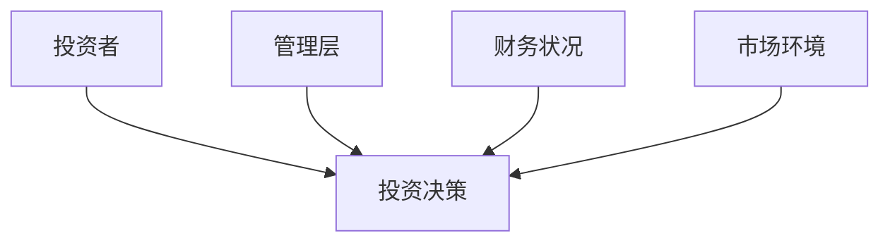
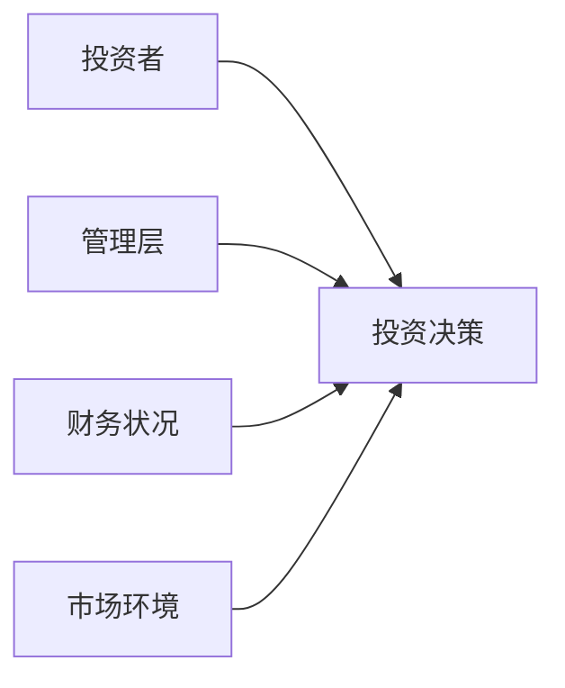

                 


# 智能化公司治理评估：多智能体AI在价值投资中的应用

> **关键词**：智能化公司治理评估，多智能体AI，价值投资，金融决策，人工智能

> **摘要**：随着金融市场的日益复杂化，传统的公司治理评估方法已难以满足现代投资需求。本文探讨如何运用多智能体人工智能技术，构建智能化的公司治理评估系统，助力价值投资决策。通过分析多智能体AI的核心原理、算法实现和系统架构，结合实际案例，展示其在金融领域的应用潜力和实践价值。

---

## 第1章: 公司治理评估的智能化需求

### 1.1 问题背景与挑战

#### 1.1.1 传统公司治理评估的局限性

传统的公司治理评估主要依赖于财务指标和简单的定性分析。这种方法在一定程度上能够反映公司的运营状况，但在面对复杂市场环境和多样化因素时显得力不从心。例如，财务指标无法完全捕捉到公司治理中的潜在风险，如管理层决策失误或内部腐败问题。

#### 1.1.2 价值投资中的公司治理问题

价值投资者通常关注公司的长期价值，而公司治理的优劣直接影响企业的长期发展。传统评估方法难以量化公司治理的多个维度，如董事会结构、管理层激励机制等，导致评估结果不够全面。

#### 1.1.3 智能化评估的必要性

随着金融市场数据的爆炸式增长，单纯依靠人工分析已难以处理海量信息。智能化评估能够通过多智能体AI技术，从多维度、多层次分析公司治理问题，提供更精准的评估结果，帮助投资者做出更明智的决策。

---

### 1.2 多智能体AI的基本概念

#### 1.2.1 多智能体系统定义

多智能体系统（Multi-Agent System, MAS）是由多个相互作用的智能体组成的系统，这些智能体能够通过协作或竞争完成特定任务。在公司治理评估中，每个智能体可以代表一个评估维度，如财务状况、管理团队稳定性等。

#### 1.2.2 多智能体AI的特点

- **分布式智能**：每个智能体独立决策，协同完成任务。
- **动态协作**：智能体之间通过通信和协调，实时调整策略。
- **自适应性**：能够根据环境变化动态调整行为。

#### 1.2.3 多智能体与传统AI的对比

| 特性 | 传统AI | 多智能体AI |
|------|--------|------------|
| 决策方式 | 单点决策 | 分布式决策 |
| 协作性 | 独立运行 | 高度协作 |
| 适应性 | 较低 | 较高 |

---

## 第2章: 多智能体AI在金融领域的应用潜力

### 2.1 金融领域的复杂性

#### 2.1.1 金融市场的多参与方特性

金融市场由众多参与者构成，包括投资者、公司、监管机构等。每个参与者的行为都可能影响市场走势，使得评估公司治理成为一个复杂的多维度问题。

#### 2.1.2 多智能体在金融决策中的优势

多智能体AI能够同时处理多个维度的信息，如财务数据、市场情绪、政策变化等，提供更全面的评估结果。此外，智能体之间的协作能够模拟市场参与者的互动，捕捉潜在风险。

#### 2.1.3 价值投资中的信息处理需求

价值投资者需要综合分析公司的财务状况、行业地位、管理团队等多个因素。多智能体AI能够帮助投资者快速处理和分析这些信息，提供更精准的评估结果。

---

### 2.2 多智能体AI的核心原理

#### 2.2.1 多智能体系统的架构



#### 2.2.2 个体智能体的行为模型

智能体通过感知环境（如财务数据、市场趋势）做出决策，并与其他智能体协作，最终形成评估结果。每个智能体都有自己的目标和策略，但通过系统级的协调实现整体最优。

#### 2.2.3 系统级的协调与优化

通过强化学习和博弈论，多智能体系统能够在复杂环境中找到最优解。智能体之间的通信和协作机制是系统的关键，确保每个智能体的决策能够协同一致。

---

## 第3章: 公司治理评估的智能化方法

### 3.1 传统公司治理评估方法分析

#### 3.1.1 财务指标法

仅关注财务数据，无法全面反映公司治理状况。

#### 3.1.2 治理结构评估法

依赖于主观判断，难以量化评估结果。

#### 3.1.3 传统方法的局限性

- 数据维度单一
- 评估结果不够精准
- 难以应对复杂市场环境

---

### 3.2 多智能体模型在公司治理评估中的应用

#### 3.2.1 多智能体模型的优势

- **全面性**：能够同时处理多个维度的信息。
- **动态性**：适应市场变化，实时调整评估结果。
- **协作性**：多个智能体协同工作，提供更准确的评估。

#### 3.2.2 模型构建的基本思路

1. 确定评估维度（如财务状况、管理团队、市场环境等）。
2. 为每个维度设计一个智能体。
3. 设计智能体之间的协作机制，确保系统级最优。

#### 3.2.3 评估指标体系的构建

通过多智能体协作，构建一个包含多个评估维度的指标体系，确保评估结果的全面性和准确性。

---

## 第4章: 多智能体AI算法原理

### 4.1 强化学习基础

#### 4.1.1 强化学习的基本概念

智能体通过与环境交互，学习策略以最大化累计奖励。

#### 4.1.2 状态、动作、奖励的定义

- **状态（State）**：智能体所处环境的信息。
- **动作（Action）**：智能体根据状态做出的决策。
- **奖励（Reward）**：智能体行为的结果反馈。

#### 4.1.3 策略与价值函数的数学模型

策略函数：$$ \pi(a|s) = P(\text{选择动作 } a | \text{状态 } s) $$

价值函数：$$ V(s) = \max_a Q(s,a) $$

---

### 4.2 多智能体协作机制

#### 4.2.1 多智能体协作的基本原理

智能体之间通过通信和协作，共同完成复杂的评估任务。

#### 4.2.2 联合强化学习框架

智能体通过共享经验，共同学习，提高整体性能。

#### 4.2.3 智能体之间的通信与协调

通过消息传递机制，智能体之间实时交换信息，确保协作一致。

---

## 第5章: 公司治理评估的多智能体模型实现

### 5.1 模型构建步骤

#### 5.1.1 数据收集与预处理

收集公司财务数据、市场信息等，进行清洗和标准化处理。

#### 5.1.2 智能体设计

为每个评估维度设计一个智能体，负责处理特定类型的数据。

#### 5.1.3 系统级优化

通过强化学习，优化智能体的协作机制，提高整体评估精度。

---

### 5.2 算法实现与优化

#### 5.2.1 环境安装

安装必要的库和工具，如TensorFlow、Keras等。

#### 5.2.2 核心代码实现

```python
class Agent:
    def __init__(self, state_space, action_space):
        self.state_space = state_space
        self.action_space = action_space
        # 初始化策略网络
        self.policy = self.build_network(state_space, action_space)

    def build_network(self, state_space, action_space):
        # 网络结构设计
        pass

    def act(self, state):
        # 根据策略选择动作
        pass

    def update(self, reward):
        # 更新策略
        pass
```

---

## 第6章: 系统设计与实现

### 6.1 系统架构设计



### 6.2 接口设计与交互

定义智能体之间的通信接口，确保协作顺利进行。

---

## 第7章: 项目实战

### 7.1 环境安装与配置

安装必要的Python库，如TensorFlow、Keras等。

### 7.2 代码实现与解读

实现多智能体协作的算法，解读代码逻辑。

### 7.3 实际案例分析

通过具体案例，展示多智能体AI在公司治理评估中的应用效果。

---

## 第8章: 最佳实践与总结

### 8.1 总结

总结全文内容，强调多智能体AI在公司治理评估中的重要性。

### 8.2 注意事项

在实际应用中，需要注意数据质量和模型的可解释性。

### 8.3 未来展望

探讨多智能体AI在金融领域的更多应用可能性。

---

## 作者：AI天才研究院 & 禅与计算机程序设计艺术

通过本文，我们详细探讨了多智能体AI在公司治理评估中的应用，展示了其在价值投资中的巨大潜力。希望本文能为读者提供有价值的参考，帮助他们在复杂多变的金融市场中做出更明智的决策。

