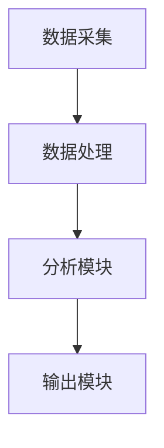

                 


# 智能化公司间比较分析：多智能体AI的价值投资应用

> 关键词：多智能体AI，价值投资，公司比较分析，智能化投资，AI算法

> 摘要：本文探讨了多智能体AI在价值投资中的应用，特别是如何通过智能化的公司间比较分析来提升投资决策的效率和准确性。文章从背景、概念、算法原理、系统架构到项目实战，全面解析了多智能体AI在价值投资中的核心价值和实现路径。

---

## 第一部分: 智能化公司间比较分析的背景与概念

### 第1章: 智能化公司间比较分析概述

#### 1.1 智能化公司比较分析的背景

##### 1.1.1 传统公司比较分析的局限性

传统的公司比较分析主要依赖人工收集和整理数据，分析效率低，且容易受到主观因素的影响。此外，传统方法难以处理海量数据，难以捕捉复杂市场环境中的细微变化。

##### 1.1.2 多智能体AI的兴起与应用

随着人工智能技术的发展，多智能体AI逐渐兴起。多智能体AI通过分布式协作，能够高效处理复杂问题，适用于金融投资、自动驾驶、机器人协作等领域。

##### 1.1.3 价值投资中的智能化需求

价值投资需要对大量公司进行深度分析，传统的分析方法效率低下。多智能体AI能够快速处理海量数据，提供精准的分析结果，满足价值投资者对高效、准确分析的需求。

#### 1.2 多智能体AI的基本概念

##### 1.2.1 多智能体系统的定义

多智能体系统是指由多个相互作用的智能体组成的系统，每个智能体都有自己的目标和决策机制，通过协作完成复杂任务。

##### 1.2.2 多智能体AI的核心属性

- **自主性**：智能体能够自主决策。
- **反应性**：能够实时感知环境并做出反应。
- **协作性**：多个智能体能够协作完成任务。
- **学习性**：能够通过经验优化自身行为。

##### 1.2.3 多智能体AI与传统AI的区别

多智能体AI强调协作和分布式决策，而传统AI通常基于单一智能体。多智能体AI在处理复杂、动态环境中的任务时更具优势。

#### 1.3 本章小结

- 多智能体AI的核心概念和优势。
- 价值投资中对智能化分析的需求。
- 本书的研究目标和框架。

---

## 第2章: 多智能体AI与价值投资的结合

### 2.1 价值投资的基本原理

#### 2.1.1 价值投资的核心理念

价值投资强调通过分析公司的基本面，寻找被市场低估的投资标的。核心在于发现“烟蒂股”，即具有潜在价值的股票。

#### 2.1.2 价值投资的关键因素

- **盈利能力**：如净利润率、ROE等。
- **成长性**：如收入增长率、净利润增长率。
- **估值指标**：如PE、PB等。

#### 2.1.3 传统价值投资的挑战

传统价值投资依赖人工分析，耗时长、效率低，且容易受到主观因素影响。此外，市场环境复杂多变，人工分析难以捕捉所有关键信息。

### 2.2 多智能体AI在价值投资中的应用

#### 2.2.1 多智能体AI的优势

- **高效数据处理**：多智能体AI能够快速处理海量数据，提升分析效率。
- **精准分析**：通过分布式协作，多智能体AI能够提供更精准的分析结果。
- **实时反馈**：能够实时监控市场变化，及时调整投资策略。

#### 2.2.2 多智能体AI在公司比较中的具体应用

- **数据清洗与预处理**：通过多智能体协作，快速清洗和预处理公司财务数据。
- **特征提取与选择**：利用多智能体AI提取关键财务指标，选择对公司价值影响最大的特征。
- **公司评分与排序**：基于多智能体协作，对多个公司进行综合评分，并进行排序。

#### 2.2.3 多智能体AI与价值投资的结合

通过多智能体AI，价值投资者能够更高效地进行公司比较分析，发现潜在的投资机会，优化投资组合。

### 2.3 本章小结

- 多智能体AI在价值投资中的核心优势。
- 多智能体AI在公司比较中的具体应用。
- 多智能体AI与价值投资结合的意义。

---

## 第3章: 多智能体AI的数学模型与算法原理

### 3.1 多智能体AI的核心算法

#### 3.1.1 聚类算法

聚类算法用于将相似的公司归为一类，便于后续分析。常用算法包括K-means、DBSCAN等。

#### 3.1.2 分类算法

分类算法用于将公司分为不同的类别，如高成长型、稳定型等。常用算法包括决策树、随机森林等。

#### 3.1.3 联合推理算法

联合推理算法用于综合多个智能体的分析结果，形成最终的决策。常用算法包括Distributed Reasoning、Multi-Agent Decision Making等。

### 3.2 多智能体AI的数学模型

#### 3.2.1 聚类模型

聚类模型通过计算公司之间的相似性，将公司分为不同的类别。常用的相似性指标包括欧氏距离、Jaccard相似系数等。

#### 3.2.2 分类模型

分类模型通过训练数据，建立分类器，对新的公司进行分类。常用的分类器包括支持向量机（SVM）、神经网络等。

#### 3.2.3 联合推理模型

联合推理模型通过综合多个智能体的分析结果，形成最终的决策。模型通常基于概率论和统计学原理。

### 3.3 算法实现

#### 3.3.1 聚类算法的实现

使用Python的scikit-learn库实现K-means聚类算法：

```python
from sklearn.cluster import KMeans
import numpy as np

# 示例数据
X = np.array([[1, 2], [3, 4], [5, 6], [7, 8]])

# 聚类模型
kmeans = KMeans(n_clusters=2)
kmeans.fit(X)
print(kmeans.labels_)
```

#### 3.3.2 分类算法的实现

使用决策树算法对股票进行分类：

```python
from sklearn.tree import DecisionTreeClassifier
from sklearn.datasets import make_classification

# 示例数据
X, y = make_classification(n_samples=100, n_features=2)
clf = DecisionTreeClassifier()
clf.fit(X, y)
print(clf.predict(X))
```

#### 3.3.3 联合推理算法的实现

通过分布式推理算法，综合多个智能体的分析结果：

```python
import numpy as np

# 示例数据
agents_results = np.array([0.6, 0.7, 0.5])

# 联合推理
combined_result = np.mean(agents_results)
print(combined_result)
```

### 3.4 本章小结

- 多智能体AI的核心算法及其实现。
- 数学模型在多智能体AI中的应用。
- 算法实现的具体步骤和示例。

---

## 第4章: 智能化公司比较分析的系统架构

### 4.1 系统架构设计

#### 4.1.1 系统模块划分

- 数据采集模块：负责采集公司数据。
- 数据处理模块：负责清洗和预处理数据。
- 分析模块：负责公司比较分析。
- 输出模块：负责展示分析结果。

#### 4.1.2 系统功能设计

- 数据采集：从多个数据源获取公司数据。
- 数据处理：清洗、转换数据，提取特征。
- 分析：使用多智能体AI进行公司比较分析。
- 输出：展示分析结果，生成报告。

#### 4.1.3 系统架构图



### 4.2 系统接口设计

#### 4.2.1 数据接口

- 数据输入接口：接收公司数据。
- 数据输出接口：输出分析结果。

#### 4.2.2 用户接口

- 用户输入接口：接收用户的输入指令。
- 用户输出接口：展示分析结果。

#### 4.2.3 API接口

- 提供RESTful API，供其他系统调用。

### 4.3 系统交互流程

#### 4.3.1 数据输入流程

1. 用户输入公司数据。
2. 数据采集模块接收数据。
3. 数据处理模块清洗数据。

#### 4.3.2 数据处理流程

1. 数据清洗：去除无效数据。
2. 数据转换：将数据转换为适合分析的格式。
3. 特征提取：提取关键特征。

#### 4.3.3 结果输出流程

1. 分析模块进行公司比较分析。
2. 输出模块展示分析结果。
3. 用户查看结果并做出决策。

### 4.4 本章小结

- 系统架构设计的核心要点。
- 系统接口设计的原则。
- 系统交互流程的关键环节。

---

## 第5章: 项目实战——智能化公司比较分析系统

### 5.1 环境安装与配置

#### 5.1.1 系统运行环境要求

- 操作系统：Windows/Mac/Linux。
- Python版本：3.6以上。
- 需要安装的库：numpy、pandas、scikit-learn、mermaid等。

#### 5.1.2 开发工具安装

- 安装Jupyter Notebook或PyCharm。
- 安装Mermaid工具。

#### 5.1.3 数据库配置

- 选择合适的数据库，如MySQL、PostgreSQL。
- 配置数据库连接。

### 5.2 系统核心实现

#### 5.2.1 数据预处理

1. 数据清洗：去除重复数据、处理缺失值。
2. 数据转换：将数据转换为适合分析的格式。
3. 特征提取：提取关键特征，如净利润增长率、ROE等。

#### 5.2.2 算法实现

1. 使用K-means算法进行聚类分析。
2. 使用决策树算法进行分类分析。
3. 使用分布式推理算法进行联合推理。

#### 5.2.3 系统测试

1. 测试数据预处理模块。
2. 测试算法模块。
3. 测试系统交互流程。

### 5.3 代码实现与解读

#### 5.3.1 数据预处理代码

```python
import pandas as pd

# 示例数据
data = {'公司': ['A', 'B', 'C', 'D'],
        '净利润增长率': [0.2, 0.3, 0.1, 0.4],
        'ROE': [0.15, 0.2, 0.1, 0.25]}
df = pd.DataFrame(data)

# 数据清洗
df.dropna()
print(df)
```

#### 5.3.2 算法实现代码

```python
from sklearn.cluster import KMeans

# 示例数据
X = df[['净利润增长率', 'ROE']].values

# 聚类分析
kmeans = KMeans(n_clusters=2)
kmeans.fit(X)
print(kmeans.labels_)
```

#### 5.3.3 系统测试代码

```python
import pytest

def test_kmeans():
    X = df[['净利润增长率', 'ROE']].values
    kmeans = KMeans(n_clusters=2)
    kmeans.fit(X)
    assert len(kmeans.labels_) == len(X)

test_kmeans()
```

### 5.4 实际案例分析

#### 5.4.1 案例背景

假设我们有四家公司的数据，需要通过多智能体AI进行比较分析。

#### 5.4.2 数据分析

1. 数据清洗：去除无效数据。
2. 数据转换：将数据转换为适合分析的格式。
3. 特征提取：提取净利润增长率和ROE作为关键特征。

#### 5.4.3 分析结果

通过K-means算法，将公司分为两类。第一类包括公司A和C，第二类包括公司B和D。

#### 5.4.4 投资决策

根据分析结果，建议投资者关注公司B和D，因为它们具有较高的净利润增长率和ROE。

### 5.5 本章小结

- 项目实战的核心内容。
- 代码实现的具体步骤和解读。
- 案例分析的过程和结果。

---

## 第六章: 最佳实践与总结

### 6.1 最佳实践

1. 数据预处理是关键，确保数据质量。
2. 选择合适的算法，根据实际需求进行调整。
3. 系统架构设计要合理，确保系统的可扩展性和可维护性。

### 6.2 小结

多智能体AI在价值投资中的应用前景广阔，通过智能化的公司比较分析，投资者能够更高效、准确地进行投资决策。

### 6.3 注意事项

1. 数据隐私和安全问题需要重视。
2. 算法的选择和调优需要根据实际情况进行。
3. 系统的稳定性和可靠性需要保障。

### 6.4 拓展阅读

1. 多智能体系统：[Multi-Agent Systems](https://en.wikipedia.org/wiki/Agent-oriented_software Engineering)
2. 价值投资经典书籍：《 Intelligent Investor》
3. 人工智能与金融：[Artificial Intelligence in Finance](https://www.sciencedirect.com/science/topic/computer-science/artificial-intelligence-in-finance)

---

## 作者：AI天才研究院/AI Genius Institute & 禅与计算机程序设计艺术 /Zen And The Art of Computer Programming

---

希望这篇文章能够为您提供有价值的见解和实用的技术指导。

