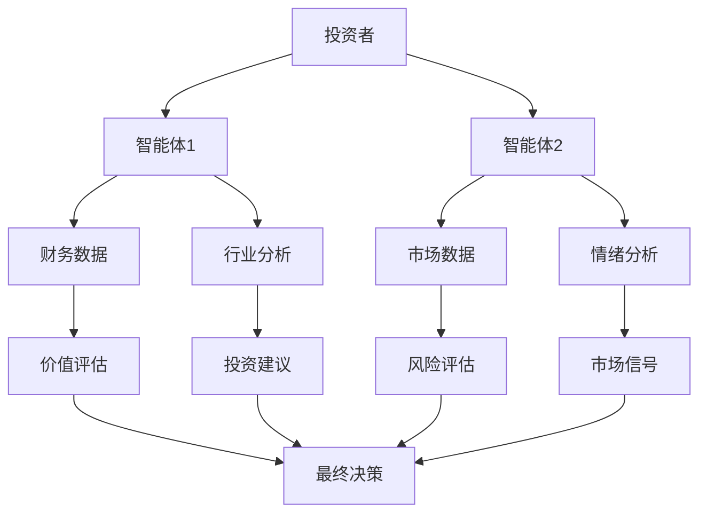
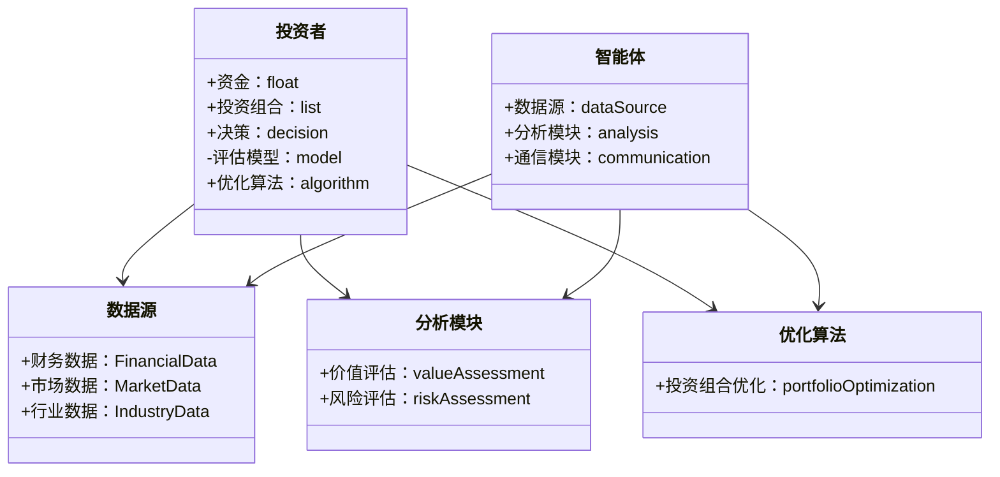
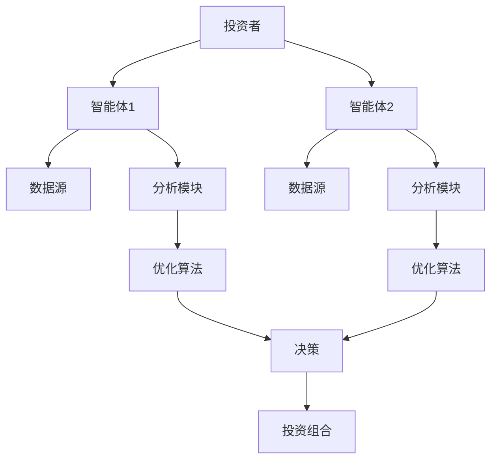
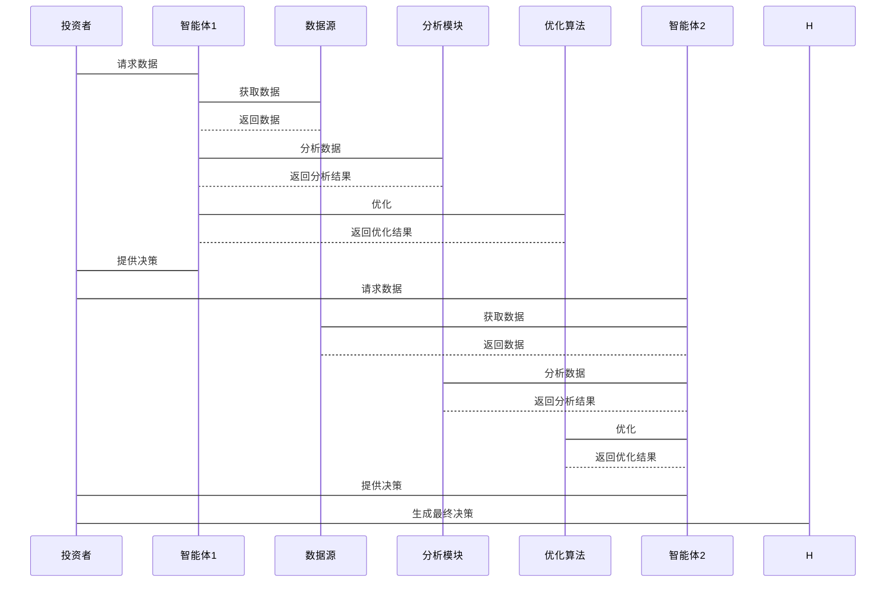

                 


```markdown
# 智能化商业模式分析：多智能体AI在价值投资中的角色

## 关键词：多智能体AI，价值投资，商业模式，人工智能，投资决策

## 摘要：
本文深入探讨了多智能体AI在价值投资中的应用，分析了其在智能化商业模式中的角色。通过背景介绍、核心概念、算法原理、系统架构、项目实战和总结，展示了多智能体AI如何通过协作机制优化投资决策，解决传统投资中的信息不对称问题，并通过数学模型和实际案例验证其优势。

---

# 第1章：智能化商业模式与多智能体AI的背景介绍

## 1.1 多智能体AI的基本概念

### 1.1.1 多智能体AI的定义
多智能体AI是由多个相互作用的智能体组成的系统，这些智能体通过协作完成复杂的任务。与传统AI不同，多智能体AI强调分布式计算和自主决策，能够适应动态变化的环境。

### 1.1.2 多智能体AI的核心特征
- **分布式计算**：多个智能体独立运行，通过通信协作完成任务。
- **自主决策**：每个智能体具备自主决策能力，能够根据环境反馈调整行为。
- **协作与竞争**：智能体之间可以协作或竞争，以实现共同目标或个体目标。

### 1.1.3 多智能体AI与传统AI的区别
| 特性               | 多智能体AI                 | 传统AI                   |
|--------------------|--------------------------|--------------------------|
| 结构               | 分布式，多个智能体         | 集中式，单个或少数智能体   |
| 决策方式           | 分散决策，智能体间协作     | 中央控制，集中决策         |
| 环境适应性         | 高，适应动态变化           | 较低，适应性有限           |

## 1.2 价值投资的基本概念

### 1.2.1 价值投资的定义
价值投资是一种投资策略，通过分析企业的基本面，寻找被市场低估的投资标的，长期持有以获得超额收益。

### 1.2.2 价值投资的核心原则
- **安全边际**：买入价格低于内在价值。
- **长期视角**：关注企业的长期盈利能力。
- **独立思考**：避免随市波动，独立判断。

### 1.2.3 价值投资与传统投资的区别
| 特性               | 价值投资                 | 传统投资                 |
|--------------------|--------------------------|--------------------------|
| 投资策略           | 基于基本面分析             | 基于技术分析或短期波动   |
| 持股期限           | 长期持有                  | 短期交易                  |
| 风险承受能力       | 较高                      | 较低                      |

## 1.3 多智能体AI在价值投资中的应用背景

### 1.3.1 价值投资中的信息不对称问题
市场参与者之间的信息不对称导致价格偏离真实价值，多智能体AI通过分布式协作获取更多信息，降低信息不对称。

### 1.3.2 多智能体AI在投资决策中的优势
- **信息整合**：多个智能体分别分析不同维度的数据，整合后提供更全面的评估。
- **决策优化**：通过协作，智能体能够综合考虑多种因素，做出更优决策。
- **动态适应**：多智能体系统能够快速响应市场变化，调整投资策略。

### 1.3.3 当前市场中的应用现状
目前，多智能体AI在量化交易、风险控制等领域已有初步应用，但其潜力尚未完全释放。

---

# 第2章：多智能体AI在价值投资中的核心概念与联系

## 2.1 多智能体AI的协作机制

### 2.1.1 分布式智能体的协作原理
通过通信协议，智能体之间共享信息，协调行动。协作机制包括任务分配、信息同步和决策共识。

### 2.1.2 多智能体之间的信息共享与决策
信息共享机制确保每个智能体都能获得所需数据，基于共识算法做出集体决策。

### 2.1.3 协作中的冲突与协调问题
智能体可能因个体目标差异产生冲突，需通过协调机制达成一致。

## 2.2 价值投资中的多智能体模型

### 2.2.1 多智能体在价值评估中的角色
智能体分别负责财务分析、行业研究和市场情绪分析，综合评估企业价值。

### 2.2.2 多智能体在风险控制中的应用
通过实时监控市场变化，智能体识别潜在风险，调整投资组合。

### 2.2.3 多智能体在投资组合优化中的作用
基于智能体的协作，优化投资组合，分散风险，提高收益。

## 2.3 多智能体AI与价值投资的关系分析

### 2.3.1 多智能体AI如何影响价值投资决策
通过高效的信息处理和协作决策，多智能体AI提升了投资决策的准确性和效率。

### 2.3.2 价值投资中的多智能体协作优势
分布式协作降低了信息不对称，提高了决策质量，增强了系统的鲁棒性。

### 2.3.3 多智能体AI在价值投资中的潜在挑战
包括通信延迟、协调复杂性和隐私问题。

---

# 第3章：多智能体AI的算法原理与数学模型

## 3.1 多智能体AI的算法基础

### 3.1.1 分布式计算与多智能体协作算法
分布式算法确保智能体间高效协作，例如一致性算法和共识算法。

### 3.1.2 多智能体中的通信协议
定义智能体间的通信规则，确保信息有效传递。

### 3.1.3 多智能体中的学习机制
基于强化学习或博弈论，智能体通过经验改进决策。

## 3.2 价值投资中的数学模型

### 3.2.1 价值评估的数学公式
$$ V = \sum_{t=1}^{n} \frac{C_t}{(1+r)^t} $$
其中，V为内在价值，C_t为第t年的现金流，r为折现率。

### 3.2.2 投资组合优化的数学模型
目标函数：最大化收益，最小化风险。
$$ \max \mu - \lambda \sigma $$
其中，$\mu$为预期收益，$\sigma$为风险，$\lambda$为风险厌恶系数。

## 3.3 算法流程图



---

# 第4章：系统分析与架构设计方案

## 4.1 问题场景介绍
构建一个多智能体AI系统，用于价值投资决策支持。

## 4.2 系统功能设计

### 4.2.1 领域模型类图



## 4.3 系统架构设计

### 4.3.1 系统架构图



## 4.4 系统交互流程图



---

# 第5章：项目实战

## 5.1 环境配置

### 5.1.1 安装Python
```bash
python --version
pip install --upgrade pip
```

### 5.1.2 安装依赖库
```bash
pip install numpy pandas matplotlib
pip install gym keras tensorflow
```

## 5.2 核心代码实现

### 5.2.1 智能体类
```python
class Agent:
    def __init__(self, data_source):
        self.data_source = data_source
        self.communication = Communication()

    def analyze(self):
        # 获取数据
        data = self.data_source.get_data()
        # 分析数据
        analysis = self._analyze(data)
        return analysis

    def _analyze(self, data):
        # 示例分析逻辑
        return {'value': data['price'] * 0.8, 'risk': data['volatility']}
```

### 5.2.2 优化算法
```python
def optimize_portfolio(agents, weights):
    # 示例优化逻辑
    return {'weights': weights, 'risk': sum(weights * a['risk'] for a in agents)}
```

### 5.2.3 投资者类
```python
class Investor:
    def __init__(self, agents):
        self.agents = agents
        self.portfolio = []
        self.optimization = Optimization()

    def make_decision(self):
        # 获取分析结果
        results = [agent.analyze() for agent in self.agents]
        # 优化投资组合
        optimal = self.optimization.optimize_portfolio(self.agents, results)
        return optimal
```

## 5.3 案例分析

### 5.3.1 环境配置与代码实现
```bash
# 示例数据源
class DataSource:
    def get_data(self):
        return {'price': 100, 'volatility': 0.1}
```

### 5.3.2 投资决策过程
1. 投资者请求多个智能体进行数据收集和分析。
2. 智能体分别分析财务数据和市场数据，返回分析结果。
3. 优化算法根据分析结果优化投资组合，生成最终决策。

### 5.3.3 实际案例解读
通过分析实际市场数据，多智能体AI系统生成投资组合，实现风险可控下的收益最大化。

## 5.4 项目总结
本项目展示了多智能体AI在价值投资中的应用，通过协作机制和优化算法，提升了投资决策的效率和准确性。

---

# 第6章：总结与展望

## 6.1 总结
多智能体AI通过协作机制优化投资决策，解决传统投资中的信息不对称问题，提升投资收益。

## 6.2 最佳实践 tips
- 确保智能体间高效通信
- 定期更新优化算法
- 监控系统运行状态

## 6.3 注意事项
- 避免过度依赖算法，保持独立判断
- 注意隐私和数据安全
- 定期验证系统准确性

## 6.4 未来展望
多智能体AI在价值投资中的应用将更加广泛，结合区块链和大数据技术，进一步提升投资效率和收益。

---

# 作者：AI天才研究院 & 禅与计算机程序设计艺术

**注：以上内容为示例，实际文章需根据具体需求进行详细扩展和优化。**
```

