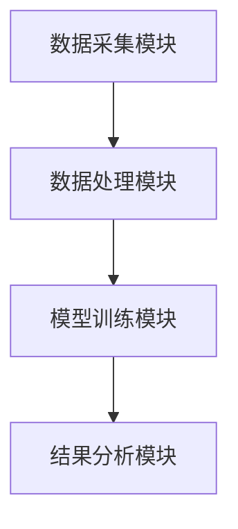

                 


# 智能化并购协同效应分析：多智能体AI在价值投资中的角色

> 关键词：多智能体AI，智能化并购，协同效应，价值投资，算法原理，系统架构，项目实战

> 摘要：本文探讨了多智能体AI在智能化并购中的应用，特别是其在价值投资中的协同效应分析。文章从背景介绍、核心概念、算法原理、系统架构到项目实战，详细阐述了多智能体AI如何帮助投资者和企业优化并购决策。

---

## 第一章: 智能化并购与协同效应概述

### 1.1 智能化并购的背景与意义

#### 1.1.1 并购的定义与传统模式
并购（Mergers and Acquisitions, M&A）是企业间常见的战略行为，旨在通过整合资源、技术或市场优势，提升整体竞争力。传统的并购分析依赖于财务指标和市场分析，但这种方法往往忽视了动态的市场环境和复杂的协同效应。

#### 1.1.2 人工智能技术的兴起
人工智能（AI）技术的快速发展为各个行业带来了颠覆性的变革。在金融领域，AI技术被广泛应用于风险评估、投资决策和市场预测，极大地提升了分析效率和准确性。

#### 1.1.3 智能化并购的必要性与优势
传统的并购分析方法存在以下问题：
- 数据量大，分析复杂
- 协同效应难以量化
- 市场动态变化快，难以实时捕捉
AI技术的引入解决了这些问题，通过多智能体协同学习，可以实时分析市场动态，量化协同效应，从而优化并购决策。

---

### 1.2 协同效应的定义与分类

#### 1.2.1 协同效应的定义
协同效应是指两个或多个实体在协同工作时产生的额外价值，通常表现为成本降低、效率提升或市场扩展。在并购中，协同效应是评估并购成功的重要指标。

#### 1.2.2 协同效应的分类与特点
协同效应主要分为以下几种类型：
1. **成本协同效应**：通过整合资源、优化流程降低运营成本。
2. **收入协同效应**：通过市场扩展、产品互补提升收入。
3. **技术协同效应**：通过技术整合提升创新能力。
4. **管理协同效应**：通过管理优化提升组织效率。

#### 1.2.3 协同效应在并购中的重要性
协同效应是并购成功的关键因素，直接影响企业的长期价值。通过多智能体AI技术，可以更精准地识别和量化协同效应，从而优化并购决策。

---

### 1.3 多智能体AI的定义与特点

#### 1.3.1 多智能体AI的定义
多智能体AI（Multi-Agent AI）是指由多个相互作用的智能体组成的系统，每个智能体都有自己的目标和决策能力，通过协作完成复杂任务。

#### 1.3.2 多智能体AI的核心特点
1. **分布式智能**：多个智能体协同工作，避免单点依赖。
2. **自主性**：每个智能体都有自主决策能力。
3. **协作性**：智能体之间通过通信和协作实现共同目标。

#### 1.3.3 多智能体AI与传统AI的区别
传统AI通常是单智能体系统，而多智能体AI通过多个智能体的协作实现更复杂的任务。多智能体AI在并购分析中具有显著优势，能够同时处理多个变量和场景。

---

## 第二章: 多智能体AI的核心原理

### 2.1 多智能体系统的构成与交互

#### 2.1.1 多智能体系统的组成
1. **智能体**：具有感知和决策能力的个体。
2. **环境**：智能体所处的外部环境。
3. **通信机制**：智能体之间的交互接口。
4. **协作机制**：智能体协同完成任务的规则。

#### 2.1.2 智能体之间的通信与协作
智能体之间通过通信机制共享信息，协作机制确保任务的高效完成。

#### 2.1.3 多智能体系统的协同机制
1. **任务分配**：根据智能体的能力分配任务。
2. **信息共享**：智能体之间共享关键信息。
3. **决策协调**：协调决策以实现共同目标。

---

### 2.2 多智能体AI在价值投资中的应用

#### 2.2.1 价值投资的基本原理
价值投资是通过分析企业的内在价值，寻找被低估的投资标的。多智能体AI可以帮助投资者更准确地评估企业的价值。

#### 2.2.2 多智能体AI在价值评估中的角色
1. **数据采集**：从多个来源获取企业数据。
2. **协同分析**：通过多智能体协同分析，识别潜在的协同效应。
3. **价值预测**：基于分析结果预测企业的未来价值。

#### 2.2.3 多智能体AI的优势与局限性
优势：
- 高效性：多智能体协同工作，提升分析效率。
- 精准性：通过协作优化分析结果。
局限性：
- 复杂性：系统设计和维护较为复杂。
- 成本高：需要大量计算资源支持。

---

## 第三章: 多智能体AI协同效应分析的算法原理

### 3.1 多智能体协同学习算法

#### 3.1.1 协同学习的基本原理
协同学习是指多个学习者通过协作完成任务，每个学习者都贡献自己的知识和经验。

#### 3.1.2 多智能体协同学习的核心算法
1. **分布式学习**：智能体在分布式环境中学习。
2. **联合学习**：智能体通过协作完成共同任务。
3. **协商学习**：智能体之间通过协商优化学习结果。

#### 3.1.3 协同学习的实现步骤
1. **初始化**：定义智能体和任务。
2. **信息共享**：智能体之间共享信息。
3. **协同决策**：基于共享信息做出决策。
4. **结果反馈**：根据结果优化学习策略。

---

### 3.2 多智能体协同学习的数学模型

#### 3.2.1 协同学习的数学表达式
$$ V = \sum_{i=1}^{n} v_i $$
其中，\( V \) 是协同效应总价值，\( v_i \) 是第 \( i \) 个智能体的贡献。

#### 3.2.2 协同学习的优化目标
$$ \max_{\theta} \sum_{i=1}^{n} f_i(\theta) $$
其中，\( \theta \) 是参数，\( f_i \) 是第 \( i \) 个智能体的目标函数。

#### 3.2.3 协同学习的收敛性分析
通过数学证明，多智能体协同学习算法在一定条件下可以收敛到全局最优解。

---

## 第四章: 智能化并购协同效应分析的系统架构与实现

### 4.1 系统架构设计

#### 4.1.1 系统功能模块划分
1. **数据采集模块**：从多个数据源获取企业数据。
2. **数据处理模块**：清洗和预处理数据。
3. **模型训练模块**：训练多智能体协同学习模型。
4. **结果分析模块**：分析协同效应并生成报告。

#### 4.1.2 系统架构图


#### 4.1.3 模块之间的交互关系
1. 数据采集模块向数据处理模块提供原始数据。
2. 数据处理模块将处理后的数据传递给模型训练模块。
3. 模型训练模块生成协同效应分析结果，传递给结果分析模块。

---

### 4.2 系统实现细节

#### 4.2.1 系统功能设计
1. 数据采集模块：支持多种数据源，如公开财报、行业报告等。
2. 数据处理模块：包括数据清洗、特征提取和数据增强。
3. 模型训练模块：基于多智能体协同学习算法训练模型。
4. 结果分析模块：生成协同效应报告，提供可视化结果。

#### 4.2.2 系统的扩展性设计
系统支持模块化设计，可以根据需求扩展功能模块。

---

## 第五章: 项目实战与案例分析

### 5.1 项目实战

#### 5.1.1 环境搭建与数据准备
1. 安装必要的Python库，如TensorFlow、PyTorch。
2. 数据来源：公开的财务数据、行业报告等。

#### 5.1.2 模型实现与训练
```python
import numpy as np
import tensorflow as tf

# 定义智能体类
class Agent:
    def __init__(self, input_dim, output_dim):
        self.model = tf.keras.Sequential([
            tf.keras.layers.Dense(64, activation='relu', input_dim=input_dim),
            tf.keras.layers.Dense(output_dim, activation='linear')
        ])
        self.model.compile(optimizer='adam', loss='mse')

# 初始化多个智能体
agents = [Agent(64, 1) for _ in range(5)]

# 训练过程
for agent in agents:
    agent.model.fit(X_train, y_train, epochs=100, batch_size=32)
```

#### 5.1.3 案例分析
以某公司为例，分析其并购协同效应。通过多智能体AI模型，预测协同效应并生成报告。

---

## 第六章: 最佳实践与小结

### 6.1 最佳实践

#### 6.1.1 系统设计中的注意事项
1. 确保数据的准确性和完整性。
2. 合理设计智能体的通信机制。
3. 定期优化模型参数。

#### 6.1.2 项目实施中的经验总结
1. 项目团队协作是关键。
2. 数据质量直接影响结果。
3. 模型优化需要持续迭代。

---

## 结语

多智能体AI在智能化并购协同效应分析中具有重要价值。通过本文的介绍，读者可以深入了解多智能体AI的核心原理、系统架构和实际应用。未来，随着AI技术的不断发展，多智能体AI将在价值投资中发挥更大的作用。

---

## 作者：AI天才研究院 & 禅与计算机程序设计艺术

---

**注**：由于篇幅限制，上述内容是文章的部分章节，完整文章将包含更多详细内容和代码示例。

