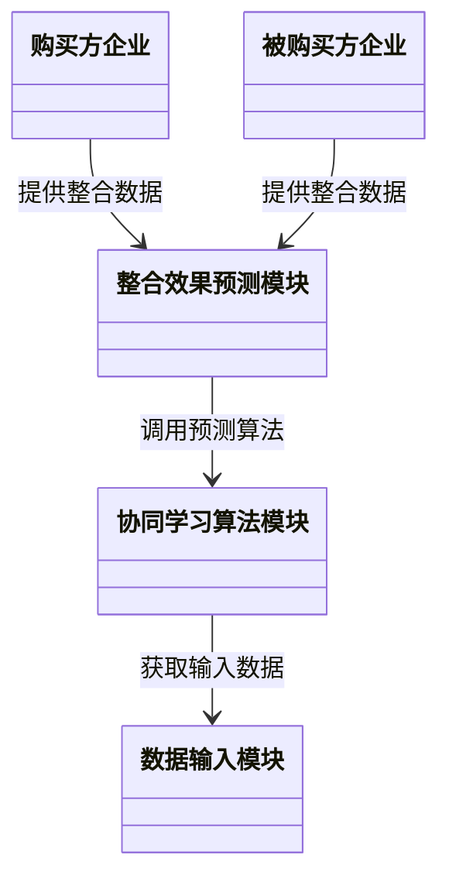
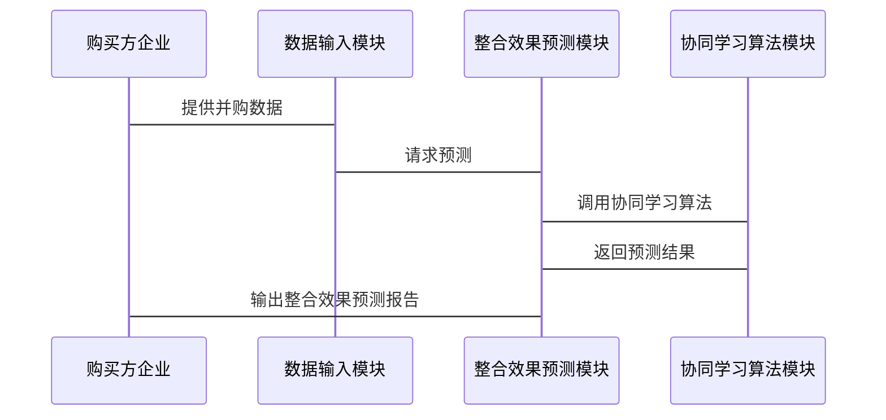

                 


# 智能化并购后整合效果预测：多智能体AI的新视角

---

## 关键词：
智能化并购、整合效果预测、多智能体AI、协同学习、商业整合

---

## 摘要：
本文从智能化并购后整合效果预测的角度，探讨了多智能体AI在这一领域的应用。通过分析传统整合方法的局限性，提出了基于多智能体AI的新视角，详细阐述了多智能体协同学习算法的原理、系统架构设计、实际案例分析及最佳实践。本文旨在为读者提供一个全面的技术视角，帮助他们理解如何利用多智能体AI技术优化并购后的整合效果。

---

# 第1章：智能化并购后整合效果预测的背景与问题

## 1.1 并购整合的背景与挑战
### 1.1.1 并购整合的定义与重要性
### 1.1.2 并购整合中的主要挑战
### 1.1.3 传统并购整合方法的局限性

## 1.2 智能化整合的提出
### 1.2.1 人工智能在商业整合中的应用潜力
### 1.2.2 多智能体AI的新视角
### 1.2.3 智能化整合效果预测的必要性

## 1.3 本书的研究目标与意义
### 1.3.1 研究目标
### 1.3.2 研究意义
### 1.3.3 本书的创新点

---

# 第2章：多智能体AI的基本原理

## 2.1 多智能体系统概述
### 2.1.1 多智能体系统的定义与特点
### 2.1.2 多智能体与传统AI的区别
### 2.1.3 多智能体系统的应用场景

## 2.2 多智能体协同学习
### 2.2.1 协同学习的定义
### 2.2.2 多智能体协同学习的机制
### 2.2.3 协同学习的优势与挑战

## 2.3 多智能体AI在整合效果预测中的应用
### 2.3.1 多智能体AI的核心优势
### 2.3.2 多智能体AI在整合效果预测中的作用
### 2.3.3 多智能体AI的实现框架

---

# 第3章：多智能体协同学习算法

## 3.1 多智能体协同学习的基本算法
### 3.1.1 分散式协同学习算法
### 3.1.2 集中式协同学习算法
### 3.1.3 混合式协同学习算法

## 3.2 基于多智能体的整合效果预测模型
### 3.2.1 模型的输入与输出
### 3.2.2 模型的训练过程
### 3.2.3 模型的评估指标

## 3.3 数学模型与公式
### 3.3.1 协同学习的数学表达
$$ y_i = f(x_i, \theta) $$

### 3.3.2 模型优化的公式推导
$$ \theta^{(t+1)} = \theta^{(t)} - \eta \cdot \nabla L(\theta^{(t)}) $$

---

# 第4章：系统分析与架构设计

## 4.1 问题场景介绍
### 4.1.1 智能化并购整合的典型场景
### 4.1.2 系统功能需求
### 4.1.3 系统边界与外延

## 4.2 系统功能设计
### 4.2.1 领域模型设计（Mermaid类图）


## 4.3 系统架构设计
### 4.3.1 系统架构图（Mermaid架构图）
```mermaid
container 整合效果预测系统 {
    组件1: 数据输入模块
    组件2: 整合效果预测模块
    组件3: 协同学习算法模块
}
```

## 4.4 系统接口设计
### 4.4.1 接口描述
### 4.4.2 接口交互流程（Mermaid序列图）


---

# 第5章：项目实战与案例分析

## 5.1 环境安装与准备
### 5.1.1 开发环境搭建
### 5.1.2 数据集准备
### 5.1.3 工具安装

## 5.2 核心代码实现
### 5.2.1 协同学习算法实现
```python
class MultiAgentCollaborativeLearning:
    def __init__(self, num_agents):
        self.num_agents = num_agents
        self.agents = []
        # 初始化各个智能体
        for _ in range(num_agents):
            self.agents.append(Agent())

    def train(self, data):
        for agent in self.agents:
            agent.train(data)
            agent.collaborate_with_others(self.agents)
```

### 5.2.2 整合效果预测模块实现
```python
class IntegrationEffectPrediction:
    def predict(self, input_data):
        # 调用协同学习算法模块
        result = self.cooperative_learning_agent.predict(input_data)
        return result
```

## 5.3 案例分析与结果解读
### 5.3.1 案例背景
### 5.3.2 实施过程
### 5.3.3 预测结果与分析
### 5.3.4 结果解读与优化建议

---

# 第6章：最佳实践与总结

## 6.1 最佳实践
### 6.1.1 数据质量的重要性
### 6.1.2 模型调优的技巧
### 6.1.3 系统部署的注意事项

## 6.2 小结
### 6.2.1 本书的核心内容总结
### 6.2.2 未来研究方向
### 6.2.3 对读者的展望

---

# 作者：AI天才研究院/AI Genius Institute & 禅与计算机程序设计艺术 /Zen And The Art of Computer Programming

