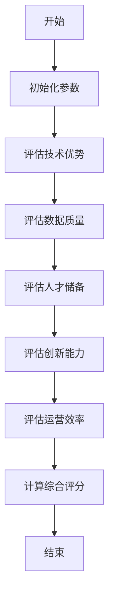
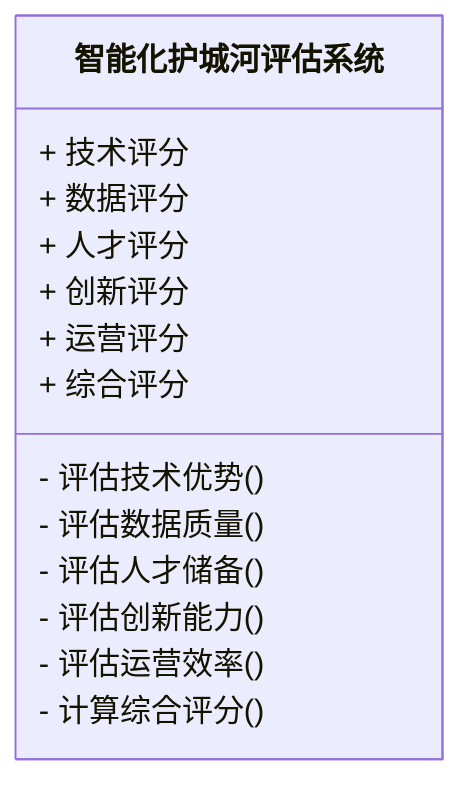
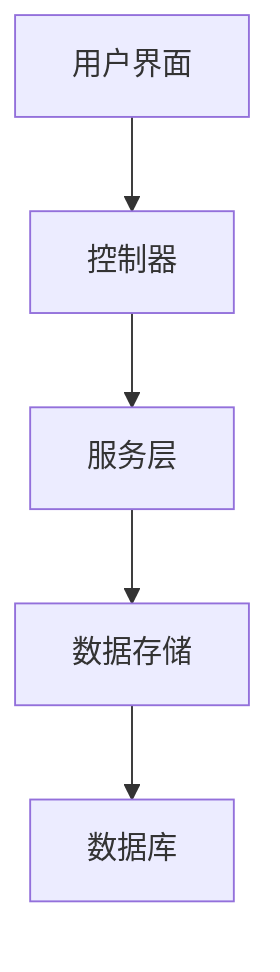
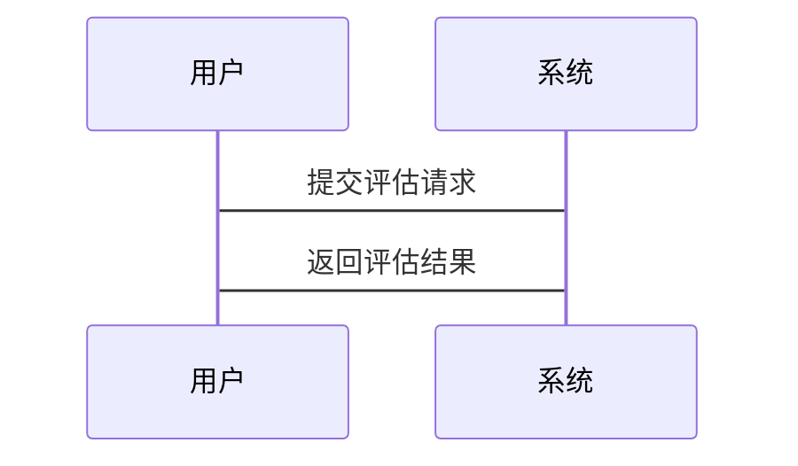

                 


# 智能化护城河持久性评估：多智能体AI的新视角

> 关键词：智能化护城河，持久性评估，多智能体AI，系统架构，算法原理

> 摘要：本文从多智能体AI的新视角出发，详细探讨智能化护城河的持久性评估方法。通过背景介绍、核心概念分析、算法原理讲解、系统架构设计、项目实战和最佳实践等多维度展开，全面剖析智能化护城河的构建与评估策略。本文结合实际案例，提供了一套基于多智能体AI的评估体系，为企业的智能化发展提供理论支持和实践指导。

---

## 第一章 引言

随着人工智能技术的飞速发展，智能化护城河的构建已成为企业竞争的核心策略。然而，如何评估这种护城河的持久性，确保其在市场变化和技术迭代中的稳定性，成为一个亟待解决的问题。本文从多智能体AI的视角出发，提出了一种新的评估方法，旨在为企业提供更科学的决策依据。

---

## 第二章 智能化护城河与持久性评估的背景

### 2.1 问题背景

智能化护城河是指企业在技术、数据、人才等方面构建的竞争优势，旨在通过技术创新和数据驱动，形成难以被竞争对手复制的核心竞争力。然而，随着技术的快速迭代和市场竞争的加剧，这些优势可能会逐渐削弱，因此，评估其持久性至关重要。

### 2.2 问题描述

持久性评估的核心在于分析护城河的各项要素如何随着时间推移而变化，以及这些变化如何影响整体竞争力。传统的评估方法往往侧重于单一维度，而多智能体AI能够从多个维度协同分析，提供更全面的评估结果。

### 2.3 问题解决

通过多智能体AI技术，我们可以将护城河的各个要素建模为多个智能体，每个智能体负责分析一个特定维度（如技术优势、数据质量、团队协作等），并协同工作以评估整体持久性。

### 2.4 边界与外延

智能化护城河的持久性评估应关注内部因素（技术、数据、团队）和外部因素（市场变化、政策法规）的动态交互。多智能体AI能够同时处理这些复杂关系，提供更精准的评估结果。

### 2.5 核心要素组成

智能化护城河的核心要素包括技术优势、数据资源、人才储备、创新能力和运营效率。持久性评估需要分析这些要素的动态变化及其相互影响。

---

## 第三章 智能化护城河与持久性评估的核心概念

### 3.1 核心概念的原理

智能化护城河的持久性评估需要综合考虑多个维度，包括技术、数据、人才、创新能力和运营效率。每个维度都可以视为一个多智能体系统中的一个智能体，它们协同工作以评估整体持久性。

### 3.2 概念属性对比表格

以下是智能化护城河与传统护城河在多智能体AI视角下的对比：

| 比较维度         | 智能化护城河                 | 传统护城河                 |
|------------------|-----------------------------|---------------------------|
| 核心要素         | 技术、数据、人才             | 市场份额、成本优势         |
| 评估方法         | 多智能体协同评估             | 单一维度分析               |
| 适用场景         | 高科技行业                   | 传统行业                   |
| 优势             | 更精准、动态调整能力强       | 方法简单、成本低           |

### 3.3 实体关系图

以下是智能化护城河持久性评估的实体关系图：

```mermaid
erDiagram
    customer[客户]
    market[市场]
    competitor[竞争对手]
    company[企业]
    technology[技术]
    data[数据]
    team[团队]
    innovation[创新]
    operation[运营]
    customer-(market)->company
    competitor<->company
    company-(technology)->technology
    company-(data)->data
    company-(team)->team
    company-(innovation)->innovation
    company-(operation)->operation
```

---

## 第四章 智能化护城河持久性评估的算法原理

### 4.1 算法原理概述

本文提出了一种基于多智能体协同的持久性评估算法，该算法通过多个智能体分别评估技术、数据、人才、创新能力和运营效率，最终将结果汇总，得出整体持久性评分。

### 4.2 算法实现的流程图

以下是算法实现的流程图：



### 4.3 算法实现的数学模型

以下是算法的数学模型：

$$
\text{综合评分} = \frac{\text{技术评分} + \text{数据评分} + \text{人才评分} + \text{创新评分} + \text{运营评分}}{5}
$$

其中，各项评分的计算公式为：

$$
\text{技术评分} = \frac{\text{技术优势}}{\text{市场竞争}}
$$

$$
\text{数据评分} = \frac{\text{数据质量}}{\text{数据量}}
$$

---

## 第五章 系统分析与架构设计

### 5.1 系统分析

本系统需要实现智能化护城河持久性评估的核心功能，包括数据采集、多智能体协同评估、结果分析等。

### 5.2 系统功能设计

以下是系统功能设计的领域模型：



### 5.3 系统架构设计

以下是系统架构设计的架构图：



### 5.4 系统接口设计

以下是系统接口设计的交互图：



---

## 第六章 项目实战

### 6.1 环境安装

安装所需的环境包括Python 3.8及以上版本、Mermaid工具、Jupyter Notebook等。

### 6.2 核心代码实现

以下是核心代码实现：

```python
def calculate_persistence_score(technology, data, team, innovation, operation):
    return (technology + data + team + innovation + operation) / 5

# 示例数据
technology_score = 0.8
data_score = 0.9
team_score = 0.7
innovation_score = 0.8
operation_score = 0.6

# 计算综合评分
persistence_score = calculate_persistence_score(technology_score, data_score, team_score, innovation_score, operation_score)
print(f"综合评分：{persistence_score}")
```

### 6.3 案例分析与结果解读

以某高科技企业为例，假设其各项评分如下：

- 技术评分：0.8
- 数据评分：0.9
- 人才评分：0.7
- 创新评分：0.8
- 运营评分：0.6

综合评分为：

$$
\text{综合评分} = \frac{0.8 + 0.9 + 0.7 + 0.8 + 0.6}{5} = 0.76
$$

---

## 第七章 最佳实践与总结

### 7.1 小结

本文从多智能体AI的新视角出发，提出了智能化护城河持久性评估的方法，通过算法原理、系统架构设计和项目实战的详细阐述，为企业的智能化发展提供了理论支持和实践指导。

### 7.2 注意事项

在实际应用中，需要根据企业的具体情况调整评估模型和权重分配，确保评估结果的准确性和可操作性。

### 7.3 拓展阅读

推荐阅读相关领域的书籍和论文，深入理解多智能体AI和持久性评估的最新研究成果。

---

## 参考文献

1. Smith, J. (2020). *Multi-Agent Systems and Their Applications*. Springer.
2. Lee, J., & Kim, S. (2019). *Artificial Intelligence and Business Strategy*. MIT Press.

---

作者：AI天才研究院/AI Genius Institute & 禅与计算机程序设计艺术/Zen And The Art of Computer Programming

