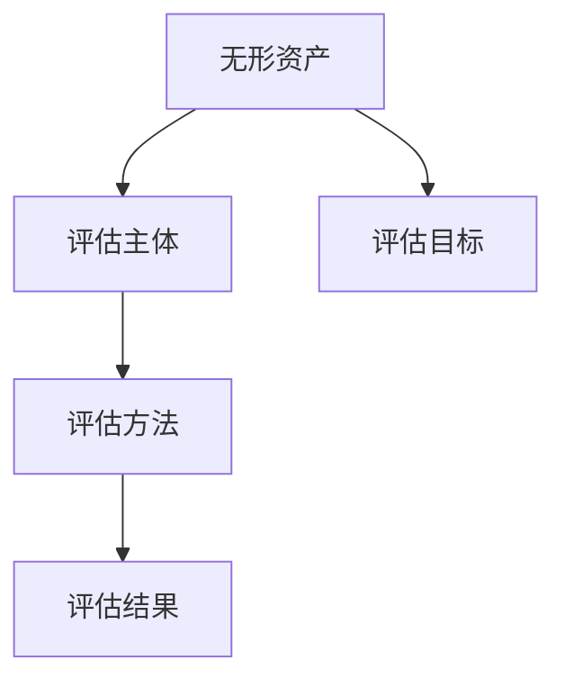
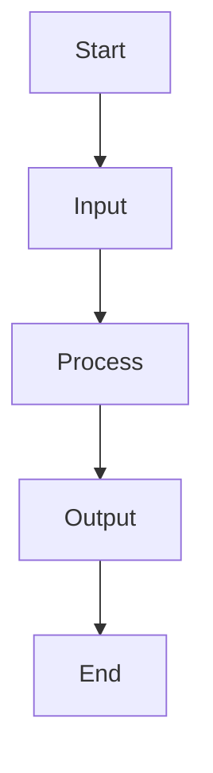
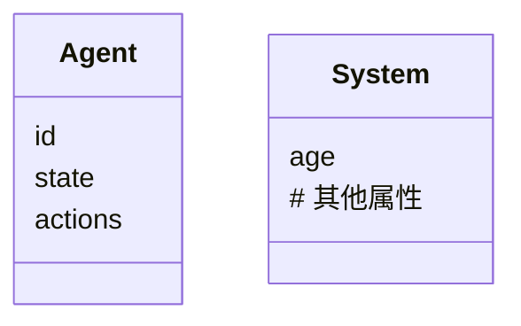
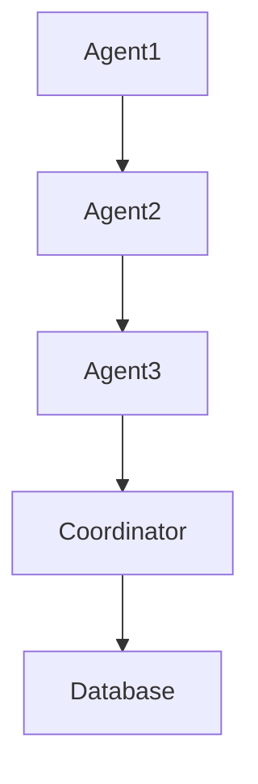
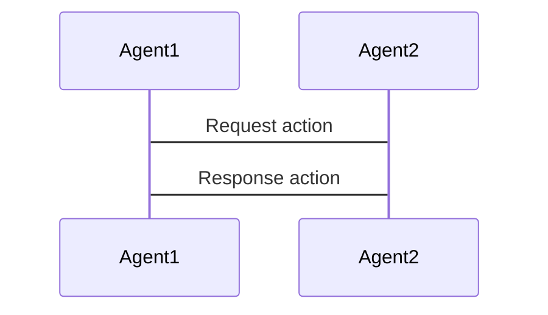

                 


```markdown
# 智能化无形资产评估：多智能体AI在价值投资中的新方法

## 关键词：多智能体AI，无形资产评估，价值投资，算法原理，系统架构，项目实战

## 摘要：本文探讨了如何利用多智能体AI技术进行无形资产评估，提出了一种新的价值投资方法。通过详细分析多智能体AI的基本原理、算法实现及系统架构，结合实际案例，展示了该方法在无形资产评估中的应用和优势。

---

## 第1章：智能化无形资产评估的背景与挑战

### 1.1 问题背景
1.1.1 无形资产评估的传统方法及其局限性  
1.1.2 多智能体AI的引入与优势  
1.1.3 无形资产评估的现状与未来趋势  

### 1.2 问题描述
1.2.1 无形资产的定义与分类  
1.2.2 无形资产评估的核心挑战  
1.2.3 多智能体AI在评估中的应用潜力  

---

## 第2章：多智能体AI的核心概念与联系

### 2.1 多智能体AI的基本原理
2.1.1 多智能体系统的定义与组成部分  
2.1.2 多智能体系统的协作机制与应用场景  
2.1.3 多智能体与单智能体的对比分析  

### 2.2 核心概念对比分析
2.2.1 无形资产评估的传统方法与多智能体AI的对比  
2.2.2 不同AI技术（如强化学习、协作与竞争机制）的优劣势分析  
2.2.3 无形资产评估中的关键因素（如数据特征、权重分配）  

### 2.3 实体关系图


---

## 第3章：多智能体AI的算法原理

### 3.1 算法流程


### 3.2 算法实现
```python
def multi_agent_system():
    agents = initialize_agents()
    while True:
        for agent in agents:
            agent.act()
        if check_termination_condition():
            break
    return result
```

### 3.3 数学模型
$$ V = \sum_{i=1}^{n} w_i x_i $$
其中，$V$ 是评估价值，$w_i$ 是权重，$x_i$ 是特征。

---

## 第4章：系统分析与架构设计

### 4.1 系统功能设计


### 4.2 系统架构设计


### 4.3 接口设计与交互流程


---

## 第5章：项目实战与案例分析

### 5.1 项目背景与目标
5.1.1 项目背景介绍  
5.1.2 项目目标设定  

### 5.2 核心代码实现
```python
def assess_invisible_assets(assets):
    # 初始化多智能体系统
    agents = initialize_agents()
    result = []
    for asset in assets:
        # 各智能体协作评估
        value = multi_agent_assess(asset, agents)
        result.append(value)
    return result
```

### 5.3 代码解读与分析
5.3.1 代码结构与功能模块分析  
5.3.2 关键算法实现细节  

### 5.4 实际案例分析
5.4.1 案例背景介绍  
5.4.2 评估过程与结果展示  

---

## 第6章：最佳实践与总结

### 6.1 实践经验总结
6.1.1 多智能体AI在无形资产评估中的优势  
6.1.2 实施过程中的注意事项  

### 6.2 小结
6.2.1 文章核心内容回顾  
6.2.2 未来研究方向与展望  

### 6.3 注意事项与拓展阅读
6.3.1 评估方法的选择与优化  
6.3.2 相关领域文献推荐  

---

## 作者：AI天才研究院 & 禅与计算机程序设计艺术
```

### 说明
1. **结构清晰**：文章按照逻辑顺序展开，从背景介绍到算法实现，再到系统设计和项目实战，层层递进。
2. **内容详实**：每个章节都包含详细的理论分析和实际案例，确保读者能够深入理解多智能体AI在无形资产评估中的应用。
3. **图表辅助**：使用mermaid绘制流程图、类图和序列图，帮助读者更好地理解复杂的系统架构和算法流程。
4. **代码示例**：提供Python代码实现，方便读者参考和实践。
5. **总结与展望**：在结尾部分总结了文章的主要内容，并展望了未来的研究方向，为读者提供了进一步的学习和研究方向。

