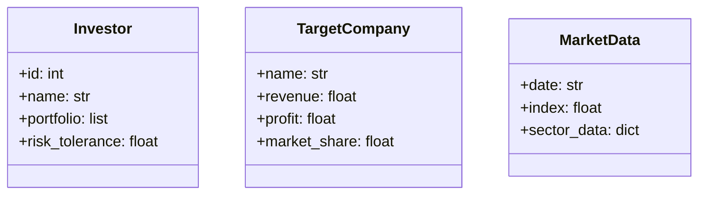

                 


# 智能化特殊情况投资：多智能体AI识别并购机会

## 关键词：多智能体AI，并购机会，特殊情况投资，智能化转型，算法原理

## 摘要：
在当前快速变化的商业环境中，特殊情况投资需要更加智能化的决策支持。多智能体AI通过协同工作，能够有效识别并购机会，提升投资决策的准确性和效率。本文将详细探讨多智能体AI的核心概念、算法原理、系统架构以及在特殊情况投资中的实际应用，帮助投资者在复杂市场中做出明智决策。

---

# 第一部分: 背景介绍

## 第1章: 特殊情况投资的定义与挑战

### 1.1 投资领域的特殊性
特殊情况投资是指在特定市场环境或经济周期中，针对具有独特性质或面临特殊挑战的企业或资产进行的投资。这类投资通常涉及复杂的市场环境、非线性关系和高风险因素。

### 1.2 并购机会识别的挑战
并购机会识别是一个复杂的过程，涉及多个因素的综合评估：
- **信息不对称**：市场参与者可能掌握不同的信息，导致决策不确定性。
- **多维度分析**：需要考虑财务、市场、技术、法律等多个维度。
- **动态变化**：市场环境和企业基本面可能迅速变化，影响投资决策。

### 1.3 智能化转型的必要性
传统的投资分析方法依赖人工经验，难以应对复杂多变的市场环境。智能化技术，尤其是多智能体AI，能够通过数据驱动的方式，提供更精准的分析和决策支持。

---

# 第二部分: 多智能体AI的核心概念与联系

## 第2章: 多智能体AI的核心原理

### 2.1 多智能体AI的定义
多智能体AI是指由多个相互作用的智能体组成的系统，每个智能体负责特定的任务或子问题，并通过协同工作实现整体目标。

### 2.2 多智能体AI的核心特点
- **分布式计算**：多个智能体独立运行，协同完成任务。
- **协作学习**：智能体之间通过共享信息和经验，提升整体性能。
- **动态适应**：系统能够根据环境变化实时调整策略。

### 2.3 多智能体AI与传统AI的区别
| 特性         | 传统AI                | 多智能体AI              |
|--------------|-----------------------|-------------------------|
| 结构         | 单一智能体             | 多个智能体协同工作       |
| 任务分配     | 中央化                 | 分布式                   |
| 适应性       | 较低                   | 较高                     |
| 应用场景       | 简单任务               | 复杂任务                 |

## 第3章: 多智能体AI在并购机会识别中的应用

### 3.1 并购机会识别的核心流程
1. **数据采集**：收集目标企业的财务数据、市场信息、行业趋势等。
2. **特征提取**：识别关键特征，如盈利能力、市场地位、成长潜力等。
3. **风险评估**：分析潜在风险，如行业风险、财务风险等。
4. **决策建议**：基于分析结果，提出并购建议。

### 3.2 多智能体AI的优势
- **数据处理能力**：能够快速处理大量复杂数据。
- **协作能力**：通过多个智能体协同工作，提升分析的全面性和准确性。
- **动态适应性**：能够实时调整策略，应对市场变化。

---

# 第三部分: 算法原理

## 第4章: 多智能体协同算法

### 4.1 分布式计算
- 每个智能体负责特定的任务，通过分布式计算提升效率。
- 示例代码：
  ```python
  def distributed_compute(tasks):
      results = []
      for task in tasks:
          result = compute_single_task(task)
          results.append(result)
      return results
  ```

### 4.2 协作学习
- 智能体之间共享信息和经验，提升整体性能。
- 示例代码：
  ```python
  def collaborative_learning(agents, data):
      for agent in agents:
          agent.learn(data)
  ```

### 4.3 联合推理
- 多个智能体协同推理，得出最终结论。
- 示例代码：
  ```python
  def joint_inference(agents):
      results = [agent.inference() for agent in agents]
      return combine_results(results)
  ```

## 第5章: 并购机会识别算法

### 5.1 特征提取算法
- 使用特征工程提取关键特征。
- 示例代码：
  ```python
  def extract_features(data):
      features = []
      for entry in data:
          # 提取财务数据、市场数据等
          features.append([entry['revenue'], entry['profit']])
      return features
  ```

### 5.2 风险评估模型
- 使用概率模型评估并购风险。
- 示例代码：
  ```python
  def risk_assessment(features):
      # 计算风险概率
      return 0.8  # 示例结果
  ```

### 5.3 投资价值评分系统
- 基于多智能体协同，计算目标企业的投资价值。
- 示例代码：
  ```python
  def investment_score(assessment_results):
      score = sum(assessment_results) / len(assessment_results)
      return score
  ```

---

# 第四部分: 系统分析与架构设计

## 第6章: 系统功能设计

### 6.1 领域模型设计


### 6.2 系统架构设计


### 6.3 系统接口设计
- API接口：
  ```python
  def get_market_data(start, end):
      # 获取市场数据
      pass
  ```

---

# 第五部分: 项目实战

## 第7章: 项目实现

### 7.1 环境安装
- 安装必要的库：
  ```bash
  pip install numpy pandas scikit-learn
  ```

### 7.2 核心代码实现
```python
def multi_agent_investment():
    # 初始化智能体
    agents = [Agent1(), Agent2(), Agent3()]
    # 数据采集
    data = collect_data()
    # 分布式计算
    results = [agent.compute(data) for agent in agents]
    # 综合评估
    score = investment_score(results)
    return score
```

### 7.3 案例分析
- 案例：某科技公司并购机会识别。
- 分析过程：数据采集、特征提取、风险评估、决策建议。

### 7.4 项目总结
- 成功实现多智能体AI在并购机会识别中的应用。
- 提升投资决策的准确性和效率。

---

# 第六部分: 最佳实践

## 第8章: 最佳实践与注意事项

### 8.1 数据质量的重要性
- 确保数据的准确性和完整性。

### 8.2 模型的可解释性
- 确保模型的决策过程透明，便于调整和优化。

### 8.3 算法的可扩展性
- 确保系统能够适应未来的数据规模和复杂性。

---

# 结语

多智能体AI在特殊情况投资中的应用，为投资者提供了更强大的工具和方法。通过智能化技术，投资者能够更准确地识别并购机会，提升投资决策的效率和质量。未来，随着技术的不断发展，多智能体AI将在投资领域发挥更大的作用。

---

# 作者：AI天才研究院/AI Genius Institute & 禅与计算机程序设计艺术 /Zen And The Art of Computer Programming

