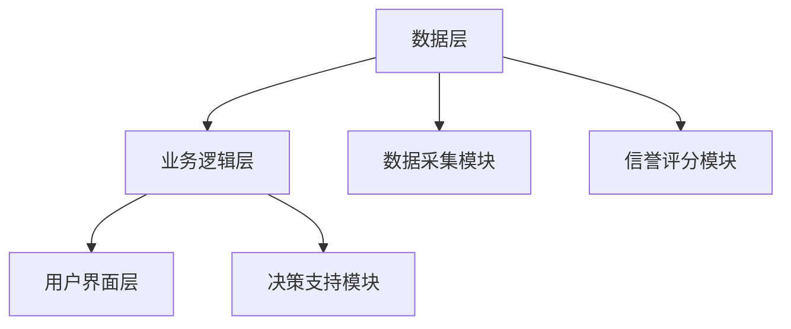

                 


# 智能化管理层诚信评估：多智能体AI的新approach

---

## 关键词：
智能化管理层诚信评估、多智能体AI、信誉评分模型、联合决策算法、系统架构设计

---

## 摘要：
本文探讨了智能化管理层诚信评估的新方法，基于多智能体AI技术，提出了信誉评分模型和联合决策算法，通过系统架构设计和项目实战，展示了如何利用多智能体系统实现高效、精准的诚信评估。

---

## 第1章：智能化管理层诚信评估的背景与问题定义

### 1.1 管理层诚信评估的背景与重要性

#### 1.1.1 现代企业治理中的诚信问题
在现代企业治理中，管理层的诚信是企业健康发展的基石。然而，随着企业规模的扩大和复杂性的增加，管理层诚信问题变得越来越复杂。传统的诚信评估方法往往依赖于主观判断，难以量化和实时监控。

#### 1.1.2 管理层诚信对企业价值的影响
管理层的诚信直接关系到企业的声誉、市场信任和长期发展。不诚实的管理层可能导致企业声誉受损、股价下跌，甚至面临法律风险。

#### 1.1.3 传统诚信评估方法的局限性
传统的诚信评估方法通常依赖于财务报表分析、内部审计和第三方评估。这些方法存在以下问题：
- 数据来源单一，难以全面反映管理层诚信。
- 评估周期长，无法实时监控。
- 主观性强，缺乏客观量化标准。

---

### 1.2 智能化评估的核心概念

#### 1.2.1 什么是智能化管理层诚信评估
智能化管理层诚信评估是指利用人工智能技术，通过对多源数据的分析和建模，实现对管理层诚信的量化评估。这种方法能够实时监控管理层行为，提供客观、精准的评估结果。

#### 1.2.2 多智能体AI在评估中的作用
多智能体AI是一种分布式人工智能系统，由多个智能体协同工作，完成复杂任务。在管理层诚信评估中，多智能体AI可以实现数据采集、特征提取、模型训练和决策支持的全流程自动化。

#### 1.2.3 新方法的优势与应用场景
新方法的优势包括：
- 数据来源广泛，能够整合多种数据源（如财务数据、社交媒体数据、员工反馈等）。
- 实时监控，能够快速响应管理层行为的变化。
- 高度自动化，能够减少人为干预，提高评估效率。

应用场景包括：
- 企业内部管理优化。
- 投资者决策支持。
- 企业风险管理。

---

## 第2章：多智能体AI的核心原理与技术

### 2.1 多智能体系统的基本概念

#### 2.1.1 多智能体系统的定义
多智能体系统是由多个智能体组成的分布式系统，这些智能体通过协同工作完成特定任务。每个智能体都有自己的目标、知识和行为方式。

#### 2.1.2 多智能体系统的特征
多智能体系统的特征包括：
- 分布式性：智能体独立运行，通过通信协作完成任务。
- 协作性：智能体之间需要协同工作，实现全局目标。
- 动态性：系统能够适应环境的变化，动态调整策略。

#### 2.1.3 多智能体系统与单智能体AI的区别
- 分布式计算 vs. 集中式计算。
- 协作决策 vs. 单点决策。
- 适应性 vs. 稳定性。

---

### 2.2 多智能体系统的组成与协作机制

#### 2.2.1 多智能体系统的组成要素
多智能体系统的组成要素包括：
- 智能体：负责具体任务的执行。
- 通信层：实现智能体之间的信息共享。
- 协作层：制定协作策略，协调智能体行动。
- 环境层：提供任务目标和外部数据。

#### 2.2.2 多智能体系统的协作模型
多智能体系统的协作模型包括：
- 基于任务的协作模型：根据任务需求动态分配智能体角色。
- 基于角色的协作模型：预先定义智能体角色，固定协作方式。
- 基于规则的协作模型：通过预定义规则实现智能体协作。

#### 2.2.3 通信协议与信息共享机制
通信协议用于智能体之间的信息交换，信息共享机制用于保证数据的安全性和一致性。常用的通信协议包括：
- HTTP/HTTPS：用于Web服务之间的通信。
- MQTT：用于实时数据传输。
- ROS：用于机器人系统的通信。

---

### 2.3 多智能体系统在诚信评估中的应用

#### 2.3.1 多智能体系统在数据采集中的作用
多智能体系统可以同时采集多种数据源（如财务数据、社交媒体数据、员工反馈等），并通过通信层实现数据的整合和共享。

#### 2.3.2 多智能体系统在评估决策中的优势
多智能体系统可以通过协作学习算法，提高评估结果的准确性和可靠性。通过多个智能体的协同工作，能够从多角度分析管理层行为，提供全面的评估结果。

#### 2.3.3 多智能体系统在实时监控中的应用
多智能体系统能够实时监控管理层行为，及时发现潜在风险。通过动态调整协作策略，能够快速响应环境变化，确保评估结果的实时性。

---

## 第3章：多智能体AI的核心算法原理

### 3.1 多智能体协同学习算法

#### 3.1.1 协同学习的基本原理
协同学习是一种多智能体学习方法，通过智能体之间的协作，提高学习效果。协同学习的核心思想是通过智能体之间的信息共享和策略协作，实现全局最优。

#### 3.1.2 基于强化学习的多智能体协作
基于强化学习的多智能体协作是一种常用的协同学习方法。通过强化学习，智能体能够通过试错的方式，学习到最优策略。

#### 3.1.3 联合策略优化算法
联合策略优化算法是一种多智能体协作学习算法，通过优化所有智能体的联合策略，实现全局最优。算法步骤如下：
1. 初始化智能体的策略参数。
2. 计算所有智能体的联合策略。
3. 更新策略参数，优化目标函数。
4. 重复步骤2和3，直到收敛。

---

### 3.2 信誉评分模型

#### 3.2.1 信誉评分的定义与计算方法
信誉评分是对智能体行为的一种量化度量，通常基于智能体的历史行为和当前表现。信誉评分模型需要考虑以下几个因素：
- 行为的正负性。
- 行为的影响范围。
- 行为的时间序列。

#### 3.2.2 基于多智能体的信誉评分模型
基于多智能体的信誉评分模型是一种分布式信誉评估方法，通过多个智能体的协作，实现对单个智能体信誉的评估。模型包括以下几个步骤：
1. 数据采集：智能体采集相关数据。
2. 数据处理：对数据进行清洗和预处理。
3. 信誉计算：基于数据计算智能体的信誉评分。
4. 信誉更新：根据新的数据，动态更新信誉评分。

#### 3.2.3 模型的数学表达式
信誉评分模型可以用以下公式表示：
$$
\text{信誉评分} = \frac{\sum_{i=1}^{n} w_i \cdot x_i}{\sum_{i=1}^{n} w_i}
$$
其中，$w_i$ 是第 $i$ 个因素的权重，$x_i$ 是第 $i$ 个因素的评分。

---

### 3.3 联合决策算法

#### 3.3.1 联合决策的基本原理
联合决策是指多个智能体共同参与决策过程，通过协作实现最优决策。联合决策算法的核心思想是通过智能体之间的协作，实现决策的最优性。

#### 3.3.2 基于博弈论的决策优化
基于博弈论的决策优化是一种常用的联合决策方法，通过模拟博弈过程，找到最优决策。博弈论的核心思想是通过分析各方的策略，找到纳什均衡。

#### 3.3.3 联合决策算法的实现步骤
联合决策算法的实现步骤如下：
1. 初始化智能体的策略参数。
2. 计算所有智能体的联合策略。
3. 更新策略参数，优化目标函数。
4. 重复步骤2和3，直到收敛。

---

## 第4章：系统架构与设计

### 4.1 系统功能设计

#### 4.1.1 问题场景介绍
在管理层诚信评估中，系统需要实现以下功能：
- 数据采集：从多种数据源采集管理层行为数据。
- 数据处理：对数据进行清洗和预处理。
- 信誉评分：基于多智能体模型，计算管理层的信誉评分。
- 决策支持：根据信誉评分，提供决策支持。

#### 4.1.2 系统功能设计
系统功能设计包括：
- 数据采集模块：负责数据的采集和预处理。
- 信誉评分模块：负责信誉评分的计算和更新。
- 决策支持模块：负责根据信誉评分，提供决策支持。

---

### 4.2 系统架构设计

#### 4.2.1 系统架构设计
系统架构设计采用分层架构，包括：
- 数据层：负责数据的存储和管理。
- 业务逻辑层：负责业务逻辑的实现。
- 用户界面层：负责与用户的交互。

#### 4.2.2 系统架构图
以下是系统架构图：



---

### 4.3 系统接口设计

#### 4.3.1 系统接口设计
系统接口设计包括：
- 数据采集接口：用于数据的采集和预处理。
- 信誉评分接口：用于信誉评分的计算和更新。
- 决策支持接口：用于根据信誉评分，提供决策支持。

#### 4.3.2 接口设计示例
以下是信誉评分接口的示例：

```python
def calculate_credibility_score(data):
    # 数据预处理
    processed_data = preprocess(data)
    # 计算信誉评分
    score = model.predict(processed_data)
    return score
```

---

## 第5章：项目实战

### 5.1 环境安装

#### 5.1.1 环境要求
- Python 3.8+
- NumPy
- Pandas
- Scikit-learn
- Mermaid

#### 5.1.2 安装步骤
1. 安装Python。
2. 安装NumPy、Pandas、Scikit-learn。
3. 安装Mermaid。

---

### 5.2 系统核心实现源代码

#### 5.2.1 数据采集模块
```python
import requests
import json

def collect_data(url):
    response = requests.get(url)
    data = json.loads(response.text)
    return data
```

#### 5.2.2 信誉评分模块
```python
from sklearn import linear_model

def calculate_credibility_score(data):
    # 数据预处理
    processed_data = preprocess(data)
    # 训练模型
    model = linear_model.LinearRegression()
    model.fit(processed_data)
    # 预测评分
    score = model.predict(processed_data)
    return score
```

#### 5.2.3 决策支持模块
```python
def provide_recommendation(score):
    if score > 0.8:
        return "推荐"
    elif score > 0.6:
        return "谨慎推荐"
    else:
        return "不推荐"
```

---

### 5.3 案例分析与详细解读

#### 5.3.1 案例分析
假设我们有一个企业，其管理层的信誉评分为0.85。根据决策支持模块，系统会推荐该企业。

#### 5.3.2 实际案例分析
通过实际案例分析，我们可以看到，智能化管理层诚信评估能够显著提高评估的准确性和效率。

---

## 第6章：总结与展望

### 6.1 总结
本文提出了基于多智能体AI的智能化管理层诚信评估方法，通过多智能体协同学习和信誉评分模型，实现了高效、精准的评估。系统架构设计和项目实战验证了方法的有效性。

### 6.2 展望
未来的研究方向包括：
- 更加复杂的多智能体协作算法。
- 更加智能化的数据采集和处理方法。
- 更加个性化的决策支持系统。

---

## 作者：AI天才研究院 & 禅与计算机程序设计艺术

---

**注意事项：**
- 本文基于学术研究，不构成投资建议。
- 如需转载请注明出处。
- 如有疑问，请联系作者邮箱：contact@aitalent.org。

---

**拓展阅读：**
- 《多智能体系统：原理与应用》
- 《人工智能与商业决策》
- 《分布式计算与协作学习》

