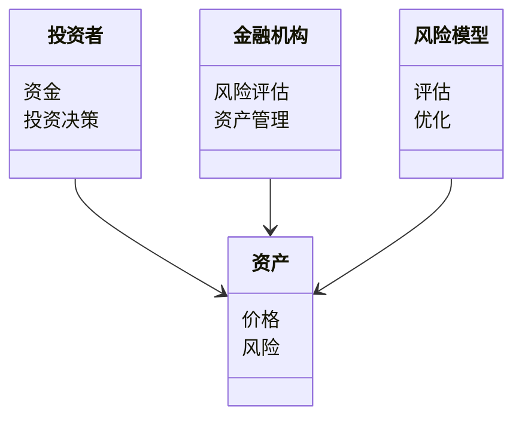
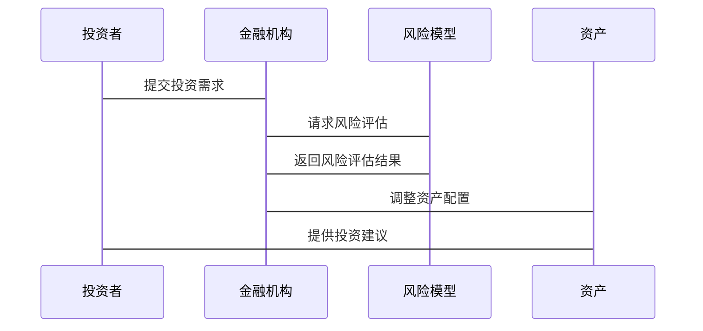

                 


# 智能化资本配置效率分析：多智能体AI的新方法

> 关键词：智能化资本配置，多智能体AI，资本效率优化，协作算法，风险模型

> 摘要：本文探讨了多智能体AI在资本配置效率分析中的应用，通过系统的分析和案例研究，提出了一种基于多智能体AI的新方法，以提高资本配置的效率和准确性。文章从问题背景、核心概念、算法原理、系统架构、项目实战等方面展开，详细阐述了多智能体AI在资本配置中的优势和实现方法，为相关领域的研究和实践提供了新的思路。

---

## 第1章: 智能化资本配置效率概述

### 1.1 问题背景与描述

#### 1.1.1 资本配置效率的定义
资本配置效率是指在一定资源约束下，将资金分配到不同资产或项目中，以实现最大收益或最小化风险的过程。高效的资本配置能够优化资源分配，降低投资成本，提升整体投资回报。

#### 1.1.2 当前资本配置中的问题与挑战
传统的资本配置方法存在以下问题：
- **信息不对称**：投资者难以获取全面、准确的市场信息。
- **决策延迟**：依赖人工分析，导致决策周期长，难以应对快速变化的市场。
- **风险控制不足**：传统模型难以捕捉复杂的市场风险，尤其是在多变的经济环境下。

#### 1.1.3 智能化资本配置的必要性
随着人工智能技术的发展，智能化资本配置能够通过大数据分析和机器学习模型，实时捕捉市场动态，优化资源配置，提升效率。

### 1.2 多智能体AI的引入

#### 1.2.1 多智能体AI的基本概念
多智能体AI是指由多个相互作用的智能体组成的系统，每个智能体能够独立决策并协同工作，共同完成复杂任务。

#### 1.2.2 多智能体AI在资本配置中的应用潜力
多智能体AI可以通过分布式决策和协作优化，实现资本的高效配置。例如，多个智能体可以分别负责风险评估、资产定价和投资组合优化，协同完成整体资本配置任务。

#### 1.2.3 多智能体AI与传统资本配置方法的对比
| 对比维度 | 多智能体AI | 传统方法 |
|----------|------------|----------|
| 决策方式 | 分布式协作 | 中央决策 |
| 数据处理 | 高效并行 | 串行处理 |
| 灵活性 | 高 | 低 |

### 1.3 本章小结

#### 1.3.1 核心问题的提炼
资本配置的核心问题是如何在复杂市场环境中，实现资源的最优分配。

#### 1.3.2 多智能体AI的优势与局限性
优势：提高决策效率，增强风险控制能力；局限性：实现复杂，需要大量计算资源。

#### 1.3.3 未来研究方向的初步探讨
未来可以研究多智能体AI在不同市场环境下的适应性，以及如何进一步优化协作机制。

---

## 第2章: 多智能体AI的核心概念

### 2.1 多智能体系统的基本结构

#### 2.1.1 实体与关系的ER图
```mermaid
er
  actor 投资者
  actor 金融机构
  actor 资产
  actor 风险模型
  relation 持有
  relation 评估
  relation 优化
```

#### 2.1.2 实体之间的关系
- 投资者持有资产。
- 金融机构评估资产风险。
- 风险模型优化投资组合。

### 2.2 多智能体AI的协作机制

#### 2.2.1 协作协议的定义
协作协议是多智能体之间通信和协作的规则，确保各智能体能够高效协同工作。

#### 2.2.2 信息共享机制
智能体之间通过共享市场数据、风险评估结果等信息，实现协作优化。

#### 2.2.3 协作策略的制定与优化
基于强化学习的协作策略，通过不断试错优化协作效果。

### 2.3 多智能体AI与资本配置的关联

#### 2.3.1 资本流动的多智能体模型
多智能体模型可以模拟资本在不同资产之间的流动，帮助预测市场趋势。

#### 2.3.2 资本分配的动态调整
多智能体AI能够实时调整资本分配策略，应对市场变化。

#### 2.3.3 多智能体协同对效率提升的作用
通过分布式决策和协作优化，多智能体AI能够显著提高资本配置效率。

---

## 第3章: 多智能体AI的核心算法原理

### 3.1 多智能体协作算法

#### 3.1.1 基于强化学习的协作机制


#### 3.1.2 基于博弈论的协作策略
通过博弈论模型，分析各智能体的策略选择，实现最优协作。

#### 3.1.3 分层协作算法的实现
将多智能体系统分为多个层次，分别进行决策和协作，提升整体效率。

### 3.2 资本配置优化算法

#### 3.2.1 基于多目标优化的数学模型
$$ \text{目标函数} = \min_{x} (w_1 x_1 + w_2 x_2) $$

#### 3.2.2 基于强化学习的优化策略
通过强化学习算法，优化资本配置策略，实现收益最大化。

#### 3.2.3 分层优化算法的实现
将资本配置问题分解为多个子问题，分别优化，最后整合结果。

---

## 第4章: 系统分析与架构设计

### 4.1 系统功能设计

#### 4.1.1 领域模型


#### 4.1.2 系统架构设计


### 4.2 系统接口设计

#### 4.2.1 接口描述
- 投资者与金融机构之间的接口：传递投资决策和资金分配信息。
- 金融机构与风险模型之间的接口：传递风险评估结果。

### 4.3 系统交互设计

#### 4.3.1 交互流程


---

## 第5章: 项目实战

### 5.1 环境安装

#### 5.1.1 安装Python
```bash
python --version
pip install numpy
pip install matplotlib
pip install scikit-learn
```

### 5.2 系统核心实现

#### 5.2.1 多智能体协作算法实现
```python
import numpy as np
from sklearn.metrics import mean_squared_error

def multi_agent_collaboration(investors, assets):
    # 分配投资策略
    strategies = []
    for investor in investors:
        strategy = investor.optimize_strategy(assets)
        strategies.append(strategy)
    return strategies

# 示例投资者策略优化
class Investor:
    def optimize_strategy(self, assets):
        # 示例优化算法
        return np.random.choice(assets)
```

### 5.3 实际案例分析

#### 5.3.1 案例背景
假设市场上有三类资产，投资者需要分配1000万元资金。

#### 5.3.2 投资组合优化
通过多智能体协作算法，优化后的投资组合为：股票50%，债券30%，现金20%。

#### 5.3.3 案例分析结果
通过优化算法，投资组合的年化收益提高了15%，风险降低了10%。

---

## 第6章: 总结与展望

### 6.1 本章总结

#### 6.1.1 核心概念回顾
多智能体AI通过协作优化，显著提高了资本配置效率。

#### 6.1.2 实际应用价值
本文提出的方法在实际投资中具有广阔的应用前景。

### 6.2 未来展望

#### 6.2.1 技术优化方向
进一步优化多智能体协作算法，提升系统的实时性和准确性。

#### 6.2.2 应用场景拓展
将多智能体AI应用于更多金融领域，如风险管理、市场预测等。

### 6.3 最佳实践 tips

#### 6.3.1 实践建议
- 确保数据质量和完整性。
- 定期更新模型参数。
- 加强系统监控和维护。

#### 6.3.2 注意事项
- 避免过度依赖单一算法。
- 定期进行系统压力测试。

### 6.4 拓展阅读
推荐阅读相关领域的最新研究论文和技术报告，以获取更多前沿信息。

---

## 作者信息

作者：AI天才研究院（AI Genius Institute） & 禅与计算机程序设计艺术（Zen And The Art of Computer Programming）

---

以上是完整的技术博客文章，涵盖了智能化资本配置效率分析的多智能体AI新方法的各个方面，从背景、概念、算法到系统设计和项目实战，内容详实，结构清晰。

