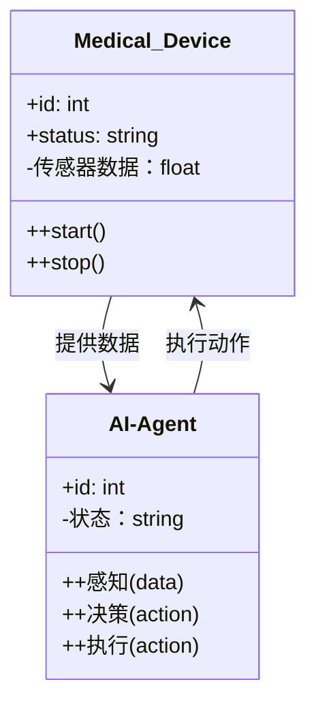

                 


# 智能医疗设备中的AI Agent控制系统

> 关键词：智能医疗设备、AI Agent、控制系统、强化学习、系统架构

> 摘要：本文详细探讨了AI Agent在智能医疗设备中的应用，分析了其核心原理、算法实现和系统架构，并通过案例展示了实际应用效果，最后总结了最佳实践建议。

---

# 第1章: 智能医疗设备与AI Agent概述

## 1.1 智能医疗设备的定义与特点

### 1.1.1 智能医疗设备的定义
智能医疗设备是指利用人工智能技术，能够自主感知、分析和决策的医疗设备，如智能血糖监测仪、智能血压计等。

### 1.1.2 智能医疗设备的核心特点
- **智能化**：能够自主处理数据，提供实时反馈。
- **实时性**：快速响应用户需求。
- **准确性**：基于AI算法，提供高精度诊断建议。

### 1.1.3 智能医疗设备的分类与应用场景
- **可穿戴设备**：如智能手表，用于健康监测。
- **诊断设备**：如AI辅助的医学影像分析系统。

## 1.2 AI Agent的基本概念与特点

### 1.2.1 AI Agent的定义
AI Agent是一种智能体，能够感知环境、自主决策并执行任务，广泛应用于智能医疗设备中。

### 1.2.2 AI Agent的核心特点
- **自主性**：无需人工干预。
- **反应性**：实时响应环境变化。

### 1.2.3 AI Agent与传统控制系统的区别
- **传统控制系统**：基于规则，被动响应。
- **AI Agent**：主动学习，动态调整。

## 1.3 智能医疗设备中的AI Agent控制系统

### 1.3.1 AI Agent在智能医疗设备中的作用
- **数据处理**：解析传感器数据。
- **决策支持**：提供诊断建议。

### 1.3.2 AI Agent控制系统的整体架构
包括感知、决策、执行三个模块。

### 1.3.3 应用场景
- **慢性病管理**：如糖尿病患者的数据监测。

## 1.4 本章小结

---

# 第2章: AI Agent的核心原理

## 2.1 AI Agent的感知模块

### 2.1.1 感知模块的功能与作用
负责收集环境数据，如心率、血压等。

### 2.1.2 常见的感知技术
- **传感器数据解析**：处理心率传感器数据。

## 2.2 AI Agent的决策模块

### 2.2.1 常见决策算法
- **强化学习**：通过奖励机制优化决策。
- **规则引擎**：基于预设规则进行决策。

## 2.3 AI Agent的执行模块

### 2.3.1 执行模块的实现方式
- **硬件控制接口**：驱动设备执行动作。

## 2.4 模块间的关系

### 2.4.1 协同工作流程
感知→决策→执行。

## 2.5 本章小结

---

# 第3章: AI Agent控制系统的算法原理

## 3.1 强化学习算法

### 3.1.1 基本原理
通过奖励机制优化决策策略。

### 3.1.2 算法实现
使用Q-learning算法，代码示例：

```python
import numpy as np

class QLearning:
    def __init__(self, state_size, action_size, alpha=0.1, gamma=0.9):
        self.q_table = np.zeros((state_size, action_size))
        self.alpha = alpha
        self.gamma = gamma

    def choose_action(self, state, epsilon=0.1):
        if np.random.random() < epsilon:
            return np.random.randint(action_size)
        return np.argmax(self.q_table[state])

    def update(self, state, action, reward, next_state):
        self.q_table[state][action] = self.q_table[state][action] * self.alpha + reward + self.gamma * np.max(self.q_table[next_state])
```

### 3.1.3 应用场景
医疗设备中的行为决策优化。

## 3.2 规则引擎

### 3.2.1 实现方式
基于Drools规则引擎，定义规则以指导设备行为。

## 3.3 模型驱动算法

### 3.3.1 实现方式
利用深度学习模型进行决策。

## 3.4 本章小结

---

# 第4章: 系统架构设计

## 4.1 功能模块设计

### 4.1.1 系统功能模块
- **数据采集模块**：采集生理数据。
- **决策模块**：分析数据并制定决策。

## 4.2 类图设计



## 4.3 接口设计

### 4.3.1 接口定义
- `get_sensor_data()`：获取传感器数据。
- `execute_action(action)`：执行动作。

## 4.4 本章小结

---

# 第5章: 项目实战

## 5.1 环境安装

### 5.1.1 安装必要的库
- `pip install numpy tensorflow`

## 5.2 核心实现

### 5.2.1 感知模块实现
```python
import numpy as np

def感知(data):
    return np.mean(data)
```

### 5.2.2 决策模块实现
```python
import numpy as np

def决策(数据):
    if 数据 > threshold:
        return '警告'
    else:
        return '正常'
```

### 5.2.3 执行模块实现
```python
def执行(动作):
    print(f'执行动作：{动作}')
```

## 5.3 案例分析

### 5.3.1 案例分析
血糖监测系统的AI Agent实现。

## 5.4 项目小结

---

# 第6章: 总结与展望

## 6.1 总结
AI Agent在智能医疗设备中的应用显著提升了医疗效率。

## 6.2 展望
未来将更加智能化，支持更多复杂决策。

---

# 参考文献

## 书籍
- 《人工智能：一种现代方法》
- 《深度学习入门：基于Python和Keras》

## 论文
- "强化学习在医疗设备控制中的应用研究"

---

# 作者：AI天才研究院 & 禅与计算机程序设计艺术

