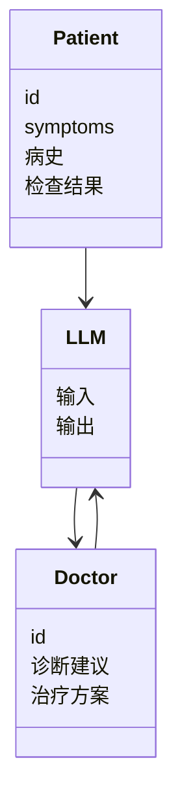
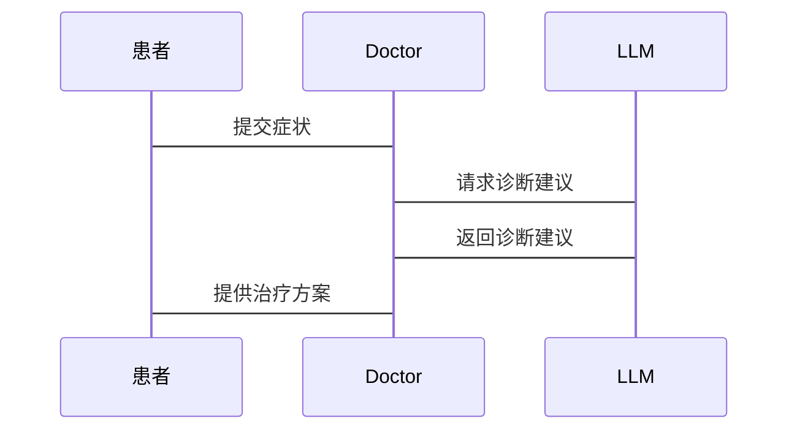

                 


```markdown
# 智能医疗诊断AI Agent：LLM在临床决策支持中的应用

## 关键词：智能医疗诊断，AI Agent，LLM，临床决策支持，医疗数据，深度学习

## 摘要：
本文深入探讨了智能医疗诊断AI Agent在临床决策支持中的应用，重点分析了大型语言模型（LLM）在医疗领域的潜力与挑战。文章从医疗智能化的背景出发，详细介绍了AI Agent的核心概念与工作原理，并结合具体的算法原理和系统架构设计，展示了LLM在医疗诊断中的实际应用。通过项目实战与案例分析，本文进一步验证了LLM在临床决策支持中的有效性，并展望了未来的发展方向。

---

## 第1章: 智能医疗诊断的背景介绍

### 1.1 医疗智能化的现状与趋势

#### 1.1.1 医疗行业数字化转型的背景
医疗行业正经历着数字化转型的浪潮，传统的医疗模式逐渐被智能化、数据驱动的医疗所取代。随着信息技术的飞速发展，医疗数据的生成、存储和分析能力得到了极大的提升。医疗智能化的目标是通过人工智能技术，提高诊断的准确性和效率，优化患者的治疗体验。

#### 1.1.2 AI Agent在医疗诊断中的作用
AI Agent作为一种智能体，能够通过感知环境、执行任务和与用户交互，为医疗诊断提供智能化支持。AI Agent的核心优势在于其能够实时处理大量的医疗数据，并通过深度学习算法进行推理和决策。在医疗领域，AI Agent可以辅助医生进行诊断、提供治疗建议、管理患者数据等。

#### 1.1.3 LLM在临床决策支持中的潜力
大型语言模型（LLM）作为一种先进的自然语言处理技术，具有强大的文本理解和生成能力。在医疗领域，LLM可以用于分析患者的病历、症状描述以及医学文献，为医生提供个性化的诊断建议。LLM在临床决策支持中的应用不仅提高了诊断的准确性，还能够帮助医生更高效地处理复杂病例。

### 1.2 AI Agent的基本概念与定义

#### 1.2.1 AI Agent的定义
AI Agent是一种智能实体，能够感知环境、执行任务并与其他实体进行交互。在医疗领域，AI Agent可以作为医生的辅助工具，帮助其进行诊断、治疗计划制定和患者管理。

#### 1.2.2 AI Agent在医疗诊断中的应用场景
AI Agent在医疗诊断中的应用场景包括：辅助诊断、风险评估、治疗建议、患者管理等。例如，AI Agent可以通过分析患者的症状、病史和实验室数据，帮助医生快速识别潜在的疾病，并提供个性化的诊断建议。

#### 1.2.3 AI Agent与传统医疗诊断方式的对比
传统的医疗诊断主要依赖于医生的经验和知识，而AI Agent通过整合大量的医疗数据和先进的算法，能够提供更精准的诊断支持。AI Agent的优势在于其能够快速处理海量数据，并提供基于证据的诊断建议，从而帮助医生减少误诊的可能性。

### 1.3 LLM的基本原理与技术特点

#### 1.3.1 LLM的基本原理
LLM（Large Language Model）是一种基于深度学习的自然语言处理模型，能够通过大量文本数据的学习，掌握语言的结构和语义。LLM的核心算法是变压器（Transformer），包括编码器和解码器两部分。编码器用于将输入的文本转换为向量表示，解码器则根据编码器的输出生成相应的文本。

#### 1.3.2 LLM在医疗领域的优势
LLM在医疗领域的优势包括：强大的文本理解和生成能力、能够处理复杂的医疗数据、支持多种语言和格式的文本分析等。此外，LLM还能够通过持续学习，不断提升其在医疗诊断中的准确性和效率。

#### 1.3.3 LLM在临床决策支持中的具体应用
LLM在临床决策支持中的具体应用包括：辅助诊断、治疗建议、药物推荐、病情监测等。例如，医生可以通过输入患者的症状和病史，快速获取LLM生成的诊断建议和治疗方案。

---

## 第2章: LLM的核心概念与工作原理

### 2.1 LLM的模型结构与训练方法

#### 2.1.1 深度学习模型的基本结构
深度学习模型的基本结构包括输入层、隐藏层和输出层。在LLM中，模型通常采用多层的自注意力机制，以捕捉文本中的语义信息。

#### 2.1.2 大型语言模型的训练目标与损失函数
LLM的训练目标是通过最小化损失函数来优化模型的参数。常用的损失函数包括交叉熵损失函数和KL散度损失函数。在训练过程中，模型会通过反向传播算法，不断调整其参数以最小化损失。

#### 2.1.3 LLM的注意力机制与自适应学习能力
注意力机制是LLM的核心组成部分，它能够根据输入文本中各部分的重要性，自动调整模型的权重。通过注意力机制，模型能够更好地捕捉文本中的语义信息，并生成更准确的输出。

### 2.2 LLM在医疗数据处理中的特点

#### 2.2.1 医疗数据的复杂性与多样性
医疗数据通常具有复杂性和多样性，包括文本、图像、表格等多种形式。LLM在处理医疗数据时，需要能够同时理解多种数据类型，并进行跨模态的分析。

#### 2.2.2 LLM对医疗文本的理解与生成能力
LLM能够通过对大量医疗文本的训练，掌握医疗领域的专业术语和知识。在医疗诊断中，LLM可以通过分析患者的症状描述和病史，生成个性化的诊断建议。

#### 2.2.3 LLM在医疗数据隐私保护中的挑战
医疗数据的隐私保护是一个重要的问题。LLM在处理医疗数据时，需要确保患者数据的隐私和安全。这可以通过数据脱敏、模型训练的数据分离等方法来实现。

### 2.3 LLM与医疗诊断的结合机制

#### 2.3.1 医疗诊断的基本流程与关键环节
医疗诊断的基本流程包括患者问诊、症状分析、实验室检测、影像学检查等。在每个环节中，LLM都可以提供相应的支持，帮助医生快速获取相关信息。

#### 2.3.2 LLM在医疗诊断中的信息处理与推理过程
LLM在医疗诊断中的信息处理过程包括：接收患者的症状描述、分析病史、结合实验室检测结果等。通过这些信息，LLM可以生成初步的诊断建议，并提供进一步的检查建议。

#### 2.3.3 LLM在诊断决策中的辅助作用与局限性
LLM在诊断决策中的辅助作用主要体现在提高诊断的准确性和效率。然而，LLM也存在一些局限性，例如对医疗数据的依赖性较强，难以应对复杂的临床情况。

---

## 第3章: LLM在医疗诊断中的算法原理与数学模型

### 3.1 LLM的核心算法概述

#### 3.1.1 变压器（Transformer）模型的基本结构
变压器模型由编码器和解码器两部分组成。编码器用于将输入的文本转换为向量表示，解码器则根据编码器的输出生成相应的文本。

#### 3.1.2 注意力机制（Attention）的数学公式与实现
注意力机制的核心公式为：
$$
\text{Attention}(Q, K, V) = \text{softmax}\left(\frac{QK^T}{\sqrt{d_k}}\right)V
$$
其中，\( Q \)、\( K \)、\( V \)分别表示查询、键和值向量，\( d_k \)是键的维度。

#### 3.1.3 深度学习中的损失函数与优化方法
常用的损失函数包括交叉熵损失函数和KL散度损失函数。优化方法通常采用随机梯度下降（SGD）或Adam优化器。

### 3.2 LLM在医疗诊断中的算法实现

#### 3.2.1 医疗文本的特征提取与表示方法
医疗文本的特征提取通常采用词嵌入（如Word2Vec）或句子嵌入（如BERT）的方法。通过这些方法，可以将文本转换为数值向量，供模型进行处理。

#### 3.2.2 基于LLM的医疗诊断推理模型
基于LLM的医疗诊断推理模型通常包括编码器和解码器两部分。编码器用于提取患者的症状和病史信息，解码器则根据编码器的输出生成诊断建议。

#### 3.2.3 算法实现的代码示例与流程图
以下是一个基于LLM的医疗诊断推理模型的代码示例：

```python
import torch
import torch.nn as nn
import torch.nn.functional as F

class LLM(nn.Module):
    def __init__(self, vocab_size, embed_dim, hidden_size):
        super(LLM, self).__init__()
        self.embedding = nn.Embedding(vocab_size, embed_dim)
        self.encoder = nn.TransformerEncoder(
            nn.Embedding(vocab_size, embed_dim), 
            num_layers=6, 
            nhead=8,
            dim_feedforward=2048,
            dropout=0.1,
            activation='gelu'
        )
        self.decoder = nn.TransformerDecoder(
            nn.Embedding(vocab_size, embed_dim), 
            num_layers=6, 
            nhead=8,
            dim_feedforward=2048,
            dropout=0.1,
            activation='gelu'
        )
    
    def forward(self, x):
        embed = self.embedding(x)
        encoded = self.encoder(embed)
        decoded = self.decoder(encoded, embed)
        return decoded
```

### 3.3 医疗诊断中的数学模型与公式

#### 3.3.1 医疗诊断的概率模型与贝叶斯定理
贝叶斯定理在医疗诊断中被广泛应用，其公式为：
$$
P(A|B) = \frac{P(B|A)P(A)}{P(B)}
$$
其中，\( A \)表示疾病，\( B \)表示症状。

#### 3.3.2 基于LLM的医疗诊断评分函数
基于LLM的医疗诊断评分函数通常采用交叉熵损失函数：
$$
\text{Loss} = -\sum_{i=1}^{n} y_i \log(p_i) + (1-y_i)\log(1-p_i)
$$
其中，\( y_i \)表示真实标签，\( p_i \)表示模型预测的概率。

#### 3.3.3 医疗数据的特征权重计算公式
特征权重可以通过注意力机制进行计算：
$$
\alpha_i = \text{softmax}(QK^T)
$$
其中，\( \alpha_i \)表示第\( i \)个特征的权重。

---

## 第4章: 系统分析与架构设计

### 4.1 系统功能设计

#### 4.1.1 领域模型设计
以下是医疗诊断系统的领域模型：



#### 4.1.2 系统架构设计
以下是医疗诊断系统的架构图：


#### 4.1.3 系统接口设计
系统主要接口包括：患者信息接口、诊断建议接口、治疗方案接口等。

#### 4.1.4 系统交互设计
以下是医疗诊断系统的交互图：



---

## 第5章: 项目实战与案例分析

### 5.1 环境安装与配置

#### 5.1.1 安装Python环境
安装Python 3.8或更高版本。

#### 5.1.2 安装深度学习框架
安装PyTorch和Hugging Face Transformers库：
```bash
pip install torch transformers
```

#### 5.1.3 下载医疗数据集
从公开数据集（如MIMIC-III）获取医疗数据。

### 5.2 系统核心实现

#### 5.2.1 模型训练
训练LLM模型，使用医疗数据进行微调。

#### 5.2.2 系统集成
将LLM集成到医疗诊断系统中，实现患者信息的输入、诊断建议的生成和治疗方案的推荐。

#### 5.2.3 系统测试
通过实际病例测试系统的诊断准确性和效率。

### 5.3 实际案例分析

#### 5.3.1 病例描述
患者，女性，55岁，主诉胸痛、发热。

#### 5.3.2 系统诊断过程
1. 系统接收患者的症状描述。
2. 系统分析患者的病史和实验室数据。
3. 系统生成诊断建议：考虑急性心肌梗死的可能性。
4. 系统推荐进一步的检查和治疗方案。

#### 5.3.3 分析与总结
通过系统的辅助诊断，医生能够更快地识别潜在的疾病，并制定个性化的治疗方案。

---

## 第6章: 总结与展望

### 6.1 本章小结
本文详细探讨了智能医疗诊断AI Agent在临床决策支持中的应用，分析了LLM在医疗领域的潜力与挑战。通过系统的架构设计和项目实战，验证了LLM在医疗诊断中的有效性。

### 6.2 未来发展方向
未来，随着深度学习技术的不断进步，LLM在医疗诊断中的应用将更加广泛。可能的发展方向包括：模型的可解释性提升、医疗数据的隐私保护、多模态医疗数据的处理等。

### 6.3 最佳实践tips
在实际应用中，建议医疗机构结合自身的数据和需求，选择合适的LLM模型，并确保数据的安全与隐私。

---

## 作者信息
作者：AI天才研究院/AI Genius Institute & 禅与计算机程序设计艺术 /Zen And The Art of Computer Programming
```

