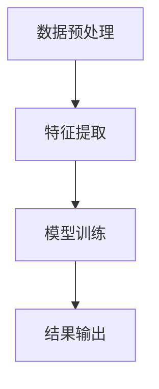
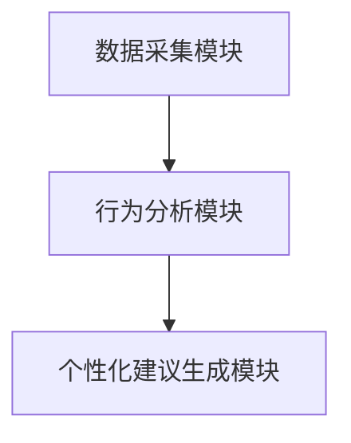
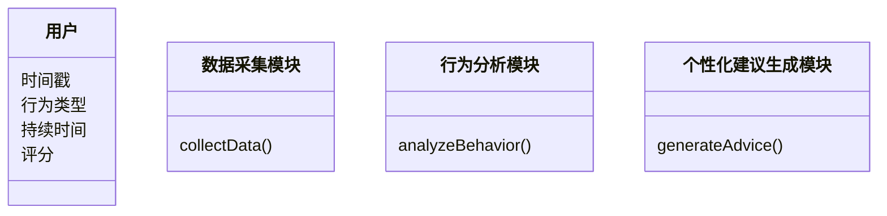
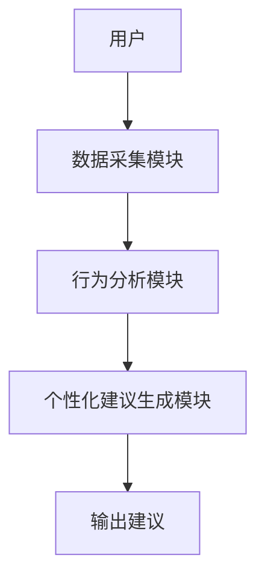
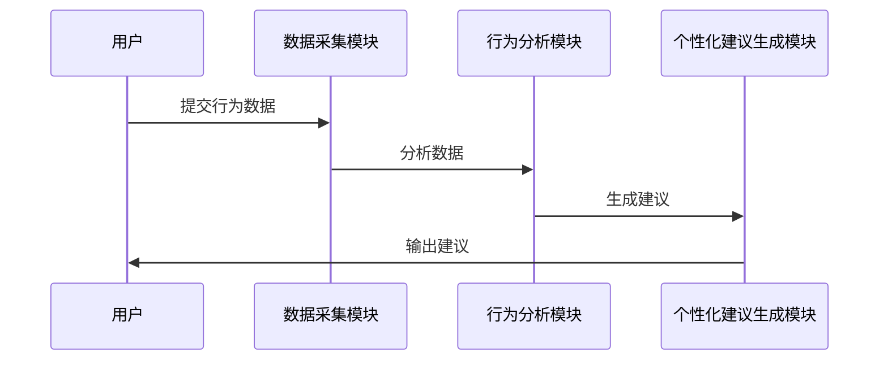

                 


# 智能卫生间：AI Agent的个人卫生习惯分析

## 关键词：智能卫生间, AI Agent, 个人卫生习惯, 行为分析, 算法模型

## 摘要：本文详细探讨了AI Agent在智能卫生间中的应用，分析了个人卫生习惯的核心要素，介绍了基于AI的卫生习惯分析算法，包括数据预处理、特征提取和模型训练的步骤，并通过系统架构设计和项目实战展示了如何实现个性化的卫生习惯优化建议。最后，本文总结了AI在智能卫生间中的应用价值，并提出了未来研究的方向。

---

## 第三章: 基于AI的卫生习惯分析算法

### 3.1 算法原理

#### 3.1.1 数据预处理
- 数据清洗：去除无效数据，处理异常值。
- 数据标准化：统一时间戳、行为类型等特征的格式。

#### 3.1.2 特征提取
- 时间特征：行为发生的时间、频率。
- 行为特征：行为类型、持续时间。
- 关联特征：行为之间的关联性。

#### 3.1.3 模型训练与优化
- 使用随机森林或神经网络进行分类或回归训练。

### 3.2 算法流程图


### 3.3 代码实现
```python
import pandas as pd
from sklearn.ensemble import RandomForestClassifier
from sklearn.model_selection import train_test_split

# 数据预处理
data = pd.read_csv('卫生习惯数据.csv')
data.dropna(inplace=True)
data['时间戳'] = pd.to_datetime(data['时间戳'])

# 特征提取
features = data[['时间戳', '行为类型', '持续时间']]
labels = data['评分']

# 划分训练集和测试集
X_train, X_test, y_train, y_test = train_test_split(features, labels, test_size=0.2)

# 模型训练
model = RandomForestClassifier()
model.fit(X_train, y_train)

# 预测与评估
score = model.score(X_test, y_test)
print(f"模型准确率：{score}")
```

### 3.4 数学模型
- 使用随机森林模型，数学公式如下：
  $$ y = f(x) $$
  其中，x是输入特征向量，y是输出预测结果。

---

## 第四章: 系统分析与架构设计方案

### 4.1 系统整体架构

#### 4.1.1 功能模块划分
- 数据采集模块：收集用户行为数据。
- 行为分析模块：对数据进行分析和建模。
- 个性化建议生成模块：输出优化建议。

#### 4.1.2 系统架构图


### 4.2 系统功能设计

#### 4.2.1 领域模型类图


#### 4.2.2 系统架构设计


### 4.3 系统接口与交互

#### 4.3.1 系统接口设计
- 数据接口：提供REST API用于数据上传和查询。
- 建议接口：返回个性化卫生习惯建议。

#### 4.3.2 系统交互流程


---

## 第五章: 项目实战

### 5.1 环境搭建

#### 5.1.1 安装依赖
```bash
pip install pandas scikit-learn matplotlib
```

### 5.2 系统核心实现

#### 5.2.1 数据采集模块实现
```python
import datetime

def collect_behavior_data():
    data = []
    while True:
        timestamp = datetime.datetime.now()
        action = input("请输入行为类型：")
        duration = float(input("请输入持续时间："))
        data.append((timestamp, action, duration))
    return data
```

#### 5.2.2 行为分析模块实现
```python
from sklearn.model_selection import train_test_split
from sklearn.metrics import accuracy_score

def analyze_behavior(data):
    features = pd.DataFrame(data, columns=['时间戳', '行为类型', '持续时间'])
    labels = pd.Series([input("请输入评分：") for _ in range(len(data))])
    X_train, X_test, y_train, y_test = train_test_split(features, labels, test_size=0.2)
    model = RandomForestClassifier()
    model.fit(X_train, y_train)
    print(f"模型准确率：{model.score(X_test, y_test)}")
    return model
```

#### 5.2.3 个性化建议生成模块实现
```python
def generate_advice(model):
    new_data = collect_behavior_data()
    prediction = model.predict(pd.DataFrame(new_data, columns=['时间戳', '行为类型', '持续时间']))
    print(f"预测结果：{prediction}")
```

### 5.3 案例分析

#### 5.3.1 数据分析结果
- 用户A：刷牙频率低，建议增加刷牙次数。
- 用户B：如厕时间过长，建议优化排便习惯。

---

## 第六章: 最佳实践与总结

### 6.1 最佳实践
- 数据隐私保护：确保用户数据的安全性。
- 模型优化：定期更新模型以提高准确率。
- 用户反馈：收集用户反馈以改进系统。

### 6.2 小结
本文详细介绍了AI Agent在智能卫生间中的应用，从数据采集到模型训练，再到系统实现，为个人卫生习惯的优化提供了技术支持。

### 6.3 注意事项
- 数据采集需合法合规。
- 模型需定期更新以适应用户行为变化。
- 个性化建议需简洁明了，便于用户理解和执行。

### 6.4 拓展阅读
- 推荐阅读《机器学习实战》和《数据挖掘导论》。

---

## 作者：AI天才研究院 & 禅与计算机程序设计艺术

---

**总结：** 本文通过详细分析智能卫生间中的AI Agent，展示了如何利用技术手段优化个人卫生习惯，为未来的智能卫生间设计提供了理论和技术支持。

