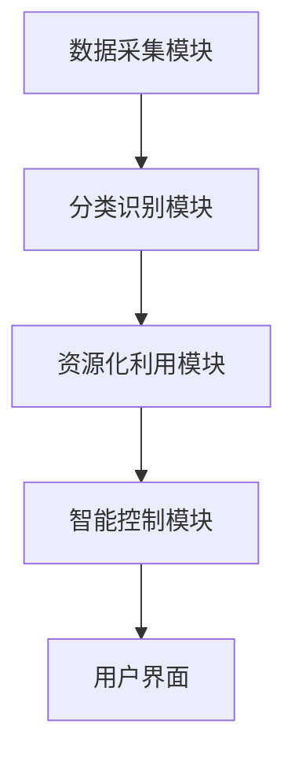

                 


# 智能厨余处理器：AI Agent的厨余再利用建议

## 关键词：智能厨余处理器，AI Agent，厨余再利用，人工智能，资源化利用

## 摘要：  
本文探讨了智能厨余处理器在AI Agent技术下的厨余再利用建议。通过分析厨余处理的现状与挑战，结合AI Agent的核心算法和系统架构，提出了一种基于人工智能的厨余资源化利用解决方案。本文详细介绍了AI Agent在厨余分类、资源化利用中的应用，并通过实际案例展示了系统的实现与应用效果。最后，本文总结了智能厨余处理器的优势，并提出了未来发展的建议。

---

# 第一部分: 智能厨余处理器的背景与概念

## 第1章: 智能厨余处理器的背景介绍

### 1.1 厨余处理的现状与挑战

#### 1.1.1 厨余垃圾的定义与分类
厨余垃圾是指在日常生活中产生的有机废弃物，主要包括食物残渣、菜叶、果皮等。根据来源和性质，厨余垃圾可以分为以下几类：
- **可回收厨余**：如剩饭、菜叶等可进行堆肥或生物质能利用的有机废弃物。
- **不可回收厨余**：如陶瓷、塑料餐具等无法进行资源化利用的废弃物。

#### 1.1.2 当前厨余处理的主要问题
- **环境污染**：厨余垃圾填埋或焚烧处理会释放有害气体，造成环境污染。
- **资源浪费**：厨余垃圾中含有丰富的有机物质，未充分利用造成资源浪费。
- **处理成本高**：传统的厨余处理方式成本较高，且效率低下。

#### 1.1.3 厨余资源化利用的重要性
厨余资源化利用不仅可以减少环境污染，还能实现资源的循环利用，具有重要的生态和经济价值。

### 1.2 AI Agent在厨余处理中的应用背景

#### 1.2.1 AI技术在环保领域的应用趋势
人工智能技术在环保领域的应用日益广泛，尤其是在垃圾分类、污染监测和资源利用等方面。

#### 1.2.2 AI Agent的定义与特点
AI Agent是一种能够感知环境、自主决策并执行任务的智能体。其特点包括：
- **自主性**：能够自主决策，无需人工干预。
- **反应性**：能够实时感知环境并做出反应。
- **学习能力**：能够通过数据学习和优化。

#### 1.2.3 AI Agent在厨余处理中的优势
- **高效分类**：AI Agent可以通过图像识别和机器学习技术实现厨余的精准分类。
- **资源优化**：AI Agent可以优化厨余的处理流程，提高资源利用效率。
- **降低成本**：通过智能化处理，降低人工成本和处理成本。

### 1.3 智能厨余处理器的定义与目标

#### 1.3.1 智能厨余处理器的定义
智能厨余处理器是一种基于AI Agent技术的智能设备，能够实现厨余的自动分类、资源化利用和高效处理。

#### 1.3.2 智能厨余处理器的核心目标
- **高效分类**：实现厨余的精准分类，提高资源化利用效率。
- **资源化利用**：将厨余转化为可再生资源，如堆肥、生物质能等。
- **降低成本**：通过智能化处理，降低处理成本和人工成本。

#### 1.3.3 智能厨余处理器的边界与外延
- **边界**：智能厨余处理器仅处理厨余垃圾，不涉及其他类型的垃圾处理。
- **外延**：智能厨余处理器可以与其他智能设备联动，形成完整的智能垃圾分类系统。

### 1.4 本章小结
本章介绍了智能厨余处理器的背景，包括厨余处理的现状与挑战、AI Agent在厨余处理中的应用背景以及智能厨余处理器的定义与目标。通过这些内容，读者可以了解智能厨余处理器的重要性和应用前景。

---

## 第2章: AI Agent与厨余处理的核心概念

### 2.1 AI Agent的基本原理

#### 2.1.1 AI Agent的定义与分类
AI Agent可以根据智能水平分为以下几类：
- **反应式AI Agent**：基于当前环境信息做出反应。
- **认知式AI Agent**：具有推理和规划能力，能够处理复杂任务。

#### 2.1.2 AI Agent的核心算法
AI Agent的核心算法包括：
- **机器学习算法**：如支持向量机（SVM）、随机森林（Random Forest）等。
- **深度学习算法**：如卷积神经网络（CNN）、循环神经网络（RNN）等。
- **强化学习算法**：如Q-learning、Deep Q-Network（DQN）等。

#### 2.1.3 AI Agent在厨余处理中的应用原理
AI Agent通过图像识别技术对厨余进行分类，然后根据分类结果进行资源化利用。

### 2.2 厨余处理的核心概念

#### 2.2.1 厨余分类与识别
厨余分类与识别是智能厨余处理器的核心功能之一。通过图像识别技术，AI Agent可以快速识别厨余的种类和性质。

#### 2.2.2 厨余资源化利用的模式
厨余资源化利用的模式包括：
- **堆肥**：将厨余转化为有机肥料。
- **生物质能**：将厨余转化为沼气等可再生能源。
- **饲料**：将厨余转化为动物饲料。

#### 2.2.3 厨余处理的智能化需求
随着环保意识的增强和科技的进步，厨余处理的智能化需求日益迫切。

### 2.3 AI Agent与厨余处理的联系

#### 2.3.1 AI Agent在厨余分类中的作用
AI Agent可以通过图像识别技术实现厨余的精准分类。

#### 2.3.2 AI Agent在厨余资源化中的应用
AI Agent可以优化厨余资源化利用的流程，提高资源利用效率。

#### 2.3.3 AI Agent在厨余处理系统中的集成
AI Agent可以与其他智能设备集成，形成完整的智能厨余处理系统。

### 2.4 本章小结
本章详细介绍了AI Agent的基本原理、厨余处理的核心概念以及AI Agent与厨余处理的联系。通过这些内容，读者可以了解AI Agent在厨余处理中的重要作用。

---

## 第3章: AI Agent在厨余处理中的算法原理

### 3.1 AI Agent的核心算法

#### 3.1.1 机器学习算法在AI Agent中的应用
机器学习算法在AI Agent中的应用包括分类、回归和聚类等任务。

#### 3.1.2 深度学习算法在AI Agent中的应用
深度学习算法在AI Agent中的应用包括图像识别、语音识别和自然语言处理等任务。

#### 3.1.3 强化学习算法在AI Agent中的应用
强化学习算法在AI Agent中的应用包括机器人控制和游戏AI等任务。

### 3.2 厨余分类算法的实现

#### 3.2.1 基于图像识别的厨余分类
图像识别是厨余分类的重要技术之一。通过深度学习模型（如CNN），AI Agent可以实现厨余的精准分类。

#### 3.2.2 基于机器学习的厨余分类
机器学习模型（如SVM、Random Forest）也可以用于厨余分类，但其准确率通常低于深度学习模型。

#### 3.2.3 基于强化学习的厨余分类
强化学习模型可以通过与环境的交互，逐步优化厨余分类的策略。

### 3.3 AI Agent算法的数学模型

#### 3.3.1 机器学习模型
机器学习模型的数学模型包括线性回归、支持向量机等。

#### 3.3.2 深度学习模型
深度学习模型的数学模型包括卷积神经网络（CNN）、循环神经网络（RNN）等。

#### 3.3.3 强化学习模型
强化学习模型的数学模型包括Q-learning、Deep Q-Network（DQN）等。

### 3.4 本章小结
本章详细介绍了AI Agent的核心算法以及厨余分类算法的实现。通过这些内容，读者可以了解AI Agent在厨余处理中的算法原理。

---

## 第4章: 智能厨余处理器的系统架构与设计

### 4.1 系统架构设计

#### 4.1.1 系统功能模块
智能厨余处理器的系统功能模块包括：
- **数据采集模块**：采集厨余的图像和传感器数据。
- **分类识别模块**：对厨余进行分类识别。
- **资源化利用模块**：将厨余转化为可再生资源。
- **智能控制模块**：对系统进行智能控制和优化。

#### 4.1.2 系统架构图
以下是智能厨余处理器的系统架构图：



#### 4.1.3 系统功能设计
智能厨余处理器的功能设计包括：
- **图像采集与识别**：通过摄像头采集厨余图像，并通过AI算法进行分类识别。
- **资源化利用**：根据分类结果，将厨余转化为堆肥、沼气等可再生资源。
- **智能控制**：通过AI Agent对系统进行智能控制，优化处理流程。

### 4.2 系统接口设计

#### 4.2.1 数据接口
数据接口包括：
- **图像接口**：用于传输厨余图像数据。
- **传感器接口**：用于传输厨余的物理参数（如温度、湿度等）。

#### 4.2.2 用户接口
用户接口包括：
- **图形界面**：用于显示厨余分类结果和系统运行状态。
- **命令接口**：用于接收用户的指令和控制。

### 4.3 本章小结
本章详细介绍了智能厨余处理器的系统架构与设计，包括系统功能模块、系统架构图和系统接口设计等内容。

---

## 第5章: 智能厨余处理器的项目实战

### 5.1 项目环境安装

#### 5.1.1 系统环境
建议使用Ubuntu 20.04及以上版本。

#### 5.1.2 安装依赖
安装Python、TensorFlow、OpenCV等依赖库。

### 5.2 核心代码实现

#### 5.2.1 图像采集与识别
以下是基于OpenCV的图像采集与识别代码：

```python
import cv2

cap = cv2.VideoCapture(0)
while cap.isOpened():
    ret, frame = cap.read()
    if not ret:
        break
    cv2.imshow('Camera', frame)
    if cv2.waitKey(1) == ord('q'):
        break

cap.release()
cv2.destroyAllWindows()
```

#### 5.2.2 厨余分类算法
以下是基于TensorFlow的厨余分类算法代码：

```python
import tensorflow as tf
from tensorflow.keras import layers

model = tf.keras.Sequential([
    layers.Conv2D(32, (3,3), activation='relu', input_shape=(224, 224, 3)),
    layers.MaxPooling2D((2,2)),
    layers.Conv2D(64, (3,3), activation='relu'),
    layers.MaxPooling2D((2,2)),
    layers.Flatten(),
    layers.Dense(128, activation='relu'),
    layers.Dense(10, activation='softmax')
])

model.compile(optimizer='adam', loss='sparse_categorical_crossentropy', metrics=['accuracy'])
model.fit(train_images, train_labels, epochs=10, validation_data=(test_images, test_labels))
```

### 5.3 代码解读与分析

#### 5.3.1 图像采集与识别
上述代码实现了基于OpenCV的图像采集与识别功能。

#### 5.3.2 厨余分类算法
上述代码实现了基于TensorFlow的厨余分类算法，包括卷积层、池化层和全连接层等。

### 5.4 实际案例分析

#### 5.4.1 案例一：家庭厨余处理
通过智能厨余处理器，家庭厨余可以被精准分类并转化为堆肥，减少环境污染。

#### 5.4.2 案例二：餐饮业厨余处理
餐饮业可以通过智能厨余处理器将厨余转化为沼气等可再生能源，实现资源化利用。

### 5.5 本章小结
本章通过实际案例分析，展示了智能厨余处理器的实现与应用效果。

---

## 第6章: 智能厨余处理器的最佳实践与总结

### 6.1 最佳实践

#### 6.1.1 系统维护与优化
定期维护系统，优化算法模型，提高处理效率。

#### 6.1.2 用户教育与推广
加强对用户的教育和推广，提高智能厨余处理器的普及率。

### 6.2 小结

#### 6.2.1 本文总结
本文详细介绍了智能厨余处理器的背景、算法原理、系统架构和项目实战等内容。

#### 6.2.2 未来展望
未来，随着人工智能技术的不断发展，智能厨余处理器将更加智能化和高效化。

### 6.3 注意事项

#### 6.3.1 系统安全性
确保系统的安全性，防止数据泄露和网络攻击。

#### 6.3.2 系统稳定性
确保系统的稳定性，避免因故障导致数据丢失或处理中断。

### 6.4 拓展阅读

#### 6.4.1 相关技术领域
建议读者进一步了解人工智能、物联网和环保技术等相关领域。

#### 6.4.2 相关书籍与文献
推荐以下书籍和文献：
- 《深度学习》——伊恩·布恩
- 《人工智能：一种现代方法》——斯蒂芬·拉塞尔

---

## 作者信息

作者：AI天才研究院/AI Genius Institute & 禅与计算机程序设计艺术 /Zen And The Art of Computer Programming

---

以上是《智能厨余处理器：AI Agent的厨余再利用建议》的完整目录大纲和文章内容。

