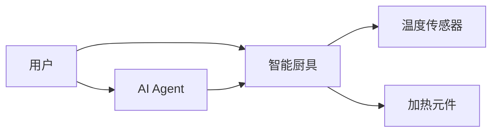
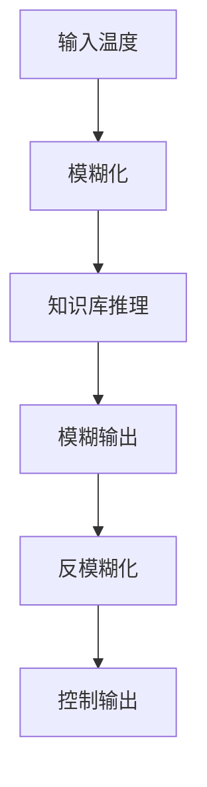
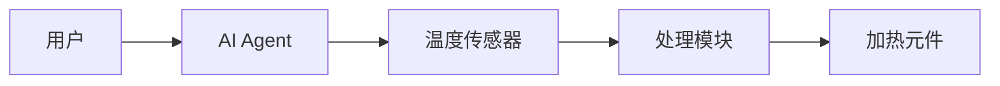

                 


```markdown
# 智能厨具：AI Agent的烹饪温度控制

> 关键词：智能厨具，AI Agent，温度控制，PID算法，模糊控制，物联网

> 摘要：本文探讨了AI代理在智能厨具中的应用，特别是烹饪温度控制的实现。通过分析AI代理的核心原理、算法实现和系统架构，展示了如何利用先进技术优化烹饪过程，提升用户体验。

---

# 第1章: 智能厨具与AI Agent的背景介绍

## 1.1 智能厨具的发展历程
### 1.1.1 传统厨具的功能与局限
传统厨具依赖人工操作，温度控制不精准，效率低下。

### 1.1.2 智能化厨具的兴起
随着物联网技术的发展，智能厨具逐渐普及，具备自动化功能。

### 1.1.3 AI技术在厨具中的应用前景
AI技术的引入，使得厨具能够智能化，提升用户体验。

## 1.2 AI Agent的基本概念
### 1.2.1 人工智能代理的定义
AI Agent是能够感知环境并自主决策的智能体。

### 1.2.2 AI Agent的核心功能与特点
具备感知、推理、规划和执行能力。

### 1.2.3 AI Agent与传统控制系统的区别
传统系统基于规则，AI Agent具备学习和自适应能力。

## 1.3 智能厨具中的AI Agent应用
### 1.3.1 烹饪温度控制的背景与问题
温度控制对烹饪质量至关重要，传统方法存在不足。

### 1.3.2 AI Agent在温度控制中的作用
通过实时反馈优化温度，提升烹饪效果。

### 1.3.3 智能厨具的市场现状与发展趋势
市场需求增长迅速，AI技术将推动行业革新。

---

# 第2章: AI Agent的核心概念与联系

## 2.1 AI Agent与智能厨具的关系
### 2.1.1 实体关系分析
```mermaid
er
actor: 用户
agent: AI代理
device: 智能厨具
```

### 2.1.2 系统架构图


## 2.2 温度控制的数学模型
### 2.2.1 PID控制原理
PID算法通过比例、积分、微分三个部分调整输出。

### 2.2.2 模糊控制原理
模糊控制基于模糊逻辑，处理非线性问题。

### 2.2.3 神经网络控制原理
神经网络通过学习优化控制策略。

---

# 第3章: AI Agent的温度控制算法

## 3.1 PID控制算法
### 3.1.1 PID算法流程图
```mermaid
graph TD
A[输入温度] --> B[计算偏差]
B --> C[计算积分]
B --> D[计算微分]
C --> E[积分项]
D --> F[微分项]
G[PID输出] = B + E + F
```

### 3.1.2 PID算法实现代码
```python
def pid_control(desired_temp, current_temp, integral, derivative, Kp, Ki, Kd):
    error = desired_temp - current_temp
    integral += error * dt
    derivative = (error - previous_error) / dt
    output = Kp * error + Ki * integral + Kd * derivative
    return output
```

### 3.1.3 PID算法数学模型
$$\text{PID输出} = K_p \cdot e + K_i \cdot \int e \, dt + K_d \cdot \frac{de}{dt}$$

## 3.2 模糊控制算法
### 3.2.1 模糊控制流程图


### 3.2.2 模糊控制实现代码
```python
def fuzzy_control(current_temp):
    if current_temp < 100:
        return 0.5
    elif 100 <= current_temp < 120:
        return 1.0
    else:
        return 0.0
```

---

# 第4章: 系统分析与架构设计

## 4.1 系统组成部分
### 4.1.1 传感器模块
温度传感器实时监测环境温度。

### 4.1.2 执行器模块
加热元件根据指令调整功率。

### 4.1.3 AI代理模块
负责数据处理和控制决策。

## 4.2 系统架构图


## 4.3 接口设计与交互流程
```mermaid
sequence
用户 -> AI Agent: 设置目标温度
AI Agent -> 温度传感器: 获取当前温度
温度传感器 -> AI Agent: 返回当前温度
AI Agent -> 加热元件: 调整功率
加热元件 -> 用户: 确认温度调整
```

---

# 第5章: 项目实战

## 5.1 环境安装与配置
安装Python、NumPy、Scipy等库。

## 5.2 核心代码实现
### 5.2.1 PID控制器实现
```python
import numpy as np

def pid_control(desired, current, integral, derivative, Kp, Ki, Kd):
    error = desired - current
    integral += error * dt
    derivative = (error - previous_error) / dt
    output = Kp * error + Ki * integral + Kd * derivative
    return output
```

### 5.2.2 系统集成
```python
dt = 0.1
Kp = 1.0
Ki = 0.1
Kd = 0.05

desired_temp = 100
current_temp = 50
integral = 0
derivative = 0
previous_error = 0

while True:
    output = pid_control(desired_temp, current_temp, integral, derivative, Kp, Ki, Kd)
    print(f"Output: {output}")
    previous_error = error
```

## 5.3 实际案例分析
设置目标温度为100°C，系统输出调整功率，最终达到目标温度。

## 5.4 项目小结
通过实战掌握了AI代理在温度控制中的应用，PID算法实现精准控制。

---

# 第6章: 最佳实践与总结

## 6.1 系统维护与优化
定期校准传感器，优化算法参数。

## 6.2 常见问题处理
温度漂移、过冲问题的解决方法。

## 6.3 性能优化建议
采用自适应PID算法，提升系统鲁棒性。

## 6.4 拓展阅读
推荐学习物联网、机器学习相关知识。

## 6.5 全书小结
系统介绍了AI代理在智能厨具中的应用，详细讲解了温度控制算法和系统设计。

---

# 作者

作者：AI天才研究院 & 禅与计算机程序设计艺术
```

