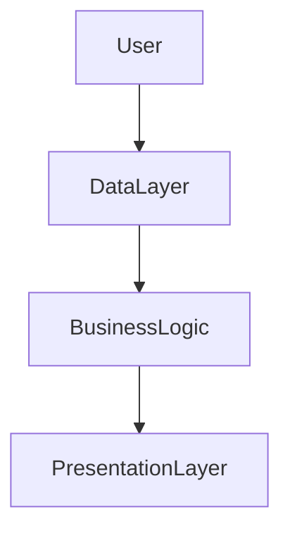
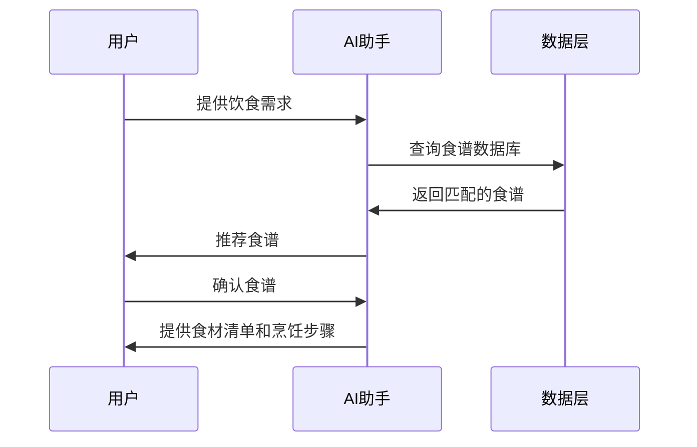

                 


# 智能厨房助手：AI Agent的营养均衡膳食规划

> 关键词：AI代理，营养均衡，膳食规划，推荐系统，系统架构

> 摘要：本文探讨了智能厨房助手如何利用AI代理帮助用户规划营养均衡的膳食。通过分析AI代理的核心原理、营养均衡的基本概念、推荐系统的算法实现以及系统架构设计，结合实际案例，展示了如何利用技术手段实现个性化的膳食管理。

---

# 第一部分: 智能厨房助手的背景与需求

## 第1章: 智能厨房助手的背景与问题背景

### 1.1 问题背景

#### 1.1.1 当代厨房智能化的需求
现代生活节奏的加快，使得厨房智能化成为趋势。用户需要一个能够自动化处理膳食规划的工具，帮助他们节省时间和精力。

#### 1.1.2 营养均衡膳食的重要性
营养均衡是维持身体健康的关键。然而，许多用户由于知识不足或时间限制，难以制定科学的膳食计划。

#### 1.1.3 AI技术在厨房中的应用潜力
AI技术能够处理大量数据，提供个性化的解决方案。通过AI代理，厨房助手可以实时调整膳食计划，满足用户需求。

### 1.2 问题描述

#### 1.2.1 用户需求分析
用户希望有一个工具能够根据他们的饮食习惯、健康状况和口味偏好，推荐营养均衡的食谱。

#### 1.2.2 现有解决方案的不足
现有的解决方案通常缺乏个性化，无法根据用户的具体需求进行调整。此外，数据更新不及时，推荐结果不够精准。

#### 1.2.3 智能厨房助手的定位与目标
智能厨房助手的目标是通过AI代理，提供个性化的营养均衡膳食规划，帮助用户实现健康饮食。

### 1.3 问题解决

#### 1.3.1 AI代理在营养规划中的作用
AI代理能够分析用户数据，推荐合适的食谱，并提供健康建议。

#### 1.3.2 数据驱动的膳食优化方法
通过收集和分析用户数据，AI代理可以优化膳食计划，确保营养均衡。

#### 1.3.3 个性化需求的实现路径
根据用户的口味偏好、健康状况和饮食习惯，AI代理可以定制个性化的膳食计划。

### 1.4 边界与外延

#### 1.4.1 功能边界
智能厨房助手的主要功能包括膳食推荐、食材建议和健康建议。

#### 1.4.2 外延与扩展可能性
未来，系统可以扩展到健康监测、食材采购建议等领域。

### 1.5 概念结构与核心要素

#### 1.5.1 核心概念组成
包括AI代理、营养均衡、膳食规划、推荐系统。

#### 1.5.2 系统架构要素
涵盖数据采集、处理、分析和反馈模块。

#### 1.5.3 关键技术点
涉及机器学习、数据挖掘、自然语言处理和推荐算法。

---

# 第二部分: 智能厨房助手的核心概念与联系

## 第2章: AI代理与营养均衡的核心概念

### 2.1 AI代理的基本原理

#### 2.1.1 代理的定义与分类
代理是一种能够感知环境并采取行动的智能实体，分为简单代理和复杂代理。

#### 2.1.2 AI代理的核心特征
包括自主性、反应性、目标导向和学习能力。

#### 2.1.3 代理在智能厨房中的应用
AI代理能够处理用户的请求，推荐食谱，并提供健康建议。

### 2.2 营养均衡的基本原理

#### 2.2.1 营养学基础
涵盖六大营养素及其每日推荐摄入量。

#### 2.2.2 膳食均衡的标准与模型
基于平衡膳食宝塔，确保食物种类多样。

#### 2.2.3 营养需求的个性化分析
考虑年龄、性别、体重和健康状况等因素。

### 2.3 核心概念的联系

#### 2.3.1 AI代理与营养均衡的关系
AI代理通过分析用户数据，推荐营养均衡的膳食。

#### 2.3.2 数据驱动的营养优化方法
利用机器学习算法，优化膳食结构。

#### 2.3.3 代理决策机制与膳食规划的结合
AI代理根据用户需求，制定个性化膳食计划。

### 2.4 核心概念属性特征对比

| 特性       | AI代理                   | 营养均衡               |
|------------|--------------------------|-----------------------|
| 自主性      | 高                      | 无                    |
| 反应性      | 高                      | 低                    |
| 目标导向    | 高                      | 低                    |
| 学习能力    | 高                      | 无                    |

### 2.5 ER实体关系图

```mermaid
erd
    User: 用户
    MealPlan: 膳食计划
    Ingredient: 食材
    Nutrient: 营养素
    AIAssistant: AI助手
    User -[1..*]-> MealPlan
    MealPlan -[1..*]-> Ingredient
    Ingredient -[1..*]-> Nutrient
    User -[0..1]-> AIAssistant
    AIAssistant -[1..*]-> MealPlan
```

---

# 第三部分: 智能厨房助手的算法原理

## 第3章: 基于AI代理的膳食推荐算法

### 3.1 算法原理概述

#### 3.1.1 协同过滤算法
基于用户相似性推荐食谱。

#### 3.1.2 基于内容的推荐算法
分析食谱的营养成分，推荐相似食谱。

#### 3.1.3 混合推荐模型
结合协同过滤和内容推荐，提升推荐准确性。

### 3.2 协同过滤算法实现

#### 3.2.1 用户相似度计算
使用余弦相似度衡量用户相似性。

$$ \text{相似度}(u, v) = \frac{\sum u_i v_i}{\sqrt{\sum u_i^2} \sqrt{\sum v_i^2}} $$

#### 3.2.2 基于用户的协同过滤推荐
根据用户相似度，推荐食谱。

#### 3.2.3 基于物品的协同过滤推荐
分析食谱之间的关联性，推荐相似食谱。

### 3.3 基于内容的推荐算法

#### 3.3.1 食谱表示向量化
将食谱转化为向量表示，便于计算相似性。

#### 3.3.2 基于向量的相似度计算
使用余弦相似度计算食谱相似度。

$$ \text{相似度}(v_1, v_2) = \frac{v_1 \cdot v_2}{\|v_1\| \|v_2\|} $$

#### 3.3.3 基于营养成分的推荐
分析食谱的营养成分，推荐补充不足的营养素。

### 3.4 混合推荐模型

#### 3.4.1 协同过滤与内容推荐的结合
综合考虑用户偏好和营养均衡需求。

#### 3.4.2 深度学习模型的应用
使用神经网络进行食谱推荐。

#### 3.4.3 模型评估与优化
通过A/B测试优化推荐算法。

---

# 第四部分: 智能厨房助手的系统分析与架构设计

## 第4章: 系统分析与架构设计

### 4.1 问题场景介绍

#### 4.1.1 需求分析
用户需要个性化膳食推荐，系统需要高效处理大量数据。

#### 4.1.2 系统功能设计
包括用户管理、膳食推荐、健康建议等功能。

### 4.2 系统功能设计

#### 4.2.1 领域模型
用户向系统输入需求，系统推荐食谱。

#### 4.2.2 系统架构
采用分层架构，包括数据层、业务逻辑层和表现层。

### 4.3 系统架构设计



### 4.4 系统接口设计

#### 4.4.1 API接口
提供RESTful API，供第三方应用调用。

#### 4.4.2 数据接口
与健康监测设备对接，获取用户数据。

### 4.5 系统交互流程图



---

# 第五部分: 智能厨房助手的项目实战

## 第5章: 项目实战

### 5.1 环境安装

#### 5.1.1 安装Python
```bash
python --version
```

#### 5.1.2 安装依赖库
```bash
pip install numpy pandas scikit-learn
```

### 5.2 核心代码实现

#### 5.2.1 数据预处理
```python
import pandas as pd
data = pd.read_csv('recipes.csv')
```

#### 5.2.2 协同过滤算法实现
```python
from sklearn.metrics.pairwise import cosine_similarity
user_similarity = cosine_similarity(user_features)
```

#### 5.2.3 混合推荐模型实现
```python
from tensorflow.keras import layers
model = Sequential()
model.add(layers.Dense(64, activation='relu'))
model.add(layers.Dense(1, activation='sigmoid'))
model.compile(optimizer='adam', loss='binary_crossentropy')
```

### 5.3 实际案例分析

#### 5.3.1 案例背景
用户希望根据自身健康状况，推荐低脂高蛋白的食谱。

#### 5.3.2 数据分析
分析用户数据，计算营养需求。

#### 5.3.3 推荐结果
推荐若干食谱，并解释其营养成分。

### 5.4 项目小结
通过项目实战，验证了系统的可行性和有效性，展示了AI代理在营养均衡膳食规划中的应用潜力。

---

# 第六部分: 智能厨房助手的最佳实践

## 第6章: 最佳实践

### 6.1 小结
智能厨房助手通过AI代理和推荐算法，帮助用户实现营养均衡的膳食规划。

### 6.2 注意事项
确保数据隐私和安全，定期更新系统和模型。

### 6.3 拓展阅读
推荐相关领域的书籍和论文，如《集体智慧编程》和《深度学习》。

---

# 作者：AI天才研究院/AI Genius Institute & 禅与计算机程序设计艺术 /Zen And The Art of Computer Programming

---

本文详细探讨了智能厨房助手的核心概念、算法原理和系统架构设计，结合实际案例，展示了如何利用AI代理实现个性化的营养均衡膳食规划。通过系统的分析和实战演示，读者可以深入了解技术细节，并应用于实际场景中。

