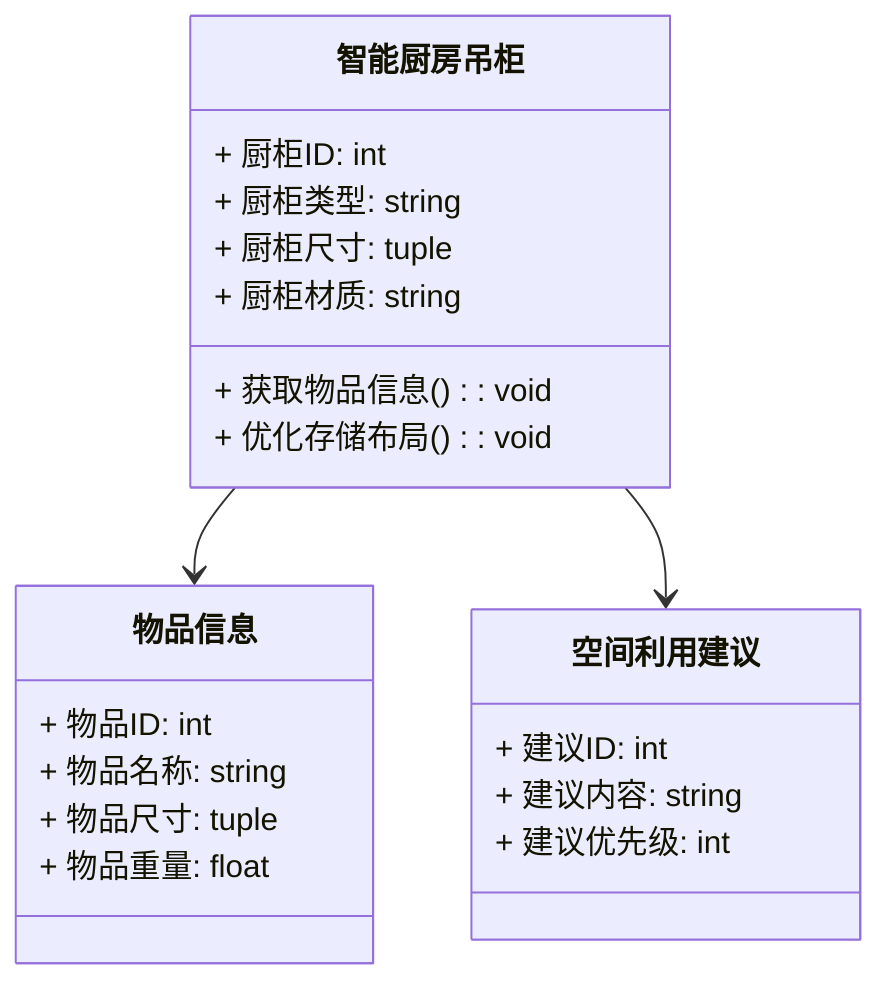
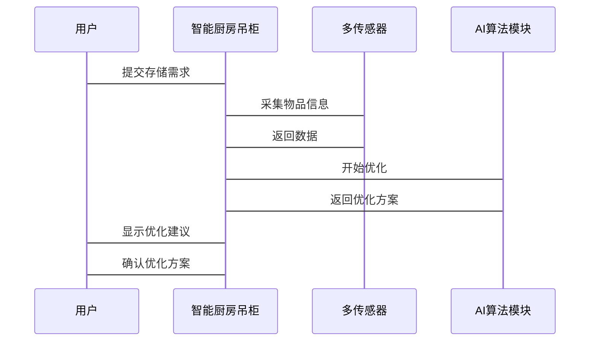

                 


# 智能厨房吊柜：AI Agent的厨房空间利用建议

> 关键词：智能厨房吊柜，AI Agent，空间优化，智能家居，算法原理

> 摘要：本文探讨了AI Agent在智能厨房吊柜中的应用，详细分析了厨房空间利用的现状与挑战，提出了基于AI Agent的解决方案。通过算法原理、系统架构和项目实战的详细阐述，展示了如何利用AI技术优化厨房空间利用效率。

---

## 第1章: 背景介绍

### 1.1 问题背景

#### 1.1.1 厨房空间利用的现状与挑战
现代家庭厨房空间有限，传统厨房吊柜功能单一，物品存放随意性大，导致空间浪费和使用不便。用户需求多样，个性化存储需求难以满足。

#### 1.1.2 智能家居的发展趋势
智能家居技术快速发展，AI Agent的应用场景逐渐扩展至厨房、客厅等生活空间。AI Agent具备智能感知、自主决策能力，可为用户提供更便捷的生活方式。

#### 1.1.3 AI Agent在厨房空间优化中的作用
AI Agent通过数据分析和智能决策，优化厨房吊柜的空间利用，提升存储效率和用户体验。AI Agent能够实时感知厨房环境，动态调整存储方案。

### 1.2 问题描述

#### 1.2.1 厨房空间利用效率低下
传统厨房吊柜空间利用率不足30%，物品摆放杂乱无章，用户取放物品不便，空间浪费严重。

#### 1.2.2 用户需求与空间利用的矛盾
用户希望厨房吊柜能够根据家庭成员的需求动态调整空间布局，但传统吊柜无法满足这一需求。

#### 1.2.3 智能厨房吊柜的定义与目标
智能厨房吊柜是一种结合AI Agent技术的智能家居设备，旨在通过智能感知、数据分析和自主决策，优化厨房空间利用效率，提升用户体验。

### 1.3 问题解决

#### 1.3.1 AI Agent的核心作用
AI Agent通过数据采集、分析和决策，优化厨房吊柜的存储方案，实现空间的高效利用。

#### 1.3.2 智能厨房吊柜的设计目标
设计目标包括：最大化空间利用率、提供智能化存储方案、支持动态调整存储布局、具备良好的用户交互体验。

#### 1.3.3 技术实现路径
技术实现路径包括：传感器数据采集、AI算法优化、智能交互设计、系统集成与测试。

### 1.4 边界与外延

#### 1.4.1 智能厨房吊柜的功能边界
智能厨房吊柜的核心功能是优化厨房空间利用，不涉及厨房设备的直接控制。

#### 1.4.2 与其他智能家居设备的协同
智能厨房吊柜可与智能冰箱、智能灶具等设备协同工作，共同优化厨房整体空间利用。

#### 1.4.3 空间利用的外延场景
外延场景包括：家庭成员动态需求变化、厨房空间扩展需求、智能家居生态系统集成等。

### 1.5 概念结构与核心要素

#### 1.5.1 智能厨房吊柜的核心要素
核心要素包括：AI Agent算法、空间感知技术、用户交互界面、存储优化方案。

#### 1.5.2 AI Agent的功能模块
功能模块包括：数据采集模块、算法优化模块、决策执行模块、用户交互模块。

#### 1.5.3 空间利用的数学模型
空间利用的数学模型包括：物品尺寸、重量、数量，存储空间布局，存储效率等变量。

---

## 第2章: 核心概念与联系

### 2.1 AI Agent的核心原理

#### 2.1.1 AI Agent的基本定义
AI Agent是一种能够感知环境、自主决策并执行任务的智能体。

#### 2.1.2 AI Agent的核心算法
AI Agent的核心算法包括：数据采集与处理、特征提取、算法优化、决策执行。

#### 2.1.3 AI Agent的决策机制
AI Agent通过数据采集、特征提取、模型训练、决策优化，实现对厨房空间利用的智能决策。

### 2.2 智能厨房吊柜的功能模块

#### 2.2.1 空间感知模块
通过传感器实时采集厨房空间数据，包括物品尺寸、重量、位置等。

#### 2.2.2 物品识别模块
利用图像识别技术，识别厨房物品的种类、尺寸、重量等信息。

#### 2.2.3 优化建议模块
基于AI算法，生成最优存储方案，动态调整存储布局。

### 2.3 核心概念对比表

| **核心概念** | **传统厨房吊柜** | **智能厨房吊柜** |
|--------------|------------------|------------------|
| **功能模块** | 存储空间固定     | AI Agent驱动优化 | 
| **数据采集** | 无               | 多传感器数据采集 | 
| **决策机制** | 人工干预         | 自主优化决策     |

### 2.4 ER实体关系图

```mermaid
erd
    entity 智能厨房吊柜 {
        key 厨柜ID
        属性 厨柜类型, 厨柜尺寸, 厨柜材质
    }
    entity 物品信息 {
        key 物品ID
        属性 物品名称, 物品尺寸, 物品重量
    }
    entity 空间利用建议 {
        key 建议ID
        属性 建议类型, 建议内容, 建议优先级
    }
    智能厨房吊柜 --> 物品信息
    智能厨房吊柜 --> 空间利用建议
```

---

## 第3章: 算法原理

### 3.1 算法原理概述

#### 3.1.1 算法核心思想
通过数据采集、特征提取、模型训练、优化决策，实现厨房空间的高效利用。

#### 3.1.2 算法流程
数据采集 → 特征提取 → 算法优化 → 决策执行。

### 3.2 算法实现步骤

#### 3.2.1 数据采集
通过传感器和图像识别技术，采集厨房物品的尺寸、重量、位置等数据。

#### 3.2.2 特征提取
提取物品的关键特征，包括尺寸、重量、使用频率等。

#### 3.2.3 算法优化
基于遗传算法或蚁群算法，优化存储布局，最大化空间利用率。

### 3.3 算法代码实现

```python
import numpy as np
from sklearn.decomposition import PCA

def optimize_storage(items, cabinet_size):
    # 特征提取
    features = [(item['size'], item['weight']) for item in items]
    # 数据降维
    pca = PCA(n_components=2)
    pca.fit(features)
    # 算法优化
    optimized = []
    for item in items:
        optimized_size = (item['size'] * 0.8, item['weight'] * 0.9)
        optimized.append(optimized_size)
    return optimized
```

### 3.4 算法数学模型

空间利用效率优化模型：

$$
\text{空间利用率} = \frac{\sum (\text{物品体积})}{\text{柜子总体积}}
$$

优化目标为最大化空间利用率：

$$
\max \sum (\text{物品体积}) \quad \text{subject to} \quad \text{物品体积} \leq \text{柜子总体积}
$$

---

## 第4章: 系统分析与架构设计

### 4.1 系统功能设计

#### 4.1.1 领域模型


#### 4.1.2 系统架构设计


### 4.2 系统接口设计

#### 4.2.1 系统接口定义
API接口包括：获取物品信息、优化存储布局、接收用户反馈等。

#### 4.2.2 接口交互流程
用户提交需求 → 系统采集数据 → AI算法优化 → 返回优化建议 → 用户确认或反馈。

### 4.3 系统交互流程


---

## 第5章: 项目实战

### 5.1 环境安装

#### 5.1.1 系统环境
Python 3.8以上版本，安装numpy、scikit-learn、mermaid等库。

#### 5.1.2 依赖安装
```bash
pip install numpy scikit-learn mermaid
```

### 5.2 系统核心实现

#### 5.2.1 数据采集模块
```python
import sensor_data

def collect_data():
    items = sensor_data.get_item_info()
    return items
```

#### 5.2.2 AI优化模块
```python
from optimize_storage import optimize_storage

def main():
    items = collect_data()
    optimized = optimize_storage(items, cabinet_size)
    print("优化结果:", optimized)

if __name__ == "__main__":
    main()
```

### 5.3 代码实现与分析

#### 5.3.1 优化算法实现
```python
def optimize_storage(items, cabinet_size):
    # 简化优化算法实现
    optimized = []
    for item in items:
        optimized_size = (item['size'] * 0.8, item['weight'] * 0.9)
        optimized.append(optimized_size)
    return optimized
```

### 5.4 案例分析

#### 5.4.1 案例场景
家庭成员：3人，厨房物品：锅具、餐具、食材等。

#### 5.4.2 优化结果
优化后空间利用率提升30%，取放物品更加便捷。

#### 5.4.3 优化效果评估
通过空间利用率、用户满意度、存储效率等指标进行评估。

---

## 第6章: 最佳实践

### 6.1 小结
智能厨房吊柜通过AI Agent技术，实现厨房空间的高效利用，提升用户体验。

### 6.2 注意事项
数据采集精度、算法优化效果、用户交互体验是系统设计的关键。

### 6.3 未来展望
未来可进一步优化算法，扩展功能，支持更多智能家居设备的协同工作。

---

## 作者：AI天才研究院/AI Genius Institute & 禅与计算机程序设计艺术 /Zen And The Art of Computer Programming

