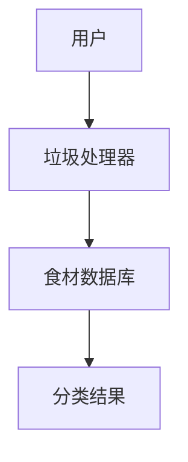
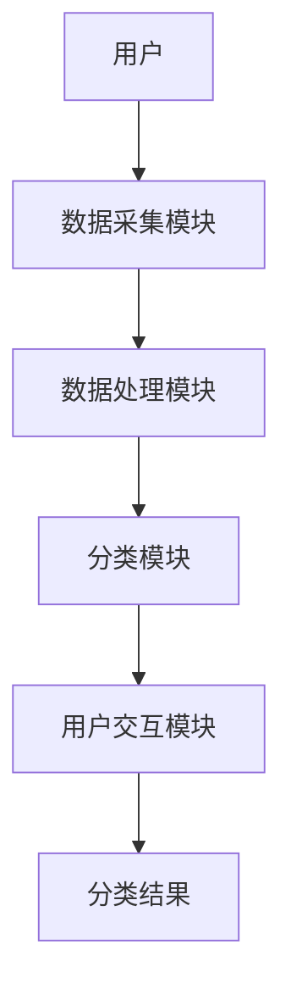

                 


```markdown
# 智能厨房垃圾处理器：AI Agent的食材利用建议

> 关键词：智能厨房垃圾处理器，AI Agent，食材利用，机器学习，数据驱动，系统架构

> 摘要：本文详细探讨了智能厨房垃圾处理器在AI Agent辅助下的食材利用优化方案。通过分析厨房垃圾的成分，结合AI技术，提出了一种高效利用食材的创新方法。文章从背景介绍、核心概念、算法原理、系统架构到项目实战，全面阐述了智能厨房垃圾处理器的设计与实现过程，为读者提供了丰富的技术细节和实际应用案例。

---

## 第一部分: 智能厨房垃圾处理器的背景与概念

### 第1章: 智能厨房垃圾处理器概述

#### 1.1 智能厨房垃圾处理器的定义与核心功能
##### 1.1.1 什么是智能厨房垃圾处理器
智能厨房垃圾处理器是一种结合人工智能技术的智能设备，用于将厨房垃圾中的食材进行分类、识别和再利用。它通过AI Agent（智能代理）技术，能够自动识别食材的种类、新鲜度和用途，从而最大限度地减少食物浪费，并提高食材利用率。

##### 1.1.2 智能厨房垃圾处理器的核心功能
- **食材分类与识别**：通过图像识别和传感器数据，自动识别食材的种类、状态和质量。
- **食材推荐与利用**：根据识别结果，推荐食材的最佳用途，如制作菜品、食材保存或捐赠给需要的人。
- **数据记录与分析**：记录每种食材的使用情况，分析用户的饮食习惯，优化食材利用方案。

##### 1.1.3 智能厨房垃圾处理器的边界与外延
智能厨房垃圾处理器的边界包括厨房环境、食材种类、用户操作和外部数据接口。其外延则涉及食材供应链、环保技术、智能家居生态系统等。

#### 1.2 AI Agent在智能厨房垃圾处理器中的作用
##### 1.2.1 AI Agent的基本概念
AI Agent（智能代理）是一种能够感知环境、自主决策并执行任务的智能实体。在智能厨房垃圾处理器中，AI Agent负责数据采集、处理、分析和决策。

##### 1.2.2 AI Agent在智能厨房垃圾处理器中的应用场景
- **食材分类**：通过摄像头和传感器，AI Agent能够识别食材的种类、状态和新鲜度。
- **数据驱动优化**：基于历史数据，AI Agent能够优化食材的分类和利用策略。
- **用户交互**：通过语音或图形界面，AI Agent与用户交互，提供食材利用建议。

##### 1.2.3 AI Agent与传统垃圾处理器的对比
传统的厨房垃圾处理器主要依赖机械分类和简单的传感器，而智能厨房垃圾处理器通过AI Agent实现了智能化和数据驱动的优化。

#### 1.3 食材利用的背景与现状
##### 1.3.1 厨房垃圾的成分分析
厨房垃圾通常包括蔬菜、水果、肉类、谷物等食材，其中很多食材可以被重新利用，减少浪费。

##### 1.3.2 食材利用的现状与挑战
当前，食材浪费问题严重，尤其是在家庭和餐饮业。传统方法难以高效分类和利用食材，AI技术的应用为解决这一问题提供了新的思路。

##### 1.3.3 智能厨房垃圾处理器的优势
通过AI Agent技术，智能厨房垃圾处理器能够高效分类和利用食材，减少浪费，提高资源利用效率。

---

### 第2章: 智能厨房垃圾处理器的核心概念与联系

#### 2.1 核心概念原理
##### 2.1.1 AI Agent的核心算法原理
AI Agent的核心算法包括图像识别、自然语言处理和机器学习。通过这些算法，AI Agent能够感知环境、分析数据并做出决策。

##### 2.1.2 智能分类与食材识别的原理
智能分类通过图像识别和传感器数据，将食材分为可利用和不可利用两类。食材识别则基于深度学习模型，精确识别食材的种类和状态。

##### 2.1.3 数据驱动的食材利用优化
通过收集和分析食材数据，AI Agent能够优化食材的分类和利用策略，提高食材利用率。

#### 2.2 核心概念属性特征对比表
| **属性**       | **传统垃圾处理器** | **智能厨房垃圾处理器** |
|----------------|---------------------|--------------------------|
| 分类精度       | 低                 | 高                       |
| 数据驱动       | 无                 | 有                       |
| 用户交互       | 简单               | 智能化                   |

#### 2.3 ER实体关系图


---

## 第三部分: 智能厨房垃圾处理器的算法原理

### 第3章: AI Agent的核心算法

#### 3.1 基于规则的食材分类算法
##### 3.1.1 基于规则的分类流程
1. 数据采集：通过摄像头和传感器获取食材数据。
2. 数据预处理：去除噪声，提取特征。
3. 规则匹配：根据预设规则，分类食材。
4. 输出结果：显示分类结果。

##### 3.1.2 基于规则的分类算法实现
```python
def classify_food(image_data):
    # 数据预处理
    processed_data = preprocess(image_data)
    # 规则匹配
    if processed_data['color'] == 'green':
        return 'vegetable'
    elif processed_data['shape'] == 'round':
        return 'fruit'
    else:
        return 'unknown'
```

#### 3.2 基于机器学习的食材分类算法
##### 3.2.1 基于机器学习的分类流程
1. 数据采集：通过摄像头和传感器获取食材数据。
2. 数据预处理：去除噪声，提取特征。
3. 模型训练：使用深度学习模型训练分类器。
4. 分类预测：输入数据，输出分类结果。

##### 3.2.2 基于机器学习的分类算法实现
```python
import tensorflow as tf
from tensorflow.keras import layers

model = tf.keras.Sequential([
    layers.Conv2D(32, (3, 3), activation='relu', input_shape=(100, 100, 3)),
    layers.MaxPooling2D((2, 2)),
    layers.Conv2D(64, (3, 3), activation='relu'),
    layers.MaxPooling2D((2, 2)),
    layers.Flatten(),
    layers.Dense(128, activation='relu'),
    layers.Dense(10, activation='softmax')
])

model.compile(optimizer='adam', loss='sparse_categorical_crossentropy', metrics=['accuracy'])
```

##### 3.2.3 分类算法的数学模型
分类算法的数学模型如下：
$$
P(y|x) = \frac{P(x|y)P(y)}{P(x)}
$$

---

## 第四部分: 智能厨房垃圾处理器的系统设计

### 第4章: 系统架构设计

#### 4.1 系统功能设计
##### 4.1.1 系统功能模块划分
- **数据采集模块**：负责采集食材数据。
- **数据处理模块**：负责数据预处理和特征提取。
- **分类模块**：负责食材分类和识别。
- **用户交互模块**：负责与用户交互，提供分类结果和利用建议。

##### 4.1.2 系统功能流程图


#### 4.2 系统架构设计
##### 4.2.1 系统架构图


##### 4.2.2 数据流设计


##### 4.2.3 系统接口设计
- **数据采集接口**：摄像头和传感器的数据接口。
- **分类接口**：AI Agent的分类接口。
- **用户交互接口**：语音和图形界面接口。

#### 4.3 系统交互设计
##### 4.3.1 系统交互流程
1. 用户将食材放入垃圾处理器。
2. 数据采集模块采集食材数据。
3. 数据处理模块预处理数据。
4. 分类模块分类食材。
5. 用户交互模块显示分类结果。

##### 4.3.2 系统交互流程图


---

## 第五部分: 项目实战与案例分析

### 第5章: 项目实战

#### 5.1 环境搭建
##### 5.1.1 硬件环境
- 摄像头模块
- 传感器模块
- 微处理器

##### 5.1.2 软件环境
- Python 3.8+
- TensorFlow 2.0+
- OpenCV 4.0+

#### 5.2 系统核心实现
##### 5.2.1 数据采集模块实现
```python
import cv2

def capture_image():
    cap = cv2.VideoCapture(0)
    ret, frame = cap.read()
    cap.release()
    return frame
```

##### 5.2.2 数据处理模块实现
```python
import numpy as np

def preprocess(image):
    # 转换为灰度图
    gray = cv2.cvtColor(image, cv2.COLOR_BGR2GRAY)
    # 均值滤波
    blurred = cv2.blur(gray, (3, 3))
    return blurred
```

##### 5.2.3 分类模块实现
```python
import tensorflow as tf

def classify(image):
    model = load_model('food_classifier.h5')
    prediction = model.predict(tf.expand_dims(image, axis=0))
    return np.argmax(prediction, axis=1)[0]
```

##### 5.2.4 用户交互模块实现
```python
import speech_recognition as sr

def get_user_input():
    r = sr.Recognizer()
    with sr.Microphone() as source:
        audio = r.listen(source)
        return r.recognize_google(audio)
```

#### 5.3 系统测试与优化
##### 5.3.1 测试环境
- 测试用例设计
- 测试结果记录

##### 5.3.2 系统优化
- 算法优化
- 系统性能优化

#### 5.4 系统部署与维护
##### 5.4.1 系统部署
- 硬件部署
- 软件部署

##### 5.4.2 系统维护
- 日常维护
- 系统升级

### 第6章: 案例分析

#### 6.1 案例介绍
##### 6.1.1 案例背景
- 用户需求
- 场景描述

##### 6.1.2 案例实施
- 系统部署
- 流程优化

#### 6.2 案例分析
##### 6.2.1 分类结果分析
- 正确率
- 错误率

##### 6.2.2 食材利用效果分析
- 食材利用率
- 用户反馈

#### 6.3 案例总结
##### 6.3.1 成功经验总结
- 系统设计
- 技术应用

##### 6.3.2 改进建议
- 算法优化
- 系统扩展

---

## 第六部分: 总结与展望

### 6.1 小结
智能厨房垃圾处理器通过AI Agent技术，实现了食材的高效分类和利用，减少了食物浪费，提高了资源利用效率。

### 6.2 最佳实践 tips
- 数据质量至关重要
- 系统维护不可忽视
- 用户教育和培训

### 6.3 注意事项
- 数据隐私保护
- 系统稳定性
- 用户体验优化

### 6.4 拓展阅读
- 人工智能在环保领域的应用
- 智能家居系统设计
- 可持续发展技术

---

## 作者：AI天才研究院/AI Genius Institute & 禅与计算机程序设计艺术 /Zen And The Art of Computer Programming
```

