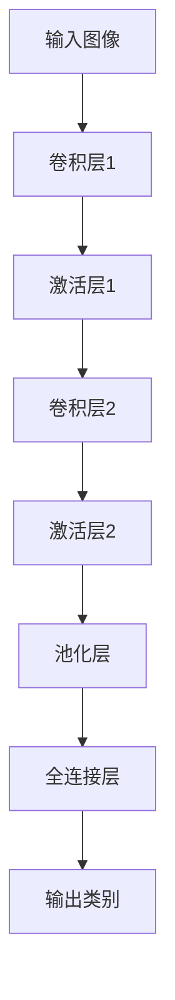
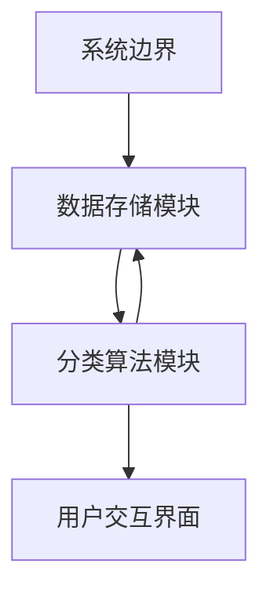
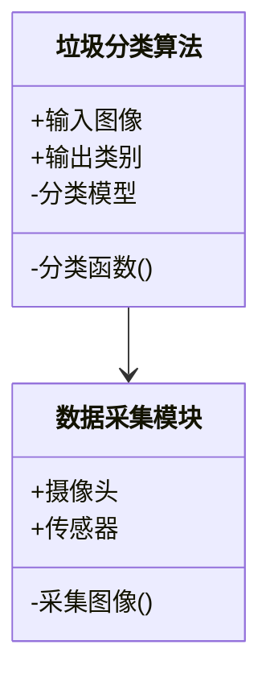

                 


# 智能厨房垃圾桶：AI Agent的厨余分类指导

## 关键词：AI Agent、厨余分类、智能垃圾桶、图像识别、机器学习、物联网

## 摘要：  
本文深入探讨了AI Agent在智能厨房垃圾桶中的应用，详细讲解了其背后的技术原理和系统架构。通过分析厨余分类的算法原理、系统设计和实际案例，展示了AI技术如何提升垃圾分类效率和用户体验。文章最后总结了最佳实践和未来发展方向。

---

# 正文

## 第一部分：智能厨房垃圾桶的背景与需求

### 第1章：问题背景与描述

#### 1.1 厨余垃圾分类的重要性  
厨余垃圾是生活垃圾中占比最大的部分，妥善分类和处理可以减少环境污染，提高资源利用效率。然而，传统垃圾桶无法实现智能分类，导致分类效率低下，增加了人工处理的难度。

#### 1.2 智能垃圾桶的解决方案  
AI Agent通过图像识别和机器学习技术，能够自动识别厨余垃圾的种类，实现智能分类。这种解决方案可以显著提高分类效率，减少人工干预。

#### 1.3 AI Agent的核心功能  
- **图像采集与识别**：通过摄像头捕捉垃圾图像，利用深度学习模型进行分类。  
- **智能决策**：基于识别结果，指导垃圾桶进行分类操作。  
- **数据记录与分析**：记录分类数据，优化算法模型。

### 第2章：AI Agent的核心概念

#### 2.1 AI Agent的定义与特点  
AI Agent是一种能够感知环境、自主决策的智能系统，具有以下特点：  
- **自主性**：无需人工干预，自动执行任务。  
- **反应性**：能够实时感知环境变化并做出反应。  
- **学习能力**：通过数据不断优化分类模型。

#### 2.2 实体关系图（ER图）  
以下是系统中的实体关系图：  
```mermaid
er
    %% 实体关系图
    系统边界
    --> 垃圾分类算法
    --> 数据采集模块
    --> 用户交互界面
    --> 数据存储模块
```

---

## 第二部分：垃圾分类的算法原理

### 第3章：分类算法的选择与实现

#### 3.1 卷积神经网络（CNN）的应用  
CNN适用于图像识别任务，通过多层卷积提取图像特征。以下是CNN的流程图：  


#### 3.2 分类损失函数与优化器  
常用的分类损失函数是交叉熵损失：  
$$ L = -\sum_{i=1}^{n} y_i \log(p_i) $$  
优化器选择Adam：  
$$ \theta_{t+1} = \theta_t - \eta \frac{g}{1 - \beta_1 + \beta_1^t} $$  

#### 3.3 代码实现  
以下是垃圾分类算法的Python代码示例：  
```python
import tensorflow as tf
from tensorflow.keras import layers

model = tf.keras.Sequential([
    layers.Conv2D(32, (3,3), activation='relu', input_shape=(64, 64, 3)),
    layers.MaxPooling2D(),
    layers.Conv2D(64, (3,3), activation='relu'),
    layers.MaxPooling2D(),
    layers.Flatten(),
    layers.Dense(128, activation='relu'),
    layers.Dense(10, activation='softmax')
])

model.compile(optimizer='adam', loss='sparse_categorical_crossentropy', metrics=['accuracy'])
model.fit(x_train, y_train, epochs=10, validation_data=(x_test, y_test))
```

---

## 第三部分：系统分析与架构设计

### 第4章：系统架构设计

#### 4.1 系统架构图  
以下是系统架构图：  


#### 4.2 功能模块类图  
以下是功能模块类图：  


---

## 第四部分：项目实战

### 第5章：环境安装与系统实现

#### 5.1 环境安装  
安装必要的库：  
```bash
pip install tensorflow keras matplotlib
```

#### 5.2 核心功能实现  
以下是核心功能实现代码：  
```python
import cv2
import numpy as np
from tensorflow.keras.models import load_model

model = load_model('garbage_classifier.h5')
cap = cv2.VideoCapture(0)

while True:
    ret, frame = cap.read()
    if not ret:
        continue
    cv2.imshow('Camera', frame)
    if cv2.waitKey(1) & 0xFF == ord('q'):
        break

cap.release()
cv2.destroyAllWindows()
```

---

## 第五部分：最佳实践与小结

### 第6章：总结与建议

#### 6.1 总结  
AI Agent在厨余分类中的应用显著提升了分类效率和准确性，减少了人工成本。通过图像识别和机器学习技术，智能垃圾桶能够实现高效的垃圾分类。

#### 6.2 注意事项  
- 数据质量对分类准确率有重要影响，需确保数据多样化和平衡。  
- 系统设计需考虑传感器精度和算法模型的实时性。  
- 系统扩展性：未来可以加入更多垃圾类别和分类算法优化。

#### 6.3 拓展阅读  
建议读者深入学习深度学习和计算机视觉技术，探索AI在更多场景中的应用。

---

## 作者：AI天才研究院 & 禅与计算机程序设计艺术

