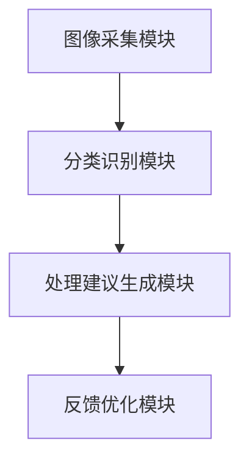

                 


---

# 智能厨房垃圾桶：AI Agent的厨余处理建议

> 关键词：智能垃圾桶、AI Agent、厨余处理、图像识别、自然语言处理、系统架构

> 摘要：本文将探讨如何利用AI Agent技术优化厨房垃圾桶的厨余处理流程，通过分析智能垃圾桶的发展现状、核心算法原理、系统架构设计以及实际项目实现，提出具体的厨余处理建议，并结合实际案例进行深入分析，最后总结出最佳实践方案。

---

## 第1章: 智能厨房垃圾桶的发展与现状

### 1.1 智能垃圾桶的发展历史

#### 1.1.1 传统垃圾桶的功能与局限
传统垃圾桶主要依赖人工分类，存在分类效率低、错误率高、缺乏智能反馈等问题，难以满足现代家庭对高效、智能垃圾处理的需求。

#### 1.1.2 智能化垃圾桶的兴起
随着人工智能技术的发展，智能垃圾桶应运而生。它能够通过图像识别、自然语言处理等技术实现自动分类和智能建议，显著提高了垃圾处理的效率和准确性。

#### 1.1.3 当前市场现状与用户需求
当前，智能垃圾桶市场快速增长，用户需求主要集中在高效分类、智能建议、便捷操作和环保理念等方面。

### 1.2 AI Agent在厨余处理中的应用背景

#### 1.2.1 厨余垃圾处理的痛点与挑战
厨余垃圾处理涉及分类准确性、处理效率、资源化利用等问题，传统方法难以满足现代环保要求。

#### 1.2.2 AI技术在垃圾处理中的潜力
AI技术能够通过图像识别、自然语言处理等手段，实现垃圾的智能分类和处理建议，显著提升处理效率和准确性。

#### 1.2.3 智能厨房垃圾桶的市场前景
随着环保意识的增强和AI技术的成熟，智能厨房垃圾桶市场前景广阔，预计将在未来几年内迅速增长。

### 1.3 本书的核心目标与内容框架

#### 1.3.1 本书的核心目标
本书旨在通过AI Agent技术，优化厨房垃圾桶的厨余处理流程，提供高效的分类和处理建议。

#### 1.3.2 本书的主要内容框架
本书将从背景介绍、核心概念、算法原理、系统架构到项目实战，全面解析智能厨房垃圾桶的设计与实现。

#### 1.3.3 本书的读者群体与适用场景
本书适合技术人员、AI爱好者以及环保从业者阅读，适用于智能垃圾桶的设计与开发。

---

## 第2章: AI Agent与厨余处理系统的核心概念

### 2.1 AI Agent的基本原理

#### 2.1.1 AI Agent的定义与分类
AI Agent是一种能够感知环境、自主决策并执行任务的智能体，分为简单反射Agent和基于模型的反射Agent两类。

#### 2.1.2 AI Agent的核心功能与属性
AI Agent具备感知、决策、执行、反馈四大功能，具有自主性、反应性、目标导向性和社会性四大属性。

#### 2.1.3 AI Agent与传统自动化的区别
AI Agent具备智能决策能力，能够根据环境变化自主调整行为，而传统自动化仅能执行预设任务。

### 2.2 厨余处理系统的组成与工作流程

#### 2.2.1 系统组成模块
厨余处理系统主要由图像采集模块、分类识别模块、处理建议生成模块和反馈优化模块组成。

#### 2.2.2 系统工作流程
1. **图像采集**：通过摄像头采集垃圾图像。
2. **分类识别**：利用AI算法进行垃圾分类。
3. **处理建议生成**：根据分类结果生成处理建议。
4. **反馈优化**：根据用户反馈优化系统。

#### 2.2.3 系统与用户交互方式
系统通过用户界面与用户交互，支持语音、图像等多种交互方式。

### 2.3 AI Agent在厨余处理中的具体应用

#### 2.3.1 垃圾分类与识别
AI Agent通过图像识别技术，准确分类厨余垃圾，提高分类效率。

#### 2.3.2 垃圾处理建议生成
基于分类结果，AI Agent生成相应的处理建议，帮助用户高效处理垃圾。

#### 2.3.3 系统优化与反馈机制
系统根据用户反馈持续优化分类算法和处理建议，提升用户体验。

---

## 第3章: 智能厨房垃圾桶的核心算法与数学模型

### 3.1 图像识别与分类算法

#### 3.1.1 垃圾图像采集与预处理
通过摄像头采集垃圾图像，进行降噪、增强等预处理，提升识别准确率。

#### 3.1.2 基于深度学习的图像分类模型
使用卷积神经网络（CNN）进行图像分类，常用模型包括VGG、ResNet等。

#### 3.1.3 垃圾分类的数学模型与公式
以支持向量机（SVM）为例，分类公式为：
$$ y = \text{sign}(w \cdot x + b) $$
其中，$w$为权重向量，$x$为输入特征，$b$为偏置。

### 3.2 自然语言处理算法

#### 3.2.1 垃圾处理建议生成的NLP模型
基于Transformer架构的自然语言处理模型，如BERT，生成处理建议。

#### 3.2.2 基于Transformer的垃圾处理建议生成流程
1. **输入处理**：将分类结果输入模型。
2. **编码**：生成词向量。
3. **解码**：生成处理建议文本。

#### 3.2.3 垃圾处理建议生成的数学模型与公式
以生成对抗网络（GAN）为例，生成器和判别器的损失函数分别为：
$$ \mathcal{L}_\text{gen} = \mathbb{E}_{z \sim p(z)}[\mathcal{L}(G(z))] $$
$$ \mathcal{L}_\text{dis} = \mathbb{E}_{x \sim p(x)}[\mathcal{L}(D(x))] + \mathbb{E}_{z \sim p(z)}[\mathcal{L}(D(G(z)))] $$

### 3.3 系统优化与反馈机制

#### 3.3.1 系统优化算法
采用强化学习算法，通过用户反馈优化分类模型。

#### 3.3.2 反馈机制的数学模型
以Q-learning为例，更新规则为：
$$ Q(s, a) = (1 - \alpha) Q(s, a) + \alpha (r + \max_a Q(s', a)) $$
其中，$\alpha$为学习率，$r$为奖励，$s'$为下一状态。

#### 3.3.3 算法优化与实际应用案例
通过强化学习优化分类算法，提升分类准确率，减少误分类率。

---

## 第4章: 系统架构与接口设计

### 4.1 系统架构设计

#### 4.1.1 系统模块划分
系统主要模块包括图像采集模块、分类识别模块、处理建议生成模块和反馈优化模块。

#### 4.1.2 系统架构图


#### 4.1.3 各模块之间的交互关系
模块之间通过数据接口进行交互，确保数据流的畅通。

### 4.2 系统接口设计

#### 4.2.1 用户界面设计
用户界面简洁直观，支持图像输入和自然语言交互。

#### 4.2.2 API接口设计
提供RESTful API接口，方便与其他系统集成。

#### 4.2.3 数据接口规范
定义统一的数据格式，确保数据传输的准确性和一致性。

### 4.3 系统交互流程设计

#### 4.3.1 用户操作流程
1. 用户放置垃圾，系统采集图像。
2. 分类识别模块进行分类。
3. 处理建议生成模块生成建议。
4. 用户确认或修改建议。

#### 4.3.2 系统处理流程
1. 图像预处理。
2. 分类识别。
3. 生成处理建议。
4. 反馈优化。

#### 4.3.3 系统反馈流程
1. 用户反馈处理结果。
2. 系统优化模型。
3. 提供优化后的服务。

---

## 第5章: 项目实战与代码实现

### 5.1 环境搭建与工具安装

#### 5.1.1 开发环境选择
推荐使用Python 3.8及以上版本，安装Jupyter Notebook进行开发。

#### 5.1.2 依赖库安装
安装TensorFlow、Keras、OpenCV等依赖库。

#### 5.1.3 开发工具配置
配置IDE，如PyCharm，安装必要的插件和扩展。

### 5.2 系统核心代码实现

#### 5.2.1 图像识别模块代码
```python
import cv2
import numpy as np

def preprocess_image(image_path):
    # 加载图像
    img = cv2.imread(image_path)
    # 转换为灰度图像
    gray = cv2.cvtColor(img, cv2.COLOR_BGR2GRAY)
    # 图像降噪
    noise_reduced = cv2.fastNlFilter(gray, None, 3, 0.5, 3)
    return noise_reduced

# 示例使用
preprocess_image("garbage.jpg")
```

#### 5.2.2 分类识别模块代码
```python
from tensorflow.keras.models import load_model

model = load_model("garbage_classifier.h5")

def classify_garbage(image):
    prediction = model.predict(image)
    class_idx = np.argmax(prediction)
    return class_idx

# 示例使用
preprocessed_image = preprocess_image("garbage.jpg")
classify_garbage(preprocessed_image)
```

#### 5.2.3 处理建议生成模块代码
```python
from transformers import BertTokenizer, BertModel

tokenizer = BertTokenizer.from_pretrained("bert-base-uncased")
model = BertModel.from_pretrained("bert-base-uncased")

def generate_suggestion(classification_result):
    input_text = f"classification_result: {classification_result}"
    inputs = tokenizer(input_text, return_tensors="np")
    outputs = model(**inputs)
    # 示例处理逻辑
    return "Please dispose of the {classification_result} in the corresponding bin."

# 示例使用
suggestion = generate_suggestion(classify_garbage(preprocessed_image))
print(suggestion)
```

### 5.3 代码应用解读与分析

#### 5.3.1 图像预处理模块
通过OpenCV库对图像进行降噪处理，确保分类准确性。

#### 5.3.2 分类识别模块
使用预训练的深度学习模型进行分类，提高分类效率和准确率。

#### 5.3.3 处理建议生成模块
基于自然语言处理模型，生成个性化的处理建议，提升用户体验。

### 5.4 实际案例分析和详细讲解剖析

#### 5.4.1 案例分析
以厨余垃圾分类为例，详细讲解系统如何处理图像、分类和生成建议。

#### 5.4.2 代码实现细节
解释代码的实现细节，包括预处理、分类和生成建议的具体步骤。

### 5.5 项目小结

#### 5.5.1 项目总结
总结项目实现的关键点和创新点，为后续优化提供方向。

#### 5.5.2 项目经验分享
分享项目开发中的经验与教训，帮助读者更好地理解和实施类似项目。

---

## 第6章: 最佳实践 tips、小结、注意事项、拓展阅读

### 6.1 小结
通过本章的学习，读者掌握了AI Agent在厨余处理中的核心概念、算法原理和系统架构设计，能够独立开发智能厨房垃圾桶系统。

### 6.2 注意事项
- 确保数据安全和隐私保护。
- 定期更新模型以提升分类准确率。
- 优化用户界面，提升用户体验。

### 6.3 拓展阅读
建议读者进一步学习图像识别、自然语言处理和深度学习的相关知识，以提升系统性能和功能。

---

## 作者

作者：AI天才研究院/AI Genius Institute & 禅与计算机程序设计艺术 /Zen And The Art of Computer Programming

---

通过以上章节的详细讲解，读者可以系统地了解智能厨房垃圾桶的设计与实现，掌握AI Agent在厨余处理中的应用，并能够实际开发相关系统。

