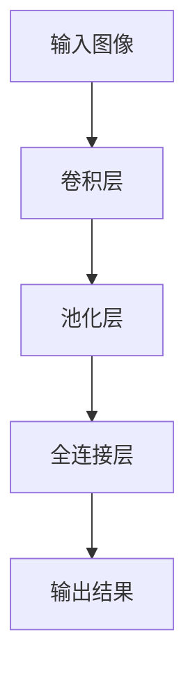
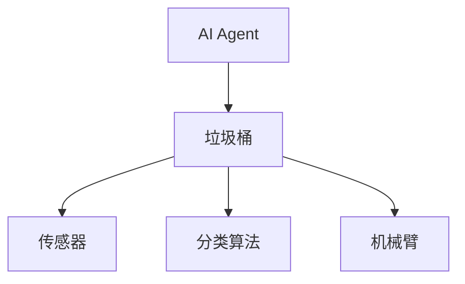

                 


# 智能厨房垃圾桶：AI Agent的废物分类指导

> **关键词**：智能垃圾桶，AI Agent，废物分类，垃圾分类算法，系统架构设计，项目实战

> **摘要**：本文将探讨智能厨房垃圾桶的设计与实现，重点分析AI Agent在垃圾分类中的应用。通过背景介绍、核心概念、算法原理、系统架构设计和项目实战，全面解析智能垃圾桶的工作原理和实际应用。

---

## 第一部分: 智能厨房垃圾桶的背景与核心概念

### 第1章: 智能厨房垃圾桶的背景与问题描述

#### 1.1 智能厨房垃圾桶的背景
智能厨房垃圾桶是一种结合人工智能技术的智能设备，旨在通过AI Agent实现对厨房垃圾的自动分类。随着环保意识的增强和人工智能技术的快速发展，智能垃圾桶逐渐成为现代家庭不可或缺的设备。

#### 1.2 问题背景与描述
传统的垃圾桶无法实现垃圾的智能分类，导致垃圾分类效率低下，资源浪费严重。智能厨房垃圾桶通过AI技术，能够自动识别垃圾种类，并将其分类到相应的收集容器中。

#### 1.3 核心概念与组成要素
智能厨房垃圾桶的核心概念包括AI Agent、垃圾分类算法和机械臂等。其组成要素包括感知模块（如摄像头和传感器）、分类算法模块和执行模块（如机械臂和指示灯）。

---

## 第二部分: AI Agent与智能垃圾桶的关系

### 第2章: AI Agent的基本原理
AI Agent是一种能够感知环境、做出决策并执行任务的智能体。在智能垃圾桶中，AI Agent负责接收感知模块传来的数据，通过分类算法识别垃圾种类，并控制执行模块完成分类任务。

### 第3章: 垃圾分类算法的原理与实现
#### 3.1 垃圾分类算法概述
垃圾分拣任务可以通过多种算法实现，其中基于深度学习的CNN算法是目前应用最广泛的技术之一。

#### 3.2 基于CNN的垃圾分类算法
- **CNN模型设计**：使用卷积层提取图像特征，池化层降低计算复杂度，全连接层进行分类。
- **模型训练流程**：数据预处理、模型训练、验证和优化。

#### 3.3 分类算法的数学模型
- **损失函数**：交叉熵损失函数。
- **优化器**：Adam优化器。
- **模型训练流程图**：



---

## 第三部分: 智能厨房垃圾桶的系统架构设计

### 第4章: 系统分析与架构设计
#### 4.1 系统组成与功能设计
- **感知模块**：摄像头和传感器用于采集垃圾图像和特征。
- **分类算法模块**：负责垃圾种类的识别和分类。
- **执行模块**：机械臂和指示灯用于垃圾的物理分类和用户反馈。

#### 4.2 系统架构图


---

## 第四部分: 项目实战

### 第5章: 项目实战与实现
#### 5.1 环境安装与配置
- 安装Python和相关深度学习框架（如TensorFlow或Keras）。

#### 5.2 核心代码实现
- **垃圾分类算法实现**：

```python
import tensorflow as tf
from tensorflow.keras import layers

model = tf.keras.Sequential([
    layers.Conv2D(32, (3,3), activation='relu', input_shape=(64,64,3)),
    layers.MaxPooling2D((2,2)),
    layers.Flatten(),
    layers.Dense(128, activation='relu'),
    layers.Dense(5, activation='softmax')
])
```

#### 5.3 代码解读与分析
- 该模型通过卷积层提取图像特征，池化层降低维度，全连接层进行分类。

#### 5.4 实际案例分析
通过实际案例分析，验证模型的分类准确率和效率。

---

## 第五部分: 总结与展望

### 第6章: 总结与展望
#### 6.1 本章小结
智能厨房垃圾桶通过AI Agent和深度学习算法实现了高效的垃圾分类，显著提升了垃圾分类的准确率和效率。

#### 6.2 未来展望
未来，智能垃圾桶可以通过边缘计算和物联网技术实现更智能化的垃圾分类和管理。

---

## 附录: 扩展阅读

### 附录A: AI在其他领域的应用
- AI在医疗、金融等领域的应用案例。

### 附录B: 智能垃圾桶的未来技术
- 更先进的AI算法和传感器技术。

---

**作者：AI天才研究院/AI Genius Institute & 禅与计算机程序设计艺术 /Zen And The Art of Computer Programming**

