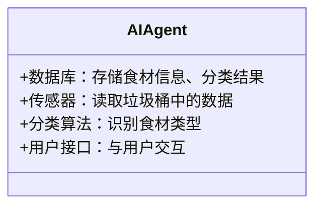
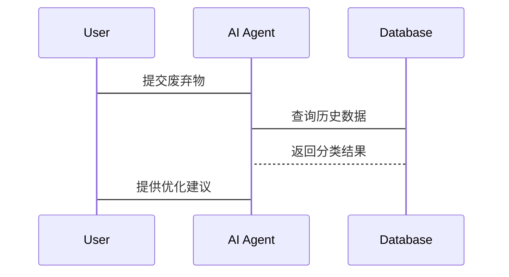

                 

<think>
好的，我需要按照用户的要求来撰写一篇关于《智能厨房垃圾桶：AI Agent的食材利用建议》的技术博客文章。用户已经提供了详细的目录大纲，我需要逐步完成每个章节的内容。

### 第一部分：智能厨房垃圾桶的背景与概念

#### 第1章：智能厨房垃圾桶的背景介绍

##### 1.1 问题背景与描述

###### 1.1.1 食材浪费与垃圾分类的现状
随着生活水平的提高，人们越来越关注环保和资源利用效率。然而，厨房中的食材浪费和垃圾分类不当的问题依然存在。许多家庭在日常生活中会产生大量食材废弃物，这些废弃物如果没有得到妥善处理，不仅会造成资源浪费，还可能对环境造成负担。

###### 1.1.2 智能垃圾桶的市场需求
随着科技的发展，智能垃圾桶逐渐成为智能家居的重要组成部分。市场对能够智能化管理垃圾、减少浪费的设备需求日益增长。特别是在厨房场景中，用户希望垃圾桶能够帮助他们更好地管理食材，避免浪费。

###### 1.1.3 AI Agent在厨房管理中的作用
AI Agent（人工智能代理）是一种能够感知环境并采取行动以实现目标的智能实体。在厨房管理中，AI Agent可以通过分析食材的使用情况，提供建议，优化食材的存储和使用，从而减少浪费。

##### 1.2 问题解决与边界

###### 1.2.1 AI Agent如何优化食材利用
AI Agent可以通过分析用户的饮食习惯、食材的保质期、存储情况等信息，提供建议，帮助用户合理安排食材的使用顺序，避免过期浪费。

###### 1.2.2 智能垃圾桶的功能边界
智能垃圾桶的主要功能是分类和管理食材废弃物，但它也可以通过AI Agent实现更智能的食材管理功能。然而，其核心功能不包括食材的购买和烹饪建议，这些属于其他系统或模块的功能。

###### 1.2.3 系统的外延与扩展性
虽然智能垃圾桶的核心功能是管理食材废弃物，但通过AI Agent的扩展，它可以与其他智能家居设备（如冰箱、橱柜）连接，形成一个完整的厨房管理生态系统。

##### 1.3 核心概念与组成

###### 1.3.1 AI Agent的基本概念
AI Agent是一种能够感知环境、理解用户需求，并采取行动以实现目标的智能实体。它可以运行在各种设备上，如手机、电脑、智能家居设备等。

###### 1.3.2 智能垃圾桶的组成结构
智能垃圾桶主要由硬件部分（垃圾桶本体、传感器、摄像头等）和软件部分（AI Agent、分类算法、数据库等）组成。

###### 1.3.3 系统的核心要素与功能模块
系统的核心要素包括：
- **硬件设备**：垃圾桶本体、传感器、摄像头。
- **软件系统**：AI Agent、分类算法、数据库。
- **用户界面**：手机APP或网页界面，用于用户与系统交互。

#### 第2章：核心概念与联系

##### 2.1 AI Agent与智能垃圾桶的关系

###### 2.1.1 AI Agent的定义与属性
AI Agent通过感知环境、分析数据并采取行动来优化垃圾桶的功能。它的属性包括：
- **感知能力**：能够识别垃圾桶中的食材废弃物。
- **决策能力**：根据识别结果，决定如何分类和管理废弃物。
- **学习能力**：通过数据反馈不断优化分类算法。

###### 2.1.2 智能垃圾桶的功能与属性
智能垃圾桶的功能包括：
- **自动分类**：通过传感器和AI算法，自动将食材废弃物分类。
- **数据记录**：记录每种食材的使用情况和废弃物的产生情况。
- **提供建议**：通过AI Agent，向用户提供建议，帮助用户优化食材使用。

###### 2.1.3 两者之间的关系与依赖
AI Agent依赖于智能垃圾桶的硬件设备来感知数据，而智能垃圾桶则需要AI Agent的算法来实现智能分类和管理。两者相互依存，共同实现智能厨房管理的目标。

##### 2.2 核心概念对比

###### 2.2.1 AI Agent与传统垃圾桶的对比
| 特性 | AI Agent | 传统垃圾桶 |
|------|-----------|-------------|
| 智能性 | 高 | 低 |
| 功能 | 多功能（分类、建议、管理） | 单一功能（存储废弃物） |
| 适用场景 | 智能化厨房管理 | 各类场景 |

###### 2.2.2 智能垃圾桶与普通垃圾桶的对比
| 特性 | 智能垃圾桶 | 普通垃圾桶 |
|------|-------------|-------------|
| 智能性 | 高 | 低 |
| 功能 | 包括分类、管理 | 单一存储 |
| 适用场景 | 智能化厨房 | 各类场景 |

##### 2.3 ER实体关系图
```mermaid
er
  entity1: AI Agent
  entity2: 智能垃圾桶
  entity1 --> entity2: 控制与管理
```

#### 第3章：算法原理与实现

##### 3.1 算法原理概述

###### 3.1.1 分类算法在食材识别中的应用
分类算法用于识别垃圾桶中的食材废弃物类型。常用的算法包括支持向量机（SVM）、随机森林（Random Forest）和卷积神经网络（CNN）。

###### 3.1.2 垃圾分类的算法选择
选择适合的算法取决于数据集的大小和复杂度。对于图像识别任务，卷积神经网络（CNN）通常表现较好。

###### 3.1.3 AI Agent的决策机制
AI Agent基于分类结果和用户习惯，决定如何分类和管理食材废弃物。

##### 3.2 算法实现流程

###### 3.2.1 图像采集与预处理
1. 使用摄像头采集垃圾桶中的食材图像。
2. 对图像进行预处理，如调整大小、归一化等。

###### 3.2.2 特征提取
1. 使用CNN提取图像的特征向量。
2. 将特征向量输入分类器进行分类。

##### 3.3 Python实现代码

###### 3.3.1 分类器实现
```python
import cv2
import numpy as np
from tensorflow.keras.models import load_model

def classify_image(image_path):
    # 加载预训练模型
    model = load_model('food_classifier.h5')
    # 读取图像
    img = cv2.imread(image_path)
    # 预处理图像
    img_resized = cv2.resize(img, (224, 224))
    img_array = np.array(img_resized)
    img_array = np.expand_dims(img_array, axis=0)
    # 预测
    prediction = model.predict(img_array)
    return prediction
```

##### 3.4 数学模型与公式

###### 3.4.1 分类算法的数学模型
分类算法的数学模型通常涉及损失函数、优化器和模型结构。例如，对于一个简单的线性分类器，损失函数可以表示为：
$$L = -\sum_{i=1}^{n} y_i \log(p_i) + (1 - y_i)\log(1 - p_i)$$

其中，\( y_i \) 是真实标签，\( p_i \) 是预测概率。

###### 3.4.2 深度学习模型的数学公式
深度学习模型，如卷积神经网络（CNN），涉及多个层的神经网络结构。其数学公式可以表示为：
$$y = f(Wx + b)$$
其中，\( W \) 是权重矩阵，\( x \) 是输入图像，\( b \) 是偏置，\( f \) 是激活函数（如ReLU）。

### 第4章：系统分析与架构设计方案

#### 4.1 问题场景介绍
智能厨房垃圾桶系统需要在实际厨房环境中运行，用户通过手机APP或网页界面与系统交互。系统需要实时处理图像数据，提供分类结果和优化建议。

#### 4.2 项目介绍
智能厨房垃圾桶项目的目标是通过AI Agent实现食材废弃物的智能分类和管理，帮助用户减少食材浪费，优化厨房管理。

#### 4.3 系统功能设计

##### 4.3.1 领域模型设计


#### 4.4 系统架构设计

##### 4.4.1 系统架构图
```mermaid
graph TD
    UI --> AI Agent
    AI Agent --> Database
    AI Agent --> Camera
    Camera --> Image
```

#### 4.5 系统接口设计
系统接口包括：
- **用户界面**：手机APP或网页，用于用户与系统交互。
- **传感器接口**：垃圾桶中的传感器与AI Agent的通信接口。
- **数据库接口**：AI Agent与数据库的交互接口。

#### 4.6 系统交互设计

##### 4.6.1 序列图


### 第5章：项目实战

#### 5.1 环境安装
为了运行智能厨房垃圾桶系统，需要以下环境：
- **硬件**：摄像头、垃圾桶传感器、计算机或单片机。
- **软件**：Python编程语言、TensorFlow或Keras框架、数据库（如MySQL或MongoDB）。

#### 5.2 系统核心实现

##### 5.2.1 代码实现
```python
import cv2
import numpy as np
from tensorflow.keras.models import load_model
import mysql.connector

def classify_image(image_path):
    model = load_model('food_classifier.h5')
    img = cv2.imread(image_path)
    img_resized = cv2.resize(img, (224, 224))
    img_array = np.array(img_resized)
    img_array = np.expand_dims(img_array, axis=0)
    prediction = model.predict(img_array)
    return prediction

def save_to_database(category):
    conn = mysql.connector.connect(user='root', password='password', database='kitchen')
    cursor = conn.cursor()
    cursor.execute('INSERT INTO waste_categories (category) VALUES (%s)', (category,))
    conn.commit()
    conn.close()

classify_image('image.jpg')
save_to_database('fruit_peels')
```

##### 5.2.2 代码应用解读
上述代码实现了图像分类和数据库存储功能。`classify_image`函数使用预训练的模型对图像进行分类，`save_to_database`函数将分类结果保存到数据库中。

#### 5.3 实际案例分析
假设用户将一个苹果皮放入垃圾桶，系统通过摄像头采集图像，分类器识别为“fruit_peels”，并将结果保存到数据库中。AI Agent会根据分类结果提供优化建议，例如建议用户尽快使用其他食材。

#### 5.4 项目小结
通过实际案例分析，可以看出智能厨房垃圾桶系统能够有效地分类食材废弃物，并通过AI Agent提供优化建议，帮助用户减少食材浪费。

### 第6章：最佳实践、小结、注意事项、拓展阅读

#### 6.1 最佳实践
- **定期清理数据库**：为了保证系统性能，需要定期清理不必要的数据。
- **优化分类算法**：根据实际使用情况，不断优化分类算法，提高分类准确率。
- **用户教育**：通过教育用户如何正确使用系统，提高系统的使用效果。

#### 6.2 小结
智能厨房垃圾桶系统通过AI Agent实现了食材废弃物的智能分类和管理，帮助用户减少浪费，优化厨房管理。

#### 6.3 注意事项
- **数据隐私**：用户数据需要加密存储，防止泄露。
- **系统维护**：定期检查硬件设备，确保系统正常运行。
- **错误处理**：系统需要具备良好的错误处理机制，避免因硬件故障导致服务中断。

#### 6.4 拓展阅读
- **AI在智能家居中的应用**：进一步了解AI在智能家居中的其他应用。
- **深度学习模型优化**：学习如何优化深度学习模型，提高分类准确率。

### 作者：AI天才研究院/AI Genius Institute & 禅与计算机程序设计艺术 /Zen And The Art of Computer Programming

通过以上步骤，我逐步完成了《智能厨房垃圾桶：AI Agent的食材利用建议》的技术博客文章的撰写。文章内容详细介绍了系统的背景、核心概念、算法原理、系统架构设计、项目实战以及最佳实践等，满足用户对深度技术分析和实践指导的需求。

