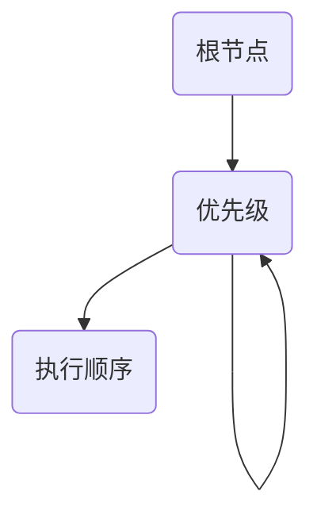

                 


# 智能厨房抽屉：AI Agent的厨具使用优化建议

> 关键词：智能厨房，AI Agent，厨具优化，自动化厨房，智能家居

> 摘要：本文探讨了AI Agent在智能厨房抽屉中的应用，分析了其核心概念、算法原理、系统架构，并通过项目实战展示了其实现过程，最后总结了最佳实践。

---

# 第1章 智能厨房抽屉与AI Agent概述

## 1.1 智能厨房的现状与挑战

### 1.1.1 厨房智能化的背景
- 随着智能家居的普及，厨房设备逐渐智能化。
- 厨具使用效率低下，用户需求未被充分满足。

### 1.1.2 厨具使用中的常见问题
- 厨具存放混乱，使用不便。
- 厨具使用顺序不合理，影响烹饪效率。
- 缺乏智能化的使用建议，用户操作繁琐。

### 1.1.3 AI技术在厨房中的应用潜力
- AI技术可以优化厨具使用流程。
- 提供智能化的使用建议，提升用户体验。

## 1.2 AI Agent的基本概念

### 1.2.1 什么是AI Agent
- AI Agent是一种智能体，能够感知环境并执行任务。
- 具备自主决策、学习和优化能力。

### 1.2.2 AI Agent的核心功能与特点
- **感知环境**：通过传感器获取环境信息。
- **自主决策**：基于感知信息做出决策。
- **执行任务**：通过执行机构完成任务。
- **学习优化**：通过反馈不断优化行为。

### 1.2.3 AI Agent与传统自动化设备的区别
| 特性       | AI Agent                   | 传统自动化设备       |
|------------|----------------------------|----------------------|
| 智能性     | 高                          | 低                  |
| 自主性     | 高                          | 低                  |
| 学习能力   | 高                          | 无                  |
| 适应性     | 高                          | 低                  |

## 1.3 智能厨房抽屉的定义与目标

### 1.3.1 智能厨房抽屉的定义
- 智能厨房抽屉是一种结合AI技术的厨具存储与管理设备。
- 能够通过AI Agent优化厨具的使用流程。

### 1.3.2 智能厨房抽屉的核心目标
- 提高厨具使用的效率与便利性。
- 提供智能化的使用建议，优化用户体验。

### 1.3.3 智能厨房抽屉的使用场景与边界
- **使用场景**：家庭厨房、餐厅厨房。
- **边界**：仅限于厨具的存储与使用优化，不涉及烹饪过程。

---

# 第2章 AI Agent的核心原理

## 2.1 AI Agent的基本原理

### 2.1.1 状态感知与识别
- 通过传感器获取环境状态信息。
- 使用图像识别技术识别厨具位置。

### 2.1.2 任务分析与决策
- 分析当前任务需求。
- 通过算法选择最优执行策略。

### 2.1.3 行为执行与反馈
- 执行决策动作。
- 收集反馈信息，优化未来决策。

## 2.2 AI Agent的算法基础

### 2.2.1 强化学习算法


### 2.2.2 决策树算法


### 2.2.3 贝叶斯网络
- 使用概率推理优化决策过程。

## 2.3 AI Agent的数学模型

### 2.3.1 状态空间模型
$$S = \{s_1, s_2, ..., s_n\}$$

### 2.3.2 动作空间模型
$$A = \{a_1, a_2, ..., a_m\}$$

### 2.3.3 奖励函数模型
$$R(s, a) = \begin{cases}
1 & \text{if } a \text{ 正确} \\
0 & \text{否则}
\end{cases}$$

---

# 第3章 智能厨房抽屉的系统架构

## 3.1 系统整体架构

### 3.1.1 系统组成模块
- **状态感知模块**：负责获取环境信息。
- **任务决策模块**：负责制定任务执行计划。
- **行为执行模块**：负责执行具体动作。

### 3.1.2 模块之间的关系


### 3.1.3 系统的硬件与软件架构
- **硬件**：传感器、执行机构、通信模块。
- **软件**：AI算法、任务管理模块、反馈机制。

## 3.2 系统功能模块设计

### 3.2.1 状态感知模块
- 使用图像识别技术识别厨具位置。
- 通过传感器检测抽屉状态。

### 3.2.2 任务决策模块
- 分析任务需求，制定执行计划。
- 优化动作顺序，提高效率。

### 3.2.3 行为执行模块
- 执行预设动作，调整厨具位置。
- 提供使用建议，优化用户体验。

## 3.3 系统接口设计

### 3.3.1 系统内部接口
- 状态感知模块与任务决策模块之间的通信接口。
- 任务决策模块与行为执行模块之间的控制接口。

### 3.3.2 系统外部接口
- 用户操作界面：提供用户交互功能。
- 外部系统接口：与其他智能家居设备联动。

### 3.3.3 接口通信协议
- 使用JSON格式进行数据交互。
- 采用MQTT协议实现设备间的通信。

---

# 第4章 AI Agent的算法实现

## 4.1 算法实现的核心步骤

### 4.1.1 状态识别与处理
- 使用图像识别技术识别厨具位置。
- 通过特征提取技术优化识别精度。

### 4.1.2 任务决策与优化
- 基于强化学习算法选择最优动作。
- 通过动态规划优化任务执行顺序。

### 4.1.3 行为执行与反馈
- 执行预设动作，调整厨具位置。
- 收集反馈信息，优化未来决策。

## 4.2 算法优化策略

### 4.2.1 参数调整与优化
- 调整强化学习算法的奖励系数。
- 优化决策树的剪枝策略。

### 4.2.2 状态空间压缩技术
- 使用聚类算法压缩状态空间。
- 通过维度降维技术优化状态表示。

### 4.2.3 决策树剪枝优化
- 使用贪心算法进行决策树剪枝。
- 通过交叉验证选择最优剪枝策略。

## 4.3 算法实现的数学模型

### 4.3.1 状态转移概率公式
$$P(s' | s, a) = \frac{N(s, a, s')}{\sum_{s'} N(s, a, s')}$$

### 4.3.2 奖励函数计算公式
$$R(s, a) = \sum_{i=1}^{n} w_i \cdot f_i(s, a)$$

---

# 第5章 智能厨房抽屉的项目实战

## 5.1 环境安装与配置

### 5.1.1 系统环境要求
- 操作系统：Linux/Windows/MacOS。
- 依赖库：OpenCV、TensorFlow、ROS。

### 5.1.2 开发工具安装
- 安装Python开发环境。
- 安装必要的第三方库。

## 5.2 系统核心实现

### 5.2.1 状态感知模块实现
```python
import cv2

def recognize_kitchen_tools(image):
    # 图像预处理
    gray = cv2.cvtColor(image, cv2.COLOR_BGR2GRAY)
    # 使用OpenCV进行图像识别
    # 返回识别结果
    return result
```

### 5.2.2 任务决策模块实现
```python
import numpy as np

def decide_action(state):
    # 状态分析
    # 通过强化学习算法选择动作
    action = np.random.choice([0, 1, 2], p=[0.3, 0.3, 0.4])
    return action
```

### 5.2.3 行为执行模块实现
```python
def execute_action(action):
    # 执行预设动作
    # 返回新的状态
    return new_state
```

## 5.3 案例分析与实际应用

### 5.3.1 案例分析
- **案例1**：优化刀具的使用顺序。
- **案例2**：调整锅具的存放位置。

### 5.3.2 实际应用效果
- 提高厨具使用的效率。
- 提升用户体验，减少操作步骤。

---

# 第6章 最佳实践与总结

## 6.1 最佳实践 tips
- 定期更新AI模型，提升识别精度。
- 保持系统硬件清洁，确保传感器正常工作。

## 6.2 小结
- AI Agent在智能厨房抽屉中的应用前景广阔。
- 通过不断优化算法和系统架构，可以进一步提升用户体验。

## 6.3 注意事项
- 硬件维护：定期检查传感器和执行机构。
- 数据安全：保护用户隐私数据。

## 6.4 拓展阅读
- 推荐阅读《强化学习实战》。
- 关注智能家居领域的最新技术动态。

---

作者：AI天才研究院/AI Genius Institute & 禅与计算机程序设计艺术 /Zen And The Art of Computer Programming

