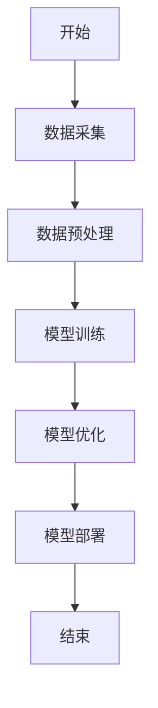
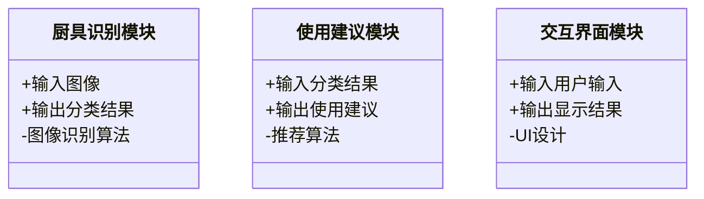
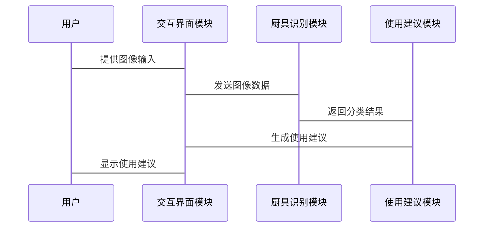

                 


# 智能厨房抽屉：AI Agent的厨具使用建议

> 关键词：AI Agent，智能厨房，厨具管理，推荐系统，图像识别，自然语言处理

> 摘要：本文探讨了AI Agent在厨房中的应用，特别是智能厨房抽屉的设计与实现。通过分析厨具管理的痛点，提出基于AI技术的解决方案，并详细阐述了AI Agent的核心算法、系统架构及实际应用场景。

---

## 第一部分：引言

### 1.1 问题背景与目标
#### 1.1.1 厨房管理的痛点与挑战
- 厨具种类繁多，使用频率不一
- 用户行为差异大，难以统一管理
- 厨房环境复杂，设备协调困难

#### 1.1.2 AI Agent在厨房中的应用潜力
- 智能识别与推荐
- 自动化管理与优化
- 个性化服务

#### 1.1.3 本书的目标与意义
- 提供AI Agent在厨房中的具体应用方案
- 解决厨具管理的效率问题
- 推动智能家居的发展

### 1.2 本书结构与内容概述
- 核心章节内容介绍
- 学习本书的预期收获
- 读者对象与适用场景

---

## 第二部分：AI Agent的基本概念与原理

### 2.1 AI Agent的定义与特点
#### 2.1.1 AI Agent的定义
- 定义与概念
- 核心特点：智能性、自主性、反应性

#### 2.1.2 AI Agent与传统计算机程序的区别
- 行为驱动 vs. 任务驱动
- 数据驱动 vs. 规则驱动
- 自适应 vs. 静态

#### 2.1.3 AI Agent在厨房中的应用场景
- 厨具识别与分类
- 使用建议生成
- 厨房环境优化

### 2.2 AI Agent的工作原理
#### 2.2.1 感知与推理机制
- 数据采集与处理
- 感知模型的构建

#### 2.2.2 决策与执行流程
- 推理与决策算法
- 行为规划与执行

#### 2.2.3 学习与优化算法
- 强化学习与监督学习
- 模型优化与迭代

### 2.3 AI Agent在厨房中的应用场景
#### 2.3.1 厨具管理与使用建议
- 基于图像识别的厨具识别
- 基于自然语言处理的使用建议生成

#### 2.3.2 厨房环境感知与优化
- 厨房环境数据采集
- 环境优化算法

#### 2.3.3 用户行为分析与个性化推荐
- 用户行为数据采集与分析
- 个性化推荐算法

---

## 第三部分：智能厨房抽屉的核心技术

### 3.1 智能厨房抽屉的功能模块
#### 3.1.1 厨具识别与分类
- 图像识别技术
- 分类算法

#### 3.1.2 使用建议生成
- 基于AI的推荐系统
- 个性化建议生成

#### 3.1.3 交互界面设计
- 用户界面设计
- 交互流程优化

### 3.2 AI算法在智能厨房抽屉中的应用
#### 3.2.1 图像识别技术
- 基于深度学习的图像识别
- 厨具分类模型

#### 3.2.2 自然语言处理
- 基于NLP的使用建议生成
- 用户意图识别

#### 3.2.3 推荐算法
- 基于协同过滤的推荐系统
- 基于内容的推荐算法

### 3.3 数据采集与处理
#### 3.3.1 厨具数据的采集方式
- 图像采集与处理
- 数据标注与清洗

#### 3.3.2 数据预处理与特征提取
- 数据清洗与标准化
- 特征提取与选择

#### 3.3.3 数据存储与管理
- 数据库设计
- 数据索引优化

---

## 第四部分：AI Agent的算法原理

### 4.1 算法原理概述
#### 4.1.1 问题建模与目标函数
- 问题建模
- 目标函数设计

#### 4.1.2 算法选择与优化
- 算法选择策略
- 参数优化方法

#### 4.1.3 算法实现步骤
- 数据预处理
- 模型训练
- 模型评估

### 4.2 算法流程图


### 4.3 算法实现代码
```python
import numpy as np
from sklearn.metrics import accuracy_score

# 示例代码：图像分类模型训练
X_train = np.array([...])
y_train = np.array([...])
model = ...  # 加载模型

model.fit(X_train, y_train)
y_pred = model.predict(X_test)
print("准确率:", accuracy_score(y_test, y_pred))
```

---

## 第五部分：系统架构设计

### 5.1 系统功能设计
#### 5.1.1 领域模型设计


#### 5.1.2 系统架构设计


#### 5.1.3 系统交互流程


### 5.2 系统接口设计
#### 5.2.1 接口定义
- 数据输入接口
- 数据输出接口
- 用户交互接口

#### 5.2.2 接口实现
- 数据接口实现
- 接口调用流程
- 接口优化与测试

### 5.3 系统优化与扩展
#### 5.3.1 系统性能优化
- 计算效率优化
- 内存优化

#### 5.3.2 功能扩展
- 新功能模块的添加
- 系统兼容性扩展

---

## 第六部分：项目实战

### 6.1 环境安装与配置
- 安装依赖
- 环境配置

### 6.2 核心实现
#### 6.2.1 数据采集与处理
```python
import cv2

def capture_image():
    cap = cv2.VideoCapture(0)
    ret, frame = cap.read()
    if ret:
        cv2.imwrite("kitchen.jpg", frame)
    cap.release()
```

#### 6.2.2 厨具识别与分类
```python
import tensorflow as tf
from tensorflow.keras import models

model = tf.keras.models.load_model("kitchen_model.h5")
def predict_image():
    img = cv2.imread("kitchen.jpg")
    img = cv2.resize(img, (224, 224))
    img = img / 255.0
    prediction = model.predict(tf.expand_dims(img, axis=0))
    print("预测结果:", prediction)
```

#### 6.2.3 使用建议生成
```python
def generate_recommendation():
    recommendation = "建议先将食材切好再进行烹饪。"
    return recommendation
```

### 6.3 案例分析与解读
- 典型案例分析
- 实际应用效果

---

## 第七部分：应用案例与未来展望

### 7.1 应用案例分析
- 案例1：智能抽屉的实际应用
- 案例2：用户反馈与改进

### 7.2 未来技术发展
- 新技术展望
- 市场前景分析

---

## 第八部分：总结与注意事项

### 8.1 总结
- 本书的核心内容
- 关键点回顾

### 8.2 注意事项
- 使用中的注意事项
- 技术实现中的常见问题

### 8.3 拓展阅读
- 推荐书籍
- 进一步学习资源

---

## 作者：AI天才研究院/AI Genius Institute & 禅与计算机程序设计艺术 /Zen And The Art of Computer Programming

