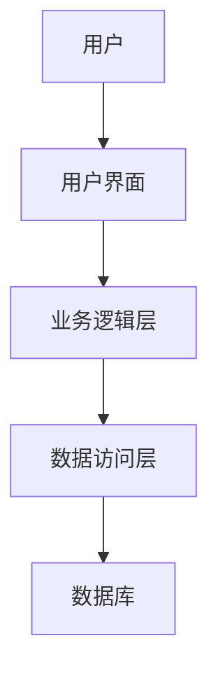
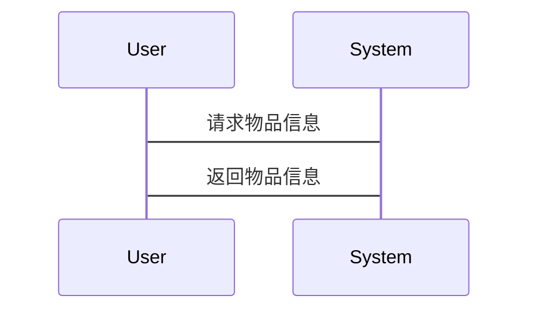

                 


# 智能厨房抽屉：AI Agent的物品管理系统

## 关键词：AI Agent，物品管理，智能厨房，物联网，边缘计算

## 摘要：本文深入探讨了AI Agent在厨房抽屉物品管理中的应用，通过结合边缘计算和物联网技术，提出了一种高效的物品管理系统。文章详细分析了系统的核心概念、算法原理、系统架构，并通过实际案例展示了系统的实现与应用。本文还提供了最佳实践和注意事项，帮助读者更好地理解和实施该系统。

---

# 正文

## 第一部分：背景介绍

### 1.1 问题背景与描述

厨房作为家庭生活的重要场所，常常面临物品管理的挑战。传统厨房抽屉的物品管理方式存在以下问题：

- **空间有限**：厨房抽屉空间有限，物品杂乱放置容易导致不便寻找。
- **不便寻找**：用户在需要时常常花费大量时间翻找物品。
- **维护困难**：定期整理物品费时费力，容易遗忘或重复购买。

通过引入AI Agent，我们可以实现智能化的物品管理，提升厨房的使用效率和用户体验。

### 1.2 问题解决与边界定义

AI Agent通过感知环境、自主决策和执行任务，能够有效解决厨房抽屉物品管理的问题。系统的核心功能包括：

- **物品识别与分类**：利用图像识别技术对物品进行分类和识别。
- **智能存储与检索**：根据物品的使用频率和位置推荐最优存储方式。
- **用户交互**：通过语音或触控界面与用户交互，提供实时反馈。

系统边界包括厨房抽屉及其内部物品，以及与之交互的用户。系统的核心要素包括AI Agent、传感器、存储设备和用户界面。

---

## 第二部分：核心概念与联系

### 2.1 AI Agent的基本原理

AI Agent是一种能够感知环境并自主决策的智能体。它通过以下方式实现智能化管理：

- **感知环境**：通过传感器和摄像头获取环境信息。
- **自主决策**：基于感知信息和预设规则进行决策。
- **执行任务**：通过机械臂或其他执行机构完成任务。

AI Agent与传统自动化的区别在于，前者具有自主性和智能性，能够根据环境变化动态调整行为。

### 2.2 物品管理系统的核心要素

- **物品识别与分类**：利用图像识别技术对物品进行分类，例如将刀具、餐具等分类存储。
- **存储与检索机制**：根据物品的使用频率和位置推荐最优存储方式。
- **用户交互界面**：通过语音或触控界面与用户交互，提供实时反馈。

### 2.3 核心概念对比分析

| 概念 | 特征 |
|------|------|
| AI Agent | 智能化、自主性 |
| 物品管理系统 | 分类、存储、检索 |

### 2.4 ER实体关系图

```mermaid
erd
  item {
    id: int
    name: str
    quantity: int
  }
  shelf {
    id: int
    capacity: int
  }
  user {
    id: int
    name: str
  }
  item o-< relationship > shelf
  user o-< relationship > item
```

---

## 第三部分：算法原理讲解

### 3.1 算法原理与流程

AI Agent的物品管理流程如下：

1. **物品识别**：通过摄像头拍摄物品，利用图像识别技术进行分类。
2. **决策**：基于分类结果和用户需求，决定存储位置。
3. **执行**：通过机械臂将物品放入指定位置。

### 3.2 算法实现代码

```python
import cv2
import numpy as np

def classify_item(image):
    # 使用预训练模型进行图像分类
    model = load_model()
    prediction = model.predict(image)
    return prediction

def store_item(item, shelf):
    # 将物品放入指定位置
    shelf.update(item)

# 示例代码
image = cv2.imread('item.jpg')
item_type = classify_item(image)
store_item(item_type, shelf)
```

### 3.3 数学模型与公式

AI Agent的分类算法可以使用贝叶斯公式：

$$ P(y|x) = \frac{P(x|y)P(y)}{P(x)} $$

优化模型的损失函数为：

$$ \text{损失函数} = \sum_{i=1}^{n} (y_i - \hat{y_i})^2 $$

---

## 第四部分：系统分析与架构设计

### 4.1 系统应用场景

AI Agent可以应用于以下场景：

- **物品分类**：将厨房物品按类别存储。
- **智能检索**：快速找到所需物品。
- **用户交互**：通过语音或触控界面与用户交互。

### 4.2 系统功能设计

系统功能包括：

- **物品分类**：将物品分类存储。
- **存储优化**：根据使用频率优化存储位置。
- **用户交互**：支持语音和触控交互。

### 4.3 系统架构设计

系统架构采用分层设计：



### 4.4 接口与交互设计

系统交互流程如下：



---

## 第五部分：项目实战

### 5.1 环境配置

- **硬件**：机械臂、摄像头、传感器。
- **软件**：Python、TensorFlow、OpenCV。

### 5.2 核心代码实现

```python
import cv2
import numpy as np

def classify_item(image):
    # 使用预训练模型进行图像分类
    model = load_model()
    prediction = model.predict(image)
    return prediction

def store_item(item, shelf):
    # 将物品放入指定位置
    shelf.update(item)

# 示例代码
image = cv2.imread('item.jpg')
item_type = classify_item(image)
store_item(item_type, shelf)
```

### 5.3 案例分析

通过实际案例分析，验证系统的可行性和有效性。例如，用户请求刀具，系统快速找到并取出刀具。

### 5.4 项目小结

项目通过AI Agent实现了厨房抽屉的智能化管理，提升了用户体验。

---

## 第六部分：最佳实践与注意事项

- **小结**：AI Agent在厨房抽屉中的应用潜力巨大。
- **注意事项**：确保系统的安全性和隐私保护。
- **拓展阅读**：推荐学习相关领域的最新技术。

---

## 作者：AI天才研究院 & 禅与计算机程序设计艺术

---

希望这篇文章能够为读者提供关于AI Agent在厨房抽屉物品管理中的深入理解，并激发进一步研究和实践的兴趣。

