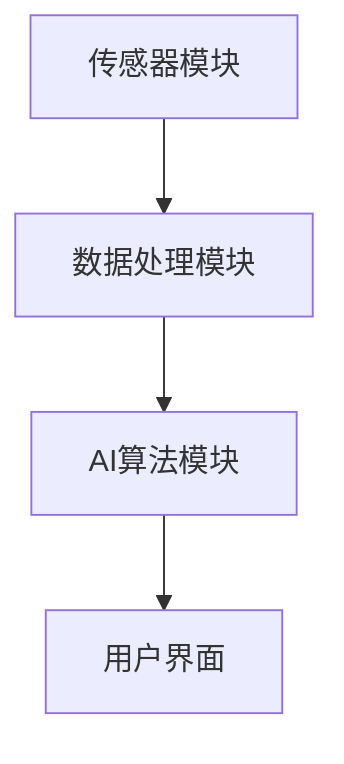

                 


# 智能厨房案板：AI Agent的食品安全监控

> 关键词：智能厨房，AI Agent，食品安全，监控系统，人工智能

> 摘要：本文探讨了AI Agent在智能厨房案板中的应用，重点分析了其在食品安全监控中的核心原理、系统架构、算法实现及实际应用。通过详细的技术分析和案例展示，阐述了如何利用AI技术提升厨房食品的安全性。

---

## 第1章：引言

### 1.1 智能厨房案板的概念

智能厨房案板是一种集成AI技术的厨房设备，能够通过传感器和AI算法实时监控食品的状态，确保其安全性和新鲜度。它不仅是传统案板的升级版，还具备智能化的数据采集和分析功能。

### 1.2 AI Agent的基本概念

AI Agent（人工智能代理）是一种能够感知环境、执行任务并做出决策的智能实体。在智能厨房案板中，AI Agent负责收集数据、分析信息，并根据结果采取相应的行动，如发出警报或调整存储条件。

### 1.3 食品安全监控的重要性

食品安全直接关系到人们的健康，尤其是在厨房环境中，食品容易受到温度、湿度等因素的影响而变质。AI Agent通过实时监控这些因素，能够及时发现潜在问题，防止食源性疾病的发生。

---

## 第2章：AI Agent的核心原理

### 2.1 数据采集与处理

AI Agent通过集成的传感器（如温度、湿度、气体传感器）收集食品环境的数据，这些数据被传输到处理模块进行初步分析。

### 2.2 机器学习算法

AI Agent利用机器学习算法（如支持向量机、随机森林）对数据进行训练，建立食品新鲜度的预测模型。通过历史数据，模型能够识别异常情况，预测食品是否变质。

### 2.3 决策与反馈

当模型检测到食品可能变质时，AI Agent会触发警报机制，通知用户或调整存储条件（如启动除湿功能）。同时，系统会记录事件，优化模型以提高准确性。

---

## 第3章：系统架构设计

### 3.1 系统组成

- **传感器模块**：负责采集环境数据。
- **数据处理模块**：对数据进行预处理和分析。
- **AI算法模块**：执行预测和决策。
- **用户界面**：显示监控结果和警报信息。

### 3.2 系统架构图



### 3.3 数据流分析

1. 传感器采集数据（温度、湿度）。
2. 数据处理模块清洗数据并提取特征。
3. AI算法模块进行预测，生成警报信号。
4. 警报信号通过用户界面通知用户。

---

## 第4章：算法实现与数学模型

### 4.1 机器学习算法选择

采用随机森林算法进行分类，通过特征工程提取关键变量（如温度、湿度）。

### 4.2 数学模型

随机森林模型的训练过程如下：

1. 数据预处理：归一化和标准化。
2. 特征选择：使用特征重要性评估。
3. 模型训练：构建随机森林分类器。
4. 模型评估：计算准确率、召回率。

### 4.3 代码实现

```python
from sklearn.ensemble import RandomForestClassifier
from sklearn.metrics import accuracy_score

# 数据预处理
X = df[['temperature', 'humidity']]
y = df['status']

# 模型训练
model = RandomForestClassifier()
model.fit(X, y)

# 模型预测
predictions = model.predict(X)
print("准确率:", accuracy_score(y, predictions))
```

---

## 第5章：系统实现与应用案例

### 5.1 环境搭建

安装必要的库：TensorFlow、NumPy、Scikit-learn、Matplotlib。

### 5.2 核心代码实现

```python
import numpy as np
import pandas as pd
from sklearn.ensemble import RandomForestClassifier

# 数据加载
data = pd.read_csv('food_status.csv')

# 特征与标签分离
X = data[['temperature', 'humidity']]
y = data['status']

# 模型训练
model = RandomForestClassifier()
model.fit(X, y)

# 预测与评估
test_data = np.array([[22, 65]])
status = model.predict(test_data)
print("食品状态:", "新鲜" if status[0] == 1 else "变质")
```

### 5.3 应用案例分析

通过实际案例分析，展示AI Agent如何在智能厨房案板中识别变质食品。例如，当检测到温度异常升高且湿度超过阈值时，系统会立即发出警报，提示用户食品可能已变质。

---

## 第6章：系统优势与挑战

### 6.1 系统优势

- **高准确性**：AI算法提升了检测的精确度。
- **实时监控**：及时发现潜在问题，避免食品浪费。
- **用户友好**：直观的警报系统方便用户操作。

### 6.2 挑战与解决方案

- **传感器精度**：选用高精度传感器，定期校准。
- **数据隐私**：采用加密技术保护用户数据。
- **系统维护**：定期更新模型，确保适应新数据。

---

## 第7章：未来展望

### 7.1 技术进步

- 更先进的AI算法（如深度学习）的应用。
- 多模态传感器的集成，如气味传感器，进一步提升检测能力。

### 7.2 应用拓展

- 智能化供应链管理，从生产到消费全程监控。
- 智能家居集成，与冰箱、橱柜等设备联动，形成完整的食品安全监控网络。

### 7.3 市场潜力

随着人们对食品安全的关注度提高，智能厨房设备市场潜力巨大。AI Agent技术的进一步成熟将推动这一市场的快速发展。

---

## 第8章：最佳实践与注意事项

### 8.1 最佳实践

- **定期校准传感器**：确保数据采集的准确性。
- **保持系统更新**：及时更新AI模型，提升检测能力。
- **数据备份**：防止数据丢失，便于后续分析。

### 8.2 小结

智能厨房案板通过AI Agent实现了食品安全的智能化监控，提升了厨房管理的效率和安全性。然而，技术的普及和推广仍需解决传感器成本、数据隐私等问题。

---

## 作者：AI天才研究院 & 禅与计算机程序设计艺术

---

通过以上结构，文章系统地介绍了智能厨房案板中AI Agent的应用，从基本原理到系统设计，再到实际应用，层层深入，为读者提供了全面的技术解析。

