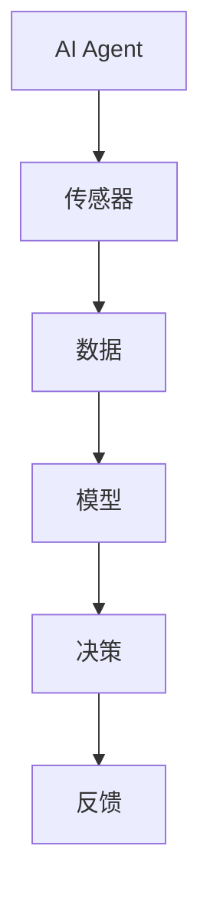
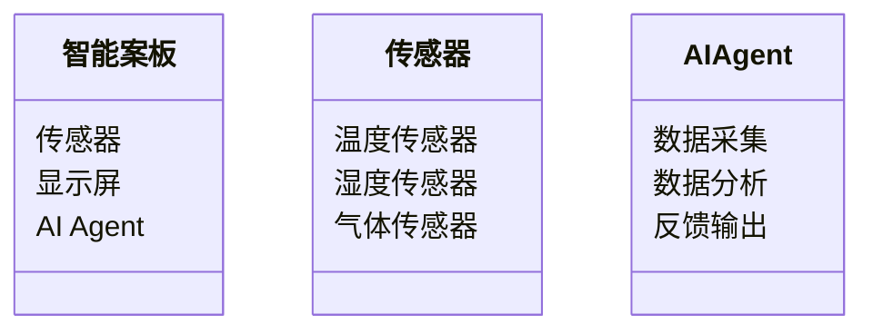
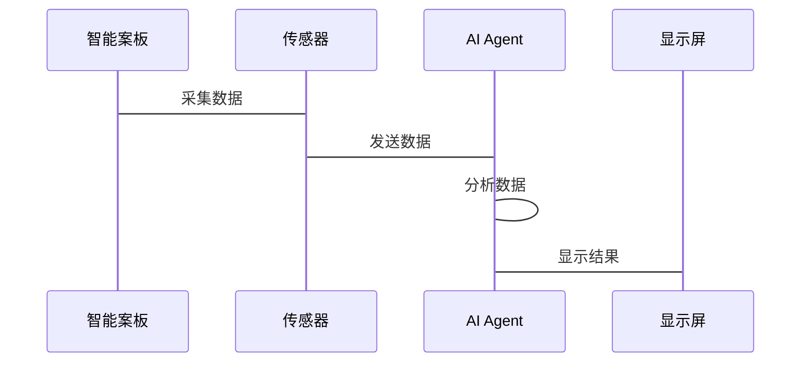

                 


# 智能厨房案板：AI Agent的食品安全监测

> **关键词**：智能厨房案板、AI Agent、食品安全、机器学习、物联网、实时监测  
> **摘要**：本文介绍了一种基于AI Agent的智能厨房案板系统，通过机器学习和物联网技术，实时监测食品安全。文章详细讲解了系统的背景、核心概念、算法原理、系统架构设计、项目实战及最佳实践，为读者提供全面的技术分析和实现方案。

---

## 第一章：智能厨房案板与AI Agent的背景介绍

### 1.1 问题背景与问题描述

#### 1.1.1 厨房食品安全问题的现状
现代生活中，食品安全问题日益受到关注。厨房是食品处理的核心区域，食材的保存状态直接影响健康。然而，传统厨房案板缺乏智能化监测手段，无法实时检测食材的新鲜度和安全性。例如，食材变质可能导致细菌滋生，引发食物中毒等问题。

#### 1.1.2 智能化监测的需求与痛点
随着物联网和人工智能技术的发展，人们对厨房设备的智能化需求日益增加。传统案板无法提供实时监测数据，用户无法及时了解食材状态。此外，手动检查食材新鲜度耗时耗力，且容易出错。

#### 1.1.3 AI Agent在食品安全监测中的作用
AI Agent（智能体）是一种能够感知环境、做出决策并执行任务的智能系统。在厨房场景中，AI Agent可以实时监测食材状态，分析数据并给出建议，帮助用户确保食品安全。

### 1.2 智能厨房案板的定义与特点

#### 1.2.1 智能厨房案板的功能概述
智能厨房案板是一种集成传感器和AI技术的厨房设备，能够实时监测食材的温度、湿度、气味等参数，通过AI算法判断食材的新鲜度和安全性。

#### 1.2.2 AI Agent的核心特征
- **实时感知**：通过传感器采集食材状态数据。
- **智能分析**：利用机器学习算法判断食材是否变质。
- **主动反馈**：通过显示屏或手机APP通知用户监测结果。

#### 1.2.3 智能厨房案板与传统案板的区别
| 特性         | 传统案板       | 智能厨房案板 |
|--------------|----------------|---------------|
| 功能         | 纯粹作为切割工具 | 集成传感器和AI算法 |
| 监测能力     | 无             | 实时监测食材状态 |
| 用户反馈     | 无             | 主动通知用户 |

### 1.3 问题解决与边界外延

#### 1.3.1 食品安全监测的主要问题
- 食材变质无法及时发现。
- 手工检查耗时且不准确。
- 厨房环境复杂，监测手段单一。

#### 1.3.2 AI Agent的解决方案
AI Agent通过实时监测食材状态，结合机器学习算法，快速判断食材是否新鲜，并通过反馈机制通知用户。

#### 1.3.3 系统的边界与适用范围
- **边界**：仅监测案板上的食材，不涉及其他厨房设备。
- **适用范围**：适用于家庭厨房和个人用户，不支持大规模工业应用。

#### 1.3.4 核心要素与组成结构
- **传感器**：温度、湿度、气体传感器。
- **AI算法**：机器学习模型用于食材状态判断。
- **用户界面**：显示屏或手机APP。

---

## 第二章：AI Agent的核心概念与联系

### 2.1 AI Agent的原理与机制

#### 2.1.1 感知层：数据采集与特征提取
AI Agent通过传感器采集食材的温度、湿度、气味等特征，将其转化为数字信号。

#### 2.1.2 决策层：模型推理与判断
AI Agent利用机器学习模型分析数据，判断食材是否新鲜。例如，使用随机森林算法分类食材状态。

#### 2.1.3 执行层：反馈与优化
AI Agent根据决策结果，通过显示屏或手机APP通知用户，并记录数据优化模型。

### 2.2 核心概念对比与联系

#### 2.2.1 概念属性特征对比表
| 概念       | 属性         | 特征 |
|------------|--------------|------|
| AI Agent   | 感知能力     | 高   |
| 传感器     | 数据采集     | 高   |

#### 2.2.2 实体关系图（Mermaid流程图）


---

## 第三章：AI Agent的算法原理

### 3.1 算法原理概述

AI Agent的核心算法包括数据预处理、特征提取、模型训练和预测。

### 3.2 数据预处理与特征提取

#### 3.2.1 数据预处理
- 数据清洗：去除异常值。
- 数据归一化：统一特征范围。

#### 3.2.2 特征提取
提取温度、湿度、气味等特征，构建特征向量。

### 3.3 机器学习模型

#### 3.3.1 模型选择
使用随机森林算法进行分类。

#### 3.3.2 模型训练
使用训练数据训练模型，优化参数。

#### 3.3.3 模型预测
输入实时数据，预测食材状态。

### 3.4 数学模型与公式

#### 3.4.1 随机森林模型
随机森林是一种集成学习方法，通过多个决策树进行投票分类。

#### 3.4.2 食材状态分类公式
$$ P(\text{新鲜}) = \sum_{i=1}^{n} w_i \cdot I(\text{特征}_i) $$

---

## 第四章：系统分析与架构设计

### 4.1 系统应用场景

智能厨房案板适用于家庭厨房，监测食材状态，提醒用户及时处理。

### 4.2 系统功能设计

#### 4.2.1 领域模型（Mermaid类图）


### 4.3 系统架构设计

#### 4.3.1 系统架构图（Mermaid架构图）


### 4.4 系统接口与交互

#### 4.4.1 系统接口设计
- 传感器接口：与智能案板连接，采集数据。
- 用户界面：显示食材状态，接收用户反馈。

#### 4.4.2 系统交互流程图（Mermaid序列图）


---

## 第五章：项目实战

### 5.1 环境搭建与工具安装

#### 5.1.1 环境要求
- Python 3.8+
- 传感器模块
- 开发板（如Raspberry Pi）

#### 5.1.2 工具安装
安装必要的库，如：
```bash
pip install numpy scikit-learn matplotlib
```

### 5.2 系统核心实现

#### 5.2.1 数据采集模块
```python
import numpy as np

def采集数据():
    温度 = 读取温度传感器()
    湿度 = 读取湿度传感器()
    气味 = 读取气味传感器()
    return [温度, 湿度, 气味]
```

#### 5.2.2 数据分析模块
```python
from sklearn.ensemble import RandomForestClassifier

def 分析数据(特征向量):
    模型 = RandomForestClassifier()
    模型.fit(训练数据, 标签)
    预测结果 = 模型.predict(特征向量)
    return 预测结果
```

### 5.3 实际案例分析

#### 5.3.1 案例分析
假设采集到的温度为5℃，湿度为60%，气味值为0.3。模型预测食材为新鲜。

#### 5.3.2 代码实现解读
代码实现数据采集、特征提取和模型预测，最终输出结果。

### 5.4 项目小结

---

## 第六章：最佳实践、小结与注意事项

### 6.1 最佳实践

- 数据隐私保护：确保用户数据安全。
- 系统维护：定期更新传感器和模型。

### 6.2 小结

本文详细介绍了AI Agent在智能厨房案板中的应用，从背景、算法到项目实现，为读者提供全面的技术分析。

### 6.3 注意事项

- 硬件维护：定期检查传感器。
- 软件优化：持续优化模型。

### 6.4 拓展阅读

推荐阅读《机器学习实战》和《物联网技术入门与应用》。

---

## 附录

### 附录A：完整的Python代码示例

```python
import numpy as np
from sklearn.ensemble import RandomForestClassifier

def 采集数据():
    温度 = 读取温度传感器()
    湿度 = 读取湿度传感器()
    气味 = 读取气味传感器()
    return [温度, 湿度, 气味]

def 分析数据(特征向量):
    模型 = RandomForestClassifier()
    模型.fit(训练数据, 标签)
    预测结果 = 模型.predict(特征向量)
    return 预测结果

if __name__ == "__main__":
    数据 = 采集数据()
    结果 = 分析数据(数据)
    打印结果(结果)
```

### 附录B：数据集说明

- 训练数据：食材状态的特征向量。
- 标签：食材的新鲜度（新鲜/变质）。

### 附录C：工具安装指南

安装必要的Python库：
```bash
pip install numpy scikit-learn
```

---

## 作者

**作者：AI天才研究院/AI Genius Institute & 禅与计算机程序设计艺术 /Zen And The Art of Computer Programming**

---

通过以上结构和内容，您可以撰写一篇详细且专业的技术博客文章。希望对您有所帮助！

