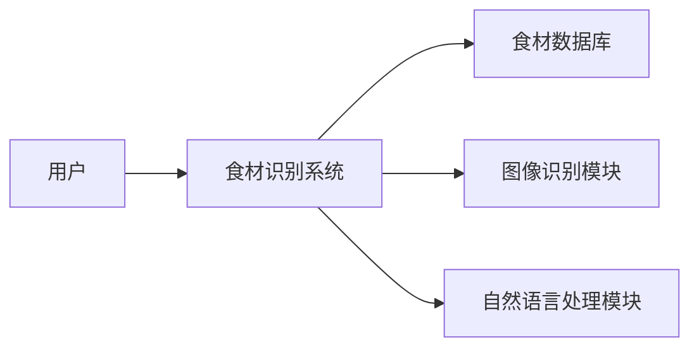
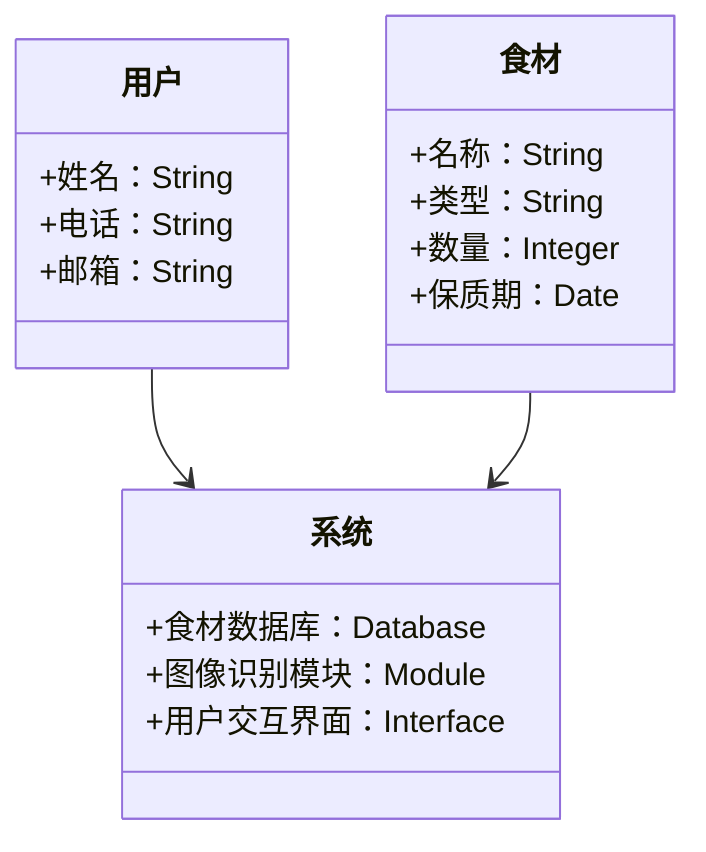
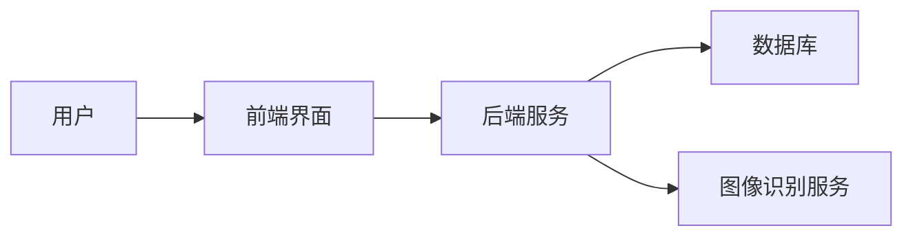

                 


# 智能厨房案板：AI Agent的食材识别系统

> 关键词：人工智能、食材识别、AI Agent、计算机视觉、机器学习

> 摘要：本文深入探讨了智能厨房案板中AI Agent的食材识别系统，从背景、概念、算法原理到系统设计和项目实战，全面解析该系统的核心技术和实现方法。通过详细分析，本文旨在为读者提供一个全面的技术指南，帮助他们理解并实现类似系统。

---

## 第一部分: 背景与概念

### 第1章: 智能厨房案板的背景介绍

#### 1.1 问题背景与问题描述

厨房是家庭生活的重要场所，但传统厨房管理存在诸多痛点。例如，食材分类混乱、存储不规范、使用效率低等。这些问题不仅影响烹饪效率，还可能导致食材浪费。随着人工智能技术的快速发展，利用AI技术解决这些问题成为可能。

**问题解决**：AI Agent（智能代理）通过图像识别、自然语言处理等技术，能够自动识别食材种类、数量和状态，从而优化厨房管理。AI Agent可以辅助用户完成食材分类、库存管理和食材推荐等功能。

**边界与外延**：本系统专注于食材识别和管理，不涉及烹饪过程的优化或其他厨房设备的控制。未来可以在此基础上扩展更多功能。

#### 1.2 系统的核心功能与模块

系统的核心功能包括：
1. **食材识别**：通过图像识别技术，自动识别食材种类。
2. **库存管理**：记录食材的使用情况和剩余量。
3. **食材推荐**：基于识别结果，推荐合适的食谱。

系统模块包括：
1. 图像采集模块
2. 图像识别模块
3. 数据存储模块
4. 用户交互模块

### 第2章: 核心概念与系统架构

#### 2.1 AI Agent的基本原理

AI Agent是一种能够感知环境、自主决策并执行任务的智能系统。它通过传感器获取信息，利用算法进行分析，并根据结果采取行动。

**核心特征**：
- **自主性**：能够自主决策
- **反应性**：能够实时响应环境变化
- **社会性**：能够与其他系统或用户交互

#### 2.2 系统的概念模型

系统的核心要素包括：
1. 用户：通过摄像头或手动输入提供食材信息。
2. 图像识别模块：负责食材的识别和分类。
3. 数据存储模块：记录食材信息和识别结果。

**实体关系**：


---

## 第二部分: 算法原理与实现

### 第3章: 图像识别算法原理

#### 3.1 基于深度学习的目标检测

**目标检测算法**：
- YOLO（You Only Look Once）：实时目标检测算法，适合实时场景。
- Faster R-CNN：适合高精度检测。

**YOLO算法流程**：
1. **图像输入**：输入待检测的图像。
2. **特征提取**：通过卷积神经网络提取图像特征。
3. **边界框回归**：预测目标的边界框。
4. **分类**：对目标进行分类。

**YOLO的优缺点**：
- **优点**：速度快，适合实时应用。
- **缺点**：检测精度较低。

#### 3.2 基于深度学习的图像分割

**图像分割算法**：
- U-Net：广泛应用于医学图像分割。
- Mask R-CNN：结合目标检测和实例分割。

**U-Net算法流程**：
1. **图像输入**：输入待分割的图像。
2. **下采样**：通过多次下采样提取深层特征。
3. **上采样**：通过上采样恢复图像分辨率。
4. **分割结果**：输出分割后的图像。

**数学模型**：
$$
\text{损失函数} = \alpha \times \text{交叉熵损失} + \beta \times \text{边缘损失}
$$
其中，$\alpha$ 和 $\beta$ 是超参数。

---

## 第三部分: 系统分析与架构设计

### 第4章: 系统分析与架构设计

#### 4.1 系统功能设计

**领域模型**：


#### 4.2 系统架构设计

**系统架构**：


**接口设计**：
1. 用户通过前端界面提交食材图像。
2. 系统调用图像识别服务进行识别。
3. 识别结果存储到数据库，并返回给用户。

---

## 第四部分: 项目实战

### 第5章: 项目实战

#### 5.1 环境安装与配置

**Python环境**：
- 安装Python 3.8+
- 安装TensorFlow、Keras、OpenCV等库。

**代码实现**：
```python
import cv2
import tensorflow as tf
import numpy as np

# 加载预训练模型
model = tf.keras.models.load_model("model.h5")

# 图像预处理
def preprocess_image(image_path):
    image = cv2.imread(image_path)
    image = cv2.resize(image, (224, 224))
    image = image / 255.0
    return image

# 图像识别
def recognize_food(image_path):
    image = preprocess_image(image_path)
    prediction = model.predict(np.array([image]))
    return prediction[0]

# 使用示例
recognize_food("apple.jpg")
```

#### 5.2 代码实现与解读

**代码解读**：
- `preprocess_image`：图像预处理函数，将图像 resize 并归一化。
- `recognize_food`：图像识别函数，加载预训练模型并进行预测。

---

## 第五部分: 总结与展望

### 第6章: 总结与展望

**总结**：
本文详细介绍了智能厨房案板中AI Agent的食材识别系统，从背景、概念到算法实现和系统设计，为读者提供了全面的技术指南。

**展望**：
未来的研究可以进一步优化算法性能，扩展系统功能，例如加入自然语言处理模块，实现更智能的食材推荐。

---

作者：AI天才研究院/AI Genius Institute & 禅与计算机程序设计艺术 /Zen And The Art of Computer Programming

