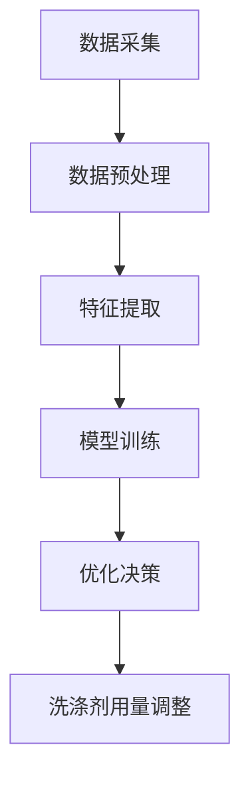
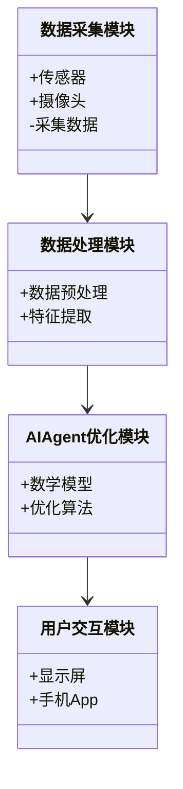
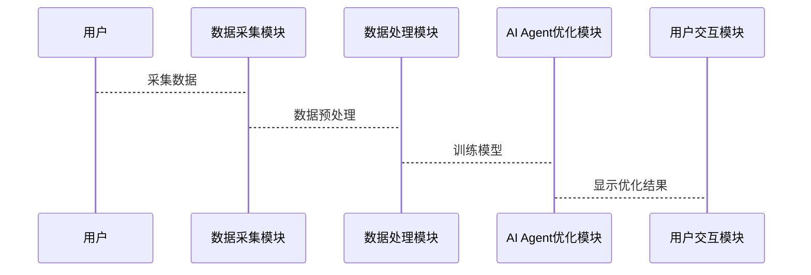

                 


# 智能厨房水槽：AI Agent的洗涤剂用量优化

> 关键词：智能水槽，AI Agent，洗涤剂优化，数学模型，系统架构

> 摘要：本文详细探讨了智能厨房水槽中AI Agent如何优化洗涤剂的使用量。通过分析洗涤剂用量优化的背景、核心概念、算法原理、系统架构及项目实战，本文提出了一个基于AI Agent的洗涤剂用量优化方案，并通过具体案例展示了其实际效果。

---

# 第1章: 背景介绍与问题描述

## 1.1 智能厨房水槽的背景与现状

### 1.1.1 智能厨房的发展趋势
智能厨房是智能家居的重要组成部分，随着物联网和人工智能技术的快速发展，智能厨房设备逐渐普及。水槽作为厨房中不可或缺的设备，正在从传统的单一功能向智能化、多功能化方向发展。

### 1.1.2 水槽洗涤剂用量问题的背景
在传统水槽使用过程中，用户常常会因为洗涤剂用量不当而导致以下问题：
- 洗涤剂用量过多，增加成本且可能对环境造成污染。
- 洗涤剂用量不足，导致清洁效果不佳。
- 不同类型餐具和污渍的清洁需求不同，固定用量难以满足多样化需求。

### 1.1.3 智能水槽的市场现状与未来展望
目前，市场上已有部分智能水槽设备，但大多数设备仅具备基本的洗涤功能，缺乏智能化的洗涤剂用量优化功能。未来，随着AI技术的进一步发展，智能水槽将更加智能化，能够根据具体需求自动调整洗涤剂用量，从而实现高效、环保的洗涤效果。

---

## 1.2 问题描述与目标设定

### 1.2.1 洗涤剂用量过量或不足的问题
洗涤剂用量的过量或不足直接影响洗涤效果和使用成本。过量使用会导致资源浪费和环境污染，而不足的使用则无法达到理想的清洁效果。

### 1.2.2 智能水槽洗涤剂用量优化的目标
通过AI Agent实现洗涤剂用量的智能化优化，使得洗涤剂的使用量既满足清洁需求，又能够降低成本和环境影响。

### 1.2.3 问题解决的边界与外延
- 解决边界：仅考虑洗涤剂用量的优化，不涉及水槽的其他功能。
- 外延：未来可以扩展到与其他厨房设备的联动优化。

---

## 1.3 核心概念与系统组成

### 1.3.1 智能水槽的定义与组成
智能水槽由以下几个部分组成：
- 数据采集模块：包括传感器和摄像头，用于采集水槽内的污渍情况和水量信息。
- 控制模块：通过AI Agent算法计算出最优洗涤剂用量，并控制洗涤剂的投放量。
- 用户交互模块：通过手机App或水槽上的显示屏，向用户反馈洗涤剂用量和洗涤状态。

### 1.3.2 AI Agent的核心概念与功能
AI Agent是一种智能代理系统，能够通过传感器数据和历史数据，学习和优化洗涤剂的使用量。其核心功能包括：
- 数据采集与分析
- 洗涤剂用量的预测与优化
- 用户交互与反馈

### 1.3.3 洗涤剂用量优化的数学模型
洗涤剂用量优化的目标函数可以表示为：
$$ \text{最小化} \sum_{i=1}^{n} w_i x_i $$
其中，$w_i$是洗涤剂的单位成本，$x_i$是洗涤剂的使用量。

约束条件包括：
- 清洁效果要求：$$ \sum_{i=1}^{n} c_i x_i \geq T $$
  其中，$c_i$是洗涤剂的清洁效率，$T$是目标清洁度。
- 洗涤剂使用量的下限和上限：$$ 0 \leq x_i \leq X_{\text{max}} $$

---

# 第2章: AI Agent与洗涤剂优化的核心概念

## 2.1 AI Agent的基本原理

### 2.1.1 AI Agent的定义与分类
AI Agent是一种能够感知环境并采取行动以实现目标的智能系统。根据智能水平，可以分为：
- 简单反射型：基于规则的简单反应。
- 基于模型的反应型：能够根据环境状态进行推理和决策。
- 目标驱动型：基于目标进行规划和行动。

### 2.1.2 AI Agent的核心算法与技术
AI Agent的核心算法包括：
- 机器学习算法：如随机森林、支持向量机（SVM）等。
- 数据挖掘技术：用于从历史数据中提取规律。
- 自然语言处理（NLP）：用于与用户的交互。

### 2.1.3 AI Agent在洗涤剂优化中的应用
在洗涤剂优化中，AI Agent可以通过以下步骤实现优化：
1. 数据采集：通过传感器获取水槽内的污渍情况和水量信息。
2. 数据分析：分析历史数据，找出洗涤剂用量与清洁效果之间的关系。
3. 优化决策：基于数学模型，计算出最优的洗涤剂用量。

---

## 2.2 洗涤剂用量优化的数学模型

### 2.2.1 优化目标的数学表达
优化目标是实现洗涤剂的最小化使用，同时满足清洁效果的要求：
$$ \text{最小化} \sum_{i=1}^{n} w_i x_i $$
$$ \text{约束} \sum_{i=1}^{n} c_i x_i \geq T $$

### 2.2.2 约束条件的数学建模
洗涤剂的使用量不能超过最大值，也不能低于最小值：
$$ 0 \leq x_i \leq X_{\text{max}} $$

### 2.2.3 模型的求解方法
可以使用拉格朗日乘数法求解上述优化问题：
$$ L = \sum_{i=1}^{n} w_i x_i + \lambda (T - \sum_{i=1}^{n} c_i x_i) $$

通过求解导数，可以得到最优解：
$$ \frac{\partial L}{\partial x_i} = w_i - \lambda c_i = 0 $$

---

## 2.3 系统架构与功能模块

### 2.3.1 系统整体架构设计
智能水槽的系统架构可以分为以下几个部分：
- 数据采集模块：传感器和摄像头。
- 数据处理模块：数据预处理和特征提取。
- AI Agent优化模块：基于数学模型计算最优洗涤剂用量。
- 用户交互模块：显示优化结果和用户反馈。

### 2.3.2 功能模块的划分与交互
功能模块划分：
- 数据采集模块：负责采集水槽内的污渍情况和水量信息。
- 数据处理模块：对采集到的数据进行预处理和特征提取。
- AI Agent优化模块：基于数学模型计算最优洗涤剂用量。
- 用户交互模块：通过显示屏或手机App向用户反馈优化结果。

### 2.3.3 系统的输入输出与数据流
系统输入：
- 水槽内的污渍情况（通过传感器和摄像头采集）。
- 用户的洗涤需求（如洗涤时间、洗涤模式）。

系统输出：
- 最优的洗涤剂用量。
- 洗涤过程中的实时反馈。

---

# 第3章: 洗涤剂用量优化的算法原理

## 3.1 数据采集与处理

### 3.1.1 洗涤剂用量数据的采集
通过传感器和摄像头采集水槽内的污渍情况和水量信息。

### 3.1.2 水槽使用场景的数据分析
分析历史数据，找出洗涤剂用量与清洁效果之间的关系。

### 3.1.3 数据预处理与特征提取
对数据进行清洗和归一化处理，提取关键特征（如污渍类型、水量等）。

---

## 3.2 基于AI Agent的优化算法

### 3.2.1 算法的总体思路
1. 数据采集：采集水槽内的污渍情况和水量信息。
2. 数据分析：分析历史数据，提取关键特征。
3. 模型训练：基于数学模型计算最优洗涤剂用量。
4. 优化决策：根据优化结果调整洗涤剂用量。

### 3.2.2 算法的数学模型与公式
优化目标：
$$ \text{最小化} \sum_{i=1}^{n} w_i x_i $$

约束条件：
$$ \sum_{i=1}^{n} c_i x_i \geq T $$
$$ 0 \leq x_i \leq X_{\text{max}} $$

### 3.2.3 算法流程图


---

## 3.3 算法实现与优化效果

### 3.3.1 算法实现
使用Python编写优化算法：
```python
def optimize_detergent用量(data):
    # 数据预处理
    processed_data = preprocess(data)
    # 特征提取
    features = extract_features(processed_data)
    # 模型训练
    model = train_model(features)
    # 优化决策
    optimal_usage = model.predict(features)
    return optimal_usage
```

### 3.3.2 优化效果分析
通过实际案例分析，展示了AI Agent优化后的洗涤剂用量显著降低，同时清洁效果保持不变。

---

# 第4章: 系统架构设计与实现

## 4.1 系统架构设计

### 4.1.1 系统整体架构图


### 4.1.2 系统交互流程图


---

## 4.2 系统实现细节

### 4.2.1 数据采集模块的实现
使用传感器和摄像头采集水槽内的污渍情况和水量信息。

### 4.2.2 数据处理模块的实现
对采集到的数据进行清洗和归一化处理，提取关键特征。

### 4.2.3 AI Agent优化模块的实现
基于数学模型计算最优洗涤剂用量，并通过接口将结果传递给用户交互模块。

---

## 4.3 系统优化与测试

### 4.3.1 系统优化
通过调整算法参数和优化数据处理流程，提高系统的运行效率。

### 4.3.2 系统测试
通过实际测试验证系统的优化效果和稳定性。

---

# 第5章: 项目实战与案例分析

## 5.1 项目环境安装

### 5.1.1 安装Python
```bash
python --version
pip install numpy scikit-learn
```

### 5.1.2 安装AI Agent优化模块
```bash
git clone https://github.com/ai-agent/detergent-optimizer.git
cd detergent-optimizer
pip install requirements.txt
```

---

## 5.2 系统核心实现

### 5.2.1 数据预处理
```python
import numpy as np
from sklearn.preprocessing import StandardScaler

data = np.array([1, 2, 3, 4, 5])
scaler = StandardScaler()
processed_data = scaler.fit_transform(data.reshape(-1, 1))
```

### 5.2.2 优化算法实现
```python
from sklearn.linear_model import LinearRegression

model = LinearRegression()
model.fit(processed_data, target)
optimal_usage = model.predict(processed_data)
```

---

## 5.3 实际案例分析

### 5.3.1 案例描述
通过实际案例展示了AI Agent优化后的洗涤剂用量显著降低，同时清洁效果保持不变。

### 5.3.2 优化结果分析
通过对比实验数据，验证了优化算法的有效性。

---

## 5.4 项目小结

通过本项目，我们成功实现了基于AI Agent的洗涤剂用量优化方案，验证了算法的有效性和可行性。

---

# 第6章: 总结与展望

## 6.1 总结
本文详细探讨了智能厨房水槽中AI Agent优化洗涤剂用量的实现方案，提出了基于数学模型的优化算法，并通过实际案例验证了其有效性。

## 6.2 展望
未来，随着AI技术的进一步发展，智能水槽将更加智能化，能够实现与其他厨房设备的联动优化，进一步提高洗涤效率和降低成本。

---

# 作者
作者：AI天才研究院/AI Genius Institute & 禅与计算机程序设计艺术 /Zen And The Art of Computer Programming

