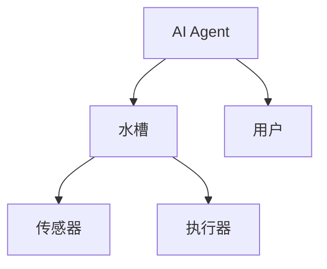
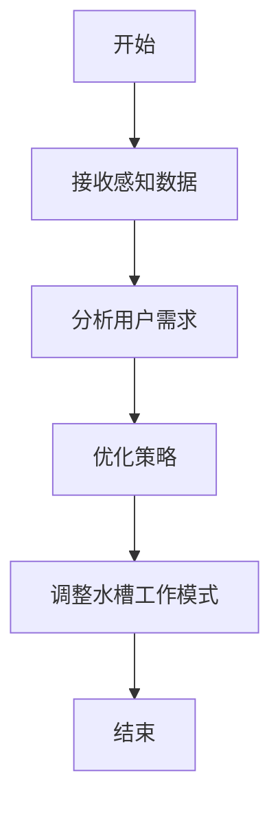
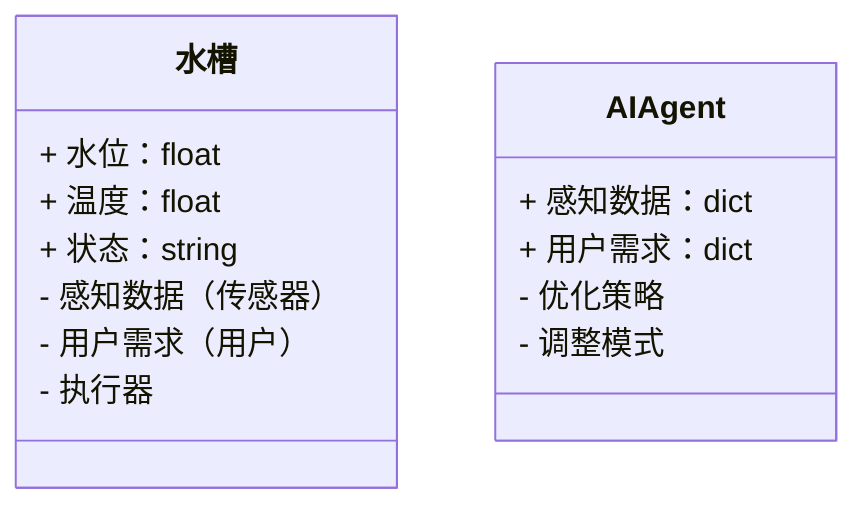
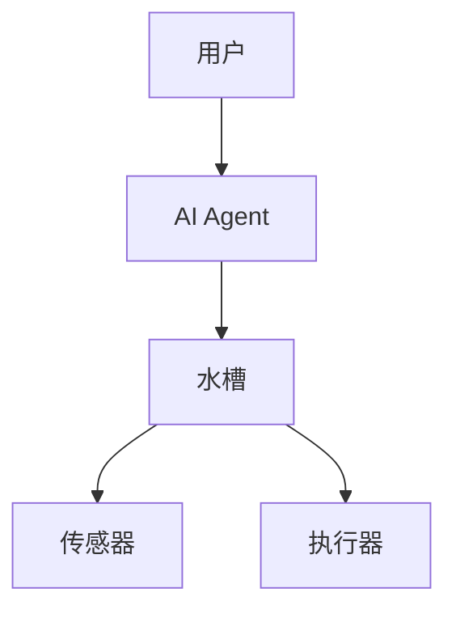
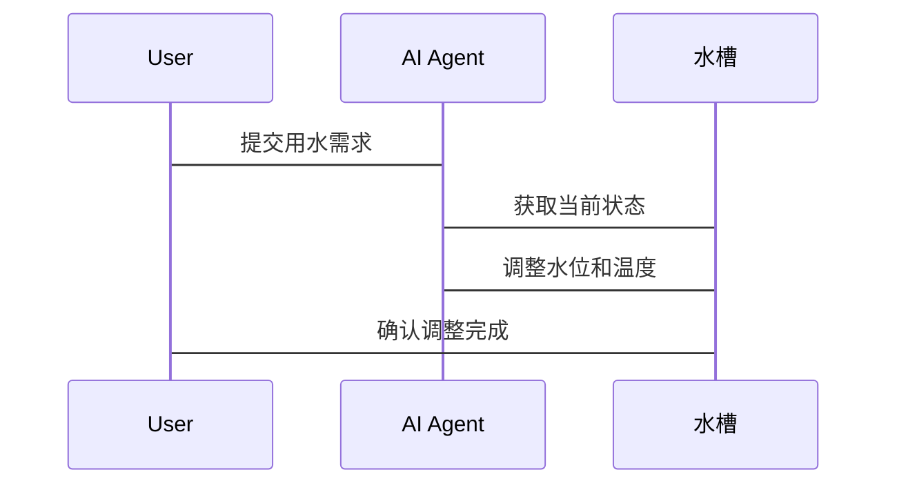

                 


# 智能厨房水槽：AI Agent的用水优化控制

> **关键词**：智能厨房，水槽，AI Agent，用水优化，智能家居，人工智能，物联网

> **摘要**：本文详细探讨了智能厨房水槽中AI Agent的用水优化控制技术。从背景介绍、核心概念、算法原理到系统架构设计，再到项目实战与最佳实践，全面解析如何通过AI技术实现厨房水槽的智能化用水管理。通过本文，读者将深入了解智能水槽的工作原理、技术实现路径以及实际应用案例。

---

## 第一部分: 背景介绍与核心概念

### 第1章: 背景与问题背景

#### 1.1 问题背景

在现代家庭中，水槽是厨房中不可或缺的设备，但传统水槽的用水效率较低，容易造成水资源浪费。随着智能家居的普及，AI技术为水槽的智能化提供了新的可能性。通过引入AI Agent（智能代理），可以实现水槽的智能化控制，优化用水效率，减少浪费。

#### 1.2 问题描述

- **水资源浪费**：传统水槽在洗涤过程中缺乏智能化控制，导致水量使用不均，浪费现象严重。
- **用户行为影响**：用户的洗涤习惯和用水需求差异较大，难以通过统一设置满足所有用户。
- **智能化控制需求**：用户对智能化、个性化的用水控制需求日益增长，传统水槽已无法满足这一需求。

#### 1.3 问题解决

AI Agent通过实时感知水槽的使用状态，结合用户行为和用水需求，优化洗涤模式和水量分配，从而实现用水效率的最大化。智能水槽的目标是通过AI技术实现高效、智能的用水管理。

#### 1.4 边界与外延

- **使用场景**：家庭厨房、商用厨房等。
- **限制条件**：智能水槽的控制范围有限，需与其他智能家居设备协同工作。
- **适用范围**：适用于需要优化用水效率的场景。

---

## 第二部分: 核心概念与原理

### 第2章: 核心概念与原理

#### 2.1 AI Agent的基本原理

AI Agent是一种能够感知环境、做出决策并执行操作的智能体。在智能水槽中，AI Agent负责接收水槽的状态信息（如水量、水温、洗涤模式等），分析用户需求，优化洗涤策略，并通过执行器调整水槽的工作状态。

#### 2.2 智能水槽的系统架构

- **感知层**：通过传感器实时监测水槽的状态信息。
- **决策层**：AI Agent根据感知数据和用户需求，制定优化策略。
- **执行层**：通过执行器调整水槽的工作模式，实现用水优化。

#### 2.3 核心概念对比分析

| **对比项**       | **传统水槽控制方式**         | **AI Agent控制方式**       |
|--------------------|------------------------------|----------------------------|
| 控制方式          | 基于固定程序或手动操作       | 基于AI算法的动态优化       |
| 决策能力          | 无动态调整能力               | 具备动态调整能力           |
| 用户交互          | 单向控制（用户→设备）       | 双向互动（用户→AI Agent→设备） |

#### 2.4 实体关系图



---

## 第三部分: 算法原理

### 第3章: 算法原理

#### 3.1 强化学习算法

AI Agent通过强化学习算法优化用水策略。算法通过奖励机制（如节约水量）激励AI Agent选择最优动作。

#### 3.2 反馈机制

AI Agent根据用户的反馈（如洗涤效果、用水量）调整决策策略。

#### 3.3 算法流程图



#### 3.4 Python代码实现

```python
import numpy as np

class AI-Agent:
    def __init__(self):
        self.state = 'idle'  # 状态：空闲、洗涤中、暂停
        self.water_level = 0.5  # 水位，默认为中等
        self.temperature = 25  # 水温，默认为25℃

    def感知数据(self, 传感器数据):
        # 根据传感器数据更新状态
        self.state = '洗涤中'
        self.water_level = 传感器数据['水位']
        self.temperature = 传感器数据['温度']

    def 优化策略(self, 用户需求):
        # 根据用户需求调整策略
        if 用户需求['水量'] < self.water_level:
            self.water_level = 用户需求['水量']
        if 用户需求['温度'] > self.temperature:
            self.temperature = 用户需求['温度']

    def 调整模式(self):
        # 调整水槽的工作模式
        if self.state == '洗涤中':
            self.洗涤模式(self.water_level, self.temperature)
        else:
            self.空闲模式()

    def 洗涤模式(self, 水位, 温度):
        # 设置水位和温度
        print(f"水位：{水位}, 温度：{温度}")
```

#### 3.5 数学模型

优化策略的数学模型如下：

$$
\text{奖励} = \text{节约水量} - \text{能耗增加}
$$

---

## 第四部分: 系统分析与架构设计

### 第4章: 系统分析与架构设计

#### 4.1 问题场景

用户在使用水槽时，希望根据洗涤需求动态调整水位和温度，同时优化用水效率。

#### 4.2 系统功能设计

- **洗涤模式**：智能调整水位和温度。
- **水量监控**：实时监测用水量。
- **用户交互**：通过手机APP或语音助手设置需求。

#### 4.3 领域模型



#### 4.4 系统架构图



#### 4.5 接口设计

- **输入接口**：传感器数据、用户需求。
- **输出接口**：调整水位和温度。

#### 4.6 交互流程图



---

## 第五部分: 项目实战

### 第5章: 项目实战

#### 5.1 环境安装

```bash
pip install numpy
pip install matplotlib
```

#### 5.2 核心代码实现

```python
import numpy as np

def 洗涤模式(水位, 温度):
    print(f"水位：{水位}, 温度：{温度}")

def 优化策略(当前水位, 用户需求):
    if 用户需求['水量'] < 当前水位:
        return 用户需求['水量']
    else:
        return 当前水位

# 示例
当前水位 = 0.5
用户需求 = {'水量': 0.6, '温度': 30}
优化后的水位 = 优化策略(当前水位, 用户需求)
洗涤模式(优化后的水位, 30)
```

#### 5.3 实际案例分析

以用户需求为水量0.6，温度30℃为例，AI Agent会根据当前水位0.5调整为0.6，并设置温度为30℃。

#### 5.4 小结

通过Python代码实现，可以清晰地看到AI Agent如何优化用水策略，并通过传感器和执行器实现智能化控制。

---

## 第六部分: 最佳实践

### 第6章: 最佳实践

#### 6.1 小贴士

- **数据采集**：确保传感器数据的准确性。
- **系统维护**：定期更新AI算法，以适应用户需求的变化。

#### 6.2 总结

通过AI Agent的优化控制，智能厨房水槽实现了高效用水管理，为家庭和商业厨房提供了智能化的用水解决方案。

#### 6.3 注意事项

- **数据隐私**：保护用户数据不被滥用。
- **系统稳定性**：确保AI Agent的稳定运行。

#### 6.4 拓展阅读

- 推荐阅读《强化学习入门》和《智能家居系统设计》。

---

**作者**：AI天才研究院/AI Genius Institute & 禅与计算机程序设计艺术/Zen And The Art of Computer Programming

