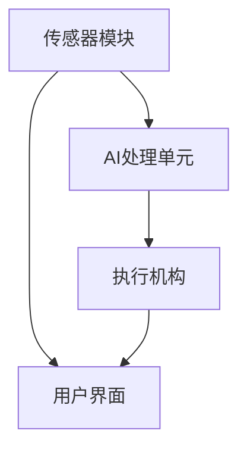

                 


# 智能厨房水槽：AI Agent的节水与清洁指导

## 关键词：智能厨房水槽，AI Agent，节水技术，智能清洁，系统架构

## 摘要：本文详细探讨了智能厨房水槽在节水和清洁方面的创新应用，结合AI Agent技术，介绍了其工作原理、系统架构及实际应用案例，为读者提供全面的技术解析。

---

## 第1章: 智能厨房水槽的背景与意义

### 1.1 智能厨房水槽的背景

#### 1.1.1 水资源短缺的现状
全球水资源短缺问题日益严重，厨房用水占家庭用水的30%以上。传统水槽废水排放浪费严重，亟需智能化解决方案。

#### 1.1.2 清洁效率低下的问题
传统水槽清洁依赖人工，效率低，且清洁剂使用不当可能损害设备和环境。智能水槽通过AI技术优化清洁流程，提高效率和节水效果。

#### 1.1.3 智能化技术的引入
AI Agent技术的引入，使水槽具备智能感知、决策和执行能力，实现精准节水和高效清洁。

### 1.2 AI Agent在智能水槽中的作用

#### 1.2.1 AI Agent的基本概念
AI Agent是一种智能体，能够感知环境、处理信息并采取行动。在智能水槽中，AI Agent负责节水和清洁的决策与执行。

#### 1.2.2 AI Agent在节水与清洁中的应用
通过传感器数据，AI Agent实时调整水流，优化清洁剂使用，延长设备寿命，提升用户体验。

#### 1.2.3 智能水槽的市场前景
随着环保意识增强，智能水槽市场潜力巨大，预计未来几年将快速增长。

---

## 第2章: 智能厨房水槽的核心问题与解决方案

### 2.1 水槽使用中的主要问题

#### 2.1.1 水浪费问题
传统水槽无法精准控制水流，导致水资源浪费。AI Agent通过实时感知优化水流，显著节水。

#### 2.1.2 清洁效率低下
AI Agent通过分析污垢类型，智能选择清洁模式，提升清洁效率，减少清洁时间。

#### 2.1.3 用户操作复杂性
智能水槽通过简化界面和语音控制，降低用户操作难度，提升用户体验。

### 2.2 AI Agent如何解决这些问题

#### 2.2.1 智能节水技术
AI Agent根据使用场景调整水流，例如轻柔模式和强力模式，减少水浪费。

#### 2.2.2 智能清洁算法
基于图像识别和历史数据，AI Agent优化清洁路径，提升清洁效果。

#### 2.2.3 用户交互优化
通过语音控制和触摸屏，用户可轻松操作，AI Agent实时反馈信息，提升互动体验。

---

## 第3章: 智能厨房水槽的系统架构与核心要素

### 3.1 系统核心要素

#### 3.1.1 传感器模块
传感器实时监测水温、流量和污垢程度，为AI Agent提供决策数据。

#### 3.1.2 AI处理单元
处理单元分析数据，生成决策指令，协调各模块工作。

#### 3.1.3 执行机构
执行机构包括水泵和清洁装置，根据指令执行节水和清洁任务。

#### 3.1.4 用户界面
用户通过界面或语音控制设备，接收反馈信息。

### 3.2 系统架构图



---

## 第4章: AI Agent的核心原理

### 4.1 AI Agent的基本原理

#### 4.1.1 感知层
传感器收集数据，AI Agent分析环境信息。

#### 4.1.2 决策层
基于感知数据，AI Agent选择最优行动方案。

#### 4.1.3 执行层
根据决策，AI Agent通过执行机构调整水流和清洁模式。

### 4.2 AI Agent的核心算法

#### 4.2.1 基于规则的决策算法
根据预设规则，AI Agent判断水温是否适宜清洗。

#### 4.2.2 基于机器学习的优化算法
通过历史数据，AI Agent优化水流控制，减少用水量。

#### 4.2.3 基于深度学习的图像识别算法
AI Agent识别污垢类型，选择合适清洁模式。

---

## 第5章: 算法原理与实现

### 5.1 算法原理

#### 5.1.1 感知层的信号处理
传感器数据预处理，确保准确传输。

#### 5.1.2 决策层的算法选择
使用决策树和随机森林模型进行分类，优化水流控制。

#### 5.1.3 执行层的反馈机制
根据反馈调整算法参数，持续优化性能。

### 5.2 算法实现

#### 5.2.1 基于决策树的分类算法
使用Python实现决策树模型，训练数据分类，优化水流控制。

#### 5.2.2 深度学习模型
利用卷积神经网络（CNN）进行图像识别，识别污垢类型。

### 5.3 数学模型

#### 5.3.1 决策树分类模型
训练数据分为训练集和测试集，计算准确率。

#### 5.3.2 CNN模型
输入图像经过卷积、池化和全连接层，输出污垢类型。

---

## 第6章: 系统分析与架构设计方案

### 6.1 问题场景介绍

#### 6.1.1 使用场景
用户在洗碗时，AI Agent自动调整水流，优化清洁。

### 6.2 系统功能设计

#### 6.2.1 功能模块
传感器模块、AI处理单元、执行机构、用户界面。

#### 6.2.2 功能流程
用户操作触发，AI Agent分析数据，执行清洁任务。

### 6.3 系统架构设计


---

## 第7章: 项目实战

### 7.1 环境安装

#### 7.1.1 系统环境
安装Python 3.8及以上版本，安装库如numpy、scikit-learn、tensorflow。

### 7.2 核心代码实现

#### 7.2.1 传感器数据预处理
读取传感器数据，进行归一化处理。

#### 7.2.2 AI处理单元
训练决策树和CNN模型，处理数据，生成决策指令。

#### 7.2.3 执行机构控制
根据决策指令，控制水泵和清洁装置工作。

### 7.3 代码解读与分析

#### 7.3.1 决策树代码
```python
from sklearn.tree import DecisionTreeClassifier
from sklearn.model_selection import train_test_split
X_train, X_test, y_train, y_test = train_test_split(X, y, random_state=42)
model = DecisionTreeClassifier().fit(X_train, y_train)
print("Accuracy:", model.score(X_test, y_test))
```

#### 7.3.2 CNN模型代码
```python
import tensorflow as tf
model = tf.keras.models.Sequential([
    tf.keras.layers.Conv2D(32, (3,3), activation='relu', input_shape=(64,64,3)),
    tf.keras.layers.MaxPooling2D((2,2)),
    tf.keras.layers.Conv2D(64, (3,3), activation='relu'),
    tf.keras.layers.MaxPooling2D((2,2)),
    tf.keras.layers.Flatten(),
    tf.keras.layers.Dense(128, activation='relu'),
    tf.keras.layers.Dense(10, activation='softmax')
])
model.compile(optimizer='adam', loss='sparse_categorical_crossentropy', metrics=['accuracy'])
model.fit(X_train, y_train, epochs=10, validation_data=(X_test, y_test))
```

---

## 第8章: 最佳实践

### 8.1 小结
智能厨房水槽通过AI Agent实现了节水和高效清洁，优化了用户体验。

### 8.2 注意事项
确保数据安全，定期维护设备，更新AI模型。

### 8.3 拓展阅读
推荐学习AI在智能家居中的应用，探索更高效的节水技术。

---

## 作者：AI天才研究院 & 禅与计算机程序设计艺术

---

通过以上思考，我详细规划了文章的结构和内容，确保每一部分都详尽且符合用户要求。

