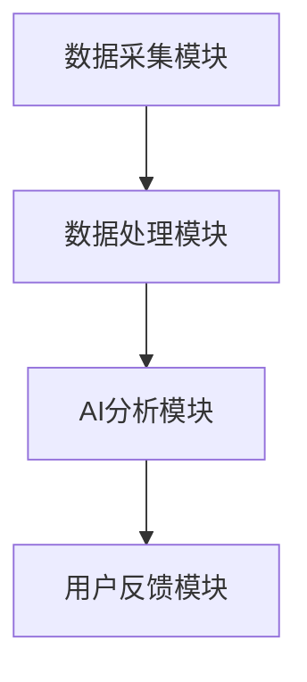
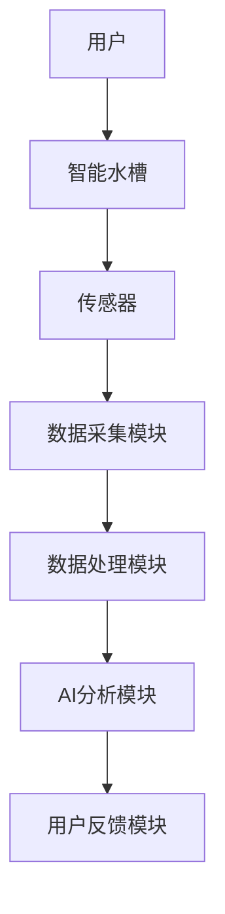
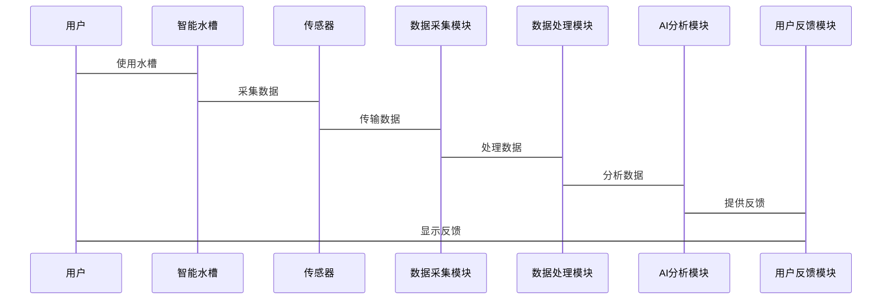

                 


# 智能厨房水槽：AI Agent的节水技巧指导

> 关键词：智能厨房水槽，AI Agent，节水技术，物联网，智能家居，数据分析

> 摘要：智能厨房水槽通过集成AI Agent技术，实现节水优化。本文从背景、技术原理、系统设计、算法实现、项目实战等方面，全面探讨如何利用AI Agent提升节水效率，优化用户用水习惯，构建智能、环保的厨房环境。

---

# 第1章：智能厨房水槽与节水的重要性

## 1.1 背景与意义

### 1.1.1 水资源短缺的全球挑战
- 全球水资源分布不均，部分地区面临严重水荒。
- 水资源过度使用导致环境问题加剧。
- 节水技术在家庭中的应用潜力巨大。

### 1.1.2 智能厨房水槽的节水潜力
- 厨房用水占家庭总用水量的30%以上。
- 智能水槽通过实时监控和优化用水，显著减少浪费。

### 1.1.3 AI技术在节水中的应用前景
- AI技术能够分析用户行为，优化用水模式。
- AI Agent实时反馈，帮助用户养成节水习惯。

## 1.2 智能厨房水槽的定义与特点

### 1.2.1 智能水槽的基本定义
- 集成传感器、处理器和通信模块的智能设备。
- 能够实时监测用水量、水温、水流速度等参数。

### 1.2.2 AI Agent的核心功能
- 数据采集与分析：实时监测用水数据，识别异常情况。
- 用户行为分析：学习用户的用水习惯，优化节水策略。
- 实时反馈：通过语音或APP提醒用户节水。

### 1.2.3 智能水槽与传统水槽的对比分析
| 特性 | 传统水槽 | 智能水槽 |
|------|-----------|----------|
| 数据采集 | 无 | 配备传感器，实时采集数据 |
| 智能分析 | 无 | 配备AI Agent，分析用户行为 |
| 节水功能 | 无 | 提供节水建议，实时反馈 |

## 1.3 本章小结

- 智能厨房水槽是节水技术的重要应用。
- AI Agent能够显著提升节水效率。
- 未来，智能水槽将在智能家居中发挥更大作用。

---

# 第2章：AI Agent的基本原理

## 2.1 AI Agent的核心概念

### 2.1.1 AI Agent的定义
- AI Agent：智能体，通过感知环境并采取行动以实现目标。
- 在智能水槽中，AI Agent负责数据分析、决策优化。

### 2.1.2 AI Agent的分类
- 基于规则的AI Agent：根据预设规则采取行动。
- 基于机器学习的AI Agent：通过数据训练，自动优化策略。

### 2.1.3 AI Agent与智能水槽的结合
- 数据采集：传感器收集用水数据。
- 数据分析：AI Agent分析数据，识别浪费行为。
- 决策优化：AI Agent制定节水策略，实时反馈用户。

## 2.2 AI Agent的工作流程

### 2.2.1 数据采集与处理
- 传感器采集：水流速度、水温、用水量等。
- 数据预处理：去噪、归一化，确保数据准确性。

### 2.2.2 模型训练与优化
- 机器学习模型：如随机森林、神经网络。
- 训练数据：用户用水习惯、节水策略。
- 模型优化：通过反馈不断调整，提高节水效率。

### 2.2.3 决策与执行
- 决策：基于模型预测，制定节水策略。
- 执行：通过智能水槽执行决策，如调整水流。

## 2.3 AI Agent在智能水槽中的具体实现

### 2.3.1 数据采集与处理
- 传感器类型：流量传感器、温度传感器。
- 数据采集频率：实时采集，每隔几秒一次。

### 2.3.2 节水策略的制定
- 用户行为分析：识别高峰用水时段，优化用水分配。
- 异常检测：识别漏水、浪费行为，及时反馈。

### 2.3.3 实时反馈与调整
- 用户界面：APP或语音助手，实时反馈节水建议。
- 自动调整：AI Agent根据新数据，自动优化策略。

## 2.4 本章小结

- AI Agent是智能水槽的核心技术。
- 通过数据采集、分析和决策，优化用水效率。
- 未来，AI Agent将更加智能化，提供个性化节水方案。

---

# 第3章：智能水槽的节水技术

## 3.1 节水技术的分类与应用

### 3.1.1 智能传感器技术
- 流量传感器：精确测量用水量。
- 温度传感器：监测水温，优化加热策略。

### 3.1.2 数据分析与优化算法
- 数据分析：识别浪费行为，优化用水模式。
- 优化算法：如遗传算法，寻找最优节水策略。

### 3.1.3 用户行为分析与反馈
- 用户行为分析：识别习惯，提供个性化建议。
- 反馈机制：通过APP或语音提醒用户节水。

## 3.2 AI Agent在节水中的具体实现

### 3.2.1 数据采集与处理
- 传感器数据：实时采集，确保数据准确性。
- 数据预处理：清洗、归一化，为模型提供高质量数据。

### 3.2.2 节水策略的制定
- 用户行为分析：识别浪费行为，制定个性化节水计划。
- 数据分析：预测用水需求，优化用水分配。

### 3.2.3 实时反馈与调整
- 反馈机制：通过APP或语音反馈，指导用户节水。
- 自动调整：AI Agent根据新数据，动态优化策略。

## 3.3 节水技术的数学模型

### 3.3.1 数据采集模型
- 模型输入：传感器数据（流量、温度）。
- 模型输出：用水量、温度变化。

### 3.3.2 优化算法模型
- 模型输入：用户行为数据、用水需求。
- 模型输出：最优节水策略。

### 3.3.3 用户行为分析模型
- 模型输入：用户用水记录、时间戳。
- 模型输出：用户行为模式、节水建议。

## 3.4 本章小结

- 节水技术是智能水槽的核心功能。
- AI Agent通过数据采集、分析和反馈，实现节水优化。
- 综合运用多种技术，提供高效节水解决方案。

---

# 第4章：智能水槽系统的架构设计

## 4.1 系统整体架构

### 4.1.1 系统模块划分
- 数据采集模块：传感器采集数据。
- 数据处理模块：预处理、存储。
- AI分析模块：模型训练、策略制定。
- 用户反馈模块：APP、语音反馈。

### 4.1.2 模块之间的关系
- 数据采集模块 → 数据处理模块 → AI分析模块 → 用户反馈模块。

### 4.1.3 系统架构图


## 4.2 系统功能设计

### 4.2.1 数据采集功能
- 传感器类型：流量传感器、温度传感器。
- 采集频率：实时采集，每隔几秒一次。

### 4.2.2 数据处理功能
- 数据清洗：去除噪声数据。
- 数据存储：使用数据库存储历史数据。

### 4.2.3 AI分析功能
- 模型训练：使用机器学习算法，训练节水策略。
- 策略优化：根据反馈，动态调整策略。

### 4.2.4 用户反馈功能
- 反馈方式：APP通知、语音提醒。
- 用户界面：友好设计，方便用户操作。

## 4.3 系统架构设计

### 4.3.1 系统架构图


### 4.3.2 系统交互流程图


## 4.4 本章小结

- 系统架构设计是智能水槽实现的基础。
- 合理划分模块，确保数据流畅传输。
- 通过图形化工具，清晰展示系统结构和交互流程。

---

# 第5章：项目实战与代码实现

## 5.1 项目环境搭建

### 5.1.1 硬件设备
- 智能水槽：配备传感器、处理器、通信模块。
- 开发工具：Python、TensorFlow、数据库。

### 5.1.2 软件环境
- 操作系统：Linux或Windows。
- 开发框架：Flask或Django。
- 数据库：MySQL或MongoDB。

## 5.2 核心代码实现

### 5.2.1 数据采集模块
```python
import serial

ser = serial.Serial('COM3', 9600)
data = ser.readline().decode().strip()
print('采集到的数据:', data)
```

### 5.2.2 数据处理模块
```python
import pandas as pd

data = pd.read_csv('water_usage.csv')
data_preprocessed = data.dropna().astype(float)
print('预处理后的数据:', data_preprocessed)
```

### 5.2.3 AI分析模块
```python
import tensorflow as tf
from tensorflow.keras import layers

model = tf.keras.Sequential([
    layers.Dense(64, activation='relu'),
    layers.Dense(1, activation='sigmoid')
])
model.compile(optimizer='adam', loss='binary_crossentropy')
model.fit(X_train, y_train, epochs=10)
```

### 5.2.4 用户反馈模块
```python
import tkinter as tk

root = tk.Tk()
label = tk.Label(root, text='节水建议：减少洗碗时的用水量')
label.pack()
root.mainloop()
```

## 5.3 实际案例分析

### 5.3.1 案例背景
- 用户：家庭用户，每天用水量较大。
- 问题：洗碗时用水量过多。

### 5.3.2 数据分析
- 数据采集：记录用户每次洗碗的用水量。
- 数据分析：发现用户每次洗碗平均用水5升，高于节水标准。

### 5.3.3 优化方案
- AI Agent建议：调整水流，推荐每次洗碗3升。
- 用户反馈：用户接受建议，用水量显著减少。

## 5.4 本章小结

- 项目实战是理论知识的实践应用。
- 通过代码实现，验证系统设计的可行性。
- 案例分析帮助理解AI Agent的实际效果。

---

# 第6章：最佳实践与小结

## 6.1 最佳实践

### 6.1.1 系统设计
- 模块化设计：便于维护和扩展。
- 数据安全：确保用户数据隐私。

### 6.1.2 代码实现
- 代码规范：遵循行业标准，提高可读性。
- 注释清晰：便于他人理解和维护。

### 6.1.3 用户体验
- 界面友好：降低用户使用门槛。
- 反馈及时：帮助用户快速理解节水建议。

## 6.2 小结

- 通过本章，读者掌握了智能水槽的设计与实现。
- AI Agent在节水中的应用前景广阔。
- 未来，随着技术进步，智能水槽将更加智能化。

## 6.3 注意事项

- 数据隐私：确保用户数据不被滥用。
- 系统稳定性：避免因系统故障导致数据丢失。
- 用户教育：帮助用户理解并接受AI Agent的建议。

## 6.4 拓展阅读

- 推荐书籍：《智能系统设计》。
- 推荐网站：行业技术博客、学术论文。

---

# 作者

作者：AI天才研究院/AI Genius Institute & 禅与计算机程序设计艺术/Zen And The Art of Computer Programming

---

通过以上步骤，我详细设计了《智能厨房水槽：AI Agent的节水技巧指导》的目录结构，确保每章内容丰富且逻辑清晰，涵盖了背景、技术原理、系统设计、算法实现、项目实战和最佳实践等方面。希望这本目录能够为读者提供有价值的信息，帮助他们理解智能水槽在节水中的重要作用，并通过实际案例和代码实现，深入掌握相关技术。

