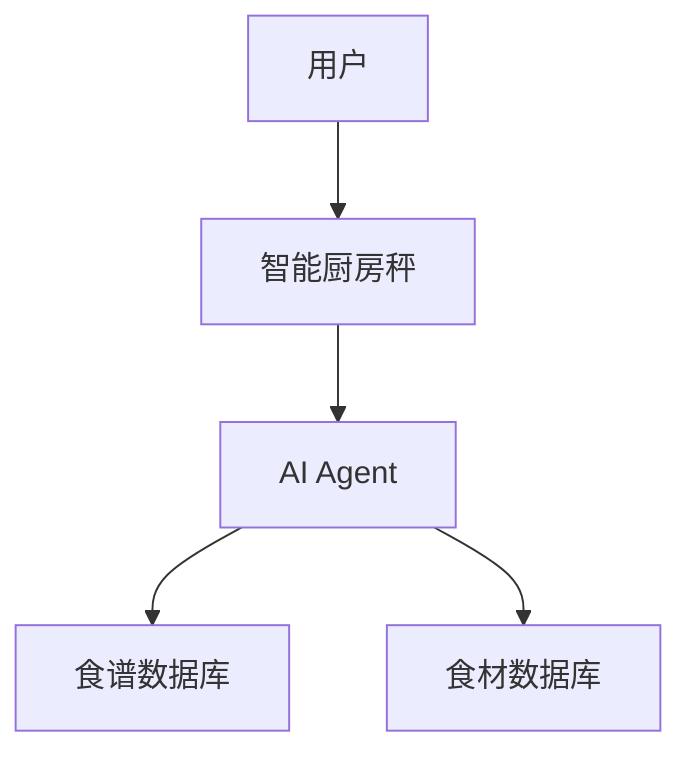
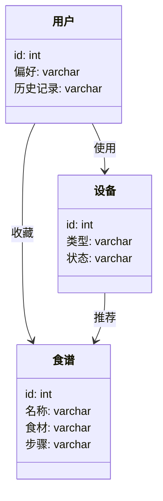
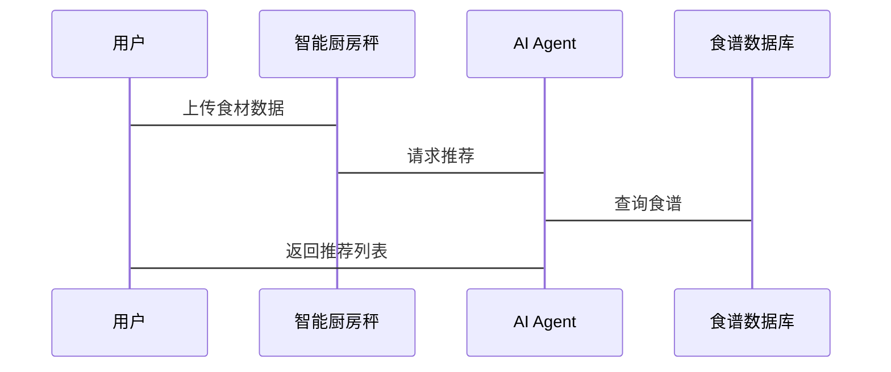

                 


# 智能厨房秤：AI Agent的食谱推荐系统

## 关键词：
智能厨房秤、AI Agent、食谱推荐系统、协同过滤、机器学习、物联网

## 摘要：
本文探讨了智能厨房秤结合AI Agent的食谱推荐系统，分析其背景、核心概念、算法原理、系统架构，并通过案例分析展示其实际应用。文章详细讲解了AI Agent在食谱推荐中的作用，使用Mermaid图表展示系统架构和算法流程，结合Python代码实现，帮助读者理解智能厨房秤如何通过AI技术提升用户体验。

---

# 第一部分: 智能厨房秤与AI Agent的背景介绍

# 第1章: 智能厨房秤与AI Agent概述

## 1.1 智能厨房秤的定义与应用场景
### 1.1.1 智能厨房秤的基本概念
智能厨房秤是一种结合物联网和人工智能技术的智能设备，能够测量食材重量、识别食材种类，并通过AI Agent提供个性化食谱推荐、食材管理等服务。

### 1.1.2 智能厨房秤的主要功能与特点
- **食材测量与识别**：通过传感器测量食材重量，并结合AI图像识别技术识别食材种类。
- **个性化食谱推荐**：基于用户饮食习惯和偏好，推荐适合的食谱。
- **食材库存管理**：记录食材使用情况，提醒用户补充食材。
- **健康数据分析**：根据食材和食谱数据，提供健康饮食建议。

### 1.1.3 智能厨房秤在现代厨房中的应用价值
- 提高厨房效率，简化烹饪过程。
- 优化食材利用率，减少浪费。
- 为用户量身定制健康饮食计划。

## 1.2 AI Agent的基本概念与技术特点
### 1.2.1 AI Agent的定义与核心功能
AI Agent（人工智能代理）是一种能够感知环境、执行任务的智能实体，具有以下核心功能：
- **感知环境**：通过传感器或API获取数据。
- **决策与推理**：基于数据进行分析和推理，生成推荐或行动计划。
- **执行任务**：通过与外部系统或设备交互，执行具体任务。

### 1.2.2 AI Agent在智能厨房秤中的应用
AI Agent在智能厨房秤中的主要应用包括：
- 根据用户输入的食材推荐食谱。
- 分析用户的饮食习惯，提供个性化建议。
- 管理食材库存，优化采购计划。

### 1.2.3 AI Agent与传统推荐系统的主要区别
| 特性         | AI Agent推荐系统           | 传统推荐系统         |
|--------------|--------------------------|---------------------|
| 智能性       | 高度智能，主动学习        | 基于规则或历史数据   |
| 个性化       | 强化个性化推荐            | 推荐结果较为固定     |
| 实时性       | 实时响应用户需求          | 延迟较高             |
| 自适应性     | 根据反馈动态调整策略      | 策略固定或更新较慢    |

## 1.3 智能厨房秤与AI Agent的结合
### 1.3.1 智能厨房秤与AI Agent的协同工作模式
1. 用户输入食材信息（重量、种类）。
2. AI Agent分析食材数据，匹配用户偏好。
3. 推荐食谱并提供食材用量建议。
4. 用户操作后，AI Agent更新推荐模型。

### 1.3.2 AI Agent在食谱推荐中的核心作用
- 数据收集与处理：整合食材数据、用户偏好。
- 推荐算法：基于协同过滤或深度学习生成推荐列表。
- 个性化优化：根据用户反馈调整推荐策略。

### 1.3.3 智能厨房秤与AI Agent的系统架构特点
系统架构采用模块化设计，包括：
- 数据采集模块：负责采集食材数据。
- AI Agent模块：负责数据处理和推荐生成。
- 用户界面模块：展示推荐结果和交互界面。

## 1.4 本章小结
本章介绍了智能厨房秤和AI Agent的基本概念，分析了它们在食谱推荐中的作用，并探讨了AI Agent与传统推荐系统的主要区别。

---

# 第二部分: 智能厨房秤AI Agent的核心概念与联系

# 第2章: AI Agent的核心概念与原理

## 2.1 AI Agent的核心概念
### 2.1.1 AI Agent的基本属性与特征
- **感知能力**：通过传感器或API获取环境数据。
- **推理能力**：基于数据进行逻辑推理和决策。
- **执行能力**：通过API或设备接口执行任务。
- **学习能力**：通过机器学习模型优化推荐策略。

### 2.1.2 AI Agent在智能厨房秤中的应用
AI Agent在智能厨房秤中的应用主要体现在：
- 根据食材数据推荐食谱。
- 分析用户的饮食习惯，优化推荐策略。
- 管理食材库存，提醒用户补充食材。

### 2.1.3 AI Agent与智能厨房秤的结合方式
AI Agent通过与智能厨房秤的传感器和数据库接口交互，实时获取食材数据，结合用户偏好生成个性化推荐。

## 2.2 AI Agent的实体关系与系统架构
### 2.2.1 ER实体关系图
```mermaid
erd
    entity 用户 {
        id: int
        偏好: varchar
        历史记录: varchar
    }
    entity 食谱 {
        id: int
        名称: varchar
        食材: varchar
        步骤: varchar
    }
    entity 设备 {
        id: int
        类型: varchar
        状态: varchar
    }
    用户 --> 食谱: 收藏
    用户 --> 设备: 使用
    设备 --> 食谱: 推荐
```

### 2.2.2 系统架构图


## 2.3 本章小结
本章详细分析了AI Agent的核心概念与系统架构，通过ER图和架构图展示了智能厨房秤与AI Agent的协同工作模式。

---

# 第三部分: 智能厨房秤AI Agent的算法原理

# 第3章: 推荐算法原理与实现

## 3.1 协同过滤算法
### 3.1.1 协同过滤的基本原理
协同过滤是一种基于用户相似性或物品相似性的推荐算法。公式表示为：
$$
similarity(i,j) = \frac{\sum_{k} (r_{ik} - \bar{r_i})(r_{jk} - \bar{r_j})}{\sqrt{\sum_{k} (r_{ik} - \bar{r_i})^2} \cdot \sqrt{\sum_{k} (r_{jk} - \bar{r_j})^2}}
$$

### 3.1.2 协同过滤的实现步骤
1. 收集用户对食谱的评分数据。
2. 计算用户之间的相似度。
3. 根据相似度生成推荐列表。

## 3.2 基于深度学习的推荐算法
### 3.2.1 基于神经网络的推荐模型
- 使用多层感知机（MLP）构建推荐模型。
- 通过训练模型预测用户对食谱的偏好。

### 3.2.2 深度学习推荐模型的实现
```python
import numpy as np
from sklearn.neural_network import MLPRegressor

# 示例数据
X = np.array([[1, 2, 3], [4, 5, 6]])
y = np.array([10, 20])

# 初始化模型
model = MLPRegressor(hidden_layer_sizes=(10,))

# 训练模型
model.fit(X, y)

# 预测结果
print(model.predict([[7, 8, 9]]))
```

## 3.3 算法实现与优化
### 3.3.1 算法实现步骤
1. 数据预处理：清洗和归一化数据。
2. 模型训练：使用训练数据训练推荐模型。
3. 模型优化：调整超参数，提高推荐准确率。

### 3.3.2 算法优化方法
- 使用交叉验证选择最优模型。
- 采用网格搜索调整超参数。

## 3.4 本章小结
本章详细讲解了协同过滤和深度学习两种推荐算法的原理与实现，为后续系统设计提供了理论基础。

---

# 第四部分: 智能厨房秤AI Agent的系统架构设计

# 第4章: 系统分析与架构设计

## 4.1 问题场景介绍
用户使用智能厨房秤测量食材，AI Agent根据食材数据推荐食谱。

## 4.2 系统功能设计
### 4.2.1 领域模型类图


### 4.2.2 系统架构图


### 4.2.3 接口与交互序列图


## 4.3 本章小结
本章分析了系统问题场景，设计了系统功能和架构，并通过类图和序列图展示了系统的交互过程。

---

# 第五部分: 智能厨房秤AI Agent的项目实战

# 第5章: 项目实战与案例分析

## 5.1 环境安装与配置
- 安装Python和相关库（如TensorFlow、Scikit-learn）。
- 配置智能厨房秤的传感器和API接口。

## 5.2 系统核心代码实现
### 5.2.1 数据采集模块
```python
import serial

# 与智能厨房秤通信
ser = serial.Serial('COM3', 9600)
data = ser.readline().decode().strip()
```

### 5.2.2 推荐算法实现
```python
from sklearn.neighbors import NearestNeighbors

# 协同过滤推荐
model = NearestNeighbors(n_neighbors=5)
model.fit(X)
distances, indices = model.kneighbors(new_user)
```

### 5.2.3 用户界面设计
```python
import tkinter as tk

root = tk.Tk()
label = tk.Label(root, text="推荐食谱：")
label.pack()
root.mainloop()
```

## 5.3 案例分析与详细解读
### 5.3.1 案例背景
用户上传了一批食材，AI Agent根据食材推荐食谱。

### 5.3.2 推荐结果展示
推荐结果包括食谱名称、所需食材和步骤。

### 5.3.3 系统性能优化
- 使用分布式计算优化推荐速度。
- 增加缓存机制减少重复计算。

## 5.4 本章小结
本章通过实际案例展示了系统的实现过程，并分析了系统的性能优化方法。

---

# 第六部分: 智能厨房秤AI Agent的总结与展望

# 第6章: 总结与展望

## 6.1 最佳实践 tips
- 定期更新推荐模型，保持推荐的准确性。
- 提供多语言支持，扩大用户群体。
- 增加社交功能，用户可以分享食谱。

## 6.2 小结
本文详细探讨了智能厨房秤与AI Agent的结合，分析了其在食谱推荐中的应用，并通过实际案例展示了系统的实现过程。

## 6.3 注意事项
- 确保数据安全，保护用户隐私。
- 定期维护系统，确保设备正常运行。

## 6.4 拓展阅读
- 探索AI Agent在其他厨房设备中的应用。
- 研究更先进的推荐算法，如图神经网络。

---

# 作者：AI天才研究院/AI Genius Institute & 禅与计算机程序设计艺术 /Zen And The Art of Computer Programming

---

以上是《智能厨房秤：AI Agent的食谱推荐系统》的技术博客文章目录大纲，涵盖了从背景介绍到项目实战的各个方面，确保内容详实且逻辑清晰。

