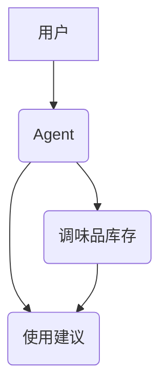
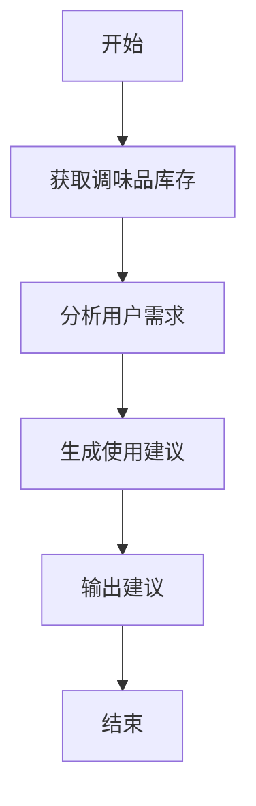
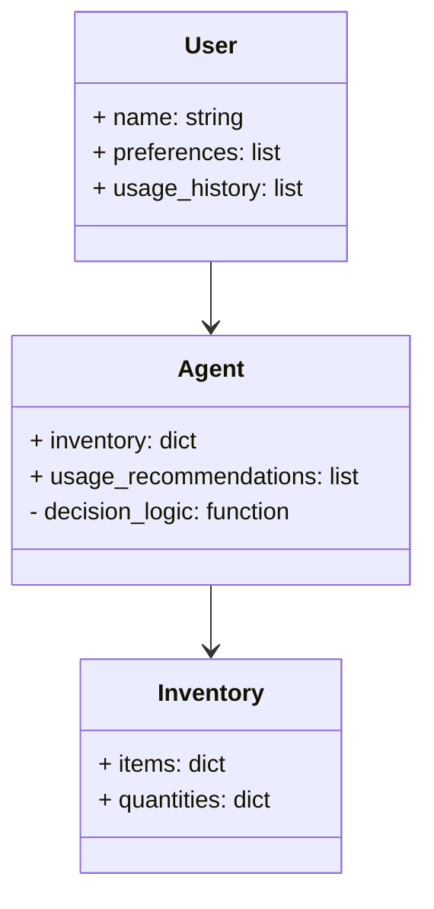
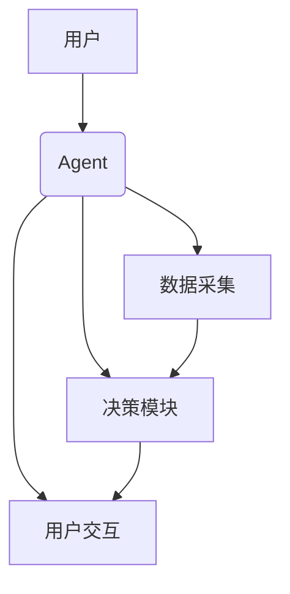
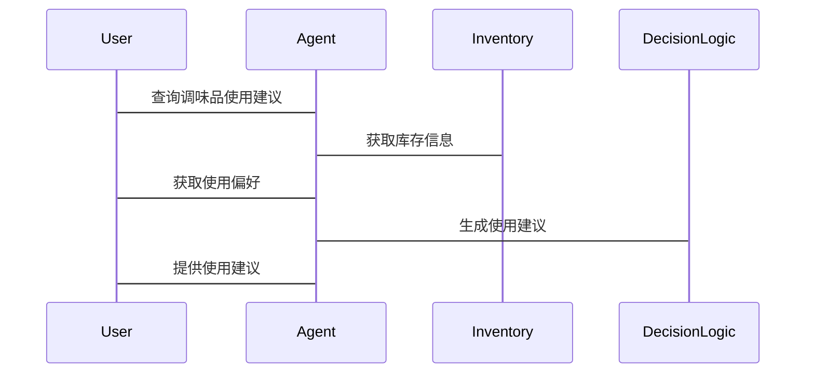

                 


# 智能厨房置物架：AI Agent的调味品使用建议

> 关键词：智能厨房置物架，AI Agent，调味品管理，算法原理，系统架构

> 摘要：本文将介绍智能厨房置物架中AI Agent在调味品使用建议中的应用，从背景介绍、核心概念、算法原理、系统架构、项目实战到最佳实践，全面解析AI Agent如何优化调味品管理，提升厨房效率。

---

# 第一部分: 智能厨房置物架的背景与核心概念

## 第1章: 智能厨房置物架的背景介绍

### 1.1 厨房管理的智能化需求
- **智能化厨房的发展趋势**：随着智能家居的普及，厨房设备逐渐向智能化方向发展，用户对厨房管理的智能化需求日益增加。
- **调味品管理的痛点**：调味品种类繁多，使用频率不一，传统管理方式效率低下，容易造成浪费或遗漏。
- **AI Agent的引入**：AI Agent作为一种智能代理，能够实时感知环境、自主决策并执行任务，为调味品管理提供了新的解决方案。

### 1.2 AI Agent的核心概念
- **AI Agent的定义与特点**：
  - AI Agent是一种智能实体，能够感知环境、理解用户需求并执行相应操作。
  - 具有自主性、反应性、目标导向性和社会性等特点。
- **AI Agent在调味品管理中的作用**：
  - 自动记录调味品的使用情况。
  - 提供科学的使用建议，优化调味品的存储和使用效率。
  - 实现与智能家居设备的联动，提升厨房的整体智能化水平。

### 1.3 问题背景与解决思路
- **调味品管理的主要问题**：
  - 调味品使用记录繁琐，难以追踪。
  - 调味品过期或浪费现象严重。
  - 用户需求多样化，传统管理方式难以满足个性化需求。
- **AI Agent如何解决调味品管理问题**：
  - 自动记录调味品的使用情况，避免人为遗漏。
  - 基于历史使用数据，预测未来需求，优化库存管理。
  - 提供个性化的使用建议，提升用户体验。

### 1.4 核心概念结构与组成
- **AI Agent的组成要素**：
  - 感知模块：用于采集环境信息，如调味品的使用记录、用户需求等。
  - 决策模块：基于感知数据，生成调味品的使用建议。
  - 执行模块：将决策结果转化为具体操作，如调整存储位置或提醒用户使用。
- **调味品使用建议的实现流程**：
  1. 感知调味品的库存和使用情况。
  2. 分析用户需求和偏好。
  3. 生成个性化的使用建议。
  4. 提供可视化反馈，帮助用户优化调味品管理。

## 1.5 本章小结
本章介绍了智能厨房置物架的背景与核心概念，重点阐述了AI Agent在调味品管理中的作用和实现思路，为后续章节的深入分析奠定了基础。

---

## 第2章: AI Agent的核心概念与联系

### 2.1 AI Agent的原理与机制
- **AI Agent的感知机制**：
  - 通过传感器或用户输入获取调味品的使用记录和库存信息。
  - 分析用户的使用习惯和偏好，生成个性化的调味品使用建议。
- **AI Agent的决策机制**：
  - 基于历史数据和用户需求，预测未来的调味品使用情况。
  - 结合库存信息，优化调味品的使用顺序和存储位置。
- **AI Agent的执行机制**：
  - 根据决策结果，调整调味品的存储位置或提醒用户优先使用某些调味品。
  - 提供可视化反馈，帮助用户更好地管理调味品。

### 2.2 核心概念的属性特征对比
- **AI Agent与传统家居设备的对比**：
  | 特性          | AI Agent                 | 传统家居设备           |
  |---------------|--------------------------|-----------------------|
  | 智能性         | 高                      | 低                   |
  | 自主性         | 高                      | 低                   |
  | 可定制性       | 高                      | 低                   |
  | 交互方式       | 多样化（语音、触控等）   | 单一化（按钮、开关等） |
- **调味品使用建议的实现特点**：
  - 数据驱动：基于用户行为数据和调味品使用记录，生成个性化建议。
  - 自适应性：能够根据用户需求和环境变化，动态调整调味品管理策略。
- **AI Agent在厨房场景中的独特优势**：
  - 实现厨房设备的智能化联动，提升厨房的整体效率。
  - 优化调味品的使用和存储，减少浪费，降低成本。

### 2.3 ER实体关系图架构


### 2.4 本章小结
本章详细阐述了AI Agent的核心概念与实现机制，通过对比分析和ER实体关系图，明确了AI Agent在调味品管理中的独特优势和实现路径。

---

## 第3章: AI Agent的算法原理

### 3.1 算法原理概述
- **AI Agent的决策算法**：
  - 基于历史数据和用户需求，采用机器学习算法（如决策树、随机森林）进行预测和推荐。
  - 使用聚类算法对调味品的使用情况进行分类，生成个性化建议。
- **调味品使用建议的生成算法**：
  - 基于用户使用频率和偏好，生成优先使用的调味品列表。
  - 结合库存信息，动态调整建议内容。
- **算法的优化与改进**：
  - 引入强化学习算法，优化AI Agent的决策策略。
  - 增加用户反馈机制，提升算法的自适应能力。

### 3.2 算法流程图


### 3.3 算法实现代码
```python
import pandas as pd
from sklearn.tree import DecisionTreeClassifier
from sklearn.metrics import accuracy_score

# 数据加载
data = pd.read_csv('usage_data.csv')

# 特征提取
X = data[['user_preference', 'usage_frequency', 'inventory_level']]
y = data['recommended_usage']

# 模型训练
model = DecisionTreeClassifier()
model.fit(X, y)

# 预测与评估
predicted = model.predict(X)
print("模型准确率:", accuracy_score(y, predicted))
```

### 3.4 数学模型与公式
- **决策树算法的分类模型**：
  - 使用ID3或C4.5算法构建决策树。
  - 基于信息增益度量选择最优特征进行划分。
  - 公式：
    $$ \text{信息增益}(D, A) = H(D) - \sum_{v \in A} H(D_v) $$
- **随机森林算法的集成模型**：
  - 通过构建多个决策树，提升模型的泛化能力。
  - 使用投票机制进行最终预测。

### 3.5 本章小结
本章详细介绍了AI Agent的算法原理，通过流程图和代码示例，展示了如何基于机器学习算法实现调味品的使用建议生成。

---

## 第4章: 系统分析与架构设计方案

### 4.1 问题场景介绍
- **问题场景**：
  - 用户希望AI Agent能够实时监控调味品的使用情况，并提供个性化的使用建议。
  - 系统需要与智能家居设备联动，实现自动化管理。

### 4.2 项目介绍
- **项目目标**：
  - 实现AI Agent对调味品的智能管理。
  - 提供个性化的使用建议，优化厨房效率。
- **项目范围**：
  - 系统包括数据采集模块、决策模块和用户交互模块。
  - 支持多种数据输入方式，如传感器数据和用户输入。

### 4.3 系统功能设计
- **领域模型（类图）**：


### 4.4 系统架构设计
- **系统架构图**：


### 4.5 系统交互设计
- **交互序列图**：


### 4.6 本章小结
本章详细分析了系统的需求和架构设计，通过类图和交互序列图，明确了系统各模块的职责和协作关系。

---

## 第5章: 项目实战

### 5.1 环境安装与配置
- **Python环境**：
  - 安装Python 3.8以上版本。
  - 安装必要的库：`pandas`, `scikit-learn`, `mermaid`, `matplotlib`。

### 5.2 核心功能实现
- **数据采集模块**：
  ```python
  def collect_data():
      # 读取传感器数据或用户输入
      pass
  ```
- **决策模块**：
  ```python
  def generate_recommendations():
      # 基于机器学习模型生成使用建议
      pass
  ```
- **用户交互模块**：
  ```python
  def display_recommendations():
      # 可视化展示使用建议
      pass
  ```

### 5.3 代码实现与解读
- **数据预处理**：
  ```python
  import pandas as pd

  data = pd.read_csv('usage_data.csv')
  data = data.dropna()
  data = pd.get_dummies(data, columns=['category'])
  ```
- **模型训练与预测**：
  ```python
  from sklearn.model_selection import train_test_split
  from sklearn.ensemble import RandomForestClassifier

  X_train, X_test, y_train, y_test = train_test_split(data.drop('recommended_usage', axis=1), data['recommended_usage'], test_size=0.2)
  model = RandomForestClassifier()
  model.fit(X_train, y_train)
  predictions = model.predict(X_test)
  print("模型准确率:", accuracy_score(y_test, predictions))
  ```

### 5.4 案例分析与优化
- **案例分析**：
  - 用户A使用频率高的调味品为盐和胡椒粉，但库存中盐的数量较少，AI Agent会优先推荐使用盐，并提醒用户及时补充库存。
  - 用户B喜欢使用复合调味料，AI Agent会根据用户的使用习惯，推荐优先使用特定的调味料组合。

### 5.5 本章小结
本章通过具体的代码实现和案例分析，展示了如何将AI Agent应用于调味品的使用建议生成，帮助用户优化厨房管理。

---

## 第6章: 最佳实践与总结

### 6.1 小结
- AI Agent在调味品管理中的应用显著提升了厨房的智能化水平。
- 通过机器学习算法和系统架构设计，实现了个性化的调味品使用建议生成。

### 6.2 注意事项
- 数据隐私保护：确保用户数据的安全性和隐私性。
- 系统维护：定期更新模型和优化算法，提升系统的准确性和响应速度。
- 用户教育：提供足够的用户指导，帮助用户更好地理解和使用AI Agent的功能。

### 6.3 拓展阅读
- 《机器学习实战》——学习更多机器学习算法和实现技巧。
- 《智能系统设计》——深入了解智能系统的架构设计和实现方法。

### 6.4 本章小结
本章总结了AI Agent在调味品管理中的应用，提出了实际应用中的注意事项和未来的发展方向。

---

# 作者：AI天才研究院/AI Genius Institute & 禅与计算机程序设计艺术 /Zen And The Art of Computer Programming

---

通过以上详细的目录和内容框架，您可以根据实际需求扩展每个章节的内容，添加具体的代码实现、数学公式推导和实际案例分析。

