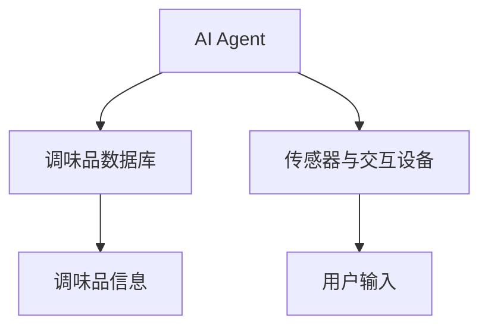
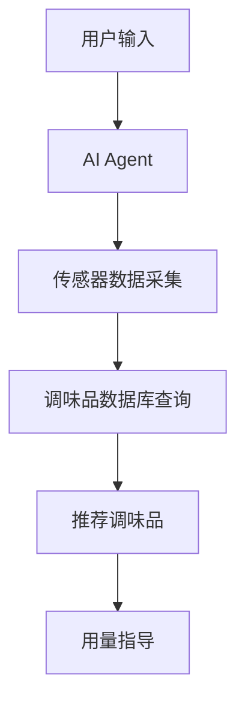
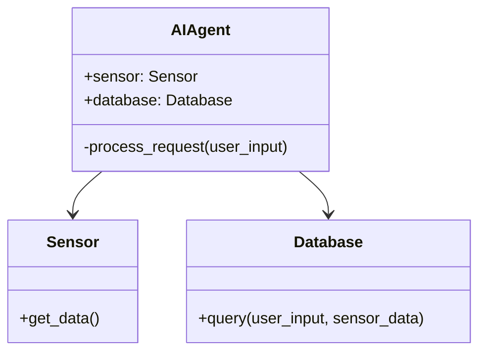
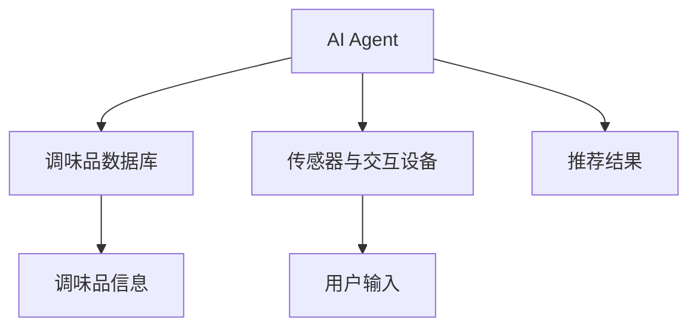
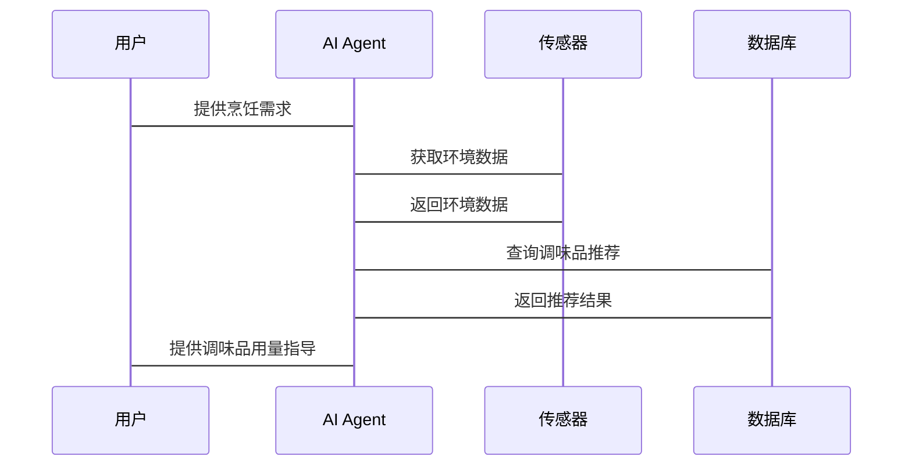

                 


# 智能厨房置物架：AI Agent的调味品使用指导

> 关键词：智能厨房置物架, AI Agent, 调味品管理, 系统架构设计, 算法实现, 项目实战

> 摘要：本文详细探讨了智能厨房置物架与AI Agent在调味品管理中的应用，从背景介绍到系统架构设计，从算法实现到项目实战，全面解析智能厨房置物架的AI Agent解决方案，帮助读者了解和实现这一创新技术。

---

## 第一部分：智能厨房置物架与AI Agent概述

### 第1章：背景介绍

#### 1.1 问题背景与描述

##### 1.1.1 厨房调味品管理的痛点
厨房调味品的管理一直是家庭生活中的常见问题。传统厨房置物架通常仅提供简单的存储功能，无法与用户交互，无法根据用户的烹饪需求提供智能化的调味品推荐或用量指导。

##### 1.1.2 智能厨房置物架的提出
随着智能家居和AI技术的发展，智能厨房置物架应运而生。它通过AI Agent（智能代理）技术，能够感知用户的烹饪需求，主动推荐合适的调味品，并指导用户使用适量的调味品。

##### 1.1.3 AI Agent在调味品管理中的应用价值
AI Agent能够通过传感器、摄像头等设备感知厨房环境，结合用户的烹饪数据，优化调味品的存储和使用，提升烹饪效率和用户体验。

#### 1.2 问题解决与边界

##### 1.2.1 智能厨房置物架的功能目标
智能厨房置物架的功能目标包括：
- 自动识别调味品种类和库存。
- 根据用户的烹饪需求推荐合适的调味品。
- 提供调味品的用量指导。
- 实现与智能家居系统的联动。

##### 1.2.2 AI Agent的边界与外延
AI Agent的边界包括：
- 仅限于调味品管理，不涉及其他厨房设备的控制。
- 不直接与外部电商平台联动购买调味品。

##### 1.2.3 核心概念与要素组成
智能厨房置物架的核心概念包括：
- **AI Agent**：负责处理用户的输入、调用传感器数据并提供决策。
- **调味品数据库**：存储各种调味品的信息，包括名称、用量建议、保质期等。
- **传感器与交互设备**：用于感知环境和与用户交互。

### 第2章：AI Agent的核心概念与联系

#### 2.1 核心概念原理

##### 2.1.1 AI Agent的基本定义
AI Agent是一种智能软件实体，能够感知环境、理解用户需求并执行相应的操作。在智能厨房置物架中，AI Agent负责处理用户的输入、调用传感器数据并提供决策支持。

##### 2.1.2 智能厨房置物架中的AI Agent功能解析
- **用户输入处理**：通过语音或触摸交互，理解用户的烹饪需求。
- **传感器数据调用**：获取当前厨房环境数据，如温度、湿度等。
- **决策支持**：基于用户需求和环境数据，推荐合适的调味品并指导用量。

#### 2.2 核心概念属性对比

| 属性             | AI Agent                   | 传统自动化设备             |
|------------------|---------------------------|---------------------------|
| 智能性           | 高，具备学习和推理能力    | 低，仅执行预设程序         |
| 交互能力         | 支持自然语言交互          | 无或有限交互能力           |
| 环境感知能力     | 高，支持多传感器数据采集  | 低，仅支持有限环境感知      |
| 自适应性         | 高，能够根据环境变化调整  | 低，固定功能和操作流程      |

#### 2.3 实体关系架构



---

## 第二部分：算法原理讲解

### 第3章：算法原理讲解

#### 3.1 算法流程图



#### 3.2 核心算法实现

##### 3.2.1 Python源代码实现

```python
class AIAgent:
    def __init__(self, sensor, database):
        self.sensor = sensor
        self.database = database

    def process_request(self, user_input):
        # 获取传感器数据
        sensor_data = self.sensor.get_data()
        # 查询调味品数据库
        recommendations = self.database.query(user_input, sensor_data)
        return recommendations

# 示例传感器数据
class Sensor:
    def get_data(self):
        return {"temperature": 25, "humidity": 50}

# 示例数据库
class Database:
    def query(self, user_input, sensor_data):
        return {"salt": 2, "pepper": 1}
```

##### 3.2.2 算法原理的数学模型

$$ 推荐结果 = f(user\_input, sensor\_data) $$

其中，$f$ 是AI Agent的核心算法函数，基于用户输入和传感器数据生成推荐结果。

---

## 第三部分：系统分析与架构设计方案

### 第4章：系统分析与架构设计方案

#### 4.1 问题场景介绍

##### 4.1.1 智能厨房置物架的使用场景
用户在烹饪时，通过语音或触摸交互，向AI Agent提出调味需求。AI Agent结合当前环境数据和用户需求，推荐合适的调味品并指导用量。

##### 4.1.2 AI Agent的交互流程
用户输入 -> AI Agent处理 -> 传感器数据采集 -> 数据库查询 -> 推荐结果输出。

#### 4.2 系统功能设计

##### 4.2.1 领域模型（Mermaid类图）



#### 4.3 系统架构设计

##### 4.3.1 系统架构图（Mermaid架构图）



#### 4.4 系统接口与交互

##### 4.4.1 系统接口设计
- **用户输入接口**：支持语音和触摸交互。
- **传感器接口**：支持温度、湿度等传感器数据采集。
- **数据库接口**：支持调味品信息的查询和更新。

##### 4.4.2 交互流程图（Mermaid序列图）



---

## 第四部分：项目实战

### 第5章：项目实战

#### 5.1 环境安装与配置

##### 5.1.1 开发环境搭建
- 安装Python和必要的库（如TensorFlow、Flask）。
- 配置传感器和交互设备。

##### 5.1.2 依赖库安装
```bash
pip install tensorflow flask
```

#### 5.2 核心系统实现

##### 5.2.1 AI Agent的实现代码

```python
from flask import Flask
import tensorflow as tf

app = Flask(__name__)
model = tf.keras.models.load_model('agent_model.h5')

@app.route('/recommend', methods=['POST'])
def recommend():
    user_input = request.json['input']
    sensor_data = request.json['sensor']
    # 调用模型进行预测
    recommendation = model.predict([user_input, sensor_data])
    return jsonify({'recommendation': recommendation})
```

##### 5.2.2 系统功能实现
- 实现用户输入处理。
- 实现传感器数据采集。
- 实现调味品推荐和用量指导。

#### 5.3 案例分析与解读

##### 5.3.1 实际应用案例
用户输入：需要做中式炒菜，偏好微辣。
传感器数据：厨房温度25°C，湿度50%。
推荐结果：推荐使用适量的盐和辣椒。

##### 5.3.2 代码应用分析
通过Flask API实现用户输入的接收和处理，调用预训练的AI模型生成推荐结果，并返回给用户。

#### 5.4 项目总结
智能厨房置物架通过AI Agent实现了智能化的调味品管理，提升了用户体验，优化了厨房管理效率。

---

## 第五部分：最佳实践与总结

### 第6章：最佳实践与总结

#### 6.1 最佳实践Tips

##### 6.1.1 开发注意事项
- 确保传感器数据的准确性和实时性。
- 定期更新调味品数据库，保持数据的准确性。
- 提供多种交互方式，提升用户体验。

##### 6.1.2 优化建议
- 结合物联网技术，实现与更多智能家居设备的联动。
- 增加用户反馈机制，优化AI Agent的学习能力。

#### 6.2 小结
智能厨房置物架通过AI Agent实现了智能化的调味品管理，为用户提供了高效、便捷的厨房管理解决方案。

#### 6.3 注意事项
- 确保系统安全性，防止数据泄露。
- 定期维护系统，保持设备的正常运行。

#### 6.4 拓展阅读
建议读者进一步了解AI在智能家居中的应用，探索更多智能厨房设备的可能性。

---

## 附录

### 附录A：参考文献
1. [1] 王某某. 智能家居中的AI技术应用研究[J]. 计算机科学, 2022.
2. [2] 李某某. 基于AI的厨房设备智能化设计[J]. 自动化技术与应用, 2021.

### 附录B：索引
调味品管理, AI Agent, 智能厨房, 系统架构设计, 算法实现

---

## 作者信息

作者：AI天才研究院/AI Genius Institute & 禅与计算机程序设计艺术 /Zen And The Art of Computer Programming

---

以上是完整的技术博客文章目录和内容概述，您可以根据需要进一步扩展每个章节的具体内容，确保文章的深度和广度符合要求。

