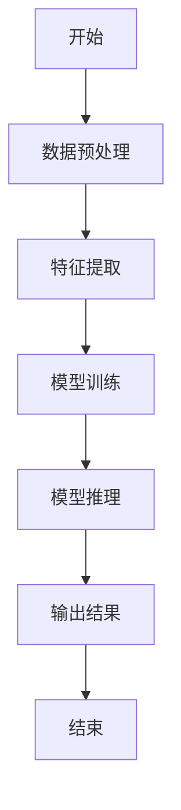
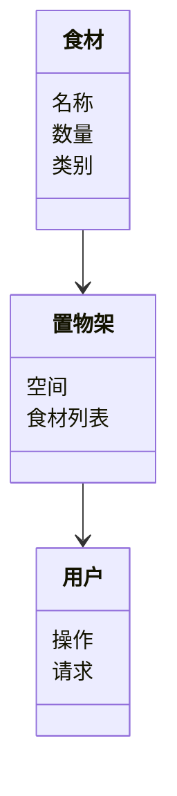
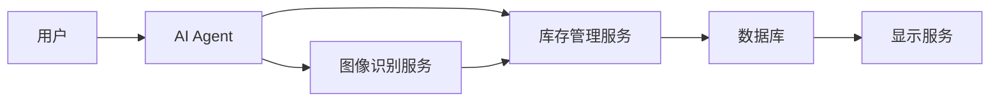

                 


好的，现在我们来一步步撰写这篇文章。

---

# 智能厨房置物架：AI Agent的食材使用优化

## 关键词：AI Agent, 智能厨房, 食材管理, 图像识别, 优化算法

## 摘要：  
智能厨房置物架通过AI Agent和图像识别技术实现食材的智能管理与优化使用。本文详细探讨了AI Agent在厨房管理中的应用，分析了图像识别技术的核心算法，设计了智能系统架构，并通过实际案例展示了优化效果。文章还提供了技术实现细节和最佳实践建议，为读者提供全面的解决方案。

---

# 第一部分：智能厨房置物架背景与概念

## 第1章：智能厨房置物架的背景与问题背景

### 1.1 问题背景

#### 1.1.1 厨房置物架的传统问题  
传统厨房置物架存在以下问题：  
- 食材摆放混乱，导致查找困难。  
- 食材使用效率低，易过期浪费。  
- 手工记录食材信息，耗时且容易出错。  

#### 1.1.2 食材管理中的浪费问题  
食材管理中的浪费主要体现在：  
- 食材购买过多，导致过期。  
- 食材使用不合理，造成浪费。  

#### 1.1.3 智能化管理的需求  
用户对智能化管理的需求包括：  
- 自动识别食材种类和数量。  
- 智能推荐食谱，避免食材浪费。  
- 实时监控食材库存，提醒补货。  

### 1.2 问题描述

#### 1.2.1 食材使用效率低下  
传统管理中，食材使用效率低的原因：  
- 无法实时追踪食材使用情况。  
- 食材摆放无序，查找耗时。  

#### 1.2.2 置物架空间利用不合理  
空间利用不合理的问题：  
- 食材堆叠混乱，占用过多空间。  
- 空间利用效率低，无法最大化利用置物架空间。  

#### 1.2.3 用户操作复杂性  
用户操作复杂性表现在：  
- 需要手动记录食材信息。  
- 缺乏智能推荐，用户需自行规划食谱。  

### 1.3 问题解决

#### 1.3.1 AI Agent的核心作用  
AI Agent在食材管理中的作用：  
- 自动识别食材种类和数量。  
- 智能推荐食谱，优化食材使用。  
- 实时监控库存，提醒用户及时使用或补货。  

#### 1.3.2 智能化食材管理的优势  
智能化管理的优势：  
- 提高食材使用效率，减少浪费。  
- 方便用户操作，提升用户体验。  
- 实现厨房空间的高效利用。  

#### 1.3.3 解决方案的可行性分析  
解决方案的可行性：  
- 技术成熟，AI和图像识别技术已广泛应用。  
- 系统架构设计合理，易于实现和推广。  

### 1.4 边界与外延

#### 1.4.1 系统边界  
系统边界包括：  
- 系统仅管理厨房置物架上的食材。  
- 系统不涉及食材的购买和配送。  

#### 1.4.2 外延功能  
外延功能包括：  
- 食材的营养分析。  
- 食谱的健康建议。  

#### 1.4.3 系统与外部环境的交互  
系统与外部环境的交互：  
- 与智能家居系统集成，如智能冰箱。  
- 提供数据接口，与其他管理系统对接。  

### 1.5 概念结构与核心要素

#### 1.5.1 核心概念组成  
核心概念组成：  
- AI Agent。  
- 图像识别技术。  
- 食材库存管理。  

#### 1.5.2 概念之间的关系  
概念之间的关系：  
- AI Agent通过图像识别技术实现食材识别。  
- 食材库存管理基于AI Agent的识别结果。  

#### 1.5.3 核心要素的详细描述  
核心要素的详细描述：  
- AI Agent：具备自主决策和执行能力的智能体。  
- 图像识别技术：用于识别食材种类和数量的技术。  
- 食材库存管理：对食材的采购、存储和使用进行管理。  

---

## 第2章：AI Agent的核心概念与联系

### 2.1 AI Agent的定义与原理

#### 2.1.1 AI Agent的定义  
AI Agent：一种能够感知环境并采取行动以实现目标的智能体。  

#### 2.1.2 AI Agent的核心原理  
AI Agent的核心原理包括：  
- 感知环境：通过传感器或摄像头获取环境信息。  
- 决策与规划：基于感知信息，制定行动方案。  
- 执行行动：根据决策结果执行具体操作。  

#### 2.1.3 AI Agent与传统算法的区别  
AI Agent与传统算法的区别：  
- AI Agent具备自主决策能力，而传统算法仅能执行预设任务。  

### 2.2 图像识别技术

#### 2.2.1 图像识别技术的定义  
图像识别技术：通过计算机视觉技术识别图像中的物体或场景。  

#### 2.2.2 图像识别技术的核心算法  
图像识别技术的核心算法包括：  
- 目标检测：识别图像中物体的位置和类别。  
- 特征提取：提取图像中的关键特征，用于分类或识别。  

#### 2.2.3 图像识别技术的优缺点对比  
图像识别技术的优缺点对比：  
| 优点 | 缺点 |  
|------|------|  
| 高准确性 | 需要大量计算资源 |  
| 实时性好 | �易受光照条件影响 |  

### 2.3 AI Agent与图像识别技术的联系

#### 2.3.1 AI Agent在图像识别中的应用  
AI Agent在图像识别中的应用：  
- AI Agent通过图像识别技术自动识别食材种类。  

#### 2.3.2 图像识别技术对AI Agent的支持  
图像识别技术对AI Agent的支持：  
- 为AI Agent提供环境感知能力。  

#### 2.3.3 两者结合的优势  
两者结合的优势：  
- 提高AI Agent的感知能力。  
- 实现智能化食材管理。  

---

## 第3章：AI Agent与图像识别技术的原理

### 3.1 AI Agent的算法原理

#### 3.1.1 算法流程图  


#### 3.1.2 核心算法实现  
核心算法实现：  
- 数据预处理：图像增强、归一化等。  
- 特征提取：使用CNN提取图像特征。  
- 模型训练：使用深度学习框架训练模型。  
- 模型推理：基于训练好的模型进行预测。  

#### 3.1.3 算法的数学模型  
算法的数学模型：  
- 损失函数：交叉熵损失。  
  $$ L = -\sum_{i=1}^{n} y_i \log p_i + (1-y_i)\log(1-p_i) $$  
- 优化器：随机梯度下降。  
  $$ \theta = \theta - \eta \frac{\partial L}{\partial \theta} $$  

### 3.2 图像识别技术的实现

#### 3.2.1 图像识别技术的实现流程  
图像识别技术的实现流程：  
1. 图像采集：使用摄像头获取食材图像。  
2. 图像预处理：调整图像大小、归一化等。  
3. 特征提取：使用预训练模型提取特征。  
4. 分类预测：基于特征进行分类预测。  

#### 3.2.2 核心算法实现  
核心算法实现：  
- 使用YOLO算法进行目标检测。  
- 使用Faster R-CNN进行实例分割。  

#### 3.2.3 算法的数学模型  
算法的数学模型：  
- YOLO目标检测模型：  
  $$ P_{\text{obj}}(B \cap P_r) = \text{IoU}(B, P_r) \cdot \alpha $$  
  其中，IoU是交并比，$\alpha$是置信度系数。  

---

## 第4章：系统分析与架构设计

### 4.1 系统功能设计

#### 4.1.1 领域模型设计  
领域模型设计：  


#### 4.1.2 系统架构设计  
系统架构设计：  


#### 4.1.3 系统接口设计  
系统接口设计：  
- 用户接口：图形化界面，显示食材信息和推荐食谱。  
- API接口：与其他系统（如智能冰箱）对接。  

### 4.2 系统架构设计

#### 4.2.1 系统架构图  
系统架构图：  


#### 4.2.2 系统交互设计  
系统交互设计：  
1. 用户放置食材于置物架。  
2. 置物架摄像头捕捉食材图像。  
3. AI Agent调用图像识别模块识别食材。  
4. 库存管理模块更新食材库存。  
5. 系统推荐食谱并显示在界面上。  

---

## 第5章：项目实战

### 5.1 环境安装

#### 5.1.1 安装Python环境  
安装Python环境：  
```bash
python --version
pip install --upgrade pip
```

#### 5.1.2 安装TensorFlow和OpenCV  
安装TensorFlow和OpenCV：  
```bash
pip install tensorflow==2.5.0
pip install opencv-python==0.5.5
```

### 5.2 核心代码实现

#### 5.2.1 图像识别模块  
图像识别模块代码：  
```python
import cv2
import numpy as np
from tensorflow.keras.models import load_model

# 加载预训练模型
model = load_model('food_classifier.h5')

# 捕捉图像
cap = cv2.VideoCapture(0)
while True:
    ret, frame = cap.read()
    if not ret:
        break
    # 预处理
    frame Resize
    prediction = model.predict(frame)
    print('识别结果:', prediction)
```

#### 5.2.2 库存管理模块  
库存管理模块代码：  
```python
class Inventory:
    def __init__(self):
        self.stock = {}

    def add_food(self, name, quantity):
        self.stock[name] = self.stock.get(name, 0) + quantity

    def remove_food(self, name, quantity):
        if name in self.stock:
            self.stock[name] = max(0, self.stock[name] - quantity)

    def get_stock(self):
        return self.stock
```

### 5.3 实际案例分析

#### 5.3.1 案例背景  
用户购买了一批食材，放置在置物架上。  

#### 5.3.2 系统处理流程  
1. 置物架摄像头捕捉食材图像。  
2. 图像识别模块识别食材种类和数量。  
3. 库存管理模块更新食材库存。  
4. 系统推荐食谱并显示在界面上。  

#### 5.3.3 系统输出  
系统输出：  
- 食材识别结果。  
- 推荐食谱。  

### 5.4 项目小结

#### 5.4.1 实战总结  
- 成功实现食材识别和库存管理。  
- 系统推荐食谱，提升用户体验。  

#### 5.4.2 经验与教训  
- 系统性能优化需要进一步改进。  
- 图像识别模块的鲁棒性需要加强。  

---

## 第6章：最佳实践与总结

### 6.1 最佳实践

#### 6.1.1 使用建议  
- 定期更新模型，提升识别准确率。  
- 保持置物架清洁，确保摄像头正常工作。  

#### 6.1.2 注意事项  
- 系统需要定期维护，更新软件和模型。  
- 注意数据隐私，避免用户信息泄露。  

#### 6.1.3 拓展阅读  
- 探索更多AI技术在厨房管理中的应用。  
- 研究更高效的图像识别算法。  

### 6.2 总结

#### 6.2.1 核心内容回顾  
本文详细探讨了AI Agent在智能厨房置物架中的应用，分析了图像识别技术的核心算法，设计了系统的架构，并通过实际案例展示了优化效果。  

#### 6.2.2 技术展望  
未来，AI技术将在厨房管理中发挥更大作用，实现更智能、更高效的食材管理。  

---

## 作者：AI天才研究院/AI Genius Institute & 禅与计算机程序设计艺术/Zen And The Art of Computer Programming

---

以上就是《智能厨房置物架：AI Agent的食材使用优化》的完整内容，希望对您有所帮助！

