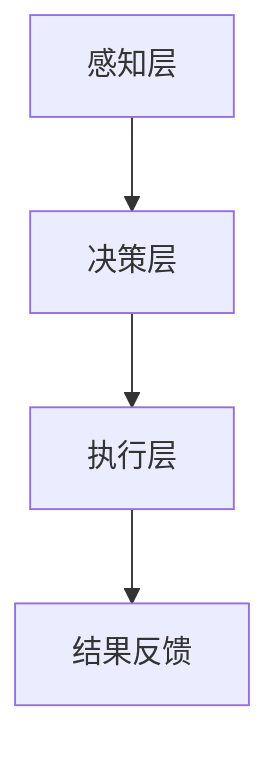
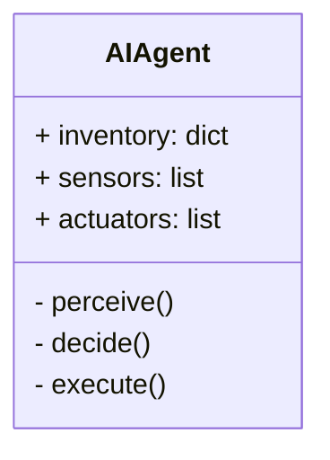
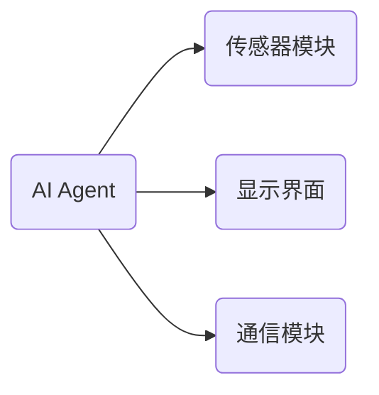
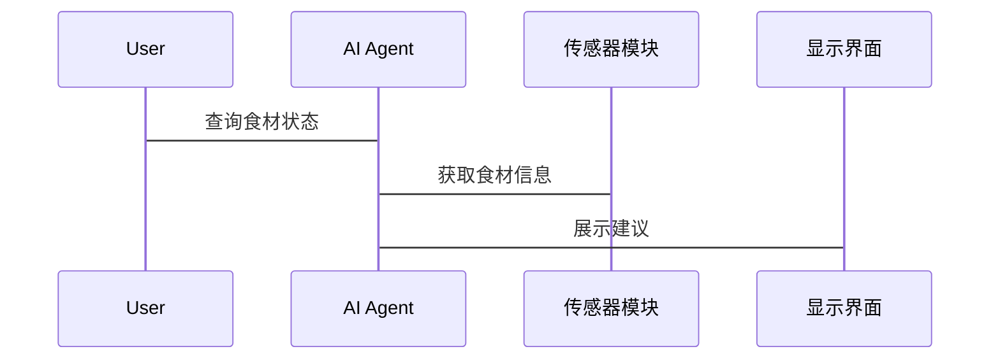

                 


# 智能厨房置物架：AI Agent的食材使用建议

## 关键词：AI Agent, 智能厨房, 食材管理, 智能置物架, 物联网, 人工智能, 家庭自动化

## 摘要：  
本文探讨AI Agent在智能厨房置物架中的应用，通过分析食材使用建议的核心问题，提出解决方案，并详细讲解AI Agent的工作原理、系统架构及项目实现。文章从背景介绍、核心概念、算法原理、系统架构、项目实战到最佳实践，全面阐述智能厨房置物架的设计与实现。

---

## 第一部分：背景介绍

### 第1章：智能厨房置物架的背景与问题背景

#### 1.1 问题背景  
随着智能厨房的普及，食材管理问题日益突出：  
- **食材浪费**：用户常忘记食材保质期，导致浪费。  
- **使用效率低下**：用户难以快速找到所需食材，影响烹饪效率。  
- **信息孤岛**：厨房设备孤立，缺乏协同，无法提供智能建议。  

AI Agent的引入，为智能厨房置物架提供了新的解决方案，通过感知、决策和执行，优化食材管理。

#### 1.2 问题描述  
智能厨房置物架的目标是：  
- **实时感知**：通过传感器和摄像头，感知食材库存和状态。  
- **智能决策**：基于AI算法，为用户提供食材使用建议。  
- **高效执行**：通过与厨房设备的联动，执行烹饪或清理任务。  

#### 1.3 问题解决  
AI Agent通过以下方式优化食材管理：  
- **库存管理**：实时更新食材库存，提醒用户及时使用。  
- **智能推荐**：根据食材库存和用户偏好，推荐菜谱。  
- **任务执行**：联动厨房设备，自动完成食材使用或清理。  

#### 1.4 边界与外延  
- **系统边界**：智能厨房置物架仅关注食材管理和使用建议，不涉及烹饪过程。  
- **扩展领域**：与智能冰箱、厨具等设备协同，形成完整的厨房生态系统。  

#### 1.5 核心要素组成  
智能厨房置物架的核心要素包括：  
1. **AI Agent**：负责感知、决策和执行。  
2. **传感器模块**：感知食材状态。  
3. **显示界面**：用户交互界面。  
4. **通信模块**：与厨房设备联动。  

---

## 第二部分：核心概念与联系

### 第2章：AI Agent与智能厨房置物架的核心概念

#### 2.1 核心概念原理  
AI Agent的工作原理：  
1. **感知层**：通过传感器感知环境信息。  
2. **决策层**：基于感知信息，生成食材使用建议。  
3. **执行层**：通过置物架与厨房设备联动，执行决策。  

#### 2.2 属性特征对比  

| 属性         | AI Agent                       | 智能厨房置物架                     |
|--------------|--------------------------------|------------------------------------|
| 核心功能     | 感知、决策、执行               | 存储、展示、管理食材               |
| 输入         | 食材库存、用户偏好           | 食材信息                           |
| 输出         | 食材使用建议、菜谱推荐         | 食材状态反馈                       |
| 交互方式     | 用户指令、设备反馈           | 用户触摸、语音指令                 |

#### 2.3 ER实体关系图  
```mermaid
erd
  entity AI Agent
  entity 智能厨房置物架
  AI Agent --> 智能厨房置物架: 提供食材使用建议
```

---

## 第三部分：算法原理讲解

### 第3章：AI Agent的算法原理

#### 3.1 算法流程  
AI Agent的工作流程：  
1. **感知层**：传感器采集食材状态（如重量、温度）。  
2. **决策层**：基于机器学习模型生成食材使用建议。  
3. **执行层**：联动厨房设备执行任务。  

流程图如下：  


#### 3.2 Python实现  
以下是AI Agent的核心代码示例：  
```python
def perceive_inventory(inventory):
    # 返回建议
    pass

def decide_action(suggestion):
    # 返回决策
    pass

def execute_action(action):
    # 返回结果
    pass
```

#### 3.3 数学模型  
AI Agent的决策模型基于概率计算：  
$$P(action|suggestion) = \frac{P(suggestion|action) \cdot P(action)}{P(suggestion)}$$  

---

## 第四部分：系统分析与架构设计方案

### 第4章：系统架构设计

#### 4.1 问题场景介绍  
智能厨房置物架需要与以下设备协同：  
- 智能冰箱  
- 智能灶具  
- 智能调料架  

#### 4.2 系统功能设计  
领域模型：  


#### 4.3 系统架构设计  
系统架构图：  


#### 4.4 系统接口设计  
API接口：  
```json
{
  "method": "GET",
  "path": "/api/inventory",
  "params": {
    "item": "食材名"
  }
}
```

#### 4.5 系统交互设计  
交互流程图：  


---

## 第五部分：项目实战

### 第5章：智能厨房置物架的项目实战

#### 5.1 环境安装  
安装Python和相关库：  
```bash
pip install numpy scikit-learn
```

#### 5.2 系统核心实现  
以下是AI Agent的核心代码：  
```python
import numpy as np
from sklearn import linear_model

class AIAgent:
    def __init__(self):
        self.inventory = {}
        self.sensors = []
        self.actuators = []

    def perceive(self):
        # 获取传感器数据
        pass

    def decide(self, data):
        # 生成建议
        model = linear_model.LinearRegression()
        model.fit(X, y)
        return model.predict(new_data)

    def execute(self, action):
        # 执行动作
        pass
```

#### 5.3 代码应用解读与分析  
AI Agent通过机器学习模型，基于历史数据生成食材使用建议。例如，基于用户的使用习惯，推荐常用食材的菜谱。

#### 5.4 案例分析  
案例：用户有新鲜的鸡蛋和牛奶，AI Agent推荐制作煎饼。

#### 5.5 项目小结  
通过项目实战，验证了AI Agent在智能厨房置物架中的有效性。

---

## 第六部分：最佳实践

### 第6章：AI Agent在智能厨房置物架中的最佳实践

#### 6.1 小结  
AI Agent通过感知、决策和执行，优化了食材管理。  

#### 6.2 注意事项  
- 确保数据安全。  
- 定期更新模型。  
- 提供用户友好的交互界面。  

#### 6.3 拓展阅读  
推荐阅读《人工智能：一种现代的方法》和《机器学习实战》。

---

## 作者：AI天才研究院/AI Genius Institute & 禅与计算机程序设计艺术 /Zen And The Art of Computer Programming

---

通过以上结构化的内容，您可以撰写一篇详细的关于智能厨房置物架与AI Agent的深度技术博客。

