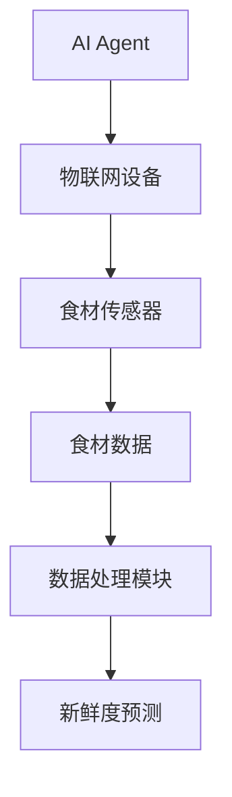
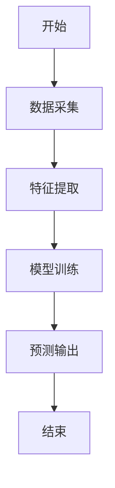
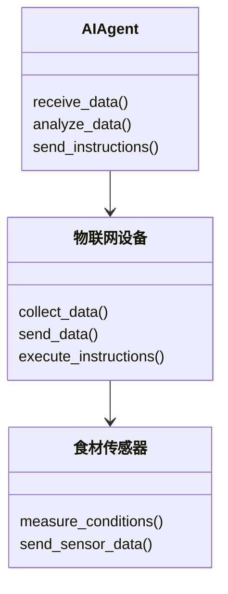
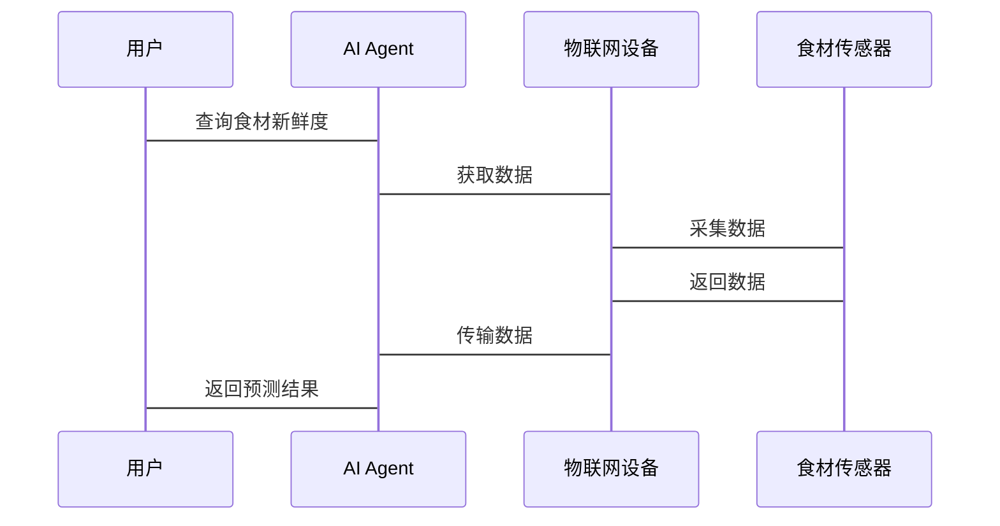

                 


# 智能厨房置物架：AI Agent的食材新鲜度监控

> 关键词：智能厨房，AI Agent，食材新鲜度，物联网，智能家居

> 摘要：本文探讨了智能厨房置物架在食材新鲜度监控中的应用，结合AI Agent和物联网技术，详细介绍其背景、核心概念、算法原理、系统架构及实际应用。

---

# 第一部分：智能厨房置物架背景与概念

## 第1章：智能厨房置物架的背景与问题背景

### 1.1 问题背景

#### 1.1.1 食材管理的痛点
现代家庭中，食材管理是一个常见的问题。食材容易变质，导致浪费和健康问题。传统方法依赖于人工检查，效率低且容易出错。

#### 1.1.2 智能厨房的兴起
智能家居的普及推动了厨房设备的智能化。智能厨房置物架通过物联网和AI技术，实现了食材管理的智能化。

#### 1.1.3 AI技术在智能家居中的应用
AI技术广泛应用于智能家居，如语音助手和环境监控。将AI应用于食材监控，进一步提升了厨房的智能化水平。

### 1.2 问题描述

#### 1.2.1 食材新鲜度监控的必要性
食材新鲜度直接影响健康和烹饪效果，及时监控可以减少浪费。

#### 1.2.2 现有解决方案的不足
传统方法依赖人工检查，效率低，误差大。现有智能设备缺乏AI代理的实时监控和预测功能。

#### 1.2.3 智能厨房置物架的创新点
结合AI代理和物联网技术，实时监控食材状态，提供智能建议，提升管理效率。

### 1.3 问题解决

#### 1.3.1 AI Agent的核心作用
AI代理通过数据采集和分析，实时监控食材状态，提供预测和建议。

#### 1.3.2 物联网技术的应用
物联网设备采集食材数据，AI代理分析数据，实现智能化管理。

#### 1.3.3 数据分析与预测
通过历史数据和机器学习模型，预测食材新鲜度，提前采取措施。

### 1.4 边界与外延

#### 1.4.1 系统功能边界
系统专注于食材新鲜度监控，与其他厨房设备联动。

#### 1.4.2 外延与扩展性
未来可能扩展到更多食材种类和更复杂的厨房管理。

#### 1.4.3 与其他智能家居的联动
与智能冰箱、oven等设备联动，实现更全面的厨房管理。

### 1.5 核心概念与结构

#### 1.5.1 核心要素组成
AI代理、物联网设备、食材传感器、数据处理模块。

#### 1.5.2 概念结构图


#### 1.5.3 核心要素对比表

| 核心要素 | 定义 | 特性 | 作用 |
|----------|------|------|------|
| AI Agent | 自主决策的智能体 | 学习、推理、自适应 | 数据分析与预测 |
| 物联网设备 | 连接物理世界的设备 | 传感器、执行器 | 数据采集与控制 |
| 食材传感器 | 监控食材状态的传感器 | 温度、湿度、气体传感器 | 数据采集 |
| 数据处理模块 | 数据处理与分析模块 | 数据清洗、特征提取、模型训练 | 支持AI代理决策 |

---

## 第2章：核心概念与联系

### 2.1 AI Agent的定义与原理

#### 2.1.1 AI Agent的基本概念
AI Agent是能够感知环境并采取行动以实现目标的智能体。

#### 2.1.2 AI Agent的核心原理
通过感知环境数据，进行推理和决策，执行相应动作。

#### 2.1.3 AI Agent的分类与特点
分为简单反射型、基于模型的反应型、目标驱动型和效用驱动型。

### 2.2 物联网技术的原理

#### 2.2.1 物联网的基本概念
物联网是通过设备连接物理世界，实现数据交换和通信的技术。

#### 2.2.2 物联网的核心技术
包括传感器、通信技术、数据管理与分析。

#### 2.2.3 物联网的应用场景
广泛应用于智能家居、智慧城市、医疗健康等领域。

### 2.3 食材新鲜度监控的实现原理

#### 2.3.1 食材新鲜度的定义
食材的新鲜度通过物理和化学指标评估，如温度、湿度、气体浓度。

#### 2.3.2 监控指标与传感器
常用传感器包括温度传感器、湿度传感器、气体传感器。

#### 2.3.3 数据分析与预测
通过机器学习模型预测食材新鲜度，如线性回归和逻辑回归。

### 2.4 核心概念之间的关系

#### 2.4.1 AI Agent与物联网的协同
AI Agent利用物联网数据进行分析，物联网设备执行AI的决策。

#### 2.4.2 食材新鲜度监控的系统架构
系统包括数据采集层、数据处理层和决策层。

#### 2.4.3 实体关系图（Mermaid）


---

## 第3章：算法原理与实现

### 3.1 算法原理

#### 3.1.1 算法概述
使用机器学习模型预测食材新鲜度，基于历史数据和传感器数据。

#### 3.1.2 算法流程图（Mermaid）



### 3.2 算法实现

#### 3.2.1 数据预处理
清洗数据，处理缺失值和异常值。

#### 3.2.2 特征选择
选择对新鲜度影响较大的特征，如温度、湿度、气体浓度。

#### 3.2.3 模型选择
使用线性回归和逻辑回归模型进行预测。

#### 3.2.4 模型训练与优化
通过交叉验证优化模型参数，提升预测准确率。

### 3.3 数学模型

#### 3.3.1 线性回归模型
$$ y = \beta_0 + \beta_1x_1 + \beta_2x_2 + \ldots + \beta_nx_n $$

#### 3.3.2 逻辑回归模型
$$ P(y=1|x) = \frac{e^{\beta_0 + \beta_1x_1 + \beta_2x_2}}{1 + e^{\beta_0 + \beta_1x_1 + \beta_2x_2}} $$

### 3.4 实现代码

```python
import numpy as np
from sklearn.linear_model import LinearRegression
from sklearn.metrics import accuracy_score

# 数据预处理
data = [...]  # 传感器数据
labels = [...]  # 新鲜度标签

# 特征选择
features = data[['temperature', 'humidity', 'gas_concentration']]

# 模型训练
model = LinearRegression()
model.fit(features, labels)

# 预测
predictions = model.predict(features)
print('预测准确率:', accuracy_score(labels, predictions))
```

---

## 第4章：系统分析与架构设计

### 4.1 系统功能设计

#### 4.1.1 领域模型（Mermaid）



### 4.2 系统架构设计

#### 4.2.1 架构图（Mermaid）


### 4.3 接口设计与交互

#### 4.3.1 接口设计
- 数据采集接口：获取传感器数据。
- 数据分析接口：处理数据并预测新鲜度。
- 用户反馈接口：接收用户指令。

#### 4.3.2 交互流程图（Mermaid）



---

## 第5章：项目实战

### 5.1 环境安装

#### 5.1.1 安装Python环境
安装Python 3.8及以上版本，安装必要的库如numpy、scikit-learn。

### 5.2 核心代码实现

#### 5.2.1 数据采集代码

```python
import serial

ser = serial.Serial('COM3', 9600)
data = ser.readline().decode().strip()
print('传感器数据:', data)
```

#### 5.2.2 数据处理与预测

```python
from sklearn.model_selection import train_test_split
from sklearn.linear_model import LogisticRegression

# 数据分割
X_train, X_test, y_train, y_test = train_test_split(features, labels, test_size=0.2)

# 模型训练
model = LogisticRegression()
model.fit(X_train, y_train)

# 预测
y_pred = model.predict(X_test)
print('预测准确率:', accuracy_score(y_test, y_pred))
```

### 5.3 案例分析

#### 5.3.1 数据分析与结果展示
通过可视化工具展示预测结果，分析模型的准确性和效果。

#### 5.3.2 应用场景解读
在实际厨房环境中，系统如何实时监控食材状态，提供保鲜建议。

### 5.4 项目小结

#### 5.4.1 经验总结
AI代理与物联网技术的结合，提升了食材管理的效率和准确性。

#### 5.4.2 改进建议
优化传感器精度，增加更多食材种类的支持，提升用户体验。

---

## 第6章：最佳实践

### 6.1 小结

#### 6.1.1 核心内容回顾
智能厨房置物架通过AI代理和物联网技术，实现食材新鲜度的智能化监控。

#### 6.1.2 关键技术总结
数据采集、分析与预测，AI代理的设计与实现，系统架构设计。

### 6.2 注意事项

#### 6.2.1 数据隐私与安全
确保食材数据的安全，避免隐私泄露。

#### 6.2.2 系统兼容性
保证系统与不同品牌和型号的厨房设备兼容。

#### 6.2.3 用户体验优化
提升界面设计和用户交互体验，使用户更便捷地使用系统。

### 6.3 拓展阅读

#### 6.3.1 推荐技术书籍
《机器学习实战》、《物联网技术入门与实践》。

#### 6.3.2 建议学习资源
在线课程：Coursera的机器学习课程，Udemy的物联网开发课程。

#### 6.3.3 未来研究方向
研究更先进的AI算法，如深度学习在食材监控中的应用，探索多模态数据融合技术。

---

# 作者

作者：AI天才研究院/AI Genius Institute & 禅与计算机程序设计艺术/Zen And The Art of Computer Programming

---

这篇文章系统地介绍了智能厨房置物架在食材新鲜度监控中的应用，详细阐述了AI Agent和物联网技术的核心原理、系统架构和实际实现。通过理论与实践的结合，为读者提供了全面的技术视角和实际操作指南。

