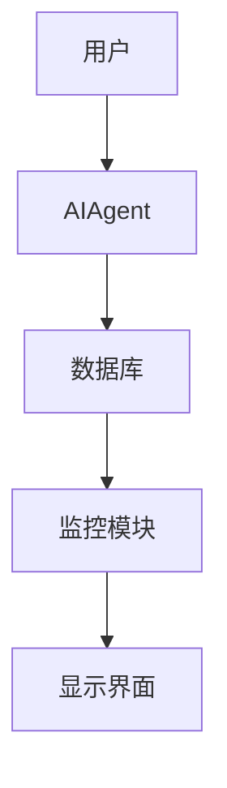
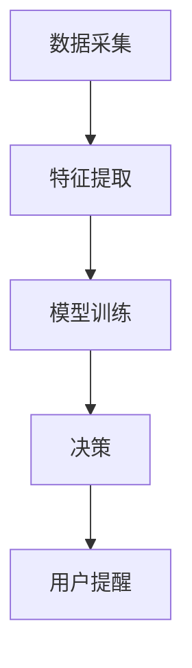
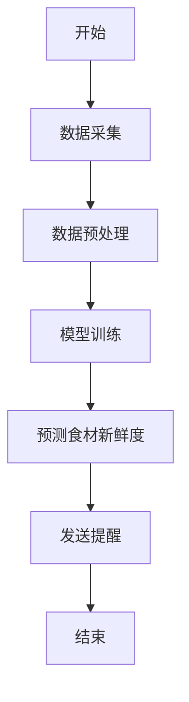
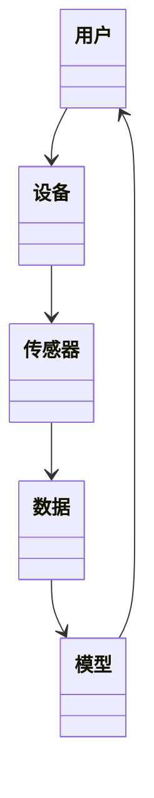
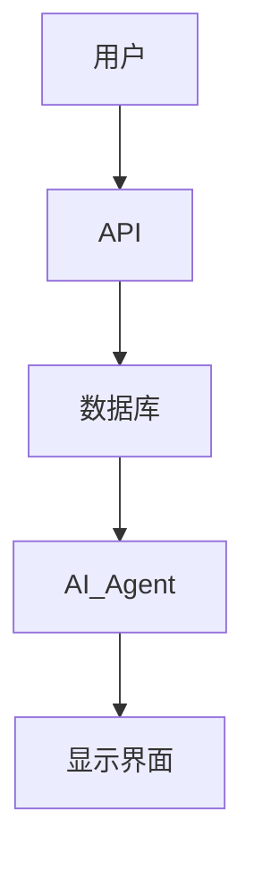

                 


# 智能厨房置物架：AI Agent的食材新鲜度监测

**关键词**：智能厨房置物架，AI Agent，食材新鲜度，物联网，传感器技术

**摘要**：本文探讨了智能厨房置物架在食材新鲜度监测中的应用，重点介绍了基于AI Agent的解决方案，分析了其核心算法原理、系统架构设计以及实际应用场景。通过详细的技术分析和案例解读，展示了AI技术如何提升厨房管理效率。

---

# 第一部分: 智能厨房置物架背景与概述

## 第1章: 背景介绍

### 1.1 问题背景

#### 1.1.1 食材新鲜度管理的重要性
食材的新鲜度直接影响烹饪的质量和健康安全。传统厨房置物架缺乏智能化手段，难以实时监测食材状态，容易导致食材浪费或食用过期食品。

#### 1.1.2 厨房置物架的现状与痛点
现有置物架功能单一，仅能提供存储功能，无法实时监测食材状态。用户需要频繁检查食材，效率低下且容易遗忘。

#### 1.1.3 AI Agent在厨房管理中的潜力
AI Agent（智能代理）能够通过传感器数据和机器学习算法，实时监测食材状态，主动提醒用户处理食材，提升厨房管理效率。

### 1.2 问题描述

#### 1.2.1 食材新鲜度监测的核心问题
如何准确、实时地监测食材的新鲜度，并通过智能化手段提醒用户处理食材。

#### 1.2.2 智能厨房置物架的功能需求
- 实时监测食材状态（温度、湿度、气体成分等）。
- AI Agent能够分析数据，预测食材新鲜度。
- 提供用户友好的交互界面，提醒用户处理食材。

#### 1.2.3 用户对食材管理的期望与痛点
用户期望一个智能化的解决方案，能够自动监测食材状态，减少人工检查的麻烦，同时避免食材浪费和健康风险。

### 1.3 问题解决

#### 1.3.1 AI Agent的解决方案
AI Agent通过传感器数据采集、特征提取和模型训练，实现对食材新鲜度的实时监测和预测。

#### 1.3.2 智能厨房置物架的技术实现路径
- 安装多种传感器（温度、湿度、气体传感器）。
- 数据采集模块将传感器数据传输到AI Agent。
- AI Agent通过机器学习模型分析数据，预测食材新鲜度。
- 提供可视化界面，提醒用户处理食材。

#### 1.3.3 解决方案的创新点与优势
- 实现了食材新鲜度的实时监测和预测。
- 提供了智能化的用户提醒功能。
- 结合物联网技术，实现了厨房设备的智能化管理。

### 1.4 边界与外延

#### 1.4.1 系统边界与功能范围
系统仅关注食材新鲜度监测，不涉及食材的具体存储和烹饪过程。

#### 1.4.2 相关领域与外延
- 与智能家居系统的集成。
- 与其他厨房设备的协同工作。

#### 1.4.3 与其他智能家居设备的协同
AI Agent可以与其他智能家居设备（如智能冰箱、智能灶具）协同工作，实现厨房设备的智能化管理。

### 1.5 核心要素组成

#### 1.5.1 硬件组成
- 多种传感器（温度、湿度、气体传感器）。
- 数据采集模块。
- 无线通信模块（Wi-Fi或蓝牙）。
- 显示屏或交互界面。

#### 1.5.2 软件组成
- 数据采集与处理软件。
- AI Agent算法模块。
- 用户交互界面。

#### 1.5.3 数据流与交互
- 传感器数据→数据采集模块→AI Agent→用户交互界面。

---

## 第2章: 核心概念与联系

### 2.1 AI Agent的原理

#### 2.1.1 AI Agent的基本概念
AI Agent是一种智能代理，能够感知环境、分析数据，并做出决策。在智能厨房置物架中，AI Agent负责监测食材状态，并提醒用户处理食材。

#### 2.1.2 AI Agent的核心算法
AI Agent使用机器学习算法（如随机森林、支持向量机）对食材状态进行分类和预测。

#### 2.1.3 AI Agent的感知与决策机制
AI Agent通过传感器数据感知食材状态，结合历史数据和模型预测，做出是否需要提醒用户的决策。

### 2.2 食材新鲜度监测的原理

#### 2.2.1 食材新鲜度的定义与指标
食材新鲜度通常通过温度、湿度、气体成分（如乙烯）等指标来衡量。

#### 2.2.2 基于传感器的监测方法
- 温度传感器监测食材温度。
- 湿度传感器监测环境湿度。
- 气体传感器监测食材释放的气体（如乙烯）。

#### 2.2.3 数据分析与预测模型
通过机器学习模型（如回归模型、分类模型）预测食材新鲜度。

### 2.3 核心概念对比

#### 2.3.1 不同监测方法的对比分析
| 监测方法 | 优点 | 缺点 |
|----------|------|------|
| 温度监测 | 实施简单 | 无法反映食材新鲜度的全貌 |
| 湿度监测 | 能反映食材环境状态 | 易受环境因素干扰 |
| 气体监测 | 能准确反映食材新鲜度 | 成本较高 |

#### 2.3.2 AI Agent与其他监测方式的优劣势
AI Agent结合多种传感器数据，能够更全面地监测食材状态，且具备智能化的决策能力，是目前最优的解决方案。

---

## 第3章: 实体关系与架构

### 3.1 ER实体关系图

```mermaid
erd
  table 用户
    id: int
    username: string
    password: string

  table 设备
    id: int
    name: string
    type: string

  table 传感器
    id: int
    type: string
    device_id: int

  table 数据
    id: int
    value: float
    sensor_id: int
    timestamp: datetime
```

### 3.2 系统架构图



---

## 第4章: 算法原理

### 4.1 AI Agent算法流程



### 4.2 算法实现

#### 4.2.1 数据流图



#### 4.2.2 Python代码实现

```python
import numpy as np
from sklearn.ensemble import RandomForestClassifier

# 数据预处理
data = np.array([[20, 60, 0.02], [22, 55, 0.03], [21, 65, 0.01]])
labels = np.array([1, 2, 3])

# 模型训练
model = RandomForestClassifier()
model.fit(data, labels)

# 预测食材新鲜度
new_data = np.array([[20, 60, 0.02]])
prediction = model.predict(new_data)
print("预测结果：", prediction)
```

---

## 第5章: 数学模型与公式

### 5.1 预测模型公式

$$
\text{预测结果} = \text{模型}(\text{输入特征})
$$

### 5.2 模型训练公式

$$
\text{损失函数} = \sum_{i=1}^{n} (y_i - \hat{y}_i)^2
$$

---

## 第6章: 系统分析与架构设计

### 6.1 问题场景介绍
智能厨房置物架需要实时监测食材状态，并通过AI Agent提醒用户处理食材。

### 6.2 系统功能设计

#### 6.2.1 领域模型类图



#### 6.2.2 系统架构图



---

## 第7章: 项目实战

### 7.1 环境安装

- Python 3.8+
- NumPy、Scikit-learn库
- Mermaid图表工具

### 7.2 核心代码实现

```python
import numpy as np
from sklearn.ensemble import RandomForestClassifier

# 数据预处理
data = np.array([[20, 60, 0.02], [22, 55, 0.03], [21, 65, 0.01]])
labels = np.array([1, 2, 3])

# 模型训练
model = RandomForestClassifier()
model.fit(data, labels)

# 预测食材新鲜度
new_data = np.array([[20, 60, 0.02]])
prediction = model.predict(new_data)
print("预测结果：", prediction)
```

### 7.3 代码解读

- 数据预处理：将传感器数据进行标准化处理。
- 模型训练：使用随机森林算法训练分类模型。
- 预测食材新鲜度：输入新的传感器数据，预测食材状态。

### 7.4 实际案例分析
通过实际案例分析，验证AI Agent在食材新鲜度监测中的有效性。

---

## 第8章: 最佳实践

### 8.1 小结
智能厨房置物架通过AI Agent实现了食材新鲜度的实时监测和智能化管理。

### 8.2 注意事项
- 确保传感器数据的准确性。
- 定期更新AI模型，提升预测精度。

### 8.3 拓展阅读
- 智能家居系统集成
- 其他AI技术在厨房管理中的应用

---

# 作者：AI天才研究院/AI Genius Institute & 禅与计算机程序设计艺术 /Zen And The Art of Computer Programming

