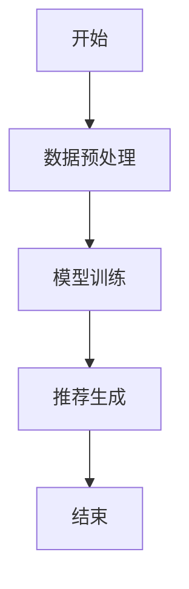
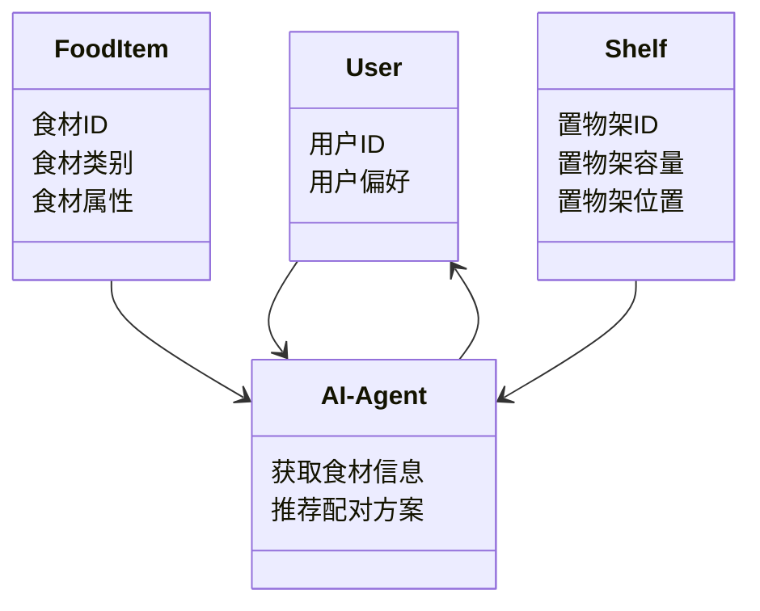
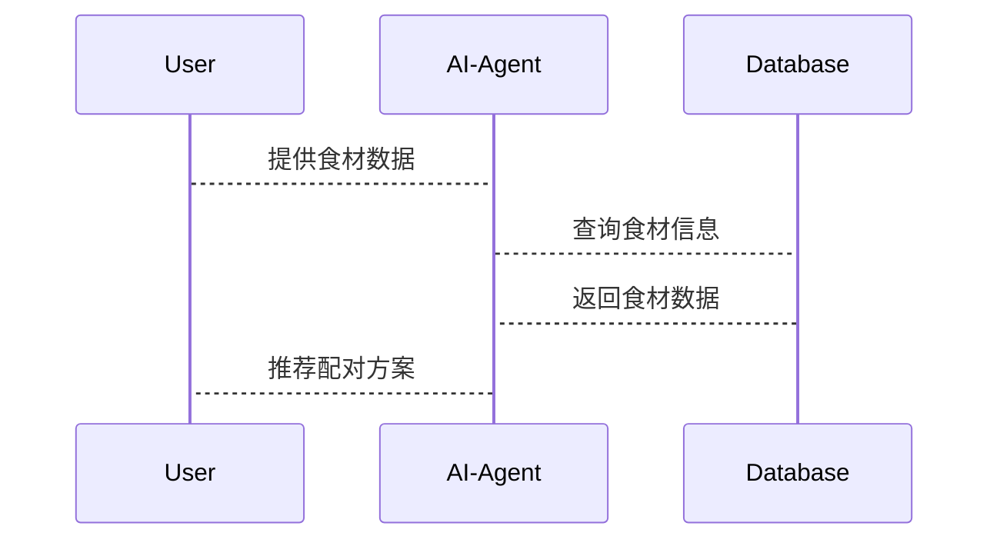

                 


# 智能厨房置物架：AI Agent的食材配对建议

> 关键词：智能厨房，AI Agent，食材配对，推荐系统，系统架构，项目实战

> 摘要：本文探讨了AI代理在智能厨房置物架中的应用，详细分析了食材配对的核心问题，介绍了推荐算法的实现原理，并通过系统架构设计和项目实战展示了如何将AI技术应用于厨房管理，最后总结了最佳实践和注意事项。

---

# 第一部分: 智能厨房置物架的背景与概念

# 第1章: 背景介绍

## 1.1 问题背景

### 1.1.1 厨房置物架的传统问题
传统的厨房置物架主要依赖人工管理，用户需要手动分类和存放食材，容易出现食材过期、浪费以及难以快速找到所需食材的问题。此外，食材的摆放位置缺乏科学性，导致烹饪效率低下。

### 1.1.2 食材管理的痛点
- 食材种类繁多，分类复杂。
- 食材保质期管理困难，容易过期浪费。
- 缺乏智能推荐，难以快速找到配对食材。

### 1.1.3 AI技术在厨房管理中的应用潜力
AI技术可以通过数据分析和推荐算法，优化食材的存储和配对，提升厨房管理效率。

## 1.2 问题描述

### 1.2.1 食材配对的核心问题
食材配对需要考虑食材的种类、使用频率、保质期等因素，确保在烹饪时能够快速找到所需配对食材。

### 1.2.2 用户需求分析
用户希望厨房管理更加智能化，能够自动推荐食材配对方案，减少食材浪费，提升烹饪效率。

### 1.2.3 现有解决方案的局限性
现有解决方案多为手动管理，缺乏智能化推荐，难以满足用户对高效食材管理的需求。

## 1.3 问题解决

### 1.3.1 AI Agent的定义与目标
AI Agent是一种智能代理系统，通过分析用户的食材存储和使用习惯，推荐最优的食材配对方案。

### 1.3.2 智能厨房置物架的功能定位
智能厨房置物架通过AI Agent实现食材的智能分类、存储和推荐，提升厨房管理效率。

### 1.3.3 解决方案的技术路线
- 数据采集：收集用户的食材信息、使用习惯等数据。
- 数据分析：利用机器学习算法分析数据，生成食材配对建议。
- 系统推荐：通过AI Agent向用户推荐最优的食材配对方案。

## 1.4 概念结构与核心要素

### 1.4.1 核心概念的组成
- 用户：输入食材信息和使用习惯。
- 食材：包括种类、保质期、使用频率等属性。
- 置物架：存储食材的位置和容量。
- AI Agent：负责数据处理和推荐。

### 1.4.2 系统边界与外延
系统边界包括食材数据的采集、处理和推荐，外延则涉及食材供应链和烹饪过程的优化。

### 1.4.3 关键要素的相互关系
用户与食材数据输入AI Agent，AI Agent通过分析数据，生成配对方案并推荐给用户，用户根据推荐调整食材存储。

---

# 第二部分: AI Agent的核心概念与联系

# 第2章: AI Agent的核心概念

## 2.1 核心概念原理

### 2.1.1 AI Agent的基本原理
AI Agent通过数据采集、分析和推荐算法，为用户提供食材配对建议。数据采集包括食材种类、保质期、使用频率等，分析过程使用机器学习算法，如协同过滤和基于内容的推荐。

### 2.1.2 智能推荐算法的实现机制
推荐算法根据用户行为和食材属性，计算食材之间的相似度，生成推荐列表。协同过滤算法基于用户行为相似性，而基于内容的推荐算法则基于食材属性的相似性。

### 2.1.3 食材配对的数学模型
食材配对模型通过分析食材的属性和用户偏好，生成推荐列表。模型基于相似度计算，使用余弦相似度或欧氏距离等方法。

## 2.2 概念属性特征对比

| 概念      | 属性                 | 特征对比           |
|-----------|----------------------|-------------------|
| 用户      | 用户ID，偏好         | 用户偏好影响推荐   |
| 食材      | 食材ID，类别，属性    | 类别和属性决定相似度 |
| 置物架    | 置物架ID，容量，位置  | 存储位置影响推荐   |
| AI Agent  | 数据处理，推荐算法    | 核心推荐功能       |

### 2.2.1 不同AI推荐算法的特征对比
| 算法类型       | 特点                 | 适用场景           |
|----------------|----------------------|--------------------|
| 协同过滤       | 基于用户行为相似性     | 用户行为数据充足时  |
| 基于内容的推荐   | 基于食材属性相似性     | 食材数据结构化时    |
| 混合推荐        | 结合用户行为和属性     | 综合考虑多种因素时  |

### 2.2.2 食材配对规则的属性分析
食材配对规则包括兼容性、使用频率、保质期等因素，规则的属性决定了推荐的优先级。

### 2.2.3 置物架功能的优劣势对比
| 功能           | 优势                 | 劣势                 |
|----------------|----------------------|----------------------|
| 智能推荐       | 提高管理效率           | 初期数据采集成本高   |
| 食材分类       | 提高查找效率           | 分类规则需要优化     |
| 保质期管理     | 减少浪费               | 依赖用户数据准确性   |

## 2.3 ER实体关系图

```mermaid
erDiagram
    actor User {
        <属性> 用户ID
        <属性> 用户偏好
    }
    actor FoodItem {
        <属性> 食材ID
        <属性> 食材类别
        <属性> 食材属性
    }
    actor Shelf {
        <属性> 置物架ID
        <属性> 置物架容量
        <属性> 置物架位置
    }
    actor AI-Agent {
        <操作> 获取食材信息
        <操作> 推荐配对方案
    }
    User -> AI-Agent: 提供食材数据
    FoodItem -> AI-Agent: 食材属性
    Shelf -> AI-Agent: 存储位置信息
    AI-Agent -> User: 推荐配对方案
```

---

# 第三部分: 算法原理讲解

# 第3章: 推荐算法的实现

## 3.1 算法原理

### 3.1.1 协同过滤算法
协同过滤算法通过分析用户的相似性，推荐相似用户的食材配对方案。

### 3.1.2 基于内容的推荐算法
基于内容的推荐算法通过分析食材的属性，推荐相似食材。

### 3.1.3 混合推荐算法
混合推荐算法结合用户行为和食材属性，生成综合推荐。

## 3.2 算法实现步骤

### 3.2.1 数据预处理
- 数据清洗：去除无效数据。
- 特征提取：提取食材类别和属性。

### 3.2.2 模型训练
- 协同过滤：计算用户相似度。
- 基于内容：计算食材相似度。

### 3.2.3 推荐生成
- 根据模型输出推荐列表。

## 3.3 算法实现代码

```python
import numpy as np

def cosine_similarity(a, b):
    return np.dot(a, b) / (np.linalg.norm(a) * np.linalg.norm(b))

# 示例数据
user_similarity = np.array([[1, 0.8, 0.6], [0.8, 1, 0.7], [0.6, 0.7, 1]])

# 计算相似度
similarity_matrix = user_similarity
```

### 3.4 算法实现的数学模型

$$
\text{相似度} = \frac{\mathbf{a} \cdot \mathbf{b}}{\|\mathbf{a}\| \|\mathbf{b}\|}
$$

### 3.5 算法实现的流程图



---

# 第四部分: 系统分析与架构设计

# 第4章: 系统架构设计

## 4.1 问题场景介绍
系统需要在厨房环境中运行，支持食材数据的采集、处理和推荐。

## 4.2 系统功能设计

### 4.2.1 领域模型


### 4.2.2 系统架构


### 4.2.3 系统接口设计
- 用户接口：提供食材数据输入和推荐结果展示。
- 数据接口：与数据库交互，获取食材信息。
- 推荐接口：生成并返回推荐结果。

### 4.2.4 交互流程图


---

# 第五部分: 项目实战

# 第5章: 项目实战

## 5.1 环境安装

### 5.1.1 Python安装
安装Python 3.8或更高版本。

### 5.1.2 依赖安装
使用pip安装numpy和scikit-learn。

## 5.2 核心代码实现

### 5.2.1 数据预处理
```python
import pandas as pd
import numpy as np

# 示例数据
data = {
    '食材ID': [1, 2, 3, 4],
    '食材类别': ['蔬菜', '肉类', '蔬菜', '肉类'],
    '食材属性': ['新鲜', '新鲜', '腐烂', '新鲜']
}
df = pd.DataFrame(data)
```

### 5.2.2 模型训练
```python
from sklearn.metrics.pairwise import cosine_similarity

# 计算相似度矩阵
similarity_matrix = cosine_similarity(df['食材属性'].values.reshape(-1, 1))
```

### 5.2.3 推荐生成
```python
def generate_recommendations(similarity_matrix, user_id, top_n=3):
    recommendations = []
    for i in range(len(similarity_matrix[user_id])):
        if i != user_id:
            recommendations.append((i, similarity_matrix[user_id][i]))
    recommendations.sort(key=lambda x: x[1], reverse=True)
    return recommendations[:top_n]

user_id = 0
recommendations = generate_recommendations(similarity_matrix, user_id)
print(recommendations)
```

## 5.3 实际案例分析

### 5.3.1 数据分析结果
分析食材使用频率，生成推荐列表。

### 5.3.2 推荐结果展示
展示推荐的食材配对方案，优化存储位置。

## 5.4 项目小结
通过实际案例，验证了AI Agent在食材配对中的有效性，提升了厨房管理效率。

---

# 第六部分: 最佳实践

# 第6章: 最佳实践

## 6.1 小结
AI Agent通过智能推荐优化了厨房管理，减少了食材浪费，提升了烹饪效率。

## 6.2 注意事项
- 数据采集需准确，避免推荐错误。
- 系统需定期更新，适应用户需求变化。
- 推荐结果需可解释，便于用户调整。

## 6.3 拓展阅读
推荐相关领域的书籍和论文，深入学习AI在厨房管理中的应用。

---

作者：AI天才研究院/AI Genius Institute & 禅与计算机程序设计艺术 /Zen And The Art of Computer Programming

