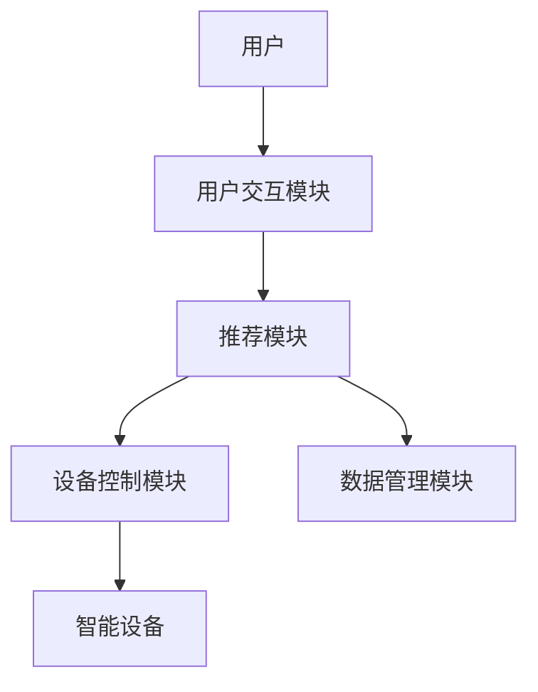

                 


# 智能厨房：AI Agent的菜谱推荐与烹饪指导

---

## 关键词：智能厨房, AI Agent, 菜谱推荐, 烹饪指导, 人工智能, 物联网, 自然语言处理

---

## 摘要：  
智能厨房是人工智能与物联网技术结合的产物，通过AI Agent实现智能化的菜谱推荐与烹饪指导。本文从智能厨房的背景与需求出发，详细探讨AI Agent在菜谱推荐和烹饪指导中的应用原理，涵盖推荐系统算法、烹饪步骤生成、食材识别与交互优化等核心内容。通过系统架构设计与实战案例，展示如何利用AI技术提升厨房体验，最终为读者提供一个全面的智能厨房解决方案。

---

## 第1章: 智能厨房的背景与需求

### 1.1 智能厨房的概念与现状  
#### 1.1.1 智能厨房的定义与特点  
智能厨房是一种结合了物联网、人工智能和大数据技术的现代厨房环境，其特点包括：  
- **智能化**：通过传感器、摄像头等设备实时感知厨房环境。  
- **自动化**：AI Agent能够自动推荐菜谱、指导烹饪步骤，并控制智能设备。  
- **个性化**：根据用户的口味、饮食习惯和健康需求提供定制化服务。  
- **互联性**：与智能家居系统（如冰箱、烤箱、灶具）无缝连接，实现设备间的协同工作。  

#### 1.1.2 当前智能厨房的发展现状  
目前，智能厨房的发展主要集中在以下几个方面：  
1. **设备智能化**：主流厨电厂商（如美的、海尔、西门子）纷纷推出智能设备。  
2. **AI技术应用**：基于深度学习的菜谱推荐系统和自然语言处理的烹饪指导逐渐普及。  
3. **用户需求多样化**：用户对个性化、便捷化、健康化的烹饪体验需求日益增长。  

#### 1.1.3 智能厨房的用户需求分析  
用户在智能厨房中的核心需求包括：  
- 快速获取适合当前食材的菜谱推荐。  
- 通过语音或图像交互获取实时烹饪指导。  
- 自动化管理食材库存，避免浪费。  
- 根据健康数据（如体重、饮食偏好）推荐个性化菜谱。  

### 1.2 AI Agent在智能厨房中的作用  
#### 1.2.1 AI Agent的基本概念  
AI Agent（智能代理）是指能够感知环境、理解用户需求并采取行动以实现目标的智能系统。在智能厨房中，AI Agent主要负责以下任务：  
- 根据用户输入和厨房设备数据推荐菜谱。  
- 提供实时的烹饪步骤指导。  
- 控制智能设备（如调整炉火温度、启动搅拌机）。  

#### 1.2.2 AI Agent在智能厨房中的应用场景  
- **菜谱推荐**：基于用户偏好、库存食材和健康需求，推荐合适的菜谱。  
- **烹饪指导**：通过语音或屏幕显示烹饪步骤，实时纠错和调整建议。  
- **食材管理**：自动识别食材种类和数量，提醒用户补充库存。  
- **健康优化**：根据用户的健康数据（如过敏、营养需求）调整菜谱推荐。  

#### 1.2.3 AI Agent的优势与挑战  
**优势**：  
- 提高烹饪效率，减少用户操作负担。  
- 通过个性化推荐提升用户体验。  
- 实现厨房设备的智能协同，降低能耗。  

**挑战**：  
- 数据隐私问题：AI Agent需要收集用户的健康数据和烹饪行为数据，数据安全和隐私保护是关键问题。  
- 系统稳定性：智能设备的互联互通和AI算法的实时性要求高。  
- 多模态交互：需要同时处理语音、图像和文本等多种交互方式，技术复杂度较高。  

### 1.3 菜谱推荐与烹饪指导的智能化趋势  
#### 1.3.1 菜谱推荐的背景与意义  
随着互联网和移动应用的普及，用户可以通过手机APP获取海量菜谱信息。然而，传统菜谱推荐系统存在以下问题：  
- 推荐结果过于泛滥，缺乏个性化。  
- 数据孤岛问题：不同平台的菜谱数据难以整合。  
- 用户反馈机制不完善，难以实时优化推荐结果。  

#### 1.3.2 烹饪指导的智能化需求  
用户在实际烹饪过程中面临以下痛点：  
- 烹饪步骤复杂，容易出错。  
- 缺乏实时反馈，无法及时纠正错误。  
- 需要根据食材和设备情况动态调整烹饪方案。  

#### 1.3.3 智能厨房的未来发展方向  
未来，智能厨房的发展将朝着以下几个方向迈进：  
- **多模态交互**：结合语音、图像和手势等多种交互方式，提升用户体验。  
- **AI芯片的优化**：通过边缘计算技术，实现更高效的本地化处理。  
- **健康饮食优化**：基于用户健康数据，提供更精准的营养搭配建议。  

---

## 第2章: 菜谱推荐系统的核心原理  

### 2.1 菜谱推荐系统的基础知识  
#### 2.1.1 推荐系统的概念与分类  
推荐系统是一种基于用户行为数据和物品属性数据，向用户推荐感兴趣物品的系统。常见的推荐系统包括：  
- **协同过滤推荐**：基于用户行为的相似性进行推荐。  
- **基于内容的推荐**：基于物品的属性特征进行推荐。  
- **混合推荐模型**：结合协同过滤和内容推荐的优势，提升推荐精度。  

#### 2.1.2 菜谱推荐的核心要素  
菜谱推荐系统的核心要素包括：  
1. **用户特征**：用户的口味偏好、饮食习惯、健康需求等。  
2. **菜品特征**：菜品的分类、口味、所需食材、烹饪难度等。  
3. **场景特征**：当前的烹饪场景（如节日、健康饮食需求）。  

#### 2.1.3 AI Agent在菜谱推荐中的应用  
AI Agent通过以下方式实现菜谱推荐：  
- **自然语言处理**：解析用户的输入（如“今天想做一道清淡的菜”），生成推荐菜谱。  
- **知识图谱**：构建菜谱知识图谱，帮助AI Agent理解菜谱之间的关联关系。  
- **强化学习**：通过用户反馈不断优化推荐算法，提升推荐准确率。  

---

### 2.2 菜谱推荐算法的实现  

#### 2.2.1 协同过滤推荐算法  
协同过滤是一种基于用户行为相似性的推荐算法。以下是其实现步骤：  
1. **数据收集**：收集用户的菜谱点击、收藏、评分等行为数据。  
2. **相似性计算**：通过余弦相似度或皮尔逊相关系数计算用户之间的相似性。  
3. **推荐生成**：根据相似用户的偏好，推荐相似的菜谱。  

#### 2.2.2 基于内容的推荐算法  
基于内容的推荐算法通过分析菜谱的特征（如食材、步骤、口味）进行推荐。以下是其实现步骤：  
1. **特征提取**：提取菜谱的关键词（如“红烧肉”、“清蒸鱼”）。  
2. **文本相似度计算**：使用TF-IDF或BM25算法计算菜谱之间的相似度。  
3. **推荐生成**：根据用户偏好和菜谱相似度生成推荐结果。  

#### 2.2.3 混合推荐模型  
混合推荐模型结合协同过滤和内容推荐的优点，通过加权融合两种算法的推荐结果，提升推荐精度。  

---

## 第3章: 烹饪指导系统的实现  

### 3.1 烹饪指导系统的基础知识  
#### 3.1.1 烹饪指导的核心任务  
烹饪指导系统的任务包括：  
- **步骤生成**：根据菜谱生成烹饪步骤。  
- **食材识别**：通过图像识别技术识别食材种类和数量。  
- **实时反馈**：通过语音交互指导用户完成烹饪过程。  

#### 3.1.2 AI Agent在烹饪指导中的实现  
AI Agent通过以下方式实现烹饪指导：  
- **自然语言处理**：通过语音识别技术接收用户的指令。  
- **图像识别**：通过摄像头识别食材状态。  
- **推理引擎**：根据用户操作和设备状态动态调整烹饪方案。  

---

## 第4章: 智能厨房的系统架构与实现  

### 4.1 系统架构设计  
#### 4.1.1 系统功能模块  
智能厨房系统主要包括以下功能模块：  
- **用户交互模块**：负责与用户的语音、图像交互。  
- **推荐模块**：负责菜谱推荐和烹饪指导。  
- **设备控制模块**：负责控制智能设备（如冰箱、烤箱）。  
- **数据管理模块**：负责用户数据和菜谱数据的存储与管理。  

#### 4.1.2 系统架构图  


### 4.2 系统实现细节  
#### 4.2.1 数据流分析  
1. **用户输入**：用户通过语音或图像输入需求（如“今天想做红烧肉”）。  
2. **数据处理**：系统提取用户需求，匹配数据库中的菜谱。  
3. **推荐生成**：推荐模块生成菜谱和烹饪步骤。  
4. **设备控制**：根据烹饪步骤，控制智能设备执行操作。  

#### 4.2.2 系统交互流程  
1. **用户发起请求**：用户通过手机APP或智能音箱提出需求。  
2. **系统解析需求**：AI Agent解析用户需求，匹配菜谱数据库。  
3. **生成推荐结果**：推荐模块生成菜谱和烹饪步骤。  
4. **设备执行操作**：智能设备根据烹饪步骤执行操作。  
5. **用户反馈**：用户反馈操作结果，系统优化推荐算法。  

---

## 第5章: 项目实战：智能厨房系统开发  

### 5.1 环境配置  
- **开发工具**：Python、TensorFlow、PyTorch、Flask。  
- **数据集**：公开的菜谱数据集（如Food52）。  
- **硬件设备**：摄像头、麦克风、智能设备（如智能音箱）。  

### 5.2 核心代码实现  
#### 5.2.1 菜谱推荐模块  
```python
def recommend_recipe(user_input):
    # 数据预处理
    user_vector = embedding(user_input)
    # 计算相似度
    similarity = cosine_similarity(user_vector, item_vector)
    # 排序并返回推荐结果
    return top_n(similarity)
```

#### 5.2.2 烹饪指导模块  
```python
def cooking_guidance(steps):
    # 步骤解析
    for step in steps:
        # 语音播报
        speak(step)
        # 等待用户确认
        time.sleep(5)
        # 实时监控
        monitor(step)
```

### 5.3 实际案例分析  
以“红烧肉”为例，展示AI Agent如何推荐菜谱并指导烹饪过程：  
1. **用户输入**：“我想做红烧肉”。  
2. **系统推荐**：推荐“经典红烧肉”菜谱。  
3. **烹饪指导**：分步骤指导用户完成烹饪，实时监控烹饪状态。  

---

## 第6章: 总结与展望  

### 6.1 总结  
本文详细探讨了AI Agent在智能厨房中的应用，涵盖菜谱推荐和烹饪指导的核心原理、系统架构与实现。通过项目实战，展示了如何利用AI技术提升厨房体验。  

### 6.2 未来展望  
1. **多模态交互**：结合视觉、听觉和触觉，打造更沉浸式的烹饪体验。  
2. **健康优化**：基于用户健康数据，提供更精准的营养搭配建议。  
3. **边缘计算**：通过AI芯片优化本地化处理能力，提升系统响应速度。  

---

## 作者：AI天才研究院/AI Genius Institute & 禅与计算机程序设计艺术 /Zen And The Art of Computer Programming

