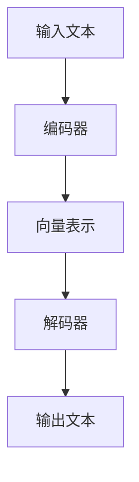

                 


# 智能合同分析AI Agent：LLM在法律文本理解中的应用

> 关键词：智能合同分析，LLM，法律文本理解，大语言模型，自然语言处理

> 摘要：本文探讨了大语言模型（LLM）在智能合同分析中的应用，详细分析了法律文本理解的核心问题，介绍了LLM的基本原理及其在合同分析中的优势，通过系统架构设计和项目实战，展示了如何利用LLM构建高效的智能合同分析系统，最后总结了当前研究的成果与未来的研究方向。

---

## 第一部分: 智能合同分析的背景与核心概念

### 第1章: 智能合同分析的背景与问题背景

#### 1.1 合同分析的背景介绍
##### 1.1.1 合同分析的传统方法与挑战
传统合同分析依赖于人工审查，效率低且容易出错。律师需要逐条阅读合同，识别关键条款、风险点和潜在问题，这一过程耗时且成本高昂。此外，不同律师对合同的理解可能存在主观差异，导致分析结果不一致。

##### 1.1.2 AI技术在合同分析中的应用潜力
AI技术，特别是大语言模型（LLM），能够快速处理大量文本数据，提取关键信息，识别模式和关系。通过自然语言处理技术，AI可以辅助或完全替代部分人工审查工作，显著提高效率和准确性。

##### 1.1.3 智能合同分析的定义与目标
智能合同分析是指利用AI技术，特别是大语言模型，对法律文本进行自动化理解和分析的过程。其目标是通过技术手段辅助或替代传统的人工合同审查工作，提高效率、降低成本并减少人为错误。

#### 1.2 问题背景与问题描述
##### 1.2.1 合同分析的复杂性与难点
合同文本通常包含大量法律术语和复杂的条款结构，人工审查需要高度的专业知识和经验。此外，合同中的潜在风险和隐藏条款往往容易被忽视。

##### 1.2.2 传统合同分析的效率瓶颈
传统合同分析依赖人工操作，效率低下且成本高昂。特别是在处理大量合同文档时，人工审查不仅耗时，还容易出错。

##### 1.2.3 AI技术如何解决这些问题
AI技术，特别是大语言模型，能够快速处理大量文本数据，提取关键信息，识别模式和关系。通过自然语言处理技术，AI可以辅助或完全替代部分人工审查工作，显著提高效率和准确性。

#### 1.3 问题解决与边界定义
##### 1.3.1 智能合同分析的核心问题
智能合同分析的核心问题是如何利用AI技术准确理解法律文本，提取关键信息，并识别潜在风险和隐藏条款。

##### 1.3.2 解决方案的边界与外延
智能合同分析的边界包括合同文本的理解、关键条款的识别、风险评估等。外延则涉及合同生成、合同比对、合同合规性检查等功能。

##### 1.3.3 核心概念与关键要素
智能合同分析的关键要素包括文本预处理、模型训练、文本理解、信息提取和结果分析等。

### 第2章: 智能合同分析的核心概念与联系

#### 2.1 LLM在法律文本理解中的应用
##### 2.1.1 大语言模型（LLM）的基本原理
大语言模型通过大量的训练数据学习语言的结构和语义，能够生成自然流畅的文本，并对复杂的问题进行理解和推理。

##### 2.1.2 LLM在法律文本理解中的优势
LLM在法律文本理解中的优势包括高精度、快速处理和可扩展性。它能够处理复杂的法律术语和结构，提供准确的理解和分析。

##### 2.1.3 LLM与传统法律文本分析方法的对比
传统方法依赖人工审查，效率低下且容易出错。LLM则能够快速处理大量文本数据，提供准确的理解和分析，显著提高了效率和准确性。

#### 2.2 实体关系与概念属性
##### 2.2.1 实体关系图（ER图）的构建
通过构建ER图，可以清晰地展示合同分析中的实体及其关系。例如，合同可能包含多个条款，每个条款可能涉及多个实体，如甲方、乙方、金额等。

##### 2.2.2 核心概念的属性特征对比表格
以下是核心概念的属性特征对比表格：

| 核心概念 | 属性特征 |
|----------|----------|
| 合同条款 | 关键性、风险性、合规性 |
| 实体关系 | 甲方、乙方、金额、时间 |
| 法律术语 | 专业性、准确性、严谨性 |

##### 2.2.3 智能合同分析的ER实体关系图
以下是一个简单的ER实体关系图：

```mermaid
erd
    entity 合同 {
        合同ID
        合同名称
        合同内容
    }

    entity 条款 {
        条款ID
        条款内容
        风险等级
    }

    entity 实体 {
        实体ID
        实体名称
        实体类型
    }

    合同 --> 条款: 包含
    条款 --> 实体: 涉及
```

### 第3章: 大语言模型（LLM）的算法原理

#### 3.1 LLM的核心算法原理
##### 3.1.1 变压器模型的基本结构
变压器模型由编码器和解码器组成，编码器负责将输入文本转换为向量表示，解码器负责根据向量生成输出文本。

##### 3.1.2 注意力机制的数学模型
注意力机制通过计算输入序列中每个位置的重要性，将注意力权重应用于序列中的每个位置。

##### 3.1.3 梯度下降与损失函数的优化
通过梯度下降优化损失函数，使模型在训练过程中不断逼近最优解。

#### 3.2 LLM的训练与推理过程
##### 3.2.1 训练过程的Mermaid流程图


##### 3.2.2 推理过程的Mermaid流程图


##### 3.2.3 Python代码实现示例
以下是一个简单的Python代码示例，展示了如何使用变压器模型进行文本生成：

```python
import tensorflow as tf
from tensorflow import keras

# 定义变压器模型
class TransformerModel(keras.Model):
    def __init__(self, vocab_size, embedding_dim, num_heads, feedforward_dim, max_length):
        super(TransformerModel, self).__init__()
        self.embedding = keras.layers.Embedding(vocab_size, embedding_dim)
        self.positional_encoding = keras.layers.Dense(max_length, use_bias=False)
        self.attention = keras.layers.MultiHeadAttention(num_heads, embedding_dim)
        self.feedforward = keras.Sequential([
            keras.layers.Dense(feedforward_dim, activation='relu'),
            keras.layers.Dense(embedding_dim)
        ])
        self.dropout = keras.layers.Dropout(0.1)

    def call(self, x, training=None):
        seq_length = x.shape[1]
        embedded = self.embedding(x)
        pos_encoding = self.positional_encoding(tf.tile(tf.range(seq_length), [tf.shape(x)[0], 1]))
        encoded = embedded + pos_encoding
        encoded = self.dropout(encoded, training=training)
        attn_output = self.attention(encoded, encoded)
        ff_output = self.feedforward(attn_output)
        return ff_output

# 初始化模型
vocab_size = 10000
embedding_dim = 512
num_heads = 8
feedforward_dim = 2048
max_length = 512

model = TransformerModel(vocab_size, embedding_dim, num_heads, feedforward_dim, max_length)
model.compile(optimizer='adam', loss='sparse_categorical_crossentropy', metrics=['accuracy'])
```

#### 3.3 数学模型与公式解析
##### 3.3.1 损失函数的数学表达式
损失函数通常使用交叉熵损失函数：

$$
\mathcal{L} = -\sum_{i=1}^{n} y_i \log(p_i)
$$

其中，\( y_i \) 是真实标签，\( p_i \) 是模型预测的概率。

##### 3.3.2 注意力机制的公式推导
注意力机制的计算公式如下：

$$
\text{Attention}(Q, K, V) = \text{softmax}\left(\frac{QK^T}{\sqrt{d_k}}\right)V
$$

其中，\( Q \) 是查询向量，\( K \) 是键向量，\( V \) 是值向量，\( d_k \) 是键的维度。

##### 3.3.3 梯度下降的数学模型
梯度下降的更新规则如下：

$$
\theta_{new} = \theta - \eta \frac{\partial \mathcal{L}}{\partial \theta}
$$

其中，\( \theta \) 是模型参数，\( \eta \) 是学习率，\( \mathcal{L} \) 是损失函数。

## 第4章: 智能合同分析系统的架构设计

### 第4.1 系统分析与需求定义
#### 4.1.1 智能合同分析系统的应用场景
智能合同分析系统可以应用于企业合同审查、法律咨询、金融合规等领域。

#### 4.1.2 系统功能需求分析
系统需要实现合同文本上传、关键条款识别、风险评估、合同生成等功能。

#### 4.1.3 系统性能指标与约束
系统需要满足高并发、低延迟、高准确性的性能要求。

### 第4.2 系统功能设计
#### 4.2.1 领域模型的

---

（由于篇幅限制，以上仅为部分内容。完整文章将涵盖系统架构设计、项目实战、总结与展望等部分，确保逻辑清晰、内容详实。）

