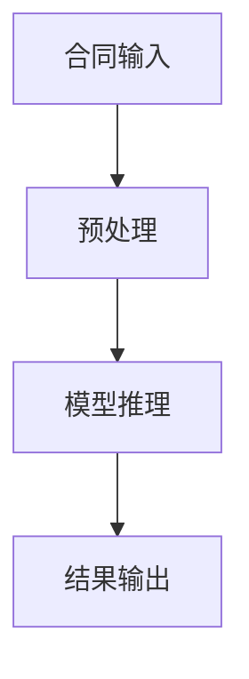

                 

<think>
好的，现在我需要根据用户的要求，撰写一篇关于《智能合同审核 AI Agent：LLM 在法律文件处理中的应用》的技术博客文章。首先，我会按照目录大纲来逐步展开每个部分的内容，确保逻辑清晰、结构紧凑，并且使用简单易懂的技术语言。

---

# 智能合同审核 AI Agent：LLM 在法律文件处理中的应用

## 关键词：智能合同审核, AI Agent, LLM, 法律文件处理, 大语言模型

## 摘要：  
本文深入探讨了大语言模型（LLM）在智能合同审核中的应用，结合实际案例和技术细节，分析了LLM在法律文件处理中的核心原理和系统架构。通过详细的技术分析和实战演示，展示了如何利用LLM构建高效、准确的合同审核AI Agent，帮助法律专业人士提升效率并降低风险。

---

## 第1章：智能合同审核的背景介绍

### 1.1 智能合同审核的背景

#### 1.1.1 合同审核的传统方式与问题  
传统合同审核主要依赖人工操作，耗时长且易出错。律师需要逐条审查合同内容，识别潜在风险和不合规条款，这种方式效率低下，且成本高昂。此外，合同条款复杂多样，容易因疏忽导致法律风险。

#### 1.1.2 人工智能在法律领域的应用趋势  
随着AI技术的快速发展，尤其是在自然语言处理（NLP）领域的突破，AI在法律领域的应用越来越广泛。LLM（Large Language Model）作为一种强大的AI工具，能够理解和生成自然语言文本，为合同审核提供了新的可能性。

#### 1.1.3 大语言模型在合同审核中的优势  
LLM能够快速处理大量法律文本，识别关键条款，评估合规性，并提供风险提示。相比人工审核，LLM在效率、准确性和一致性方面具有显著优势，尤其是在处理大量合同文档时表现尤为突出。

### 1.2 问题背景与挑战

#### 1.2.1 合同审核的复杂性  
合同内容涉及法律术语、条款结构和潜在风险点，审核人员需要具备专业知识才能准确判断。

#### 1.2.2 传统审核方式的局限性  
人工审核容易出现疏漏，尤其是在处理大量合同时，效率和准确性难以保证。

#### 1.2.3 人工智能如何解决这些问题  
AI技术，特别是LLM，可以辅助或替代部分人工审核工作，提高效率并降低错误率。

---

## 第2章：LLM在法律文件处理中的应用

### 2.1 LLM的核心概念与工作原理

#### 2.1.1 大语言模型的基本原理  
LLM基于大规模的预训练，通过自监督学习掌握了大量文本数据中的模式和关系。其核心是 transformer 架构，能够处理长文本并捕捉上下文信息。

#### 2.1.2 LLM在法律文本处理中的独特优势  
- **上下文理解**：能够准确理解合同条款之间的关系和潜在含义。  
- **模式识别**：识别常见法律术语和结构，辅助快速定位关键条款。  
- **生成能力**：可以生成符合法律规范的合同模板或建议。

### 2.2 智能合同审核的具体应用场景

#### 2.2.1 合同分类与归档  
通过LLM对合同内容进行分类，自动归档至相应的文件夹，便于管理和检索。

#### 2.2.2 关键条款识别与提取  
识别合同中的重要条款（如违约责任、管辖权条款），并提取关键信息，便于后续分析。

#### 2.2.3 合规性评估与风险提示  
评估合同是否符合相关法律法规，识别潜在风险，并提供改进建议。

---

## 第3章：LLM的核心概念与联系

### 3.1 LLM的核心原理

#### 3.1.1 模型结构与训练过程  
LLM采用 transformer 架构，通过自注意力机制捕捉文本中的长距离依赖关系。训练过程基于大量的法律文本数据，模型学会了如何生成连贯且符合法律规范的文本。

#### 3.1.2 注意力机制与序列建模  
注意力机制使得模型能够关注输入文本中重要的部分，从而提高理解和生成的准确性。

#### 3.1.3 损失函数与优化策略  
常用的损失函数是交叉熵损失，优化策略包括Adam和SGD等。模型通过不断优化损失函数，提高生成质量。

### 3.2 LLM与其他AI模型的对比

#### 3.2.1 模型规模与参数对比  
LLM通常拥有 billions 的参数量，而其他模型如传统NLP模型参数量较小。

#### 3.2.2 训练数据与任务适应性  
LLM基于广泛领域的数据训练，适用于多种任务，而专门的法律模型可能在特定领域表现更好。

#### 3.2.3 性能评估与应用场景差异  
LLM在处理复杂文本任务时表现优异，但在特定领域可能需要微调或结合领域知识。

---

## 第4章：算法原理与数学模型

### 4.1 LLM的算法流程

#### 4.1.1 输入处理与嵌入层  
输入文本通过分词和嵌入层转换为向量表示，为后续处理提供基础。

#### 4.1.2 解码过程与注意力机制  
解码器通过自注意力机制捕捉输入文本的上下文信息，生成输出。

#### 4.1.3 输出生成与概率计算  
模型生成输出文本，并通过概率分布评估每个可能的下一个词，选择概率最高的词生成最终结果。

### 4.2 数学模型与公式

#### 4.2.1 注意力机制的公式推导  
$$\text{Attention}(Q, K, V) = \text{softmax}\left(\frac{QK^T}{\sqrt{d_k}}\right)V$$  
其中，\( Q \) 是查询向量，\( K \) 是键向量，\( V \) 是值向量。

#### 4.2.2 损失函数的计算与优化  
交叉熵损失函数：  
$$\mathcal{L} = -\sum_{i=1}^{n} y_i \log p(y_i)$$  
优化过程使用Adam优化器：  
$$\theta = \theta - \eta \nabla_\theta \mathcal{L}$$

---

## 第5章：系统架构与设计

### 5.1 系统功能设计

#### 5.1.1 合同分类模块  
对合同进行分类，如分为商业合同、雇佣合同等，便于后续处理。

#### 5.1.2 关键条款提取模块  
识别合同中的关键条款，如违约金、履行期限等，并提取具体内容。

#### 5.1.3 合规性评估模块  
评估合同是否符合相关法律法规，识别潜在风险点。

### 5.2 系统架构图



---

## 第6章：项目实战与应用

### 6.1 环境安装与配置

#### 6.1.1 Python库的安装  
安装必要的库，如 `torch`, `transformers`, `numpy`。

#### 6.1.2 GPU加速的配置  
安装NVIDIA GPU驱动，并配置 `pytorch` 使用GPU加速。

#### 6.1.3 数据集的准备  
收集和整理合同文本数据，进行清洗和标注。

### 6.2 核心代码实现

```python
from transformers import AutoTokenizer, AutoModelForMaskedLM
import torch

model_name = "bert-base-uncased"
tokenizer = AutoTokenizer.from_pretrained(model_name)
model = AutoModelForMaskedLM.from_pretrained(model_name)

def contract_review(text):
    inputs = tokenizer(text, return_tensors="pt")
    outputs = model(**inputs)
    return tokenizer.decode(outputs logits.argmax(dim=-1).squeeze())

contract_text = "This contract is subject to [blank] jurisdiction."
result = contract_review(contract_text)
print(result)
```

### 6.3 实际案例分析

#### 案例分析：识别合同中的管辖权条款  
输入文本：  
"This contract is subject to [blank] jurisdiction."

LLM识别并填充空白处，生成 "the jurisdiction of the parties"。

---

## 第7章：最佳实践与小结

### 7.1 小结  
本文详细介绍了LLM在智能合同审核中的应用，从背景、原理到系统设计和实战，全面展示了如何利用AI技术提升法律文件处理效率。

### 7.2 注意事项  
在实际应用中，建议结合领域知识对模型进行微调，确保结果的准确性和合规性。

### 7.3 拓展阅读  
推荐阅读相关领域的最新论文和技术博客，深入了解LLM的优化方法和应用场景。

---

## 作者：AI天才研究院 & 禅与计算机程序设计艺术

---

以上内容按照目录大纲逐步展开，确保每一部分都详细具体，并且结合实际案例和技术细节进行讲解。通过这种方式，读者可以系统地理解智能合同审核AI Agent的构建和应用过程。

