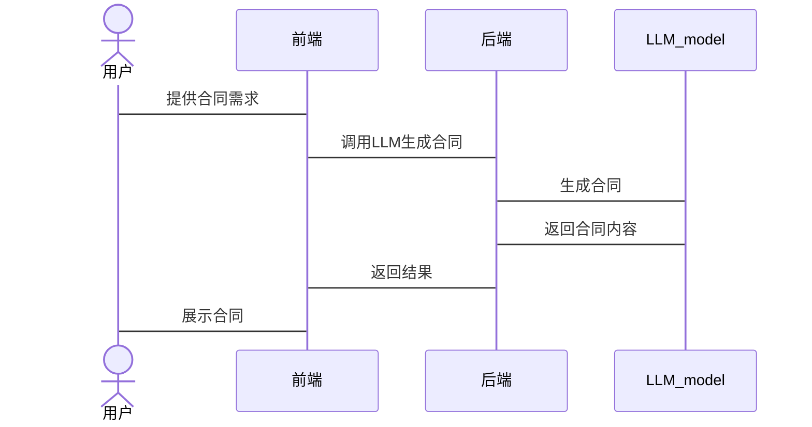

                 


# 智能合同生成AI Agent：LLM在法律文书撰写中的应用

> 关键词：智能合同生成、LLM、AI Agent、法律文书、自然语言处理、大语言模型、法律科技

> 摘要：随着人工智能技术的快速发展，大语言模型（LLM）在法律领域的应用日益广泛。本文深入探讨了智能合同生成AI Agent的背景、核心概念、算法原理、系统架构及实际应用。通过分析LLM在法律文书撰写中的潜力，展示了如何利用AI技术提高合同生成的效率与准确性，为法律专业人士提供有力支持。

---

## 第一部分：智能合同生成AI Agent的背景与核心概念

### 第1章：智能合同生成的背景与问题描述

#### 1.1 智能合同生成的背景
##### 1.1.1 合同生成的现状与挑战
传统的合同生成过程依赖于人工操作，耗时且容易出错。律师和法务人员需要逐字逐句编写合同，不仅效率低下，还可能因疏忽导致法律漏洞。随着企业规模的扩大和业务复杂性的增加，合同数量激增，人工生成的效率问题愈发突出。

##### 1.1.2 AI技术在法律领域的应用趋势
近年来，人工智能技术，尤其是大语言模型（LLM），在法律领域的应用取得了显著进展。LLM能够理解上下文、生成文本、识别模式，为合同生成提供了新的可能性。AI在法律文书处理中的应用，不仅提高了效率，还降低了错误率。

##### 1.1.3 智能合同生成的必要性与优势
智能合同生成AI Agent通过自动化处理，能够快速生成标准化合同，减少人为错误，降低成本。同时，AI能够根据具体需求定制合同内容，适应不同场景，显著提升了法律文书的效率与准确性。

#### 1.2 问题背景与问题描述
##### 1.2.1 合同生成中的痛点分析
- **效率低下**：人工生成合同耗时长，难以满足大量需求。
- **错误风险**：人为疏忽可能导致合同条款遗漏或错误，引发法律纠纷。
- **一致性不足**：不同律师生成的合同可能存在格式和条款不一致的问题。

##### 1.2.2 传统合同生成方式的局限性
传统合同生成方式依赖人工操作，存在效率低、成本高、一致性差等问题。特别是在处理大量重复性合同（如供应商合同、雇佣合同）时，人工生成不仅效率低下，还容易出错。

##### 1.2.3 智能合同生成的目标与预期效果
智能合同生成AI Agent的目标是通过自动化技术，快速、准确地生成标准化合同，同时支持定制化需求。预期效果包括提高效率、降低成本、减少错误、提升一致性等。

#### 1.3 问题解决与边界定义
##### 1.3.1 智能合同生成的解决方案
AI Agent通过LLM技术，结合自然语言处理和机器学习，实现合同的自动生成和优化。用户只需输入关键信息，AI即可生成符合要求的合同。

##### 1.3.2 解决方案的核心要素与实现路径
- **LLM模型**：利用大语言模型进行合同生成。
- **自然语言理解**：准确理解用户需求。
- **自动化生成**：快速生成合同并支持修改。

##### 1.3.3 问题的边界与适用范围
智能合同生成AI Agent适用于标准化程度高的合同类型，如供应商合同、雇佣合同等。对于复杂或定制化需求较高的合同，仍需人工辅助。

#### 1.4 核心概念与结构解析
##### 1.4.1 智能合同生成的定义与核心要素
智能合同生成AI Agent是一种基于LLM的自动化工具，能够根据输入生成合同。其核心要素包括LLM模型、自然语言理解、自动化生成和用户交互界面。

##### 1.4.2 LLM在智能合同生成中的角色与作用
LLM作为AI Agent的核心，负责理解和生成文本，确保合同内容的准确性和完整性。通过微调和训练，模型能够适应法律领域的特殊需求。

##### 1.4.3 系统架构与功能模块划分
智能合同生成系统通常包括前端界面、LLM模型、训练数据和后端服务。各模块协同工作，确保合同生成的高效和准确。

---

## 第2章：LLM与智能合同生成AI Agent的核心概念

### 2.1 LLM的基本原理与特点
#### 2.1.1 大语言模型的定义与工作原理
LLM是一种基于深度学习的自然语言处理模型，能够理解和生成人类语言。其工作原理包括预训练和微调两个阶段。

#### 2.1.2 LLM的核心特点与技术优势
- **大规模训练**：基于海量数据，提升模型的通用性。
- **上下文理解**：能够理解上下文，生成连贯的文本。
- **多任务能力**：适用于多种自然语言处理任务。

#### 2.1.3 LLM与传统NLP模型的区别
传统NLP模型通常针对特定任务训练，而LLM具有通用性，能够适应多种任务。

### 2.2 智能合同生成AI Agent的定义与架构
#### 2.2.1 AI Agent的基本概念
AI Agent是一种智能体，能够感知环境并执行任务。在智能合同生成中，AI Agent负责接收用户输入，调用LLM生成合同。

#### 2.2.2 智能合同生成AI Agent的功能模块
- **输入处理**：接收用户需求。
- **LLM调用**：生成合同内容。
- **输出展示**：将生成的合同返回给用户。
- **反馈优化**：根据用户反馈优化模型。

#### 2.2.3 Agent与LLM的结合方式
AI Agent通过调用LLM API，将用户需求转化为合同文本。两者结合，实现了从需求输入到合同输出的自动化流程。

### 2.3 核心概念的属性特征对比
#### 2.3.1 LLM与传统NLP模型的对比分析
| 特性       | LLM                         | 传统NLP模型                 |
|------------|------------------------------|-----------------------------|
| 数据量     | 大规模训练数据              | 较小规模数据                |
| 任务适应性 | 适用于多种任务              | 适用于单一任务              |
| 模型复杂度 | 高复杂度                    | 较低复杂度                  |

#### 2.3.2 智能合同生成AI Agent与传统合同生成工具的对比
| 特性               | 智能合同生成AI Agent      | 传统合同生成工具            |
|--------------------|---------------------------|-----------------------------|
| 自动化程度         | 高度自动化                | 低自动化                    |
| 定制化能力         | 支持定制化                | 有限定制化                  |
| 错误率             | 低错误率                  | 高错误率                    |
| 效率               | 高效率                   | 低效率                     |

#### 2.3.3 核心概念的ER实体关系图

```mermaid
er
actor: 用户
agent: 智能合同生成AI Agent
contract: 合同
training_data: 训练数据
LLM_model: 大语言模型
action: 生成合同行为

actor --> agent: 提供输入
agent --> LLM_model: 调用模型
LLM_model --> contract: 生成合同
contract --> actor: 返回结果
training_data --> LLM_model: 提供训练数据
```

---

## 第3章：LLM在智能合同生成中的算法原理

### 3.1 LLM的训练过程与模型结构
#### 3.1.1 预训练过程
LLM的预训练基于大规模数据，采用自监督学习，模型通过预测下一个词来学习语言结构。

#### 3.1.2 微调过程
在预训练的基础上，对特定领域数据进行微调，使模型适应法律合同生成任务。

#### 3.1.3 模型结构
大多数LLM基于Transformer架构，包括编码器和解码器。编码器负责输入处理，解码器负责生成输出。

### 3.2 合同生成算法的流程
生成合同的过程包括以下几个步骤：
1. **输入处理**：接收用户需求。
2. **LLM调用**：生成合同内容。
3. **结果输出**：将生成的合同返回给用户。

### 3.3 合同生成的数学模型
#### 3.3.1 生成模型
合同生成的数学模型基于概率分布，通过最大化条件概率来生成文本。

#### 3.3.2 损失函数
使用交叉熵损失函数来衡量生成结果与真实结果的差异。

$$ \text{损失函数} = -\sum_{i=1}^{n} \log P(y_i|x_{<i}) $$

#### 3.3.3 解码策略
采用贪心解码或采样解码策略生成合同文本。

---

## 第4章：智能合同生成系统的架构设计

### 4.1 项目场景介绍
智能合同生成系统主要用于企业法务部门，帮助快速生成标准化合同，减少人工错误。

### 4.2 系统功能设计
系统功能包括用户输入、LLM调用、合同生成和结果展示。

### 4.3 系统架构设计
系统架构采用微服务架构，包括前端、后端和数据库。

#### 4.3.1 前端部分
前端负责接收用户输入和展示生成结果。

#### 4.3.2 后端部分
后端负责处理LLM调用和结果返回。

#### 4.3.3 数据库部分
数据库存储训练数据和生成的合同。

### 4.4 接口设计
系统接口包括用户输入接口、LLM调用接口和结果展示接口。

### 4.5 交互流程图


---

## 第5章：项目实战与案例分析

### 5.1 环境安装
安装Python和相关库，如`transformers`和`torch`。

### 5.2 核心代码实现
```python
from transformers import AutoModelForSeq2SeqLM, AutoTokenizer

class ContractGenerator:
    def __init__(self, model_name):
        self.model = AutoModelForSeq2SeqLM.from_pretrained(model_name)
        self.tokenizer = AutoTokenizer.from_pretrained(model_name)

    def generate_contract(self, input_text):
        inputs = self.tokenizer.encode(input_text, return_tensors='pt', max_length=512)
        outputs = self.model.generate(inputs, max_length=1024, temperature=0.7)
        contract = self.tokenizer.decode(outputs[0], skip_special_tokens=True)
        return contract
```

### 5.3 代码解读与分析
代码实现了一个简单的合同生成器，基于预训练的LLM模型，用户输入需求，生成合同文本。

### 5.4 实际案例分析
通过具体案例展示AI生成的合同，对比人工生成的合同，分析其优缺点。

### 5.5 项目小结
总结项目实现的过程，强调LLM在合同生成中的优势。

---

## 第6章：最佳实践与总结

### 6.1 小结
智能合同生成AI Agent通过LLM技术，显著提升了合同生成的效率和准确性。

### 6.2 注意事项
- **数据隐私**：确保训练数据和生成合同的数据安全。
- **模型优化**：定期优化模型，提升生成质量。
- **用户反馈**：根据用户反馈改进系统。

### 6.3 拓展阅读
推荐相关书籍和论文，深入学习LLM和AI在法律领域的应用。

---

## 作者信息

作者：AI天才研究院/AI Genius Institute & 禅与计算机程序设计艺术/Zen And The Art of Computer Programming

---

通过以上内容，您可以逐步构建一篇完整的技术博客文章，涵盖智能合同生成AI Agent的背景、核心概念、算法原理、系统架构、项目实战及最佳实践。

