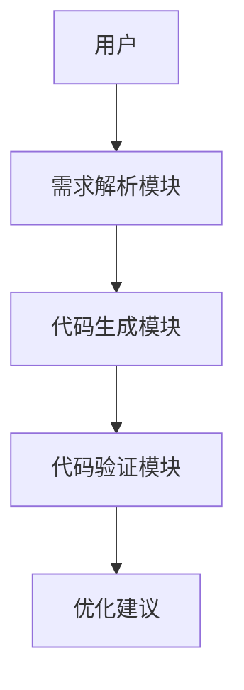
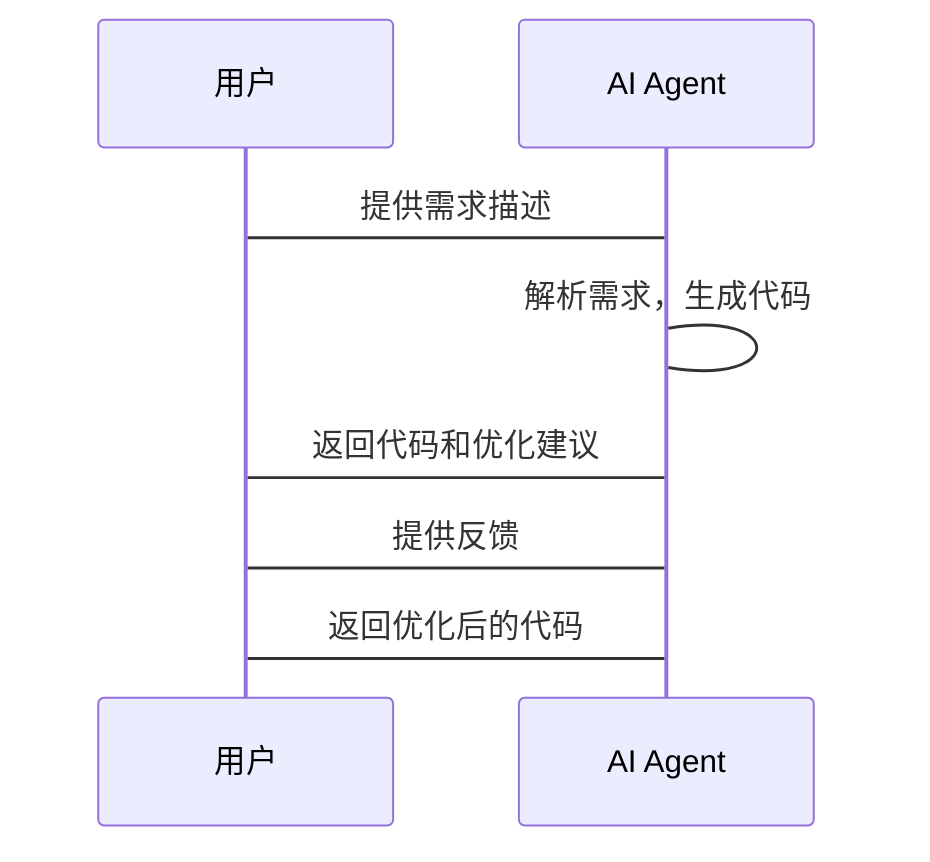

                 


# 智能合约 AI Agent：LLM 在区块链应用中的角色

---

## 关键词：智能合约、AI Agent、LLM、区块链、人工智能、大语言模型

---

## 摘要：  
本文探讨了大语言模型（LLM）在区块链智能合约中的应用，特别是其作为AI Agent在智能合约开发、验证和优化中的角色。文章从技术原理、系统架构到实际应用案例，详细分析了LLM如何赋能区块链，提升智能合约的开发效率、安全性和可扩展性。

---

# 第1章 智能合约与AI Agent概述

## 1.1 智能合约的基本概念

### 1.1.1 智能合约的定义与特点  
智能合约是基于区块链的自动化执行程序，定义了参与者之间的规则和条件。其特点包括：  
1. **去中心化**：无需信任第三方即可执行。  
2. **自动性**：基于预设规则自动触发操作。  
3. **不可篡改性**：区块链上的合约代码无法被修改。  

### 1.1.2 智能合约的核心要素与组成  
智能合约通常由以下部分组成：  
- **状态变量**：合约的当前状态。  
- **事件**：记录合约的链上操作。  
- **函数**：定义合约的逻辑和操作。  

### 1.1.3 智能合约的演进与发展趋势  
智能合约从早期的简单逻辑逐步向复杂、智能化方向发展，尤其是在AI技术的加持下，智能合约的开发和验证效率得到了显著提升。

## 1.2 AI Agent的基本概念

### 1.2.1 AI Agent的定义与特点  
AI Agent是一种智能体，能够感知环境并采取行动以实现目标。其特点包括：  
1. **自主性**：无需外部干预即可运行。  
2. **反应性**：能够根据环境变化调整行为。  
3. **学习能力**：通过数据和反馈不断优化自身行为。  

### 1.2.2 AI Agent的核心功能与应用场景  
AI Agent的核心功能包括：  
- **数据处理**：解析和处理链上数据。  
- **决策制定**：基于数据和规则做出决策。  
- **自动化操作**：执行预设或自动生成的操作。  

### 1.2.3 AI Agent与智能合约的关系  
AI Agent可以作为智能合约的辅助工具，帮助开发者生成、验证和优化智能合约代码，提升开发效率和质量。

---

# 第2章 LLM的基本原理与技术基础

## 2.1 LLM的核心原理

### 2.1.1 变压器架构的基本原理  
大语言模型（LLM）基于Transformer架构，通过**自注意力机制**（Self-Attention）捕捉文本中的语义关系。其核心公式为：  

$$\text{Attention}(Q, K, V) = \text{softmax}\left(\frac{QK^T}{\sqrt{d_k}}\right)V$$  

其中，$Q$、$K$、$V$分别是查询、键和值向量，$d_k$是键的维度。

### 2.1.2 注意力机制的数学模型  
注意力机制通过计算查询与键之间的相似性，确定每个键对查询的重要性。相似性计算公式为：  

$$\text{score}(i, j) = \text{exp}(\frac{Q_i K_j}{\sqrt{d_k}})$$  

### 2.1.3 梯度下降与损失函数  
模型通过最小化损失函数来优化参数。常用的损失函数包括交叉熵损失：  

$$\mathcal{L} = -\sum_{i=1}^{n} y_i \log p(y_i)$$  

其中，$y_i$是真实标签，$p(y_i)$是模型预测的概率。

## 2.2 LLM在区块链中的应用原理

### 2.2.1 LLM生成智能合约代码的流程  
1. **输入解析**：LLM接收用户输入的需求描述。  
2. **代码生成**：基于需求生成Solidity或其他语言的智能合约代码。  
3. **验证与优化**：检查代码的语法和逻辑，优化代码性能。  

### 2.2.2 LLM与区块链的交互机制  
LLM通过API与区块链节点交互，接收链上数据并生成相应的智能合约代码。  

### 2.2.3 LLM生成智能合约的数学模型  
LLM生成智能合约的过程可以看作是一个条件生成任务，模型通过概率分布生成代码字符序列。  

$$P(\text{代码}|\text{输入}) = \prod_{i=1}^{n} P(c_i|\text{输入}, c_{<i})$$  

---

# 第3章 LLM在智能合约中的核心应用

## 3.1 LLM生成智能合约代码

### 3.1.1 智能合约代码生成的流程  
1. **需求分析**：LLM解析用户需求，生成合约逻辑。  
2. **代码生成**：基于需求生成Solidity代码。  
3. **代码验证**：检查代码语法和逻辑错误。  

### 3.1.2 智能合约代码生成的数学模型  
生成代码的过程基于自回归模型，模型逐步生成每个代码字符。  

$$P(\text{代码}) = \prod_{i=1}^{n} P(c_i|c_{<i})$$  

### 3.1.3 案例分析  
以生成一个简单的智能合约为例：  
需求：创建一个 ERC20 代币合约。  
代码生成：LLM生成Solidity代码，包括代币发行、转移等逻辑。

## 3.2 LLM在智能合约验证中的应用

### 3.2.1 智能合约验证的基本原理  
通过LLM分析合约代码，识别潜在漏洞和逻辑错误。  

### 3.2.2 LLM在智能合约验证中的作用  
LLM可以帮助识别以下问题：  
1. **语法错误**：检查代码语法是否正确。  
2. **逻辑漏洞**：识别可能引发的漏洞，如重入攻击。  

### 3.2.3 案例分析  
通过LLM分析一段Solidity代码，识别潜在的安全漏洞并提出修复建议。

## 3.3 LLM在智能合约优化中的应用

### 3.3.1 智能合约优化的基本原理  
LLM通过分析合约代码，提出优化建议，如减少gas消耗、提升代码可读性。  

### 3.3.2 LLM在智能合约优化中的作用  
优化方向包括：  
1. **代码简化**：减少冗余代码。  
2. **性能优化**：提升合约执行效率。  

### 3.3.3 案例分析  
通过LLM优化一段Solidity代码，使其更高效、更安全。

---

# 第4章 智能合约AI Agent的系统架构设计

## 4.1 系统功能设计

### 4.1.1 功能模块划分  
- **需求解析模块**：解析用户需求，生成合约逻辑。  
- **代码生成模块**：生成Solidity或其他语言的合约代码。  
- **代码验证模块**：检查代码语法和逻辑错误。  

### 4.1.2 系统功能流程  
1. 用户输入需求描述。  
2. 需求解析模块生成合约逻辑。  
3. 代码生成模块生成代码。  
4. 代码验证模块检查代码并提出优化建议。  

## 4.2 系统架构设计

### 4.2.1 系统架构图  


### 4.2.2 系统接口设计  
- **输入接口**：用户输入需求描述。  
- **输出接口**：生成的合约代码和优化建议。  

## 4.3 系统交互设计

### 4.3.1 交互流程  
1. 用户输入需求。  
2. AI Agent解析需求并生成代码。  
3. 用户验证代码并提出修改意见。  
4. AI Agent根据反馈优化代码。  

### 4.3.2 交互流程图  


---

# 第5章 智能合约AI Agent的项目实战

## 5.1 环境配置

### 5.1.1 安装必要的工具  
- 安装Python和相关库（如TensorFlow、PyTorch）。  
- 安装Solidity和以太坊节点（如Ganache）。  

### 5.1.2 配置LLM模型  
选择一个开源的LLM模型（如GPT-2）并进行微调。  

## 5.2 系统核心实现

### 5.2.1 LLM模型的训练与微调  
使用智能合约相关的数据集对模型进行微调，提升其在智能合约生成任务中的表现。  

### 5.2.2 智能合约生成与验证  
编写代码实现LLM生成智能合约的功能，并集成验证模块。  

### 5.2.3 API接口开发  
开发API接口，方便用户通过API调用AI Agent生成智能合约。  

## 5.3 代码实现与解读

### 5.3.1 LLM模型的训练代码  
```python
import tensorflow as tf
from tensorflow.keras.layers import Dense, InputLayer
from tensorflow.keras import Model

class SimpleModel(Model):
    def __init__(self, vocab_size):
        super(SimpleModel, self).__init__()
        self.embedding = Dense(vocab_size, input_dim=100)
    
    def call(self, inputs):
        return self.embedding(inputs)
```

### 5.3.2 智能合约生成代码  
```python
def generate_contract(code_prompt):
    # 调用LLM生成代码
    response = openai_api(code_prompt)
    return response.choices[0].message.content
```

## 5.4 案例分析与实际应用

### 5.4.1 案例分析  
以生成一个 ERC20 代币合约为例，展示LLM如何生成代码并进行验证。  

### 5.4.2 实际应用  
将AI Agent部署到区块链开发环境中，供开发者使用。  

## 5.5 项目总结  
总结项目的实现过程，分析优缺点，并提出改进建议。

---

# 第6章 智能合约AI Agent的安全性与合规性

## 6.1 数据隐私与安全

### 6.1.1 数据隐私问题  
LLM在处理智能合约开发过程中，需要保护用户的隐私数据。  

### 6.1.2 数据安全措施  
采取数据脱敏、访问控制等措施，确保数据安全。  

## 6.2 模型安全与合规性

### 6.2.1 模型安全问题  
防止模型被恶意攻击或滥用。  

### 6.2.2 合规性问题  
确保AI Agent的输出符合法律法规要求。  

## 6.3 应对措施

### 6.3.1 数据隐私保护  
采用加密技术保护用户数据。  

### 6.3.2 模型安全防护  
定期进行安全审计和漏洞修复。  

### 6.3.3 合规性保障  
制定合规性策略，确保AI Agent的输出符合法律法规。  

---

# 第7章 智能合约AI Agent的未来展望

## 7.1 技术发展趋势

### 7.1.1 LLM的进一步发展  
大语言模型的性能和能力将不断提升。  

### 7.1.2 智能合约的智能化  
智能合约将更加智能化，具备更强的自主决策能力。  

## 7.2 应用潜力

### 7.2.1 新兴应用场景  
LLM在智能合约中的应用将扩展到更多领域，如供应链金融、智能合约审计等。  

### 7.2.2 跨领域协同  
智能合约AI Agent将与其他区块链技术协同工作，推动区块链技术的进一步发展。  

## 7.3 未来挑战

### 7.3.1 技术挑战  
如何进一步提升LLM的生成能力和安全性。  

### 7.3.2 应用挑战  
如何在实际应用中解决数据隐私、模型安全等问题。  

---

# 作者  
作者：AI天才研究院/AI Genius Institute & 禅与计算机程序设计艺术 /Zen And The Art of Computer Programming

