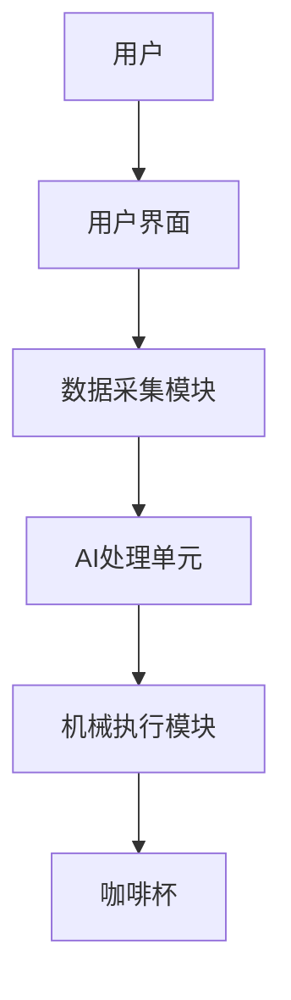

                 


# 智能咖啡机：AI Agent的个性化口味定制系统

> 关键词：智能咖啡机，AI Agent，个性化口味，机器学习，智能系统，自动化技术

> 摘要：本文深入探讨了AI Agent在智能咖啡机中的应用，详细介绍了个性化口味定制的核心原理、算法模型、系统架构及项目实现。通过结合数学模型、系统设计和实际案例，展示了如何利用AI技术实现精准的咖啡口味定制，为用户带来极致的饮用体验。

---

## 第1章：智能咖啡机与AI Agent的基本概念

### 1.1 智能咖啡机的定义与特点

智能咖啡机是一种结合了人工智能技术的咖啡制作设备，能够通过传感器和AI算法，自动感知用户需求并调整咖啡制作参数。其核心特点包括：

1. **智能化**：通过AI算法实现个性化口味定制。
2. **自动化**：从咖啡豆选择到杯数控制，全程自动化操作。
3. **可定制化**：根据用户口味偏好实时调整参数。

### 1.2 AI Agent的基本概念

AI Agent（智能代理）是一种能够感知环境、自主决策并执行任务的智能实体。在智能咖啡机中，AI Agent主要负责：

1. **感知**：采集用户的口味偏好和环境数据。
2. **决策**：基于数据生成个性化制作方案。
3. **执行**：通过机械装置实现咖啡制作。

---

## 第2章：智能咖啡机个性化口味定制的背景与需求

### 2.1 个性化口味定制的背景

随着咖啡消费市场的增长，用户对个性化体验的需求日益增加。传统咖啡机无法满足多样化的口味需求，而AI Agent的引入为解决这一问题提供了可能。

### 2.2 AI Agent在个性化口味定制中的作用

AI Agent通过以下方式实现个性化口味定制：

1. **数据采集**：收集用户的口味偏好和历史数据。
2. **模型训练**：基于用户数据训练机器学习模型。
3. **实时调整**：根据用户反馈动态优化咖啡参数。

---

## 第3章：AI Agent的核心原理与技术

### 3.1 AI Agent的核心原理

AI Agent的核心原理包括感知、决策和执行三个模块：

1. **感知模块**：通过传感器采集数据。
2. **决策模块**：基于感知数据生成决策。
3. **执行模块**：根据决策执行操作。

### 3.2 AI Agent的核心算法与数学模型

#### 3.2.1 感知模块的算法

感知模块主要使用回归分析模型。例如，线性回归模型可以表示为：

$$ y = \beta_0 + \beta_1x + \epsilon $$

其中，$y$ 是预测的咖啡浓度，$x$ 是用户输入的参数，$\beta_0$ 和 $\beta_1$ 是回归系数。

#### 3.2.2 决策模块的算法

决策模块使用支持向量机（SVM）模型。SVM的目标函数为：

$$ \text{最大化} \quad 1 - \xi_i $$

受限于：

$$ y_i(\beta_0 + \beta_1x_i) \geq 1 - \xi_i $$

#### 3.2.3 执行模块的算法

执行模块通过PID控制器调整咖啡机参数。PID控制器公式为：

$$ u(t) = K_p e(t) + K_i \int e(t)dt + K_d \frac{de(t)}{dt} $$

其中，$K_p$、$K_i$ 和 $K_d$ 是控制器参数，$e(t)$ 是误差信号。

---

## 第4章：智能咖啡机系统的架构设计

### 4.1 系统功能设计

智能咖啡机系统的主要功能包括：

1. **用户交互**：通过触摸屏或手机APP输入需求。
2. **数据采集**：采集用户口味偏好和环境数据。
3. **模型训练**：基于用户数据训练个性化模型。
4. **咖啡制作**：根据模型生成的指令制作咖啡。

### 4.2 系统架构设计

使用Mermaid绘制系统架构图：



### 4.3 系统接口设计

系统接口主要分为：

1. **用户接口**：触摸屏或手机APP。
2. **数据接口**：传感器和数据库接口。
3. **机械接口**：咖啡机机械部件的控制接口。

---

## 第5章：项目实战与实现

### 5.1 环境配置

安装必要的Python库：

```bash
pip install numpy scikit-learn matplotlib
```

### 5.2 核心代码实现

以下是AI Agent的核心代码示例：

```python
import numpy as np
from sklearn import svm

# 感知模块
def感知数据():
    # 采集用户数据
    return np.random.rand(100, 10)

# 决策模块
def训练模型(X, y):
    model = svm.SVR()
    model.fit(X, y)
    return model

# 执行模块
def执行指令(model, X):
    预测结果 = model.predict(X)
    return 预测结果

# 主函数
def main():
    X = 感知数据()
    y = np.random.rand(100, 1)
    model = 训练模型(X, y)
    预测结果 = 执行指令(model, X)
    print(预测结果)

if __name__ == "__main__":
    main()
```

### 5.3 实际案例分析

假设用户偏好浓咖啡，系统会根据历史数据调整烘焙时间和压力参数。通过不断优化模型，系统能够生成更符合用户口味的咖啡。

---

## 第6章：最佳实践与小结

### 6.1 最佳实践

1. **数据采集**：确保数据的多样性和准确性。
2. **模型优化**：定期更新模型以适应用户需求变化。
3. **用户体验**：优化交互界面，提升用户满意度。

### 6.2 小结

本文详细介绍了AI Agent在智能咖啡机中的应用，从理论到实践，展示了如何通过技术手段实现个性化的咖啡口味定制。AI Agent的引入不仅提升了用户体验，还为智能咖啡机的发展开辟了新的方向。

---

作者：AI天才研究院/AI Genius Institute & 禅与计算机程序设计艺术 /Zen And The Art of Computer Programming

